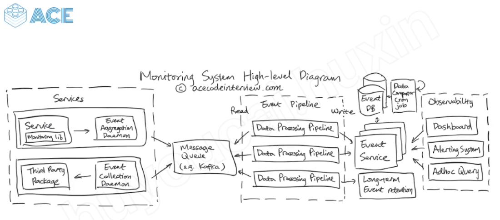

# Summary 

---

1.  Recorded the event number
2.  Time series --- how many event in each minutes, each hours ...
3.  Filter function -- criteria
4.  Set up a alarm base on the filter

Non function requirement:

5.  Suppoert milliion events
6.  Low lantency
7.  High available
8.  High accuracy for new data but reduce the accuracy for the old data

[The system has 4 part]{.mark}

1.  Data collection and aggregation daemon -- aggregate the event on the Machine level
2.  Kafka
3.  Data processing pipeline--- we have different service on the kafka side and those service will do the different type of event aggregation -- min level, second level, those service read the event from kafka and store the data in the event DB -- elasticsearch

4.  one pipeline will store event data to Hive for long term data

[Store]{.mark}

we store the event to db then async store the event data to elasticsearch or store the event to elasticsearch directly

In database level, using corn job and combine the second event to hour event

Why use kafka not rabitMQ

rabitMQ is a task queue, the latency is high when the data is large

it for task and a lot of works on other side, grab the task from the queue

