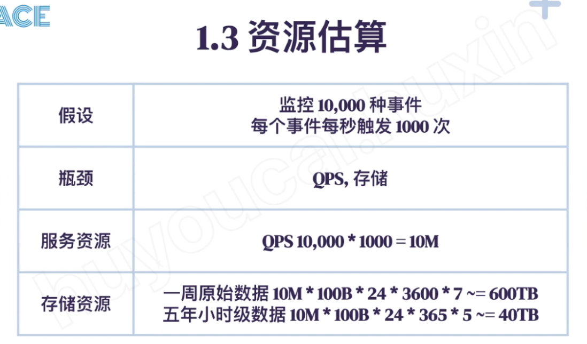
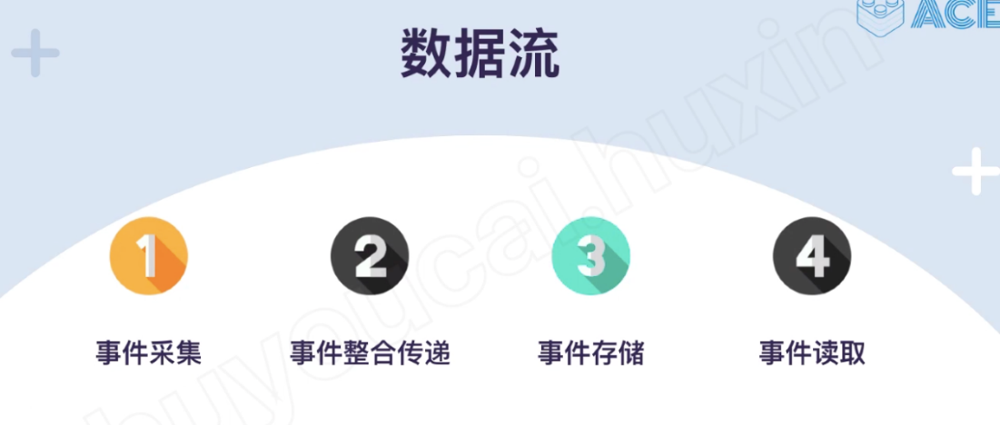
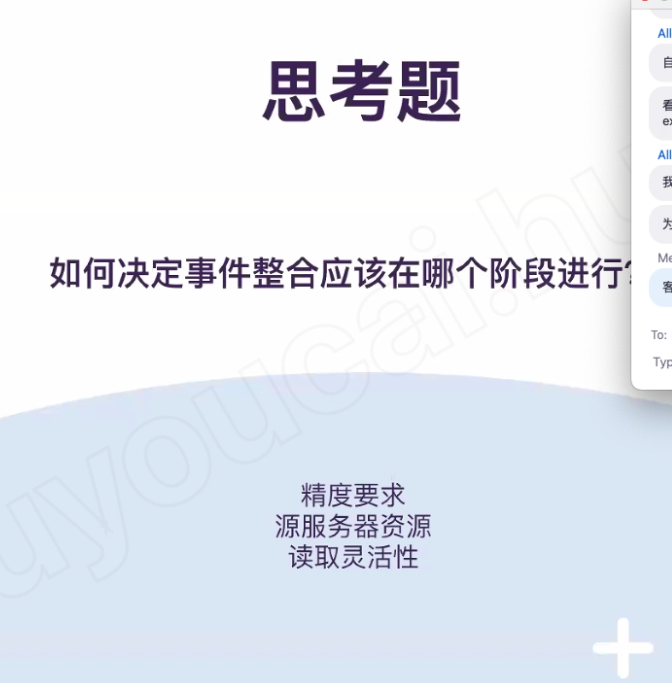
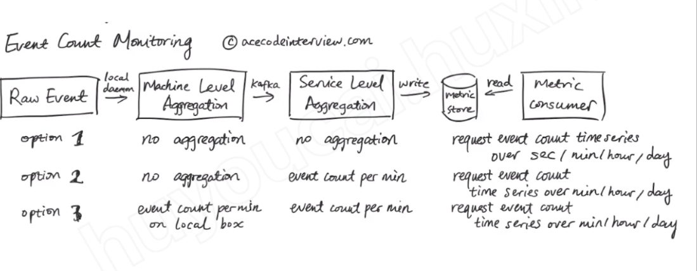
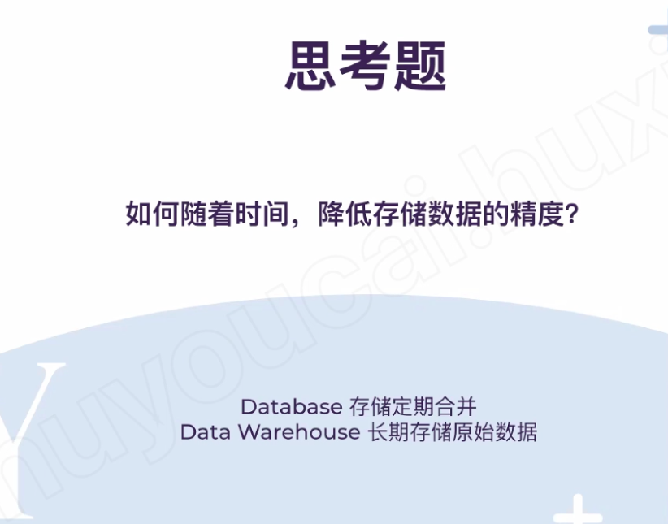
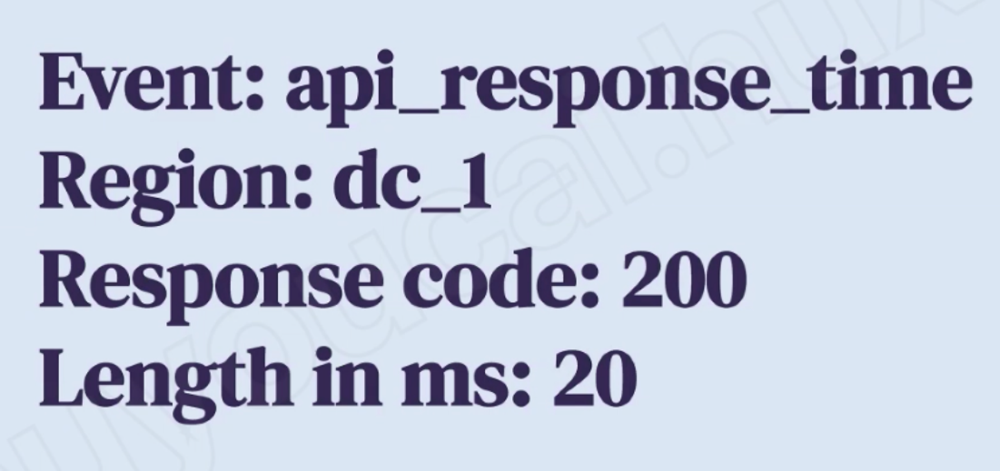
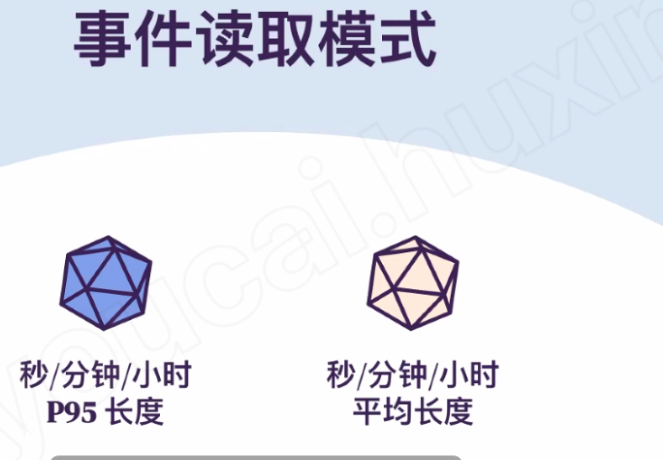

# Watch dog

---

1.  Recorded the event number
2.  Time series --- how many event in each minutes, each hours ...
3.  Filter function or search function
4.  Set up a alarm base on the filter

Non function requirement:

1.  Suppoert milliion events
2.  Low lantency
3.  High available
4.  High accuracy for new data but reduce the accuracy for the old data

5 year data - save event per each hour

Raw data - save event per second

Save in kafa then combine together

How to decide use client side combination or service side combination

1.  Accuracy requirements
2.  Can we combine the event on the source service
3.  Depend on the requirement -- need one minute data, one hour data ....

If we just need a minute event -- how many event in one minute, we can aggregative the data in client side and sent to downside

The machine level aggregate, we only can aggregate the event for this machine

If the service has multiple machine, we cannot aggregate them together on the client side

Event name and other meta data

2 type of event: 1. event count, 2 event length

事件存储：

Elasticsearch

Or event DB (网站的solution

(watch dog -2)

3 option

First option is we just write the raw event to DB and client (metric consumer )will read the data base on the requirement

( on the database side, they have min level/ hour level/...)

Machine level -- client side

Data pipeline--- map-reduce/ service --stream process ---- for data aggregation: one pipeline for minute aggregation, one pipeline for hour aggregation

histogram -Fixed bucket: -- 0- 5 min or ms ,6-10 min/ ms , 11-15 min....

Or (first 5% , 5%-10% , 10%-15%) ---event count

Average : events count and total count

Map reduce need a couple of minutes to aggregate the date

We can use kafka stream --

Event name

