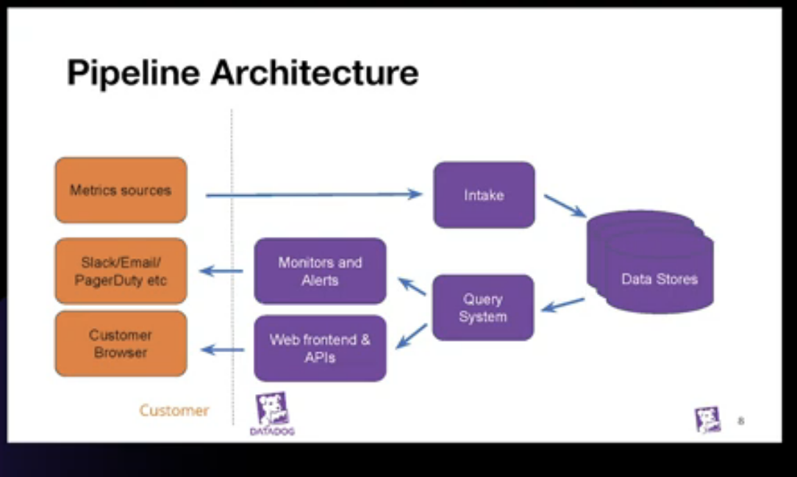
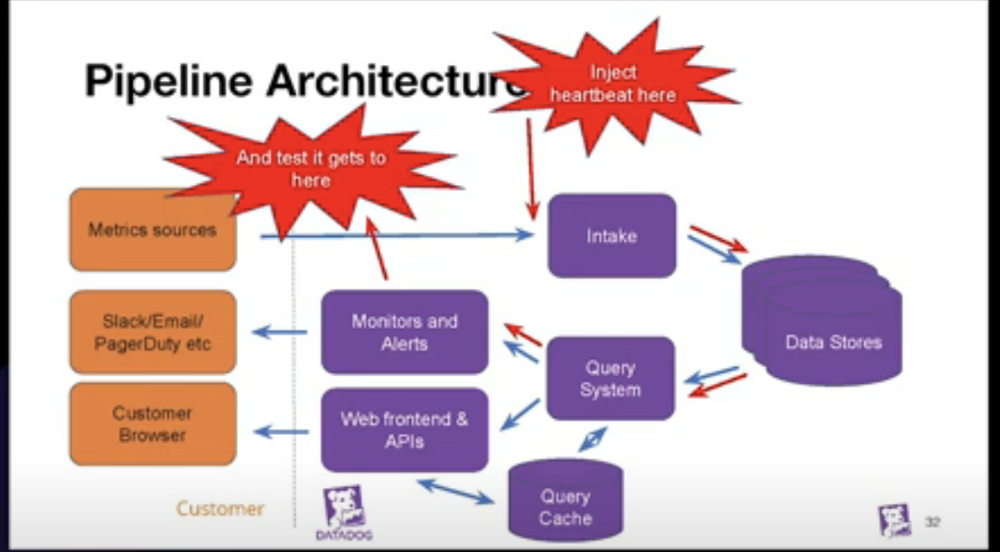
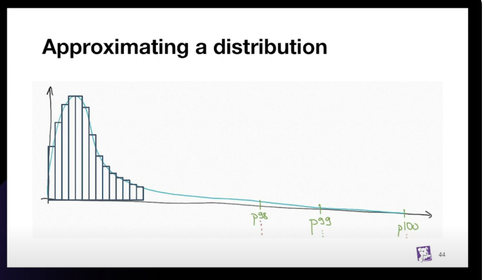
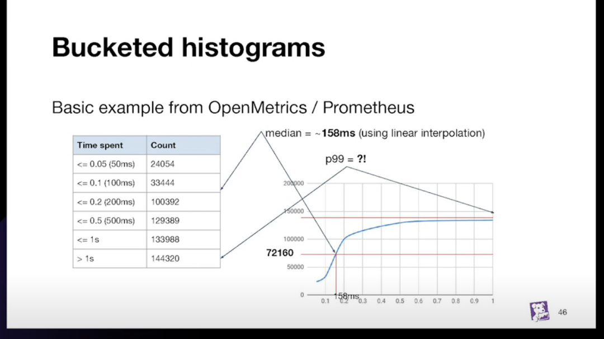

# datadog

Created: 2024-08-27 15:43:36 -0600

Modified: 2024-08-28 16:26:39 -0600

---

<https://www.youtube.com/watch?v=uQrRbvLyJ4M>

- [**00:00:00**](https://youtube.com/watch?v=uQrRbvLyJ4M&t=0)In this section, the speaker discusses the scale of Datadog's metrics infrastructure and the sources of the "Cambrian explosion" of data, including the decreasing life cycle of infrastructure and the increase in granularity of data. The speaker then introduces the performance mantras of the performance engineering community to frame the decisions that they made to scale the system to trillions of points a day. The architecture overview of Datadog's infrastructure is also presented, including the intake system, data stores, query system, and query caching.

Overview of Datadog's architecture: metric sources feed into an intake system, data is stored across different data stores, and a query system pulls data for API, dashboards, and alerts.

{width="10.083333333333334in" height="6.083333333333333in"}

{width="10.083333333333334in" height="5.75in"}

- [**00:05:00**](https://youtube.com/watch?v=uQrRbvLyJ4M&t=300)In this section, the speaker talks about how the system leverages caching and minimizes upfront processing to reduce latency while capturing data with minimal risk of loss. The talk then moves on to how the system uses Kafka for real-time queries, partitioning the data by customer and metric to balance the workload across systems and avoid hot spotting. By doing this concurrently, it scales horizontally with independently customized data stores, mapping functions on to storage and database technologies while considering the volume of data being stored. The talk also lists common technology options based on different tiers that AWS provides, listed in ascending order of latency.

{width="10.083333333333334in" height="5.729166666666667in"}

{width="10.083333333333334in" height="5.75in"}

- The intake system uses Kafka to fan out data to different queue and store the data into various data stores.
- Partitioning by customer and metric helps in handling high-volume data, but further dynamic partitioning is needed.

- [**00:10:00**](https://youtube.com/watch?v=uQrRbvLyJ4M&t=600)In this section, the speaker discusses the need to take a hybrid approach in leveraging different kinds of storage in order to meet their performance and efficiency goals. They highlight the four common queries that need to be answered from their system data stores, including the description of tags, the tag index, the tag inverted index, and the core point store. They explain the importance of only indexing what is necessary in order to answer these queries, as over-indexing can quickly dominate the storage volume of a system. The speaker then goes on to map different storage technologies, such as RAM, local SSDs, and S3, back to the kinds of queries and data stores they need to answer, and highlights the trade-offs that come with each option.

- Datadog uses a hybrid storage approach: RAM for recent data, SSDs for mid-term, and S3 for long-term storage.
- The choice of storage is based on the trade-off between cost and performance
- 
- .

{width="10.083333333333334in" height="5.625in"}

these are the four sort of common queries that we need to answer from our our system our data stores so the first one being described tags this is

we have the tag index and we have a tag inverted index so you can think of this as two sides of the same coin we have the tag index which is mapping an ID to a set of a unique set of tags in our system and

on the flip side we have an inverted index

this tag maps to this time this list of time-series IDs so if I say I want to do a filter on you know availability zone Us East one a give me all of the time series IDs that that match that specific filter and then the last one here is our core point store this is the mapping of a time series ID to the point to a eight byte float

and that's you know an incredibly high volume of data

- [**00:15:00**](https://youtube.com/watch?v=uQrRbvLyJ4M&t=900)In this section, the speaker discusses the storage and technology choices made by Datadog for a real-time metrics database. The company has mapped different storage choices based on time ranges, with RAM used for the last few hours, SSDs for days, and S3 for months and years. To ensure synchronization, Datadog uses monitors and alerts with the heartbeat pattern, which track the full round-trip latency through the system. The speaker also talks about how the company has leveraged approximation in its architecture to gain deeper insights and scale to even more data, moving beyond traditional metrics like counters and gauges.

- {width="10.083333333333334in" height="5.604166666666667in"}

we can sort of think of as a heartbeat pattern

we look for that data that we injected synthetically on the other side to know you know that the data has made it all the way through and that the last point has made it through each of the different systems that I've talked about in that it's all come together at the end before we say okay now we can go ahead and monitor this alert

every single second we're looking to see okay do we have everything up to this second do we have everything up to this second

so really what we're focused on is you know we're building synchronization in the system but we're building the minimal amount of synchronization that we need we want to do as little synchronization as possible and avoid that because as soon as we get deeply into this area you know you start to get into really hairy coordination

Approximation techniques are used to handle large volumes of data efficiently, enabling deeper insights and more flexible architecture.

Put the data in the sorted set can easily find

- [**00:20:00**](https://youtube.com/watch?v=uQrRbvLyJ4M&t=1200)In this section, the speaker talks about the importance of data aggregation and the different types of metrics: counters and gauges. Counters are aggregated over time, while gauges are continuous functions that are always being read. The speaker then introduces the concept of sketches as a way to efficiently aggregate data without having to store every single data point. Sketches can be used to efficiently calculate percentiles or other similar types of data. The speaker explains that sketches are a data structure derived from the stream processing literature that examines each point in the stream only once and has a limited memory usage.
- [**00:25:00**](https://youtube.com/watch?v=uQrRbvLyJ4M&t=1500)In this section, the speaker discusses the importance of accurate, fast, and fixed-size distribution metrics. They introduce the bucket histogram pattern for approximating a distribution, which is commonly used in open metrics like Prometheus. However, this method has limitations when it comes to long-tailed distributions, and so the team at Datadog uses a sketch data structure called the GK sketch.

{width="10.083333333333334in" height="5.864583333333333in"}

you can think of the distribution as this curve and

we're splitting the curve into discrete parts and we're measuring the height at each point and then we're storing the height in the count as a bucket

{width="10.083333333333334in" height="5.708333333333333in"}

- The GK sketch provides a relative error guarantee, which meets customers' use cases much better and provides a clean distribution reporting line for effective metric reporting and alerting. The talk ends with the speaker describing the values that they consider to define a good solution, which includes their ability to give a guaranteed relative error value.

- Sketches, such as the GK sketch, are used to approximate distributions like percentiles with minimal error and resource usage.
- This allows for accurate and efficient query responses.

- [**00:30:00**](https://youtube.com/watch?v=uQrRbvLyJ4M&t=1800)In this section,
- the speaker discusses how they achieve a max bound on their data structure while using 4,000 dynamically generated buckets to count things. The system relies on commutativity, which allows them to have a new sketch placed anywhere within the pipeline, and merge it with the larger sketch in the next section of the pipeline without any issues or errors.
- 
- 
- This arrangement lets Datadog distribute work throughout the pipeline, which maximizes efficiency at all points. The team built a new version of the sketch data structure that will be released in various programming languages soon, starting with Golang. Finally, the speaker emphasizes the importance of doing just the right amount of work and not a bit more, as it helps meet performance goals and builds highly scalable, distributed data systems.

{width="10.083333333333334in" height="5.927083333333333in"}

**Summary of the Transcript: "Building a Real-Time Metrics Database at Datadog - YouTube"**
- **Introduction (00:00-01:20):**
  - The presentation discusses Datadog's metrics infrastructure and how it handles trillions of data points daily.
  - A trillion is contextualized as 31,000 years or three times the distance to the moon and back.
- **Data Explosion (01:20-02:28):**
  - The decrease in infrastructure life cycle and increase in data granularity has led to massive growth in data points.
  - The shift from longer-lived infrastructure to millisecond-level lifespans, especially in cloud functions.
- **Performance Mantras (02:28-03:07):**
  - The presentation uses performance mantras from the engineering community to frame the system's architecture decisions.
- **High-Level Architecture (03:07-04:13):**
  - Overview of Datadog's architecture: metric sources feed into an intake system, data is stored across different data stores, and a query system pulls data for API, dashboards, and alerts.
- **Query Caching (04:13-05:44):**
  - Time series data is highly cacheable, but caching alone is insufficient due to the need for real-time data access.
- **Data Storage and Synchronization (05:44-08:01):**
  - The intake system uses Kafka to fan out data to various data stores.
  - Partitioning by customer and metric helps in handling high-volume data, but further dynamic partitioning is needed.
- **Storage Solutions (08:01-09:52):**
  - Datadog uses a hybrid storage approach: RAM for recent data, SSDs for mid-term, and S3 for long-term storage.
  - The choice of storage is based on the trade-off between cost and performance.
- **Query Types and Data Stores (09:52-13:56):**
  - Different storage technologies are used for different query types, depending on the time range covered.
  - Local SSDs are preferred over EBS for better performance.
- **Synchronization Challenges (13:56-18:27):**
  - Handling synchronization is critical, especially for monitors and alerts to avoid false positives.
  - A heartbeat pattern is used to ensure data consistency across distributed systems.
- **Approximation and Aggregation (18:27-23:11):**
  - Approximation techniques are used to handle large volumes of data efficiently, enabling deeper insights and more flexible architecture.
- **Sketches Data Structure (23:11-31:45):**
  - Sketches, such as the GK sketch, are used to approximate distributions like percentiles with minimal error and resource usage.
  - This allows for accurate and efficient query responses.
- **Commutativity and Distributed Work (31:45-34:22):**
  - Commutativity allows for distributed work across the entire data pipeline, improving efficiency and scalability.
  - Custom implementations of sketches are integrated into Datadog's system for optimal performance.
- **Conclusion (34:22-34:54):**
  - The key takeaway is the importance of doing the right amount of work at the right time to achieve performance goals in a scalable distributed data system.

4o

**You said:**

what does the "Commutativity" mean here

**ChatGPT said:**

ChatGPT

In the context of the presentation, "commutativity" refers to a property of an operation where the order of applying the operation does not affect the final result. This concept is crucial in the design of distributed systems, particularly for aggregating data efficiently across multiple components.

For example, in the context of Datadog's metrics system, commutativity allows for partial aggregation of data at different points in the processing pipeline (e.g., in the agent, in intermediate systems, or directly in the database). This means that:

- **Order Independence**: The partial results from different components can be combined in any order to produce the same final result.
- **Efficiency**: This property enables the system to distribute the workload across various parts of the architecture, allowing for parallel processing. It also allows the system to aggregate data incrementally as it flows through the pipeline, rather than waiting until the end to do all the work at once.
- **Scalability**: By leveraging commutativity, Datadog can handle large-scale data efficiently, ensuring that the system remains responsive even as the volume of data grows.

In essence, commutativity ensures that no matter where or when data is aggregated in the system, the results will be consistent, which is crucial for maintaining accuracy in a distributed, high-volume environment like Datadog's metrics system.

