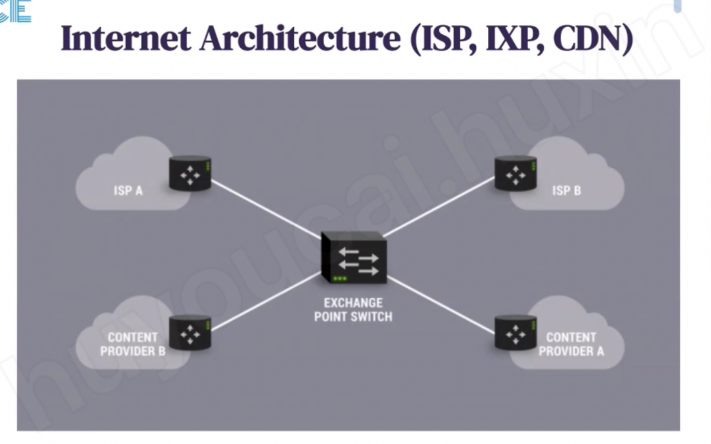
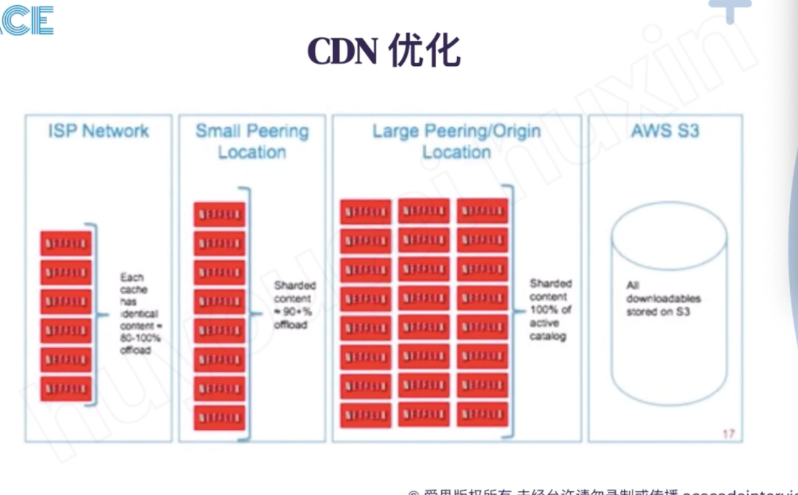
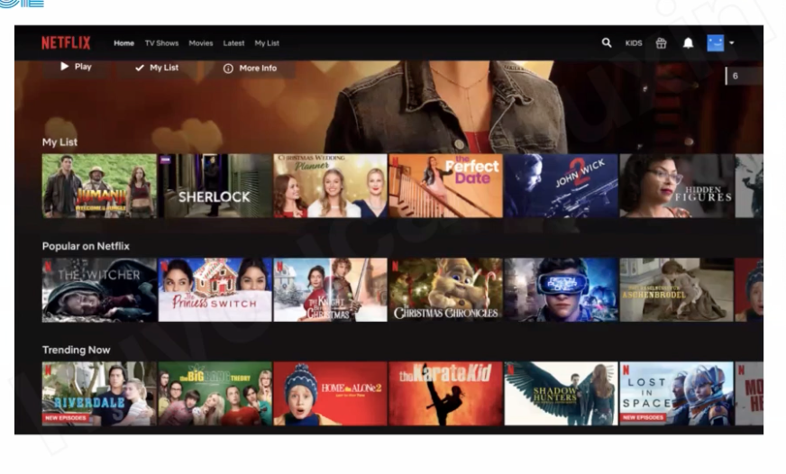
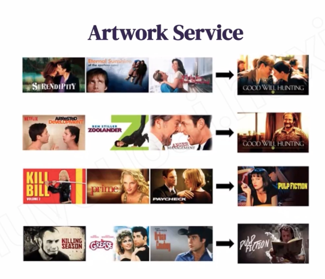
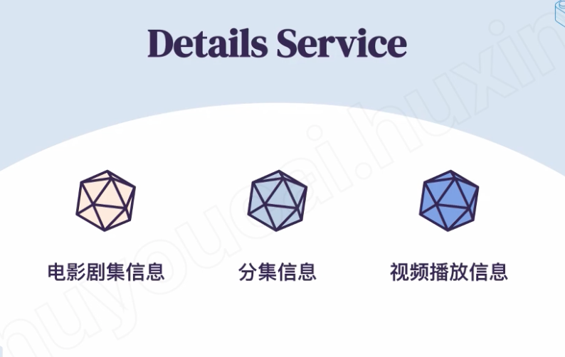
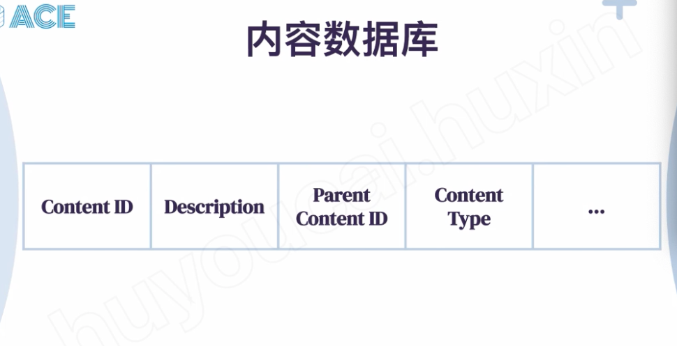
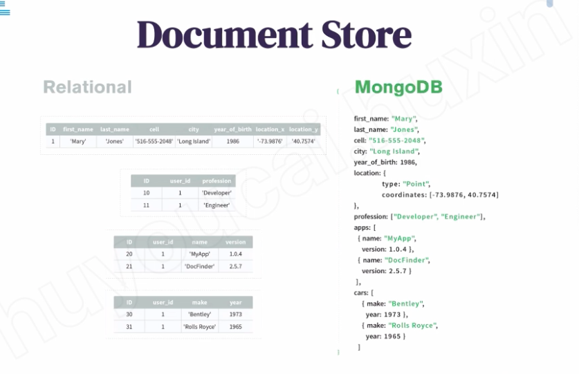
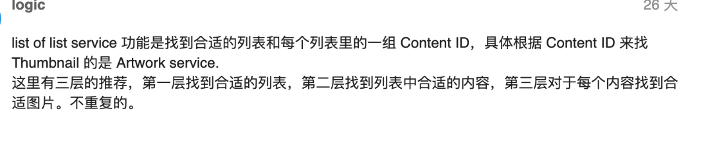

# ACE- CDN and protocol

---

Normal website will let user talked to DNS service and DNS will decide which CND user need to talk to

DNS service and find out the closet CDN

User will talk to the CDN, if the user cannot find the file in CDN then it will talk to the original service and service will save the file to CDN

Next time user will talk to CDN next time

Netflix will store the move to CDN in advance

Like cache ( query cache, if cache has the data, return to user otherwise, go to the DB then update the cache)

Or cache has some data store in cache in advance

Traffic will first go to ISP

ISP internet service provider ,

Larger peering location for each continent sourth american (100%)

Cdn close to the exchange point iXP

Client will request the video clip, each clip may just 1-2 min, before first clip finish,

It will request next clip from service

![D 创 用 Li 短 视 视 频 播 放 数 据 流 Allen Nir 应 该 需 ] dawn 《 戗 这 个 具 《 候 笞 出 0 Allen Nin 请 问 这 ， i Type me NetmxinAWS @ 爱 思 版 权 所 有 未 经 允 许 请 勿 录 制 或 传 播 acecodeinterview ℃ om ](../../media/Netfilx-Netflix-ACE--CDN-and-protocol-image6.png)

CND report health status to AWS

Client request video

AWS check the client permission and check the CDN if has that video

AWS will send the CDN address to user

Client will talk to CDN

CDN may request different resolution of this video from AWS

All the video store in a folder

Gateway accept the first request and forward to certain service nexttime

Offer id

Documents store

