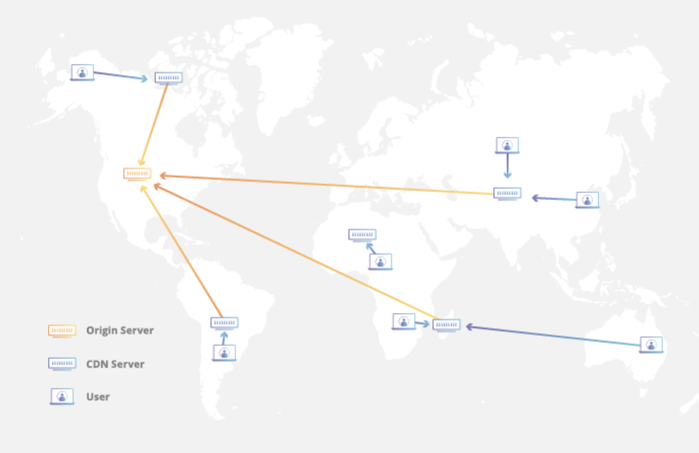
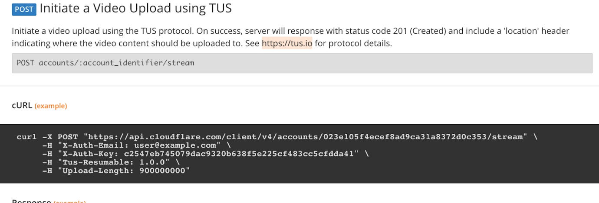
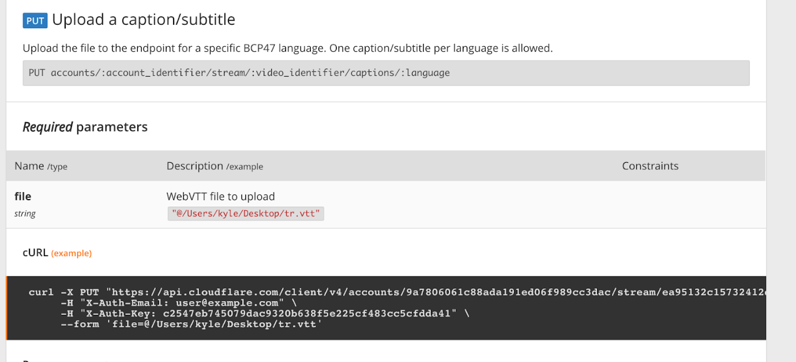

# Online Stream 

Created: 2021-01-14 00:29:24 -0600

Modified: 2021-01-14 00:39:33 -0600

---

**Functional Requirements:**

- Users should be able to upload videos.
- Users should be able to share and view videos.
- Users should be able to perform searches based on video titles.
- Our services should be able to record stats of videos, e.g., likes/dislikes, total number of views, etc.
- Users should be able to add and view comments on videos.

**Non-Functional Requirements:**

- The system should be highly reliable, any video uploaded should not be lost.
- The system should be highly available. Consistency can take a hit (in the interest of availability); if a user doesn't see a video for a while, it should be fine.
- Users should have a real time experience while watching videos and should not feel any lag.

**Bonus Part:**

- most popular videos
- Channels
- Subscriptions
- Trending videos
- Tik Tok topics
- Video recommendations
- Real time 弹幕

Not Include:

- Authentication / Authorization
- 

10 mins: Business (Use Cases)/common sense

10 mins: Constraints

10 mins: Architecture

10 mins: API Design

10 mins: DB choice

10 mins: Data model

CDN

Benefits of CDN:

1.  Improving website load times - By distributing content closer to website visitors by using a nearby CDN server (among other optimizations), visitors experience faster page loading times.
2.  Reducing bandwidth costs.
3.  Increasing content availability and redundancy
4.  Improving website security
5.  TTL feature for certain use cases.

{width="6.270833333333333in" height="4.0625in"}

Simple use case for CDN:

1.  Register with CDN
2.  Append resources with cdn url instead.

[CDN.myspace/image1]{.mark}

[Streaming service is building on the CDN]{.mark}

CDN Provide video streaming and subtitles/captions service.

Experiments with:

- [Twitch 30 secs, 20KB]{.mark}. m3u8
- Douyu cdn resource streaming 500KB/s flv -- [append to the old file]{.mark}

Youtube:

<https://r1---sn-n4v7knlk.googlevideo.com/videoplayback?expire=1591856683&ei=y3nhXuCLFdXBkwbniKYw&ip=24.5.83.146&id=o-AHUeCZdeWM1OEkDzj1HyKxh5BEHkHITyr4H0fvBXrRuA&itag=247&aitags=133%2C134%2C135%2C136%2C137%2C160%2C242%2C243%2C244%2C247%2C248%2C278&source=youtube&requiressl=yes&vprv=1&mime=video%2Fwebm&gir=yes&clen=74633294&dur=601.901&lmt=1591830739420755&fvip=1&keepalive=yes&beids=9466588&c=WEB&txp=6316222&sparams=expire%2Cei%2Cip%2Cid%2Caitags%2Csource%2Crequiressl%2Cvprv%2Cmime%2Cgir%2Cclen%2Cdur%2Clmt&sig=AOq0QJ8wRQIgWqMCObQh4QU_Yi9fcUYe1MxqppBRZVeOkvD8KN1rNiECIQDxEKh3shZHw4Vi3g3vsiXgeng_YUJvLpvUMBP9odfe_A%3D%3D&alr=yes&cpn=V0OOFmt3RLVOJOt8&cver=2.20200609.04.01&redirect_counter=1&rm=sn-n4vl67e&fexp=9466588&cms_redirect=yes&ipbypass=yes&mh=pv&mip=2601:645:8101:1ea4:58e4:772f:34ad:760c&mm=31&mn=sn-n4v7knlk&ms=au&mt=1591835011&mv=m&mvi=0&pl=34&lsparams=ipbypass,mh,mip,mm,mn,ms,mv,mvi,pl&lsig=AG3C_xAwRQIhAIRB6XQ43hKSsrFl4FsXLn1WP94PtrS04HW1-0dmjWayAiBohaIotTy2bSOZYkFiGQeVqwylAU6th7Hbk__ZzFhT1Q%3D%3D&range=4664737-6134370&rn=19&rbuf=24672>

{width="6.270833333333333in" height="1.8333333333333333in"}

Simple Design

Use CDN's provided functionality to stream the video. No need to store any copy. Take [cloudflare API](https://api.cloudflare.com/#stream-videos-list-videos) as an example, it supports stream video, list streams, upload stream captions.

![List videos Up to 1000 videos can be listed with one request, use optional parameters below to get a specific range of videos. Please note that Cloudflare Stream does not use pagination, instead it uses a cursor pattern to list more than 1000 videos. In order to list all videos, make multiple requests to the API using the created date-time of the last item in the previous request as the before or after parameter. GET accounts/:account_identifier/stream Optional parameters Name /type after string (date-time) before string (date-time) include counts boolean search string limit integer asc Description /example Show videos created after this date-time " 2014-01-02TØ2 : 20 : Show videos created before this time Include stats in the response about the number of videos in response range and total number of videos available A string provided in this field will be used to search over the 'name' key in meta field, which can be set with the upload request of after. " puppy. mp4" Number of videos to include in the response List videos in ascending order of creation Constraints default value: false valid values: (true,false) min value:O max value:1 000 default value: false ](../../media/Netfilx-Netflix-Online-Stream-image3.png){width="6.270833333333333in" height="4.28125in"}

Sample returned result:

<table>
<colgroup>
<col style="width: 100%" />
</colgroup>
<thead>
<tr>
<th>
<strong>{</strong>

<strong>"success": true,</strong>

<strong>"errors": [],</strong>

<strong>"messages": [],</strong>

<strong>"result": [</strong>

<strong>{</strong>

<strong>"allowedOrigins": [</strong>

<strong>"example.com"</strong>

<strong>],</strong>

<strong>"created": "2014-01-02T02:20:00Z",</strong>

<strong>"duration": 300,</strong>

<strong>"input": {</strong>

<strong>"height": 1080,</strong>

<strong>"width": 1920</strong>

<strong>},</strong>

<strong>"maxDurationSeconds": 300,</strong>

<strong>"meta": {},</strong>

<strong>"modified": "2014-01-02T02:20:00Z",</strong>

<strong>"uploadExpiry": "2014-01-02T02:20:00Z",</strong>

<strong>"playback": {</strong>

<strong>"hls": " <a href="https://videodelivery.net/ea95132c15732412d22c1476fa83f27a/manifest/video.m3u8">https://videodelivery.net/ea95132c15732412d22c1476fa83f27a/manifest/video.m3u8</a>",</strong>

<strong>"dash": " <a href="https://videodelivery.net/ea95132c15732412d22c1476fa83f27a/manifest/video.mpd">https://videodelivery.net/ea95132c15732412d22c1476fa83f27a/manifest/video.mpd</a>"</strong>

<strong>},</strong>

<strong>"preview": " <a href="https://watch.cloudflarestream.com/ea95132c15732412d22c1476fa83f27a">https://watch.cloudflarestream.com/ea95132c15732412d22c1476fa83f27a</a>",</strong>

<strong>"readyToStream": true,</strong>

<strong>"requireSignedURLs": true,</strong>

<strong>"size": 4190963,</strong>

<strong>"status": {</strong>

<strong>"state": "inprogress",</strong>

<strong>"pctComplete": 51</strong>

<strong>},</strong>

<strong>"thumbnail": " <a href="https://videodelivery.net/ea95132c15732412d22c1476fa83f27a/thumbnails/thumbnail.jpg">https://videodelivery.net/ea95132c15732412d22c1476fa83f27a/thumbnails/thumbnail.jpg</a>",</strong>

<strong>"uid": "ea95132c15732412d22c1476fa83f27a",</strong>

<strong>"uploaded": "2014-01-02T02:20:00Z"</strong>

<strong>}</strong>

<strong>],</strong>

<strong>"total": "35586",</strong>

<strong>"range": "1000"</strong>

<strong>}</strong>
</th>
</tr>
</thead>
<tbody>
</tbody>
</table>

{width="6.270833333333333in" height="2.1354166666666665in"}

TUS: Open protocol for reusable file uploads.

{width="6.270833333333333in" height="2.8541666666666665in"}

