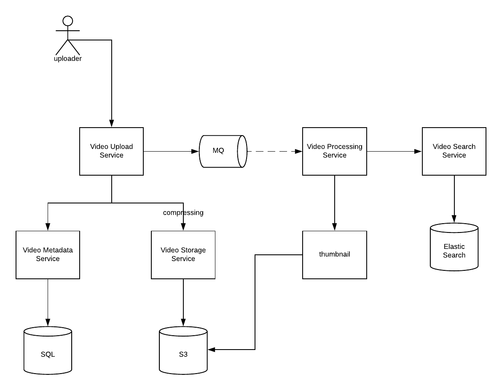
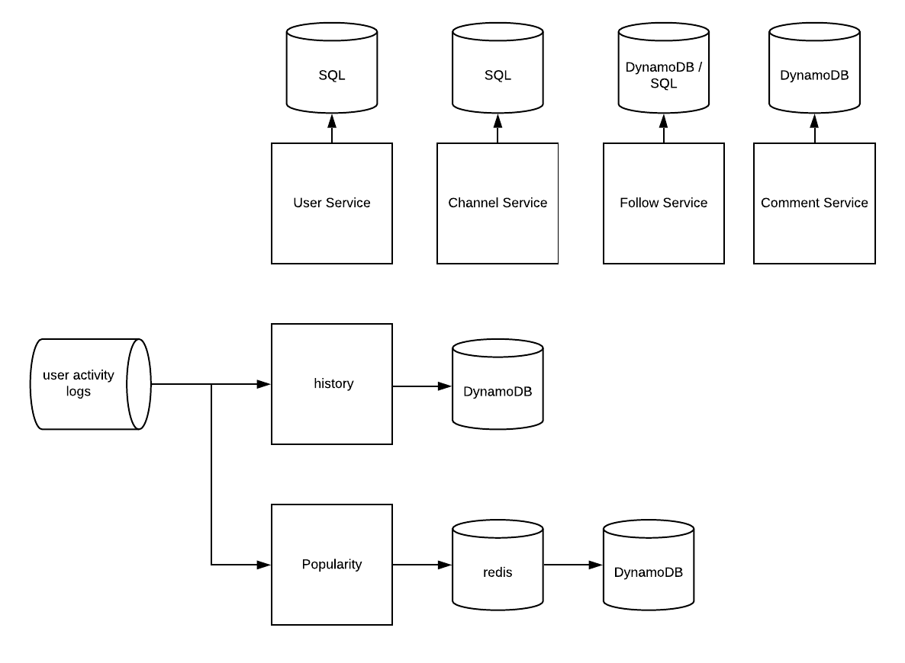
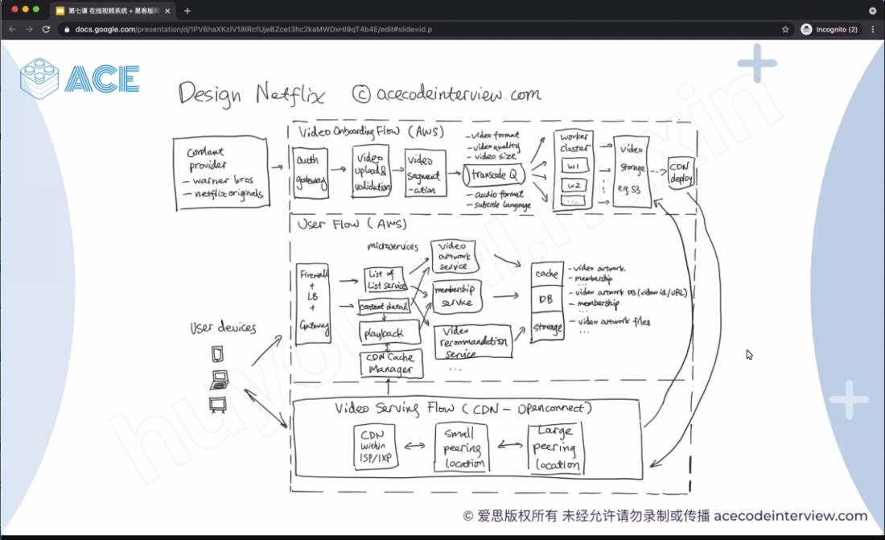

# Summary -3

Created: 2021-01-13 18:47:14 -0600

Modified: 2021-05-28 23:21:51 -0600

---

Constraints

Let's assume we have 1.5 billion total users, 800 million of whom are daily active users. If, on average, a user views 5 videos per day then the total video-views per second would be:

800M * 5 / 86400 sec => 46K videos/sec

Let's assume our upload:view ratio is 1:200, i.e., for every video upload we have 200 videos viewed, giving us 230 videos uploaded per second.

46K / 200 => 230 videos/sec

Storage Estimates: Let's assume that every minute 500 hours worth of videos are uploaded to Youtube. If on average, [one minute of video needs 50MB of storag]{.mark}e (videos need to be stored in multiple formats), the total storage needed for videos uploaded in a minute would be:

500 hours * 60 min * 50MB => 1500 GB/min (25 GB/sec)

These numbers are estimated by ignoring video compression and replication, which would change our estimates.

Bandwidth estimates: With 500 hours of video uploads per minute and assuming each video upload takes a bandwidth of 10MB/min, we would be getting 300GB of uploads every minute.

500 hours * 60 mins * 10MB => 300GB/min (5GB/sec)

Assuming an upload:view ratio of 1:200, we would need 1TB/s outgoing bandwidth. CDN could reduce 90% of traffic here.

{width="10.083333333333334in" height="5.177083333333333in"}

{width="10.083333333333334in" height="4.854166666666667in"}

Each video store 3 copies

The bottle neck is throughput

High Level

~~Youtube is a complex system with lots of features and service.~~ For separate of concerns purposes, the design of the youtube is separated into four major parts:

- Video upload, processing, view
- Metadata management(Including user, # of views, likes, watching history, comment, channel, follow etc)
- Streaming part (trending video, 弹幕，trending topic)
- Video recommendation(personalized recommendation)

For separate of concerns principle, the following designs are broke into 4 parts as well:

[Video Upload and Processing]{.mark}

Architecture

{width="12.479166666666666in" height="9.6875in"}

~~Action: generate thumbnail, video id, target url ---> video processing service~~

1.  Video is uploaded, chopped into 2 seconds clips, and stores the video clips in S3 alongside the Metadata. After the video is uploaded, compressed, chopped, stored and metadata processed & stored, return success to the user.

2.  Then the video is set to ready for process, the process will generate a thumbnail(if user didn't set), and index the video to make it searchable in the search engine.

The read will use CDN, if CDN is not buffered, read from Video metadata to identify the uuid of the video clips and then read from the S3.

Data Model

Video storage SQL + S3 table:

Next (few) uuid to reduce one additional call to metadata service

[Clip store in S3 --S3 url?????]{.mark}

S3 PrimaryKey = { video id + clip id + resolution}

Clip meta data

| [video Id]{.mark} | [Clip id]{.mark} | [resolution]{.mark} | owner | Timestamp | offset | Next clips |
|----------|---------|-------------|----------|---------------|---------|---------|
| [uuid]{.mark} | [uuid]{.mark} |  | scott | 12344 | 124 | Next uuid |

ElasticSearch index: skipped, each video (transfer the video to article) is processed as a bag of words, similar to articles or webpages, use inverted index to index the video and BM25(label the video) to search the relevant videos. give terms and criteria, the elastic search will return the highly relevant video and then filter based on the other criteria's like video length, upload time etc.

[Video metadata SQL table:]{.mark}

Next (few) uuid to reduce one additional call to metadata service

<table>
<colgroup>
<col style="width: 7%" />
<col style="width: 8%" />
<col style="width: 5%" />
<col style="width: 7%" />
<col style="width: 11%" />
<col style="width: 12%" />
<col style="width: 13%" />
<col style="width: 11%" />
<col style="width: 8%" />
<col style="width: 12%" />
</colgroup>
<thead>
<tr>
<th>Id</th>
<th>user</th>
<th>ts</th>
<th>title</th>
<th>desc</th>
<th>Total length</th>
<th>Clips mapping</th>
<th>Thumb nail</th>
<th>State</th>
<th>Share rule</th>
</tr>
</thead>
<tbody>
<tr>
<td>uuid</td>
<td>scott</td>
<td>12</td>
<td>my</td>
<td>system</td>
<td>155 seconds</td>
<td>
{0: uuid0 <mark>S3 url</mark>,

...

}
</td>
<td>uuid</td>
<td></td>
<td>
Private/

Public/

Group
</td>
</tr>
</tbody>
</table>

- State could be one of the following {NEW, UPLOADED, AVAILABLE, DELETED_PENDING, DELETED, STREAMING*}, [NEW]{.mark} is when the user starts uploading a video. When the video is uploaded, compressed, broken down and stored, the service changes the state into [UPLOADED]{.mark}, [then]{.mark} async triggered the video post processing ( generate the thumbnail). When the video is indexed in the search engine and passed all other checks(e.g. safety check), the service changed the state back to the [AVAILABLE]{.mark}.

When the user deletes the video, the state will be changed to [DELETED_PENDING,]{.mark} the search engine will un-index the video and then change it to DELETED. STREAMING will be explained in the stream section.

- [Clips mappings]{.mark} could be normalized and stored in another table. This is particularly necessary if the video is streamed and will need to add new clips as they come. Note: frequent updates of the same row is really bad in system design.

[Youtube Community]{.mark}

Architecture

{width="12.416666666666666in" height="9.104166666666666in"}

- [Popularity service in charge of the views, likes, dislikes of the video,]{.mark} likes and dislikes of the comments. The popularity service will [periodically]{.mark} read all user activity logs and update the likes/views etc.
  - Popularity has massive read / write but ok with small chance of data loss, therefore use redis to store the data and async write back to DB.

Popularity Table(Redis): Redis can handle 10k qps

Popular comments are generated by background process

| key            | value                                     |
|----------------|-------------------------------------------|
| Video id: uuid | View: 12455                               |
|               | Like: 1241                                |
|               | Dislike: 123441                           |
|               | Popular comments: [uuid1, uuid2, uuid3] |
| Comment id     | Like: 1234                                |
|               | Dislike: 1234                             |

- [All light weight(small data loss OK) activity go to the user activity logs kafka]{.mark}, that includes, view video clips, leave video pages, like a video etc.
  - The view of video will subscribed the kafka queue and update view history and popularity separately.
  - One caveat is read after write could be inconsistent, either cached in the client side or read also from the last few seconds logs. ( solution 1. client cached the data, if this is user self, he can read the user activity log and history table for own data)

[Comment DynamoDB table:]{.mark}

[videoId, is partition key, Comment_id is the sort key. Comment_id can contain a timestamp and the latest id will on the top]{.mark}

Partition key and sort key is primary key

| vId  | commentid | ts  | user  | Parent cid | comment    | Creation ts | Updated ts | reply user |
|------|------------|-----|-------|--------|-----------|----------|----------|-------|
| uuid | uuid      | 12  | scott | uuid       | Looks good | 1234        | 3425       | uuid       |

[Local secondary Index on the parent comment id.]{.mark}

history dynamodb table

view / like / dislike history

| user | ts  | VideoId | Action type       | Clip uuid |
|------|-----|---------|-------------------|-----------|
| uuid | 123 | uuid    | like/dislike/view | uuid      |

API

**Public:**

**uploadVideo(api_dev_key, video_title, vide_description, tags[], category_id, default_language, recording_details, video_contents)**

api_dev_key (string): The API developer key of a registered account. This will be used to, among other things, throttle users based on their allocated quota.

video_contents (stream): Video to be uploaded. -- [local file location]{.mark} will loaded into system via web socket

**searchVideo(search_query, user_location, maximum_videos_to_return, page_token)**

getVideo(user_id, user_context, video_id, offset);

Videos are chopped to 2 seconds clips, and stored separately. A typical short video of 5 mins = 150 clips. Medium size video 20 mins = 600 clips. Long video of 2 hours = 3600 clips.

Internal API:

GenerateThumbnail(video_id);

StoreThumbnail(video_id, image);

indexVideo(video_id);

API For comment ..

UserCRUD

Follow / Unfollow

Channel CRUD

- Playlists CRUD
- Home CRUD
- Features CRUD

Comment:

AddComment(video_id, user, parent_comment_id, reply_to_user, comment)

- Create timestamp will be added by the server

UpdateComment(video_id, user, comment_id, comment)

- Edit timestamp will be added by the server.

Recommendation System

Architecture

{width="12.479166666666666in" height="7.3125in"}

- Every video is labeled with several tags, it could be done automatically or manually
  - System design, news, stock, yu qian, classical music, civ 6, food etc.
  - Some less popular page could be classified badly (bridge)
- User preference profile could be built on top of user view/like/dislike of video ids. Then based on weight, an user profile could be built
  - [Scott: food:5.4, civ 6: 1.3, yu qian: 0.9, system design:2.8]{.mark}
- A separate service could rank video by popularity from the popular service. Based on tags and the most popular video, a list of recommendations could be generated.
- Collaborative filtering could be also used to do video recommendations.

- The generated personal recommendations [(base on the collaborative filtering and popularity ranking )]{.mark}will be stored and saved in the database. When user login to the youtube page, the recommendations will render the page then (offline generation).

recommend the videos base the similar people )

{width="12.625in" height="18.5625in"}

Streaming System

Features: Trending video / topics / streaming / live chat.

Trending Video / Topics could be done by adding a flink, realtime stateful computation on top of data stream(user activities) to calculate.

Streaming requires prefill the metadata, thumbnail (if wanted), to make the stream searchable.

1.  the data is piped through the websocket to the server and then the server broadcasts the video clip bundled with the pointer (url or the CDN address ) to the next video clip.

2.  Users fresh open the page will get the current clips and then subsequent reads will be based on the next video clip pointer, no need to request it from the server.

3.  If a connection is lost, reconnect to get the current clip url.

4.  [Sending of live chat will be temp stored, bundled with video clip id.]{.mark}

5.  When the streamer streams the video, the live chat within a certain time threshold (< 5 seconds) will be displayed back asap.

6.  Viewers will watch the stream with a few seconds latency, therefore the live chat will be precisely displayed when the other user sends it.

{width="10.083333333333334in" height="6.1875in"}

