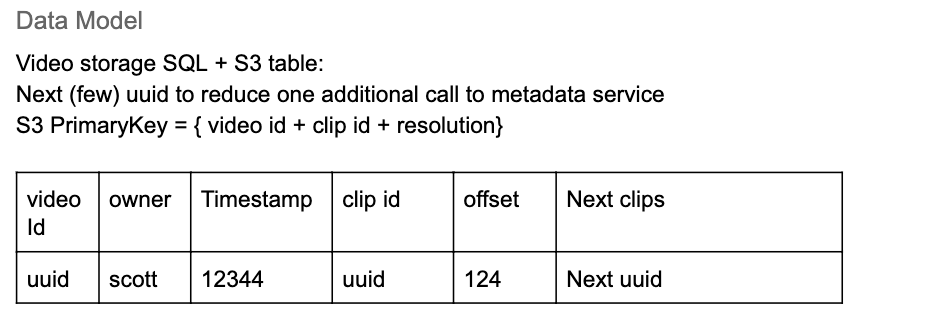

# Summary 

Created: 2020-12-03 01:53:05 -0600

Modified: 2020-12-16 01:17:16 -0600

---

if the system able to update the video, the video need be chopped into small chunks

Video is uploaded, chopped into 2 seconds clips, and stores the video clips in S3

and store the meta data to sql databse

After the video is uploaded, compressed, chopped, stored and metadata processed & stored, return success to the user. then send a message to process service to generate the thumbnail -- preview, picture

and send it to search service to create a index for searching

{width="10.083333333333334in" height="3.6770833333333335in"}

{width="10.083333333333334in" height="3.3020833333333335in"}

for recommendation and histroy

system need gather more user activity and send to pub/sub message and the worker subscribe it will store it in two table one is user history another is user active database

user history can be sorted in the sql

user activity included : view video clips, leave video pages, like a video etc.

One caveat is read after write could be inconsistent, either cached in the client side or read also from the last few seconds logs.

we will use those two table to feed the machine learning service and generate the recommendation

![Popularity Table(Redis): key Video id: uuid Comment id history dynamodb table view / like / dislike history user uuid ts 123 Videold Action type uuid like/dislike/view value View: 12455 Like: 1241 Dislike: 123441 Popular comments: [uuidl, uuid2, uuid3] Like: 1234 Dislike: 1234 Clip uuid uuid ](../../media/Netfilx-Netflix-Summary-image3.png){width="10.083333333333334in" height="9.427083333333334in"}

{width="10.083333333333334in" height="3.0625in"}

recommendation system

1.  each video should has multiple tags those generated by system
2.  each user also has multiple tags to indicate which kind of movie he like

3. other service ,ranking service will read the popularity from the redius and combine the popularity and tags, in each tags which movie are popular

4.  the service will generate the recommendation for different person base one the tag

and store in the database

person 1: tage 1: move1 ,move2 ...

for stream

Streaming requires prefill the metadata, thumbnail (if wanted), to make the stream searchable.

1.  the data/user is piped through the websocket to the server and then the server broadcasts the video clip bundled with the pointer to the next video clip to CDN services

2.  Users fresh open the page will get the current clips and then subsequent reads will be based on the next video clip pointer, no need to request it from the server.

3.  If a connection is lost, reconnect to get the current clip url.
4.  Sending of live chat will be temp stored, bundled with video clip id. chat id -> clip id

5.  When the streamer streams the video, the live chat within a certain time threshold (< 5 seconds) will be displayed back asap. ~~if the chat is not in the threshold, the chat will not display~~

6.  Viewers will watch the stream with a few seconds latency, therefore the live chat will be precisely displayed when the other user sends it.

user will only connect the CDN, will not connect the service

