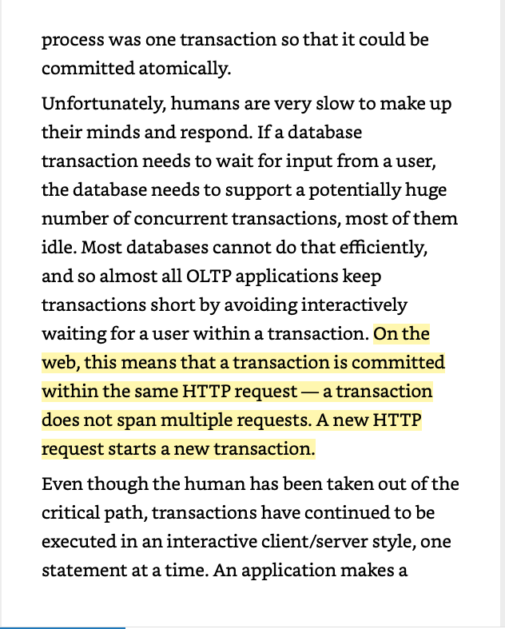

# System Design Scott transaction 

Created: 2021-02-12 10:29:37 -0600

Modified: 2021-02-13 00:59:12 -0600

---

[Chapter 9 transaction]{.mark}

Group a multiple statement-- read and writes into one logic union

We can commit or rollback the entire transaction

[Atomicity]{.mark} all or nothing (commit or abort)

Consistency has expectancy, guaranteed the expectancy, business requirement

Durability :exists a checkpoint, before that checkpoint, everything should be write to disk or write ahead log

Basic isolation level -- read committee level: no dirty reads ( all the data [you read]{.mark} have been committed)

No dirty writes ( you only will overwrite the data has been committed)

This is read committed but not snapshot isolation

![Snapshot Isolation / repeatable read select balance from accounts where id = 1 Alice Account I balance = 500 Account 2 balance 500 Transfer select balance from accounts where id 2 now balance = 400 commit time commit 500 now balance 600 update accounts set balance --- balance + 100 where id I update accounts set balance = balance - 100 where id 2 Figure 7-6. Read skew: Alice observes the database in an inconsistent state. [his anomal is called reac skew, and it is an exam le ot a nonre eatable read: il Alice were to read the balance of account I a ain at the end of the transaction she would see a diflZ•rent value ($600) than she saw in her revious ue . Read skew is considered acce table under read committed isolation: the account balances that Alice saw were indeed committed at the time when she read I hem Solution: reads from a •onsistent snapshot of the database ](../media/Onsite-quesion-System-Design-Scott-transaction-image1.png){width="5.0in" height="2.6979166666666665in"}

Dirty write ( Alice and Bob try to buy the car at the same time)

{width="5.0in" height="2.5520833333333335in"}

Row lock

![Read committed implementation Most conunonl . databases revent dirt writes b usin row-level locks: when a transaction wants to modif a )articular oWect (row or document), it must first ac uire a lock on that oWect. It must then hold that lock until the u•ansaction is cornmitted or aborted. Onl one transaction can hold the lock for an 'iven oWect: if another transactior vants to write to the same ob'ect. it must wait until the first transaction is committed or aborted before it can acc uirc •he lock and continue. This locking is done automaticallv bv databases in read committed mode (or stronuerj E low do we revent dirt reads? One o tron would be to use the same lock, and to re tilre an transaction that wants te read an ob'ect to briefl ac uire the lock and then release it a rain inunediatel after readin . This would ensure that !ead couldn't ha •n while an oWect has a dirt , uncommitted xalue (because durin ' that time the lock would be helc' h the transaction that has made the write).Howexer. thea roach of re uirin ' read locks does not work well ill wactice. because one Ion '-runnine write transaction can force manv other transactions to wait until the lone-runnin: Iransaction has coin leted -or that reason. for eve oWect that is written. the database remembers both the old cc nmitted value and the nexx  alue set b the transaction that currentl holds the write lock. While the transaction is ongoin an other transactions I hat read the oWect are sitnnlv L'ixen the old value. ()nlv when the new value is cotntnitted do transactions su•itch readitnL' the new value ](../media/Onsite-quesion-System-Design-Scott-transaction-image3.png){width="5.0in" height="2.7604166666666665in"}

[Snapshot isolation:]{.mark} read happen before partial transaction, some transaction can be read some cannot -- read never block write and write never block read

![Chapter 9: transaction part 1 Transaction txid = 12 Account I Account 2 Transaction txid= 13 select balance from accounts where id 1 500 created by = 3 deleted by nil id-l balance 500 created by = 5 deleted by nil id-2 balance = 500 update accounts set balance = balance + 100 where id 1 created by = 3 deleted by 13 id-l balance 500 created by --- 13 deleted by nil id---l balance 600 ok update accounts set balance balance • 100 where id 2 select balance from accounts where id 2 created by = 5 deleted by = 13 id-2 balance = 500 created by 13 deleted by nil id-2 balance = 400 commit time commit ok Figure 7-7. Implementing snapshot isolation using multi. version objects. Snapshot Isolation implementation readers never block writers, ant it'riters never block readers. Visibilitv Rules: At the time when the reader's transaction started, the transaction that created the obiect had alread committed. r he oWect is not marked for deletion, or if it is, the transaction that re uested deletion had not el committed at the time when the reader's transaction started ](../media/Onsite-quesion-System-Design-Scott-transaction-image4.png){width="5.0in" height="3.1041666666666665in"}

User 1 only can read all the transaction id <= 12, in this case, user will get the balance = 500

User 1 will not read transaction 13

Single point is transaction 13

All the transaction before 12 is closed or committed, the block for 12 can be deleted or garbage collection

Lost updates : it is snapshot isolation

![Read modify write: lost updates get counter User 1 Database User 2 42 [42 + I = 43) set counter = 43 42 ok set counter = 43 time ok get counter [42+ 1 431 Figure 7-1. A race condition between two clients concurrently incrementing a counter. Makin a local chan e to a com lex value, e. ., addin an element to a list within a JSON document (requires )arsin the document, makin the chan e, and writin back the modified document) Two users editin a wiki aoe at the same time, where each user saves their changes by sending the entire Da re contents to the server overwritin whatever is currentl in the database ](../media/Onsite-quesion-System-Design-Scott-transaction-image5.png){width="5.0in" height="2.8020833333333335in"}

Solution 1. atomic write 2. begin transaction ... "Compare and set" is not working for snapshot isolation, the data you read is snale data

If v == ? Update ...

SQL do the leader election will get around 200ms unavailable time

Store procedure

Bad: code review, migration ..

![Lost Update Solution... AUTOMATICALLY DETECTING LOST UPDATES: features in some databases. Atomic o erations and locks are wa s of reventin lost u dates b forcin the read-modi -write c cles to ha en se uentiall . An alternative is to allow them to execute in arallel and, if the transaction manager detects a lost update abort the transaction and force it to retry its read-modify-write cycle COMPARE-AND-SET: not working for snapshot isolation. [he u ose of this o eration is to avoid lost u dates b allowin an u date to ha en onl if the value has not changed since ou last read it. If the current value does not match what vou previously read, the update has no effect, and the read-modify-write cycle must be retried. CONFLICT RESOLUTION AND REPLICATION ,Atomic o erations can work well in a re licated context, es eciall it' thev are commutative (i.e.. vou can apply them in a different order on different re licas. and still get the same result). C RD T On the other hand, the last write wins (LWW) conflict resolution method is rone to lost u dates, as discussed in "Last concurrent writes ". Unfortunatel , L WW is the default in man re licated databases. ](../media/Onsite-quesion-System-Design-Scott-transaction-image6.png){width="5.0in" height="2.8125in"}

It is not dirty write: all data have been committed

Not lost update, change different object

![Write skew and Phantoms Alice: begin transaction select countC) from doctors where on _ call = true and shift_id 1234 if (currently on_call 2) update doctors Alice seton call = false where name = •Alice' and shifteid = 1234 commit transaction Ake BcO Card false true fa%e fane false begin transaction select count/ •j from doctors where on_call = true and shift_id 1234 Now M_ • 2 if 2) update doctors set on_call = false where name •Bob' and shift_id •z 1234 commit transaction it is neither a dirty write nor a lost update because the two transactions are updating twi iifferent objects (Alice's and Bob's on-call records, respectively). It is less obvious that •ontlict occurred here, but it's definitely ace condition: if the two transactions had run me after another. the second doctor woul have been prevented from going off call. The •tnomalous behavior was only possiblc the transactions ran concurrentlx I . Atomic single-object operations don help, as multiple objects are involved. Some databases allow you to configur •onstraints, which are then enforced b', lhe database (e.g., uniqueness, foreier key constraints, or restrictions on • )articular value). No help here. If ou can't use a serializable isolatiov level, the second-best o tion in thi case is robablv to ex licitl lock the that the transaction de •nds or, ](../media/Onsite-quesion-System-Design-Scott-transaction-image7.png){width="5.0in" height="3.1041666666666665in"}

![More write skew examples: Ileetinq room hooking sa ou want to entorce that there cannot be two bookin 's tor the sanw meetm ' room at the same time. When someonc -'A ants to make a bookin i, Otl first check for an conflicting hookint-'s (i.e.. hook ink's for the satne v. ith an overlappin: • itne range). and if none are found. vou create the meetin•• lock doesn't revent la ters from movin two dit-terent ti'-'ttres to the same on the board or •.onne other move that violates the rules of the game Claiming a usernam( Mentlallv makin•' a website where each user has a um ue username. two users ma t to create accounts With the same usernanle at thi_• titne_ You mav use a transaction to check whether a natne is taken and. if not. create an account with that nmne Preventing double-s endinL  service that allows users to s end mone or oints needs to check that a user doesn't s •nd more than the have. You ni 'ht im lement this b insertin a tentative s •nding itetn into a user's account, listin ' all the items in the account, and checkin ' that the sum is ositive. With write skew, it could ha en that two s endin ' items are inserted concurrentlv that • cause the to go negative. but that neither transacti(in notices the ](../media/Onsite-quesion-System-Design-Scott-transaction-image8.png){width="5.0in" height="3.125in"}

[Solution: Serializability]{.mark}

SSI : optimistic concurrency

Two way locking

Signal thread

![Serializability: strongest isolation level It uarantees that even thou h transactions ma execute in arallel, the end result is the same as if the had executed one at a time, seriallv, without an concurrenc . Thus, the database arantees that if the transactions behave correctl when run individually. they continue to be correct when run concurrently--- the database prevents all possible race conditions Literall executin transactions in a serial order: actual serial execution Two- hase lockin which for several decades was the onl viable o tion O timistic concurrencv control techni ues such as serializable sna shot isolation Actual Serial Execution:(redis. voltDB. single thread write) No interactive transaction, use stored rocedure instead One artition one write thread Transaction is small and fast Active dataset can fit into the memorv Write throughput must be small enough ](../media/Onsite-quesion-System-Design-Scott-transaction-image9.png){width="5.0in" height="2.71875in"}

Active dataset fit into memory -- > redis memory database

For signal thread, it should be [no interactive transaction]{.mark}:

{width="5.0in" height="6.21875in"}

![query, reads the result, perhaps makes another query depending on the result of the first query, and so on. The queries and results are sent back and forth between the application code (running on one machine) and the database server (on another machine). In this interactive style of transaction, a lot of time is spent in network communication between the application and the database. If you were to disallow concurrency in the database and only process one transaction at a time, the throughput would be dreadful because the database would spend most of its time waiting for the application to issue the next query for the current transaction. In this kind of database, it's necessary to process multiple transactions concurrently in order to get reasonable performance. For this reason, systems with single-threaded ](../media/Onsite-quesion-System-Design-Scott-transaction-image11.png){width="5.0in" height="6.302083333333333in"}

{width="5.0in" height="3.1979166666666665in"}

[2 phase locking]{.mark} -- lock on the object in the database

Read will not block read -- non exclusive lock

If there is a read lock on the object, read will block write -- excusive lock

![0820-transction-2.mp4 2 Phase Locking Several transactions are allowed to concurrentl read the same 0b •ect as Ion as nobodv is writing to it. But as soon as anyone wants to write (modify or delete) an object. exclusive access is required If transaction A has read an olfect and transaction B wants to write to that oWect, B must wait until A commits 01 aborts before it can continue. (This ensures that B can't chan e the 0b ect unex ectedl behind A's back.) If transaction A has written an oWect and transaction B wants to read that oWect, B must wait until A commits 01 aborts before it can continue. (Reading an old version of the object. like in Fi ure 7-4. is not acceptable under 2PL. ) In 2PL, writers don't •ust block other writers; the also block readers and vice versa. because 2PL rovides serializabilitv. it protects against all the race conditions discussed earlier. including lost updates and write skew it can ha en uite easil that transaction A is stuck waitin for transaction B to release its lock, and vice versa. This situation is called deadlock. The database automaticall detects deadlocks between transactions and aborts one of them so that the others can make rogress. The aborted transaction needs to be retried bv thea lication. ](../media/Onsite-quesion-System-Design-Scott-transaction-image13.png){width="5.0in" height="2.71875in"}

[Predicate lock]{.mark} : lock base on the condition or statement (where statement)

---> difficulty to implement ----> index lock

![Predicate Lock <> Index range lock A predicate lock restricts access as töllows: could be used to restrict non existing objects. Not perform well If transaction A wants to read oWects matchin some condition, like in that SELECT ue , it must ac uire a shared-mode redicate lock on the conditions of the ue . If another transaction B currentl has an exclusive lock on an oWect matchin those conditions, A must wait until B releases its lock before it is allowed to make its ue If transaction A wants to insert, u date, or delete an oWect, it must first check whether either the old or the new value matches an existin redicate lock. If there is a matching predicate lock held by transaction B. then A must wait until B has committed or aborted before it can continue Index ran e lock: if ou have a redicate lock for bookin sof room 123 between noon and I .m., ou cana roximate it by lockin bookin s for room 123 at an time, or ou cana roximate it b lockin all rooms (not •ust room 123) between noon and I .m. This is safe, because an write that matches the ori inal redicate will definitel also match thea roximations. if another transaction wants to insert, u date, or delete a bookin for the same room and/or an overla in time eriod, it will have to u date the same art of the index. In the process of doing so. it will encounter the shared lock. and it will be forced to wait until the lock is released ](../media/Onsite-quesion-System-Design-Scott-transaction-image14.png){width="5.0in" height="2.7708333333333335in"}

Pessimistic vs optimistic

Pessimistic lockin: if a lot of transaction are coming at the same time, all the transaction try to assess the same resource, resource complete rate is high

We should use pessimistic

![Serializable Snapshot Isolation: newest, performance+ lÅvo- hase lockin is a so-called essimistic concurrenc control mechanism: it is based on the rinci le that if an hine Ini ht ossibl o wron (as indicated b a lock held b another transaction), it's better to wait until the situation is saft• again before doing anything. It is like mutual exclusion, which is used to protect data structures in multi-thread. Serial execution is, in a sense, essimistic to the e.xtreme: it is essentiall e uivalent to each transaction havin an exclusiv lock on the entire database (or one artition of the database) for the duration of the transaction. We com ensate for the pessimism by making each transaction verv fast to execute, so it only needs to hold the "lock" for a short time B contrast, serializable sna shot isolation is an o timistic concurrenc control techni ue. O timistic in this context means that instead of blockin if somethin otentiall dan erous ha ens, transactions continue an a , in the ho e that eve hin will turn out all ri ht. When a transaction wants to commit, the database checks whether an thin bad ha ene ( i.e., whether isolation was violated): if so, the transaction is aborted and has to be retried. Only transactions that executed serializably are allowed to commit. Contention high: pessimistic, contention low: optimistic ](../media/Onsite-quesion-System-Design-Scott-transaction-image15.png){width="5.0in" height="2.6145833333333335in"}

![mentlng snaps ot ISO anon en a transaction rea s rom a consistent snaps ot In an ata ase. It nores writes that were made by any other transactions that hadn't yet committed at the time when the snapshot was taken. In Figure 7-10, transaction 43 sees Alice as having on_call = true. because transaction 42 (which modified Alice's on-call status) is uncommitted. However, by the time transaction 43 wants to commit, transaction 42 has already committed. This means that the write that was ignored when reading from the consis- tent snapshot has now taken effect, and transaction 43's premise is no longer true. select count(•) from doctors where on_call true and shift_id - 1234 Transaction 42 2 Database Transaction 43 shift_id name update doctors set on_call = false where name • Alice' and shift_id - 1234 ok 2 select count(') from doctors commit ok ok update doctors set on_call false commit time ABORT retry... where on_call true where name = •Bob' and shift_id - 1234 and shift_id- 1234 on_can created_by deleted_by 1234 1234 1234 1234 Alice Alice Bob Carol true false true false 42 42 Transaction 42 hasn't committed yet. so transaction 43 sees Alice as still being on call. However, the transaction manager notes that this value is no longer up•todate. Figure 7•10. Detecting When a transaction reads outdated values from an MVCC snapshot. ](../media/Onsite-quesion-System-Design-Scott-transaction-image16.png){width="5.0in" height="4.322916666666667in"}

![Detecting stale MVCC reads Recall that snapshot isolation is usually implemented by multi-version concurrency control (MVCC; see Figure 7-10). When a transaction reads from a consistent snapshot in an MVCC database, it ignores writes that were made by any other transactions that hadn't yet committed at the time when the snapshot was taken. In Figure 7-10, transaction 43 sees Alice as having on_cal true, because transaction 42 (which modified Alice's on-call status) is uncommitted. However, by the time transaction 43 wants to commit, transaction 4 2 has already committed. This means that the write that was ignored when reading from the consistent snapshot has now take effect, and transaction 43's premise is no longer true ](../media/Onsite-quesion-System-Design-Scott-transaction-image17.png){width="4.927083333333333in" height="6.5in"}

![select country from doctors where on_call true and shift_id 1234 Transaction 42 2 Database 2 Transaction 43 select count( s) from doctors where on_call true and shift_id 1234 key range information update doctors set on_call false where name Alice' and shift_id 1234 Ok commit 0k 0k commit time ABORT update doctors set on_call false where name = 'Bob' and Shift_id 1234 1234 1234 read by transaction 42 read by transaction 43 old new shift id name on_can 1234 Alice true 1234 Alice false Index-range locks on doctors.shift_id index Note: update by transaction 42 affects read by transaction 43 Figure 7-11. serializable snapshot isolation. detecting when one transaction modifies another transaction •s reads. In the context Of two-phase locking we discussed index-range locks (see "Index-range locks"), which allow the database to lock access to all rows matching some search query, such as WHERE shift id = 1234. We can use a similar technique here. except that SSI locks don't block Other transactions. In Figure 7-11 , transactions 42 and 43 both search for on-call doctors during shift 1234. If there is an index on shift id, the database can use the index entry 1234 to record the fact that transactions 42 and 43 read this ](../media/Onsite-quesion-System-Design-Scott-transaction-image18.png){width="5.0in" height="4.09375in"}

{width="4.885416666666667in" height="6.5in"}

Chapter 11

![Cots of thin scan o wron ' listributed s sterns. The silli lest wa o handlin ' such faults is to sim I ' let the 'ntire service fail. and show the user an •rror messa 'e. If that solution i unacce table, we need to find wavs 01 faul' by using a transaction, the application 'an pretend that there are no atomicity), that nobody else i. •oncurrently accessing the datalym isolation), and that storage devices are rfectlv reliable (durabilitv) i ransaction isolation is primarilv abou: tvoiding race conditions due •oncurrently executing transactions vhereas distributed consistency i: nostly about coordinating the state ot replicas in the face of delavs and faults ](../media/Onsite-quesion-System-Design-Scott-transaction-image20.png){width="3.9375in" height="6.5in"}

![Serializability != Linearizability -senanzat)lllt IS an Isolation ro rt of transacoons, wnere eve transaction ma read and Hite multi leo ct•: rows, documents, records see 'Si le-Ob ect and MuttJ-Ob ect O erations-. It uarantees that transactions bohavs •he same as if the had executed •n some serial order each transaction runmn to com letion before the next • It Order to in a recenc uarantee on reads anc writes ot ar Ister an ect . It doesnt rou• eratlonst ether into transactions. so It does not revent roblems such as write skew see N.'nte Skew ann Phantoms'). unless vou take additional measures such as matenabzina conflicts (see *Materializina conflicts" h database ma ovode 00th scnanza011Lt and lineanzab•llt . and thJS combination IS known as stnct tron ooeco seaahzab'fr stro -ISR 1m lementations of serialtzablll based on two. hase locki set• Two-Phase Lockinq (2PL or actual serial executton (see 'Actual Serial Execution') are tvoicallv lineanzahle ](../media/Onsite-quesion-System-Design-Scott-transaction-image21.png){width="5.0in" height="2.6770833333333335in"}

{width="5.0in" height="3.125in"}

