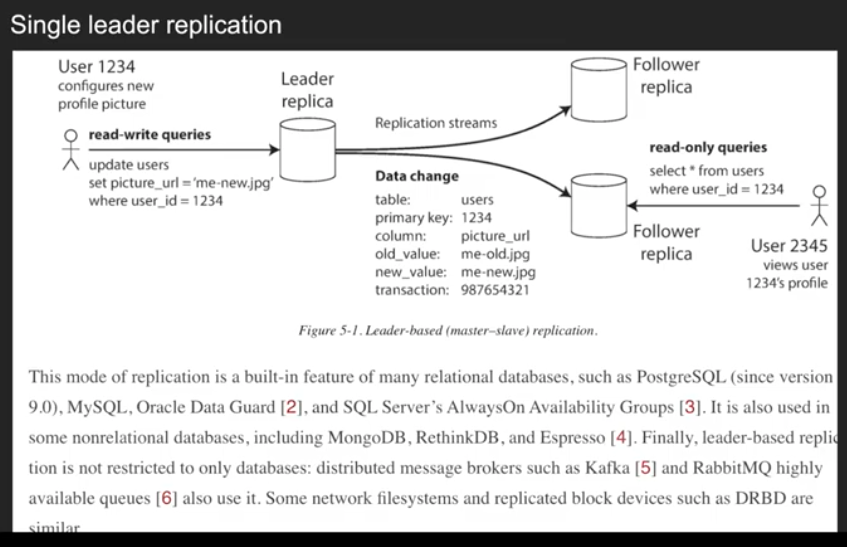
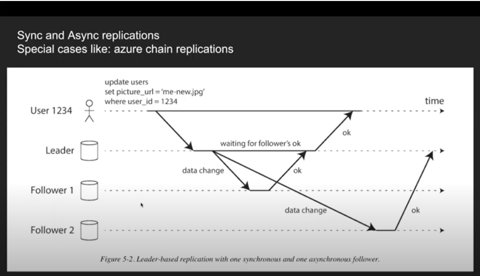
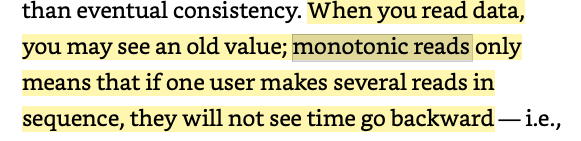
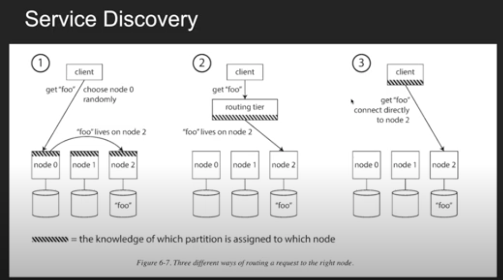
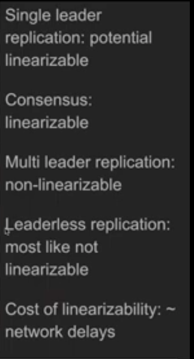

# System Design Scott

Created: 2020-11-17 11:01:54 -0600

Modified: 2021-02-12 10:30:44 -0600

---

chapter 2 system design basic

cdc capture changes data

warm up cache

rate limit , -- internal customer

throttling

how to guarantee you write is what you read: after you write comes to the primary database, but before invalidate request update to cahce, the read request will still read the old data

or we can update the cache first, then write to db, if durability is not import

{width="5.0in" height="2.513888888888889in"}

uber has primary database and secondary primary database. secondary primary database is log database, it is ready only. it only return true is both database write successfully

tweet

1.  read hotspot : gaga_01, gaga_02: problem is eventual consistency

[chapter 3 : data model]{.mark}

sql limitation for one service : 2 TB, uber 500 GB

document is good for demonized data --- write together, for sql: need join

Relational : schema on write

document database schema on read

alter table on SQL is very slow

graph database : vertices and edges

[Chapter 5 Replication]{.mark}

{width="5.0in" height="3.2222222222222223in"}

{width="5.0in" height="2.8680555555555554in"}

Follower 2 will get the old data

Set up new followers -> copy snapshot -> append the new log with new transaction after the

Snapshot

![Set up new Followers I •co data tiles trom one node to another t icall not sutticient: clients are constantl writin to database. and the data is alwa •s in flux, so a standard tile copy uould see ditlQrent parts ot•the database at differen- I'0ints in time. The result miL'ht not make anv sense iou could make the tiles on disk consistent l'n•kin:' the llnak'ltl!' it linaxail.lhle 'A Tites), hut a•-'a111St our '_'oal Ili'_'h ax Glilahilit•i I-ake a consistent sna of the leader-s database at sonle int in tilne---lf sslble. without takin ' a IOC k 0'. - entire database. Most databases have this feature. as it is also reauired for hackli In cases :hird- Yart tools are Ileeded. such as in'loback'l XlvSQl Co • the sna shot to the new follower node The follower connects to the leader and re uests all the data chan •es that have ha )ened since the sna •.vas taken. This re uires that the sna shot is associated with an exact sition in the leader's re lication Iou'. sition has various It the hinlo ' coordinate.v When the follower has rocessed the backlo ' of dala chan it the • call 'es since the sna 'sli0t. it ](../media/Onsite-quesion-System-Design-Scott-image4.png){width="5.0in" height="3.111111111111111in"}

Leader election

For 2 phrase commit, we should not change the ladder

{width="5.0in" height="0.6458333333333334in"}

![In certain fault scenarios, it could ha en that two nodes both believe that the arc the leader. This situation is calleé , 'lit brain. and it is dangerous: ifboth leaders acce t Mites. and there is no rocess for resolvin conflicts (see shut down one node if two leaders are if this is not caret-tillv (lesi•.'ned. vou call enc with both nodes bein ' shut dowrv N."hat is the ri 'ht titneout before the leader is declared dead? A Ion 'er timeout Incans a Ion 'er tinie to recove In tllc ase where the leader fails, Ilowch cr. if the timeout is too short. there could bc unnecessa ' For exani le_ ra load s ike could cause a node's res nse tirne to increase above the titneout. or a network 'litch coul•. •ause dela ed ckets. It-the s stem is alread stru 'line ivith hik•h load or network problems, an unnecessar•, ](../media/Onsite-quesion-System-Design-Scott-image6.png){width="5.0in" height="1.4722222222222223in"}

Statement based log : new() function

![Replication Logs 1: statement based replication . eader 10 's ever write re uest (statement) that it executes and sends that slatetnent 10 10 its 10110wers. , elation-al database, this Incans that ex e C?EATE. or statelnent is iörwarded to and SQI slatetnenl if it had been ed a clienl An statelncnt that calls a nondetcrlnlnlstlc tunctlon, such as ( ) to et the current date to et a random number. is likel to 'enerate a different value on each re lica If statenlents use an autoincrementin ' column. or if the r de end on the existin ' data in the database (e . ex-some the Inust be executed in exactl the sante ordcs ?CATE Statements that have side (e. tri ' 'ers. stored rocedures, user-defined functions) Ina result I !iftQrent side etn•cts on each replica. unless the side effects are absolutelv detertnillistic ssible to around those Issues---tor exaln le, the leader can re lace an nondeterlninistic tunctlon call ith a fixed return value when the statement is 10 ' 'ed so that the iöllowers all the satne value. t:ere are so cases. other replicatiotl Illetllods are no" L'etlerall. preferred Statelllent-bascd re licat1011 was used belore •scrsion 5. l. It is still ._uitnpact_ but bv default NIX'.SQI_ non• switches to row-based replicatio:• ](../media/Onsite-quesion-System-Design-Scott-image7.png){width="5.0in" height="3.1041666666666665in"}

Write ahead log: sequence of bytes, for durability, unreadable, leader and follower need to be the same data structure

![Replication Logs 2: Write ahead log replication erv v. rite is to a In the case of a 10 '-structured stora 'e en 'Inc (sce "SS-I-ables and [-SV1--l-rees•• L this loc' is the tnain place f"'r In the case Of a B-tree (see ••B-Trees•• which ox, erwrites individual disk blocks, ery is first v. ritten to . •.vrite-ahead 102 so that the index can he restored to a consistent state after a crash ill cither case, the 10 ' IS an a end-onl sc ucncc b 'tes containin ' all writes to the database. can use the exact salli I" ' to build a re lica on another node: besides writin ' the 10 ' to disk. the leader also sends it across the network to its :Ollouers_ the follower nrocesses this 102. t builds conv of the exact sarne data structures as found on the leade: I his Inethod of re lication is used in l)ostoreS L and Oracle. anion ' others. I he Inain disadvanta 'e is that the 10 ' de*cribv• data on a vet low level: a WAL contains details of which b tes were chan •ed in disk blocks. This ntakc_ lication closel Cou led to the stora 'c en 'inc. It" the re lication rotocol allows the tbllower to use a newer softwalQ ersion than the leader. ou can •rform a zero-downtime u 'rade of the database software b ' first u 'radin ' the follower, Ind tlten eriOr•1nin ' a er to tnake one of tlleu 'raded nodes the neu leader. If the re licati011 all.•v, trades re aire downtinl,• tllis version mismatch, as is often the case with WAI. shi in such u ](../media/Onsite-quesion-System-Design-Scott-image8.png){width="5.0in" height="2.888888888888889in"}

Logical log replication : main goal is for replication, old value ,new value, if committed, has sequence

![Replication Log 3: logical log replication Il a relational IS llstlälllv a sec uence 'if records v.vritc•s d:llahase• tables at roil I-or an Inserted row. the 10 ' contains the new •values of all colulnn» For a deleted row, the 10 ' contains enou 'h int•orlnation to uni uel ' identit' the row that deleted. 'l icall t be the rima ke , but if there is no rima ke on the table. the old values of all columns need to be 10 'ed For an u dated row. the 10 ' contains enou 'h intlutnation to uni identif•. the u alid the values transaction that Inodllies several rows 'enerates several such 10 ' records, tOllowed b a record indicatin ' that Nance a 10 ICal 10 is decou )led lioni the stora e ell Internals, it can tnore easil be ke t backvsard coin )atlble. leader and the töllouer to run ditlZ•rent versions of the database sotlqare. or even dif]érent storage engines ;IIIO'.'.  10 'iCal 10 ' iOr1nat is also easier external a lications to arse. -I-his as ect is usetUl if ou want to send the contents 01 database to an external s 'stem, such as a data kvarehousæ for oi)line analAis. or for hilil'iin'! lnalexes alul cache• I his technique is called ](../media/Onsite-quesion-System-Design-Scott-image9.png){width="5.0in" height="3.0902777777777777in"}

Trigger log

[Consistency level]{.mark}

Read your write problem

Solution: write and read own profile from leader, read other's profile from follower

2.  If the data has been update in last 1 minute, read from leader

3. client know the most recent write time, if the replica is not up to that time, read from another replica or wait the replica caught up

![readin ' sotnethill ' that the user Ina • have Inodilied. read it from the leader: otherwise. read it from a tOllowe[ l'hisre uires that 'OLI sotne wa of knmsin ' whether sotnethin ' Illit-'ht have been Inoditied. it. For exani le. user rotile inturtnation on a social network is nonnall onl editable b the owner ot• Il' 'rotile. not b an bod else. Alwa s read user's own roiile from the leader. and an other from a follower You could track the tilne Of the last u date and, for one Ininute after the last u date, ntake all reads frotn the leadel ou could also Inonitor the re 'lication la•_' on and ent aeries on ti'110ver that is Illore tlnan on-• Ininute behind the leader. 'l'he client can remember the tunestatn of Its tnost recent "Tite•llen the s Stern can ensure that the re Ilea servili -111 reads for that user rcflccts u dates at least until that tinlcstanl . If a re liea is not sunicicntl to date. cither the IQ•ad can be handled hy atusther replica or the query can until the replica has caucht up The tiltlestatnp could he 'iCal timestam If •our re licas are distributed across multi le datacenters 'eo 'I-a Illcal roximit to users or tor axailabilitv IE1ere is additional coin lexitv. liest That needs he served leader nmust he routed the leader corn )ilcatlon arises 1Shen the sante user is accessin our ser', ace tiotn Inultl 'le devices, tor exaln le a deskto wel brouser and a Inobile a . In this case 'ou Ina ' to rovide cross-device read-after-write consistenc if the user enter' intarmation on one de•uce and then views it on another device. thev shoul(l see the intiwm:ltion thev just entered ](../media/Onsite-quesion-System-Design-Scott-image10.png){width="5.0in" height="2.8958333333333335in"}

![Read your write... A roaches that re unre remenlbenn ' the timestalll of the user's last u date becotne tnore diliicult, because .11e code runnin ' on one device doesn't kilotv "'llat u llave 'ened the device This ill need to be centralized If our re licas are distributed across ditlerent datacellters. there IS no •uarantee that connections ditTerent devices VA-ill be routed to the satnc datacenter. (For exarn lg. if the user•s deskto com uter uses th. broadband connection alid their Inobile ice uses the cellular data net" ork. the devices • netuork Ina be com Ictel ditTerent.) If our a roach re uires readine om the leader. ntay first need oute reauests from all ofa user's (lei ices to the same datacenter ](../media/Onsite-quesion-System-Design-Scott-image11.png){width="5.0in" height="2.0277777777777777in"}

Monotonic read : read the new data first then old data, will not see time go backward

{width="5.0in" height="1.2083333333333333in"}

Read solution read from same replicas

sync()

![Replication Lag 2: monotonic read in ser t into (author. revAy_to. message) values( 1234. 55555. •Sounds time User 1234 Follower 1 Follower 2 User 2345 insert into insert result select • from comments where reply_to 55555 insert into no reqAts' select • from where repty_to SSSSS Ine wa of achle•.'in:' Ilionotonic reads is llake sure that each s makes their read iiotn the satne re lic. ditTercnt users can read 'rom different re licas) l•or exant le. there lic.: an be chosen based on liash of the user ID, rathel han randoml . Howeve: it' that re lica fails. the user •s ueries v. ill need rerouted to anothe- Figure 5---4. A user a replica. then from a stale replica. Time ta go To prevent anomaly. we need ](../media/Onsite-quesion-System-Design-Scott-image13.png){width="5.0in" height="2.6527777777777777in"}

![consistent re/i.v reads. if a se uence 01 writes ha ens in a certain order, then an one readin those writes will see them appear in the same order. Ihis isa articular roblem in artitioned I sharded) databases. If the database alwa s a lies writes in the same order. reads alwa s see a consistent refix, so this anomal cannot ha en. However. in Inan distributed databases, different partitions o erate inde endentl , so there is no lobal orderin of writes: when a user reads from the database, the max see some arts of the database in an olde state and some in a newer state. One solution is to make sure that anv writes that are causall related to each other are written to the same artition ](../media/Onsite-quesion-System-Design-Scott-image14.png){width="4.0in" height="6.5in"}

Causality violation -- guarantee portion order

![Monotonic read: causality violation Pytition 1 Pytitk»n 2 Mt , •Abo«a cruds. It' asc uencc A Tites ha •ns in a certain order. ther 'one readm ' those Will then I I Ills is a artucular roblem sharded) databases. If the databaq hes wrttes in the same order veads a consistent refix. , anomalv cannot ha •.nanv distributed databases. ditherers partitions eratc inde •ndentl so then s no 'lobal orderin ' of v. hen user reads from the database. thev -.ce some arts of the database tn an olde eate and some in a ne•aer state inc solution to make sure that an % that ate catßallv related to eacl 'ther are xvntten to the same nartlt101 ](../media/Onsite-quesion-System-Design-Scott-image15.png){width="5.0in" height="2.9375in"}

Replication lags

![Solution for replication lags... workin ' with an consistent it is ' about how the 'Itcation if the re licatiot ' increases to scAcral minutes or c•.en hours. If the answer is "no robletn." that's 'teat. Ilov.excr. if the result is a bad . x •rience tor users, ifs tm »rtant to dest •n the s 'stem to rob •de a stron •er •uarantee. such as Pretendm• ' flat re lic:ltion is svnchrotu»us V. hen in fact it is as'. nchronous is a recim• for nroblems il(iwn the linc discussed earlier. there are 'evavs in which an a lication can ide a stron •er 'uarantee than the underli,irv. . latabase--- tor exani 'le. ' cetlain kinds of reads on the leader. cr. dealink' Aith these issues in ode is comnle_x and easv to '-ret '.vron•-' it •svould be better Itcatlon •rs dldn•t to worrv about subtle re Itcatlon Issues and could ust trust theu latabases to • 'do the ri 'ht thirt This is v. Inv trimsue'io,qs exist: thev are a wav for a database to nrot. ide L'uarantee that the an licatton can be let •le-nodc transactions has c custed tor a Ion ' titnc. in the to distributed (rc )llcated and artltioned many sterns ha'. e abandoned them. clainun•---' that transactions are too ex In tenns of ertormance an, A ailabllitv. and assertint• that entual consistencv is ines. it.ihle in scalable There is sortie truth in that statetnent It is ](../media/Onsite-quesion-System-Design-Scott-image16.png){width="5.0in" height="2.8125in"}

Multi leader replication conficts

![Imagine you have a database with replicas in different datacenters (perhaps so that you Can tolerate failure of an entire datacenter. or perhaps in order to be closer to your users). With a normal leader-based replication set- up. the leader has to be in one of the datacenters, and all writes must go through that datacenter. In a multi-leader configuration. you can have a leader in each datacenter. Figure 5-6 shows what this architecture might look like. Within each datacenter. regular leader---follower replication is used'. between datacenters. each datacenter's leader replicates its changes to the leaders in other datacenters. conflkt resdution leader Datacenter I cha nges follower J Datacenter 2 changes follower conflict resolution leader read-write queries ](../media/Onsite-quesion-System-Design-Scott-image17.png){width="5.0in" height="3.6666666666666665in"}

{width="5.0in" height="3.0208333333333335in"}

[Conflict resolution:]{.mark}

1 conflict : last write win ( each node have different timer, if 10am node1 may show 9:58, node 1 may 10:01) --- new data can be overwrite by old data, clock screw

Each replica has a uuid, larger uuid will overwrite the smaller uuid, more chance get data lose

[CRDT model,]{.mark} on order set, save all the changes, different version, when user read, give the user all the version, client can choose how to show the result --- show all version all only show the latest version : no data lost, the client side will become more complexity

![r.USTOM CONFLICT RESOLUTION LOGIC the most a ro mate wav ot resolun ' a contllct mav de •nd on thea licatlon. most multi-leader repltc'.lt:on tools let vow rite con t)ict resolution application code. That code tnav be executed on rite or on read soon as the database svstem detects a contltct tn the 10 ofre heated chan es. It calls the conflict handler, For exam le I allows to write a sni •t Of tv •ackt•ronnd roce« and It execute iliekl•. hen a conflict is detected. all the conthctin ' 'Mites are stored. The next titne the data IS read, these multi le scrsion.s of thk fata are returned to thea lication. heation rolli t the user or automaticallv resol'.e the conthct_ and '.&Tite thk esult back to the database. ('ouchl)B orks this tisr Note that conflict resolution usuall',• lies at the of an tndi'.adual row or document. not tor an enure transaction Ifvou a transaction that atonucallv several ditiérent 'Mites, each w "te •ill con€idered separatelv tar 'h. ](../media/Onsite-quesion-System-Design-Scott-image19.png){width="5.0in" height="2.5555555555555554in"}

[Leaderless replication]{.mark}

[Quorum]{.mark}

[Eventual consistency]{.mark}

Read repaired : when client read a node, version 6 and node 2 version 7, client will tell ask

Node 1 Version 6 to update

Anti-trophy process: Background process, merik-tree

[Sloppy quorum]{.mark}

Try to write to the node 1 and 2 but 1 and 2 are not available, write to the 3 and 4

Temporarily and write it back to 1 and 2 when 1 and 2 are available

![arc not necessaril • ma it onl that the sets nodes used bv the read and write € •rations In at least one node. a stnaller and r vou are more likelv to read stale because it's more likelv that lidn•t include the node with the latest xalue. the u side, this conti •uration a110','.s 10',scr latencv and hi •he: es.en with w r n. there are likelv to he 'A here stale are returned T hoe depend implementation h'it It-a slo uorum IS used the end u on dit-térent nodes th.•n the r there no 2 uaranteed overla between the r nodes and the w node If two vaites occur concurrentlv. it is not clear one ha •ned tirst. In this case. the -ner •e the concurrent 'Mites. last write 'suns can be lost due to clock skev. If a "Tite ha •ns concurrentlv "ith a read. the write Inav be reflected on onlv sotne ot the re Itcas If a write succeeded on sotne re licas but failed on others (tor exatn lc because the disks on some nodes are lull). en succeeded on than re licas, it is not rolled back on the re luca.s where it succeeded. read If a node carn in ' a new fails. and its data is restored front a re lica carrvine an old x alue. the nutnber c Itc.xs storin ' the new mav fall below breakin ' the not-um condition en if e•.ervthirv-' is •aorkill'-' there are eclee cases in v.hich x ou can ect unluckv the tinnn• I hus. although uortllns a •ar to guarantee that a read returns the latest written '.alue, In r actice It not so IV I le databases are encrallv o titnwcd t0r use that can tolerate eusntual consistency. '[he Illoxs vou to ad list the robahllitv of •tale 'values IRIn ' read. hut it's to not take them absolute •uarantees ](../media/Onsite-quesion-System-Design-Scott-image20.png){width="5.0in" height="3.0069444444444446in"}

[Chapter 6 Partition]{.mark}

Vertical partition -- transaction table, user table

Horizonal partition

![Partition by Hash key or artlt:ontra' u vses. the hash tunction need not to Incall ' stron v: tor I", Mongol)B use, sitn lc hash tuncttons built in (as thev are used hash tables). but they Ina not h. suitable tor • rtitionint• Ior e.xaln le. in Jat.a•s . ( ' and Rubv•s c,h. the ••ame kev tnav haxe a antaee: Lose the abilit%. to do efliuent ran•-'c assandra achiescs a com rorntsc between the artlttomn strategies. A table 111 Cassandra can be declared com »ound wimarv kev consistin ' ot- colutnns. ()nlv the first • rt ot- that kev is hashed to detertnine 'atlltion. but the other columns are used as a concatenated Index tor sortin ' the data tn Cassandra •s SSI'ablcs- A uerv therefore cannot search for a range otÄalues 1.0thin the tirst column of a com 'und kev. hut if it s •cities I'nrtlar-v kev iParition kev sort ](../media/Onsite-quesion-System-Design-Scott-image21.png){width="5.0in" height="2.798611111111111in"}

1.  Cassandra : primary key = partition key + sorted key

Partition key = uuid

Sorted key time stamp

Kafaka, throughput / second = 64M/S - 128

Global secondary index, (partition the global index) in one partition (partition 0), can be assesses globally update a record, need update global secondary index [asynchronous]{.mark}

![Partitioning Secondary Indexes by Term Rather than each partition having its own secondary index (a local index), we can construct a global indexthat covers data in all partitions. However, we can't just store that index on one node, since it would likely become a bottleneck and defeat the purpose of partitioning. A global index must also be partitioned, but it can be partitioned differently from the primary key index. Figure 6-5 illustrates what this could look like: red cars from all partitions appear under color : red in the index, but the index is partitioned so that colors starting with the letters a to r appear in partition O and colors starting with sto z appear in ](../media/Onsite-quesion-System-Design-Scott-image22.png){width="5.0in" height="4.430555555555555in"}

The ways of partition

If Tweet is immutable, trump post one tweet, tweetid +01 - 09, 10 copy ->replica,

Rebalance partitions

Incorrect

![HOW NOT TO DO IT HASH MOD m Vhen artltionin ' the hash of a kev. •we said earlier (Fi ure that it •s hest to the hashes int. an 'cs and assiL'11 each rance t') a •tr•tition c' _ to oar-tition 0 if •z ho. to I if • Perha s vou 'A (tndered v, h v-,'C don•t 1 the o tnan•, •ratntntn Ian '[la •ct.), For I". lush(kev) mod 10 would return a nunnber between 0 and 9 (if '"Tite the hash as a decimal number. the hash 10 would he the last If we have O to 9 that like an of each kC'_ I he roblelll With the a roach is that It the number of nodes ,V chan 'CES. tuost of the kc •s Will need to he 1 234.S6. lt- vou initiallv 10 nodes, that kev stan nosed from one node to another. For exarn le. s-a hush(kev) - "It on node 6 (because mod 10 = 6), vou •row to I I nodes. the kev needs to to 3 ( nod Il --- and '011 'row to 12 it to l) ](../media/Onsite-quesion-System-Design-Scott-image23.png){width="5.0in" height="2.4722222222222223in"}

From 4 node - 5 node

New node(4th) get one partition for each old node

Need to know the user case

![FIXED NUMBER OF PARTITIONS: Before rebalancing (4 nodes in cluster) Uber schemaless, Rink. lilastlcsearch 1241. ('ouchbase I IO Node O p4 p'2 p16 Node O Node 1 Node 2 pa PIO p14 pl Node 3 Node 4 pn pts p19 Node 1 Node 2 Node 3 Legend: After rebalancing (5 nodes in cluster) 51:15/ partition remains on the same node partition migrated to another node hoosing the right numbe 'f partitions is difficult it he total size of the is highly variable (fol •xample, if it starts small but may grow much larpcl 'ver time). Since each artition contains a tixce fraction Of the total data, tilc -ize of each partition grows proportionally to the tot;C Imount of data in •luster, If partitions are vers. large, rebalancing ecovery from node tklilur( 'ecome expensive. But il partitions are too small, Illcur too much overhead he best performance is achieved when the size is ••iust riL'ht_•• ](../media/Onsite-quesion-System-Design-Scott-image24.png){width="5.0in" height="3.1041666666666665in"}

![( )vnatnic Partition or databases that use key ran •c artlttonin a fixed nutnber would be inconi. entent: could end with all of tin. fata in one nartition the ortltion Illanllallv be ••.erv tedious f or that reason, kc ' range artltloned databases such as IIBasc and Rethinkl)B create -trtltlons d •namicallv. hen 'rows to exceed a conti •urcd size (on IIBasc. the default is 10 it is lit into artltions so tha- t roximatelv half of the data ends u on each Side of the s lit. Con',erselv_ if lots of data deleted and nartltton shrlllk it can he tv ith an n ad', antaee ot- dvnarnic artltlonin ' is that the nuttiher ot- 'trtitlons add ts to the total data •solillne. lt- there is onlv a Sinai itnount data. a stnall nutnhv•t of •tilittons is sutlicicnt. so are if there is. a hur'c_• aman•nt of data_ the size 'artitions to conti 'ured on an database (this is called 're-s In the littjne reautres that alrea.lv know What the to like not onlv suitable tor kev ran •e aruttoned data. hut can e be used mth hash. art:uoned since version 2.4 su both ke '-ran 'c and hash artltionin and it lits • rlitions dvnamicallv in either casc ](../media/Onsite-quesion-System-Design-Scott-image25.png){width="5.0in" height="2.7708333333333335in"}

![ÖARTITIONING PROPORTIONALLY TO NODES W Ith (Ånarntc artlttomn the number ot • rllttons IS rc 'Tltonal to the sue of the dataset. since the s littln ' and mer•-'tn mro•ccsses kee the sue of each artitton Eyetween some fixed nummurn and maxrrnum_ On the other hand, 'Mth a fixed auntber of artltions. the size of each artition is 'toportional to the of the dataset. In hoth of these cases. the number martitions is Independent of the number of nodes third o non, used b ' Cassandra and Kctama. to make the nurnber ot artlttons rc 01110nal to the number ot nodes 'ther •aords. to hase a fixed nunlber of artltlons 'cr node. In this case. the size of each artltion ro u'tlionallv to th dataset size hilc the number of nodes remains unchan •ed, but when vou mcreasc the number of nodes. the slnaller a 'ain- Since a lareer data volutne '-•enerallv reamres a lareer nurnber of nodes to store. this annroach alv. the size of each artition fairlv stable a new node oins the cluster. it randotnlv chooses a fixed nunlber of ' •truttons to s ht. and then take• nsncrshl of one half of each of those s lit artltuons lea'. Int,' the other half' of cach artltion in lace. ..tndornization can roducc untknr s lits. but when 'ed ox er a lar 'er nutnbcr of artitions fin Cassandra. 256 r-lltton• takin a fair share ot' the load tiom the ex tstitu• nodes. Cassandra 3.0 tntrodueeh Äer node detåult), the new node ends u alternati'.e rebalancing algorithlll that axoids unfair s lith ](../media/Onsite-quesion-System-Design-Scott-image26.png){width="5.0in" height="2.4791666666666665in"}

Consist hash

{width="5.0in" height="2.7777777777777777in"}
1.  Each node know other nodes -- p2p
2.  Routing tire --
3.  Client know (another service, payment service or internal service )

Example of routing tire

![Client get •Danube' Zookeeper routing t•er node O node node 2 Key range A •k --- Bayes Bayeu --- Ceanothus Ceara --- Deluc --- Frenssen --- HolderEn Ho&rness --- Krasnoje Krasnokamsk --- Menadra Menage --- Ottæwa Otter --- Rethimnon Reti --- Solovets Sobvpv --- Truck Trudeau --- Zywiec Partition partitim partiti«t 2 partitim 3 partiti«t 4 partitiO' S 6 partitim 7 pattitim 10 partitim I Node node O node node 2 node O node node 2 node O node node 2 node O node node 2 IP address '0-20.30100 1020.30101 '0-20.30102 1020.30100 to-20.3010' 1020.30102 '0-20.30100 1020.3010' '0-20.30102 1020.30100 '0-2030101 '0.2030102 = the knowledge of which partition is assigned to which node ](../media/Onsite-quesion-System-Design-Scott-image28.png){width="5.0in" height="2.0833333333333335in"}

Redis: good for read, not good for write, write use signal thread

Cassandra good for write, quorum for write , write -- 0.5 ms and read 1-2 ms

User A need go to the leader X

{width="3.0069444444444446in" height="0.625in"}{width="0.22916666666666666in" height="0.5833333333333334in"}{width="3.9930555555555554in" height="1.0833333333333333in"}

{width="3.3541666666666665in" height="6.208333333333333in"}

CAP if the system has partition, chose consistency or availability

Dynamo db choose avaliablity

Traditional database, 2pase commit choose consistency --- the whole system doesn't work to guarantee

The consistency

{width="5.0in" height="0.4236111111111111in"}

{width="5.0in" height="2.4375in"}

![• Membership and Coordination service / ooKcc •r and etcd are desi 'ned to hold small atnounts of data that can tit enurelv in tnctnor•. although thev still write to dusk vou wouldn't to store all of your a Itcatton lata here. That amount of data is replicated across all the no-cl+ using a fault-tolerant total orde aleorithm Allocating work to nodes kind ot- data mana •ed bv /ooKec is (lite 'in it re resents information like •ethe nod runnin ' on IP address 10. I. I .2 g is the leader t0r rtltion and such asswnrnents usuallv chan•-'e on Service discovery ](../media/Onsite-quesion-System-Design-Scott-image35.png){width="5.0in" height="2.0069444444444446in"}

User service in which node

