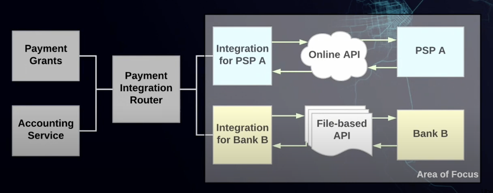

Pay per transaction: From rider to Uber

- Paid pre-transaction: Amazon
- Paid post-transaction: Uber trip: take the trip first

Schedule a batched monthly payment: pay to the driver

physical infrastructure, data stores, data model, security, and performance considerations

**Feature Requirements**

- Post-transaction: Uber trip
  - Account balance (Uber credit), account info: saved payment methods (credit numbers, bank account, etc)
  - Currency, localization? (USD, global: multiple dc across multiple regions)
  - The user has multiple accounts
- Scheduled/Batch payments
  - Monthly (configurable, hard-code is fine)
  - Batch several accounts in one payment request?
  - One account scheduled per month

Design a **scalable, reliable** payment service that could be used by your company to process payments; it could read the account info and payment info from the user and make payments. Source of truth ledger system, reduce the total number of transactions(1-2% fee per transaction)

Additionally, payment transaction to bank latency could be ~ 1-second level.

**What could go wrong: potential issue**

- Lack of payment
  - No sufficient funds (the bank denied it)
- Double spending/payout
  - Charge twice (it's not that you use the same money to pay for two things)
  - correctness/at-least-one transaction
- Incorrect currency conversion
  - n/a
- Dangling authorization
  - Don't worry about auth, not client-side auth?
  - Auth to the payment system
  - Auth from the bank
    - PSP auth (username/password pass to bank)
- Incorrect payment
  - Discrepancy from downstream services??
- Incompatible IDs(only temporarily unique)
  - Idempotency key? Diff id system (tmp unique)
- 3rd party PSP outage
  - Any downstream service outages
- Data discrepancy of charges from stripes / braintree
  - Same as incorrect payment

10 mins: Constraints/SLA

- Scalable: 30M transaction per day = 300 QPS peak: 10 times more: 3K QPS
- **Durable**: hardware/software failures
- **Fault-tolerant:** any part of the system goes down/failures
- Consistency: Strong consistency.
- Availability: 99.99% (50 mins downtime/year)
- Latency: p99. SLA < 200 ms for others

PSP: payment service provider.

10 mins: High-Level Architecture

Client (mobile/web) end trip -> frontend webservice ---emit--> trip end event --async--> payment service -> downstream service (PSP(Payment Service Provider), bank, credit cards, etc.)

- retry and de-duplication with idempotent API

Request: idempotent key (UUID, deterministic id), status: success/failure (retryable/non-retryable)

**Request Life Cycle**

1. Trip end event from event queue (durable), AWS SQS (at-least-once delivery)
2. Only one worker works on the same event
3. If the worker failed/timeout, the event would go back to the queue to be picked up by another worker
4. If it fails for configurable times, it goes to DLQ(Dead Letter Queue)
5. ~~Scale up workers for past processing~~ (work pool model) (we can assign any work to any event)
6. Backend Worker pulls event from queue (eventid as idempotent key)

Db record: Idempotentkey, status (success/retryable_failure/non-retryable_failure) Missing: queued / running? Serve 1 take request A-> req A → failed.

1. Prepare (**db row-level lock on the idempotent key, lease expiry**): expiry time: Configurable value > max downstream processing time
    1. Get or create an entry in the database
    2. If the entry in the database has with status of finished, return
    3. If the entry in the database has with status of retryable, If the entry doesn't exist, we need to continue the process
2. Process: Talk to downstream services (PSP, bank) for the actual money transfer
    1. Async, circuit break (fail fast), retry (exponentially back off retry )
3. After we get a response
4. Set back, we need to update the DB record
    1. First, update the status to either success/failure (5xx retryable failure, 4xx non-retryable failures)
    2. Release the lock on the idempotent key
    3. Delete that event from the queue, (would be processed by else again.
5. Scenario 1: Server 1 takes the request A -> req A locked → server 1 crashed ---> will not deadlock. lock has expiration: need **process** to restart (我理解 restart 就是另一个 process pick up the request)
    1. Queue: send and forget (at least once process)
    2. SQS message end of lifecycle stops when the process is fully done
    3. The MQ / Kafka end-of-life cycle is the consumption of the message
        1. Backend process to restart- maybe more than 2 jobs will process the same request
6. Scenario 2: expirable time 5 mins.
    1. Serve1 -> Row 1 lock ----> stop the world GC---wake up more than 5 mins--> W
    2. Server 2-> row1 lock -> W data ---X
7. Scenario 3: The worker process payment actually went through, didn't go back to SQS.
    1. Failed to write to DB as success:
        1. Retry -> idempotent -> no side effect
    2. Failed to delete the event
        1. Next worker gets the event, checks DB, and sees it's already finished, does nothing, and returns

For Scenario 2: Distributed locking service: id (monotonically increment id), server1 requests with id: 10, server2 requests with id: 11, when server1 goes back online, trying to commit, it can see its id is invalid (abort that transaction)

8. After processing is finished, bookkeeping for audit/data analysis purposes
    1. Save transaction history, bookkeeping data (money in/out for each account)
    2. Sweep process to clean up/purge the tables (delete rows that are 1 year old)

~~10 mins: API Design~~

~~10 mins: Data Model~~

~~10 mins: DB choice~~

1 Row -- 10K

30 M per day ---> 300 GB per day * 180 -> 50 TB = 100 DB instance (500 GB per instance)

Sharding based on transaction key - trip id → cross-shard transaction

SQL (ACID, transaction): account, request tables (purge every 6 months)

No-SQL: transaction_history, bookkeeping tables

Readon

- [SQS timeout visibility](https://docs.aws.amazon.com/AWSSimpleQueueService/latest/SQSDeveloperGuide/sqs-visibility-timeout.html)
- [Distributed lock with fencing](https://martin.kleppmann.com/2016/02/08/how-to-do-distributed-locking.html)
- [Idempotent Requests](https://stripe.com/docs/api/idempotent_requests)

After finishing the trip, the Uber system emits a trip-ending event, which will asynchronously trigger the payments

