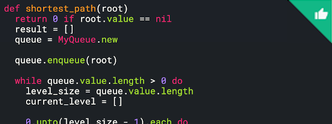
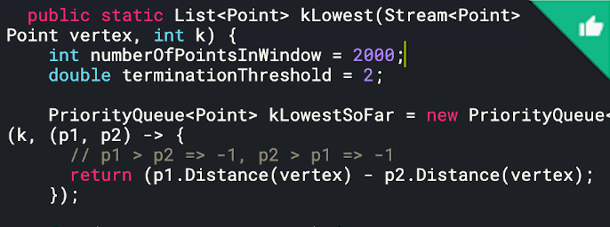
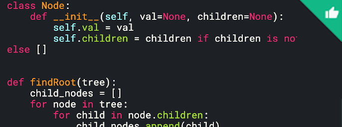
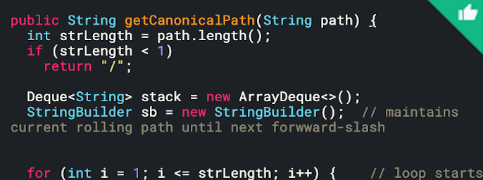

# Are we building just a back end system? And list of charities? Is it like hard coded in our system or dynamic?

---

Are we building just a back end system? And list of charities? Is it like hard coded in our system or dynamic?

[If i was a user, how can I actually donate]{.mark}, assume there is a kind of UI, I can select the charity I want to donate and select amount of money and press the donate button

[Can i donate the credit in my account]{.mark}

The user in the front end would decide how much money they want to donate.

And they would decide which charity they pick to donate to. And they can donate to the same charity, multiple times.

And they should be able to donate whenever they feel like they should be able to donate every five minutes if they want.

[clear, also what about the payments]{.mark}, do I need to like care about the payment system, or I can just use a third party service?

Hot Gyro: That's a very good question too. What we care about here is if you can get the job done. So if you think there's something out there that exists, that you can leverage, by all means, it's up to you. If you feel like you need to do it yourself, and not trust other third parties like Stripe or others, then by all means, design that too. But it's the choice is up to you.

And ideally, if you could explain that decision of why you chose one or the other, that would be great.

for example, we have a charity, and we receive donations, like each five minutes, should we like each five minutes, move all the money to this charity or like, collect it and move it once a day or once a week?

What's our strategy here? Hot Gyro: I would say this is up to you. You know, if you want to be real time you could. But I think the, for this problem, let's just say, this backend system does not need to send the money to the actual charity until maybe once a month or something so you could hold on to the data for a little bit.

Declarative Lion: And let's say worldwide, we receive like 1 million donations per day. I think it should be something? I'm not sure. But it seems like that good number again, can start off and then just work on that. If they have the 1 million donations in a day we have like around, let's say we have 100,000 seconds. So we would have like 10 requests per second. Something like this.

Hot Gyro: I could give you a good conversion near 1 million per day is roughly 12 per second.

That's something to remember. And another one that I like to use is five years is about 2000 days.

I think it's pretty much it for our high level estimations.

Let's think about the payment strategy. So what I think is handling payments is pretty tough. And our system should be, like, we need to put a lot of effort to make it secure, and so on, it would cost a lot of effort. So probably it would be much easier to, like, use third party service for doing these kind of payments, like you mentioned before, like Stripe, or something like that.

And let's say we would have a server here. It would be our application server which we'll... Yeah, it would be our application server. Now it receives the information about like what the user wants to donate amount of money. Then, we would like to be sure like to work. I'm not sure how this works, this money stuff within a spike he decided to buy. Probably we want... So if we transfer money once a month... So each should be or in which point of time, do we want to do a withdrawal? Like once a month, and when we want to like transfer money to donations, we should withdraw all users account, like in this time, or each time when user decided to pay, we should withdraw it right away and store in some like middle account? Hot Gyro: Are you asking whether the money comes out of the donator account right away? Or does it come out of their account once a month? Is that the question? Declarative Lion: I mean, should I store somewhere this? Like should this transfer be right away? I mean, do we need any middle account to store users money or we do it like from users to donation? Hot Gyro: Yeah, I think the answer here is it's up to you how you want to handle the intermediate money, because it's up to you how you want to send the money to the charities, right? Butt one thing you want to do here, though, is whenever a user says they want to donate the money, and they click that button and say yes, I donate that amount of money, that money is going to be out of their account right away. Right. So now, I think it's very natural to say there's an immediate account for your service to hold on to the money for a while, until end of the month or end of the week to send that money out. And that's not really the important part of this system here. So you're free to kind of decide how you want to do this. Declarative Lion: Okay, cool. So the payment service has some kind of feature where you can just block the money? Like, block so they are not able to use them, so I could use that. And just the other part, but I'm thinking right now is on how to move money. Right way to do it. So okay, when I have received that information. So let's say somewhere here, we would have the database with all this data are stored there. So the like portion that this user decided to transfer this data to this one to this destination service. We stored this data. So if I do, okay, let's say we do it right away. So which is we have a list of payment accounts of our donation services. So we can just initiate the transaction in this moment and just move this money to the donation service, and it's probably so let's say, here, we would have the path, it would be payment service provider. Right? Our application would initiate the transaction here for moving the money, and our clients need to approve it. So when he approves it, we just move money to the charity. Say this is some kind of abstract, the charity bank account. So it moves here from the payment service provider, or something like that. Yeah. And we store the history in the database of what changed. So what if something goes wrong? What could go wrong? Yeah. Our application server could go down, it's not a huge problem, because we could just have multiple instances of it for the case, or just to change them. The same as you would necessarily have data. So probably, for the database, you could use the plain SQL database. It will be interesting to hold it in one server. So as we said, we're five years we need just 120 gigabytes. So it could fit on one machine pretty easily. Just for the sake of availability of our service, you could do replication on our database in case if one instance fails, produce another one. So we could use something like master slave, right? Yeah. So do we, yeah, I think, each user, like initiate the transaction to the application like verify the amount to donate, but application server dies in that moment. When it received the request but still not send it to the payment service provider right in the middle of that the server dies. There's the problem here. So probably we would like to have some kind of message queue, or here... Hot Gyro: Where is the message queue? Can you draw the message queue? Declarative Lion: Yeah. So I think we need to present here, one more server here. So when user pushes the initiates the transaction here, we push it to the application, and application puts it to the message queue. And only after that we return the success responds to the user. So we know that we would not lost the data about his desire to do a donation. And so the message you would write here, we would have the... So here would be servers that do like all this payment stuff. Right. And it would actually talk with a third party providers and so on. And, yeah, I would like to delete some small. So yeah, I would like to delete here. Yeah. So it pushes it here to the payment service. Here, we have some kind of certified provider, the previous one that I just cleared. And that's it. So I think it will be more stable. For a messaging queue, we could use something like Kafka or Rabbitmq. Hot Gyro: Okay, yeah. And so let me try to understand this part a little bit with the queue. So this part here, can you can you explain, what is it? Is it a service? Or is this a database? What is this payment here, can you explain this box? Declarative Lion: Yeah, yeah, it would be our service that handles the payments. So it issued a transaction, it talks to... it's a micro service that would be responsible for handling all the payments. That's all of its responsibility. Why I decided to move it from the application service to, for application server be responsible for maybe some kind of I don't know, the client side, there would be or some kind of another request talking to the database. And I want to explore this possibility. Hot Gyro: Okay, so question about the app service here. If I understand your diagram here correctly, is it true that in the app service here, it is writing a writing a copy to the database, storing the metadata, at the same time it is putting an item in the queue so that the payment service here, will go and actually talk to the payment service to get them to validate the transaction? So these two things are asynchronous, right? Writing the record to the database to store a transaction history, as well as performing the actual transaction to the third party service, is that right? Declarative Lion: Yeah, that's a nice notice this... Hot Gyro: Because the question is, what happens if one of these two things fail? Does that mean that we have an inconsistent state of the system now? If one of these two things could be a network failure to be the third party went down? You know, you know what I mean? Like, if one of these things fail, what happens and how do you handle that? Declarative Lion: Yeah, that's a great question. So I need to think more about that. So I need to write to have in the like, status for the payment that I initiated and when users just like with this interaction, actually not just added to database, but we set its status to initiated, something like that. And after and then we have like three different directions, right? User could cancel, the payment, user can just do nothing about it just forgot about it. And user can actually pay and it would be successfully stated. So from the start, it will just put it there is the status initiated, and after payment, yeah, yeah, so the payment service would know about the status of the private. So when payment server responds, that, hey, we actually received money from the user, we should ping our application service and say, Hey, the status of this payment is successful. Update the database. Something like that. So we would have statuses. Hot Gyro: Okay. Okay. All right. So, next question I have is, let's say, your service becomes very popular. So instead of 1 million users per day, you have 1 billion donations per day, right across the world and all that. So given this new load of user coming in, how would you change your design to handle the growth? Declarative Lion: Yeah, that's a very good question. And it puts a lot of questions on the table right? From engineers standpoint, and from the payment providers, are they available in all the countries that we want to, like, spread and so on. But if we like put that aside, or just focus on the engineering part... I would say that we like, the simplest part, like, let's imagine that we started in the US, right? So and we have our data center there. So the simplest that we can do is start just by scaling horizontally, increase the number of application servers, do more replicas of the database. And that's it. But when our data, like, we stored now, not 120 gigabytes, but like terabytes of data, we should certainly think about the sharding. Yeah. And here, I think I would share the data just based on actually user's ID. If they donate anonymously, they will be generated. Hot Gyro: Yeah, you mentioned using a SQL database in the beginning, right? Can you explain how you would shard the data using a SQL database? Declarative Lion: Yeah, that's what I'm thinking right now. So if we have not 120 gigabytes, but like terabytes of data, now, like thinking that, maybe it would be easier to use some kind of NoSQL solution. Hot Gyro: Okay, let's say you use a NoSQL, right? So how would scale that database? Yeah, that's a that's a good follow up here. How would you scale your NoSQL database? Declarative Lion: Yeah, I would. And as I said before, I would do sharding. And now I think on which key should I do the shards. Do it based on the like, let's say we have 10 replicas. And we just take hash of, we would have some kind of hash function, which based on the donation service would generate ID of this service, other shard server ID, and just put data there. But if one if some donation service would be more popular than others, we would have hotspots in some services. So yeah, probably it's better to do it on userID. So we would generate them by ourselves. So they would be random generated, so it should be pretty random distributed among all of our shards. Yeah, I will take... I will do shards based on userID. Yeah. Hot Gyro: But does that address the question you just mentioned being the hot partition where if a user keeps donating money, that still generates a hot partition? Right? How do you address that? Declarative Lion: That's a nice point. So here, I think, two solution, the first one is not like... we just like split, when we see that our servers become very big. Our shard grow. We could just split it by two. Yeah, and just split the data like no, today, but that's not the greatest solution. Else... No, I thought about doing the date. But date is always like crawling. Like, what if we... No, that might be the case? Yeah. Probably, I would say that. We would split it by the word still by the userID and when the server reaches some kind of amount. It's not really hard. We just split it by two. And, yeah, and do visit. Hot Gyro: Okay, so when you do get a hot partition, you split that data. That's the solution to it? Declarative Lion: Yeah. So for example, we had a partition, right from A to k. And we see that hey, it's too hot. I split it from A to D and D to K. Hot Gyro: Okay, okay. Okay. That sounds fair. Next question I have is, again, in the payment microservice here that you mentioned. So let's try this again. So as you scale your service with the 1 billion calls per day, do you need to change this microservice? Or do you just have one micro service that will process a billion requests a day? Declarative Lion: That's a good one. Certainly. It will not be able to process the billions with just one machine. Hot Gyro: What would be the solution here? Yeah, just build this part. Declarative Lion: Yeah. Yeah, did again, we could just put the load balancer between... Like, we could represent a lot... We put a lot of microservices and do... huh, yeah, let me think about the strategy... So I would, I would, if you don't mind, I would delete all this here for now. Hot Gyro: Or you can follow this draw below. Draw the new one below. So just keep the one above, we can we can still talk about it later. You can do it. If not, then just try to do that's up to you. Declarative Lion: Controls that doesn't work here. Sorry. Okay, let's just say I would draw it below from the point by like, oh, we have here the queue right. And so from the queue, we would have some kind of load balancer as servers and here we would have those balancers. And we have a higher then... and so let me think on strategy and how we distribute the load between them. So use... just default, we do just... so here again, it would not be the greatest idea to split the load based on ID of the donation service because all of them to donate, like to the same service in the same point of time, but the user ID, I think it's pretty good idea. Because in one point of time, user donate probably, in most of cases, it donate just once, one amount of money. So like, once, even if he or she wants to do it, often, it would be like once in five minutes. So we could do just take that, again, hash of userID, and like, use the hash to put... so the transaction of a certain user would always get to the certain service. Yeah, would be like, processed in one service. Yeah. And I think it would be pretty much and then it will get back to the application services. They serve by the provider. Yeah. Plus, one thing that I want to add to like the scaling globally, probably to reduce latency, we would like to put our data centers in different parts of globe, right? So for example, one, one service in the USA, one in the European, one in Asia region, somewhere there in China, probably where we would have like the same structure, but there... Hot Gyro: Okay. So let me try to understand this... this new service here, this is replacing... how is this related to the queue? Is this service here reading from the queue, and then calling the payment service? Is that what it is, the payment service? Declarative Lion: Yeah, this one is, yeah, yeah, that's true. Hot Gyro: Okay. And this is your micro service here, or you have multiple copies of this, right? Declarative Lion: Yeah, that's right. Hot Gyro: And where does this load balancer fit, is just going to be here, like load balancer here? Is that? Declarative Lion: Yeah, and we can own like, like message queue need some kind of a subscriber, we had to read data from here. So there would be services running for that. I just know that that that... Yeah. Like how we scale DB microservices is like, payment servers. But yeah, for sure. I should do mentioned that we need subscriber. Hot Gyro: Okay. couple more questions. Since you have multiple workers here. Multiple microservices, what if one of them goes down, or some of them are unhealthy, corrupted, just went down? How do you detect that? And how do you handle that? What if something goes wrong in the microservices? Declarative Lion: Yeah, that's a good question. So first of all, we would have a copies of those services ready to like snapshot of those services ready to launch. If like one server dies, we could just launch another one. There's the first part, then how we actually detect the fail. So it could do, we could represent some kind of health check service that like when I think in, it's pretty common pattern in microservices architecture to have like health checker, which will be just the server who pings all the like, other services like once in some period of time, that's one ping 15 seconds, 10 seconds, or like one minute to check if they're alive. And to say that to load balancer... Load Balancer would have these information which servers are actually alive. And if one dies, we just delete this ID from the load balancer pool of services. And we could launch another system and just add it back there. And yeah, yeah. Hot Gyro: Yep, that's fair too. One last questions before we wrap up the interview here. You mentioned that in your schema design, there is an ID that is a random number, right? You randomly generate that ID and then you hash that into your NoSQL database, and then you try to split it up evenly as possible. I'd like to know how and where is that random ID generated in your system? Declarative Lion: Yep. Cool. Nice question. So let me think. So we have a billion users. That's a lot. Hot Gyro: Per day, per day. Declarative Lion: Yeah, yeah. Yeah. So for the simple. For our simple solution, I would say that I would just like us, and then have some kind of number and just increment it. Hot Gyro: I think the most important question here is, where is that generated? Where is the random number generated? Declarative Lion: So yeah, for these, I think we need to, we need to present key service. Okay, let's say that I present the new service, the key service, there, we would have that would like why I think this is a problem is because our system is distributed. And then you have a lot of application services. What I wanted to do is to have like database, where we would have like, generation of keys, and that's it. But like, if to like, there could be like race condition problem. And we would give the same ID to different users. So probably what I would like to do is to present... I call it so hard to do. And here at the bottom, I would like so I will draw here to the right. So here, I would actually store that. So I would have probably still have that you would have, like so now I have to Yes. So if we know that we have, we would have a billion users. Yeah, we could just pre generate all the ID and put it to the, to the database, right? And this service, it would be just one who talks to this which talks to this database, and it stores all the keys in memory. So like, it would be like book select, it reads 10,000 keys from this database and deletes it from there, and stores them in memory. So when each application server comes to it and ask for the key, it just returns it and deletes from memory. So in such a way we would prevent the duplication. And in case of fail of this key service, I we could last piece that we asked already in the database. But I think it's not really crucial. Because if we use like 64 symbols, 64 bits, it's like to the power of six, if we have six characters, it's a pretty huge number. So I think it would be okay for us to sometimes sometimes to lose this data. And the key service will be just that. If service dies, there is another one waiting already running, waiting to take the load if needed. So, yeah. Hot Gyro: Okay, I think that's fair as well. All right. So those are all the questions I have for your system. I think that would wrap up the interview part for right now. And I'm going to give you some feedback on what I saw and what I heard and then and then we can do a Q&A. So before I get started, what do you think about the question and how do you think you did? Declarative Lion: The question actually, I like the question. I didn't receive questions before with the payment service. So it's pretty new for me. Yeah, I like it. I think it was a bit challenging. And I think, overall, I did not bad. But I should have like, you... How do you say... you pointed me through the interview to the different directions, which I should set on my own before. So for example, for the key services, yeah. And for this, like, subscriber for the queue, like I should have said that on my own without your question. Yeah. Hot Gyro: Yeah. I agree with you. I think the question is not very typical question. And it's challenging because it deals with payment, deals with privacy, security, and all that stuff. I think you, I agree with you, I think you did a good job, too. There's a lot of areas where I think there's a lot of positives there. So let me go into details, let's start with the beginning. And I'm back into the code section there kind of goes through everything here. So in a lot of these kind of system design questions, the question, at first will be very vague, by intention. All the questions you get are just maybe design a chat system, design this and that. And it's your job to ask a bunch of questions to clarify the problem. And to scope it down to a very manageable set of features. Right? And I think you did a really good job in asking questions. The great questions you asked was, do you need to handle payments, right? Because if you don't need to do it, don't do it. There's other services to handle that might as well use it, just like a database, you don't need to create your own database to do something, just use the database to do the persistent storage, similarly, for payment as well, somebody handle it and let the other people handle it. That was a good question. And the other good question is, how often you will send that money to the charity? That's a good question as well, because you don't want to do this real time. So these are good questions. Couple more, you could ask. And I think you also kind of mentioned that is anonymous, or not? Right? I think you can assume that you can do both. That's okay to assume it. But it's best to kind of call it out upfront, right? So that that takes some time to really take some experience all that do to realize do you need to know user information or not. Can this be anonymous? That's one question. The other one kind of minor. But it's also good to think about is currency, right? And the amount in units, right? Do you accept dollars? Or have you accept pennies, things like that, that can help design your database schema, right? Like, is it going to be a float or integer value? So these are things that you could ask upfront, or maybe even assume that so that it will make your database design must clear, right? Again, as you're designing your database, you know, I think you put two bytes for the amount. But when you arrive at that point, you might say, Okay, I'm going to make a simple always try to look for a simple solution, right? Just say US dollars only, you know, and then the lowest cost denominator is $1. So there's no pennies, nothing like that. So your your storage is going to be integers. Right? That makes things a lot easier. Right. So those are the questions. And then I think after the questions, right away, you went to the data, or what I call the capacity estimation, like how much storage do you need? What is the read per second, these are good estimations you did. But before we went there, I suggest that you could list out the functional and non functional requirements first. So the functional is pretty much how you understood the problem. What do you need to do here? You need to be able to store user donation values, amounts. And what else are there for this service? You have a list of pre defined charities and users can donate to multiple charities. Right? So these are sort of functional requirements. Pretty much what you mentioned, but it's good to kind of list them out. Just in case so that just to clarify what what your system does and do not do, right. Because you're not trying to do a whole system you're trying to build the essential features. So you need to list them out and say this is what my system will do. Like once you list them out here, your high level design diagrams all that will try to fit all these features in like, don't do too many, you can always add them in later. But don't do too many at first. But make sure you capture the most important stuff by like for this service, you definitely need to store the transactions by the metadata of a donation. So that's the number one thing and then the rest, you can say, maybe you can return a list of history of things that you've donated. But those are minor, right? If the interviewer cares about that, they will tell you to do that. If not, then you don't need to. And by the way, you did a good job by asking another question about do you need to populate the list? So if you don't ask that question, you might think you need to design that. And then you will you end up spending time to design something that maybe I don't care about. So it's always good to ask the question, and then just make sure that you design just the most important part of the service here, right? So populate list of charities. The answer is you do not need to. So that's a good question to kind of just reduce the scope of the problem. However, I think what's missing in the requirement is the non functional requirements. Non functional requirements is usually what we call as the SLA or the service level agreement, or pretty much what the system promises to the user here. So things that you can consider here is the typical CAP theorem stuff, right? Like you want to have a call call system. So that if something fails, which you ask the question, what happens if something fails, right? So this is what you want to do, your system needs to be fault tolerant? Like, it needs to be scalable, right? Because right now, it's 1 million items operations today, you bet that the interviewer is always going to say, let's say this is going to grow and become 1,000x. How are you going to handle that? Right? That that the question that you always get asked for your system needs to be scalable, right? Scalable, fault tolerant, and highly available, right? That means that whenever I call the system, this is the means to be able to accept my request, right? It may not be able to handle the request right away, but it has to be able to accept it. Right? So a system that is highly available is one where you have your load bouncer with a bunch of web services that is able to accept the request. So when you mentioned, when you draw your diagram, and you say, there's a load balancer, you need to explain why there is one, right? And so if you put out the first by saying that this system needs to be highly available, then your load balancer is there to answer that question is, okay, this load bouncer is able to accept the request and route that to my multiple web services that will be able to handle this request. So no matter how much request coming in, I have enough capacity to handle these requests to make the system highly available. So these, these are things you need to put down here. And then you can also say some things that are not required, for example, the system does not have to be data consistent, right, for example, that means that when you submit a donation, the system doesn't have to be able to handle that right away. But eventually, your donation will show up, you know, in a database or something. So this is not important. So consistency is not an important, right. What else is not important? Let me see. latencies that I want, right? Now it's up to you. I would say that's not important. But you can you can argue and say this is very important, then you can design a system to make it, you know, to make a low latency. But what I mean here, when I say latencies, I mean that when I believe when I submit a donation, I can wait a couple of seconds before you tell me that it's complete, right? I can wait right? Now you can say no, my system needs to be highly responsive, it needs to be you know, on right away, then you can go and design that which makes it hard, right? How do you do that? But specify how you want the system to be designed is part of this requirement section, right? So mention these things. Again, a lot of this is a design decision. I'm not saying that this has to be, you have to have a low latency. But I'm saying latency is, you know, you can afford to wait a couple seconds. I also think this is up to the engineer here. Now, the others are pretty much non negotiable, right? You need to have a system that is fault tolerant, scalable and highly available. Right? So that's what I would put in my nonfunctional. And I think these things will guide you to your high level design later on. So before we go into the high level design, let's go through a couple more things here. I think your capacity estimation is great. Once you're able to use these kind of quick conversions, you're able to do the math really quickly. However, you'll notice that you know, 120 gigs in five years that's really slow, very small, which is, which is fine, because the system is going to grow. And you can have way more than that, right? It's gonna be terabytes soon. But one thing you want to talk about here is not just the amount of storage to handle today's load. But you also want to say that right now it's 120, but you want to have some redundancy in your system right? Is that something that you can also put as your non functional: redundancy. You want to make sure that it's just like, you know, s3 and all that stuff. Your storage has multiple copies, right? So you can say I want to have some redundancy here in case source node goes up goes down. And then on top of that, I'm gonna have some buffer, right? Just for peak usage, right? Let's say maybe Black Friday people donate more, I'm able to handle that extra load. So all together, this becomes maybe 500 gigabytes right? Now, the actual number doesn't really matter. What matters is you need to consider the redundancy, the peak usage, like a little buffer room. That shows to the interviewer that you're considering the future as well. So just little things here, in capacity estimation. Does that make sense? Declarative Lion: Yeah, that's awesome. Thanks. Hot Gyro: Yeah. So normally, I would suggest that once you reach this point, it's about 10 minutes of time. And I think you actually hit that, when I look at the time, by 10 minutes, I think you went, you got to here in about five to 10 minutes, which is good. But obviously, what was missing was the non functional part, if you had that, I think 10 minutes is actually doable. So I think you were on a very good schedule, up until at this point. And the next thing is, after that you did your database schema design, which is good, because this is where you kind of use that information to help you estimate your database storage, which is important, because without the schema, you don't know how much storage you need. Right? So that's all there. Now, the thing after that, though, I suggest is to have something called API design. Because after all, every back end system needs to have some sort of API or multiple API's, so that the client can call these API's and then perform that service. Right? So if you are clear about what the API's are, it will also help you in your high level design. So what would be the API here? Right? I would say one thing would be, maybe donate money. I mean, the name doesn't really matter. But you want to explain what this API does, right? And then maybe it has a user ID, or some other ID, and pretty much everything that you put here, maybe a description, a charity ID that you're donating it to, a date, yeah, that's good or timestamp, right? And then an amount, right? So these are the basic requirements, pretty much all you need here. Now, the important part about this is you want to make this an asynchronous or synchronous call, right? You need to explain what each what what it means and explain why you pick one or the other. Right? So asynchronous here means that when I click donate money, I don't care whether this request was successful or not. But I can ID back and say, okay, my request has been acknowledged, it's now up to the system to go and process it. And then tell me later on what happens. But that's sort of the asynchronous approach. A synchronous approach means that when I click the button, I'm sitting there waiting, right? Waiting for it to process, it could be seconds, could be minutes. And then when it's done, then I can respond, right? If I close that browser midway through that everything may go, maybe out of sync, right? So normally for a service, for a request that takes time, and it's a variable time, then a asynchronous request is much easier to design. Because when you do a asynchronous you need to return, maybe a donation ID here, right? Just to acknowledge that, Hey, dude, there's a request being made, right? And then after that, you want to have something called get status request API, so that the user can call this donation ID, and then check the status later on. Right? That's gonna be like pending, you know, running, you know, fail, or other things. Right? But that's sort of the the asynchronous approach. The synchronous suppose will be harder to actually design, because you have to talk about all the different things that could go wrong, right? So once you have the API design complete, then when you switch to the diagrams, you can really explain how does that API call will work into your system, right? And I think all this here on the coding page will provide you clarity on how the block diagrams will fit together, right? So let's switch it over to the block diagrams and talk about what you did and some feedback there. So you notice that when I asked you these questions about how do you scale, how do you get the unique ID, how do you shard the database? How do you handle when a worker goes down? These are questions that are meant for a generic workflow system, right? Not just for your service here, but it's general questions, right? Like it could apply to almost any service out there. Right. And, and really, all these kinds of questions, you know, chat system or donation system or Uber Eats whatever. They're all pretty much similar in terms of the back end in terms of you need a database, you need a web service, you need a load balancer, you need a queue, you need workers in a workflow. So you need to answer these questions for almost every single design questions, right? So you want to make sure that you have different types of solutions with the trade offs. And so everything that I asked you today could apply to a different problem, right? I know that I'm kind of on the time. I need about five more minutes. Is that okay with you? Declarative Lion: Yeah. Yeah, that's awesome. If that's okay with you. Hot Gyro: Yeah, works for me. So I just need five more minutes to kind of finish off my feedback. And then you can ask me some questions. And then we can call that a day. So continuing my feedback here, the questions I asked are all generic type of questions for a back end system. And like you said, it's great if you could actually go through them. Talk about them as you're designing it. That makes it... that is definitely better than me asking you, because it shows that you are experienced, shows that you are considering what could go wrong? How do you scale the system? Because you even asked that question yourself in the 20 minute mark, you can you pretty much draw out the diagram. And then you ask yourself, what could go wrong here? Right? That's a good start. And I was hoping you could talk about all these different things. And it's okay, you'll talk about because I could I could prod you, I could ask you, right, because there's so many things you can talk about. I care about a couple of things. So I would ask those questions. But I would ask the questions that you may not have covered. So it's okay that I asked, but it would be great if you can talk about as much of these problems as you can. Right. And again, there are for a generic problem. So I think your answers are adequate. In all the questions that I asked, I want to highlight a couple things. You mentioned about the the key service, right? And, and the key service is indeed one solution, right? Like a separate service that that is responsible for generating unique keys, and then it populates somewhere. So these keys are pre generated, and then you just fetch it, that's cool. But if you were to do that, then maybe fetching the keys could be like a cache. So that's not like a database, so that the access was much quicker there. Right? So you mentioned that. But then even the key, like anytime you drop off, but that part could fail. When that fails, you talk about how do you handle that by so what happens when, when the key services, which you did talk about? And then I think your answer was, it's okay, you generate ahead of time, things like that. Right? So overall, that's a fair answer. But there are other options, you could mention other options. One option I can think of, or I had in mind, is to leverage the database, right? You mentioned about a NoSQL database. So for example, Cassandra is a NoSQL database, Cassandra can actually generate unique IDs like that, UUID and all of that. And so you leverage the database to generate a unique ID, right? And these databases are meant to be called like, with a lot of requests per second, right? So they can totally act as a key service. They're like a database. So you could have a table of just the user. So anytime you have a new user comes in, you just add an entry to that table, like the user table, and the return could be the the actual user ID random generated, so that's one option. The other question I asked you is, how do you shard that database? Again, a very common question on NoSQL database. How do you shard? You answered that question with the user ID, right? The user ID is a good primary key to shard the database. However, a lot of NoSQL databases allow you to have a composite key, right? Multiple columns as a key, right? So you could use something like the user ID plus the timestamp, or the day of the of the donation. So those two together, will more likely will not have a hot partition, right? Because every day is gonna be different, right? So let's say you have a billion requests per day. And you're not likely to have a hot position in it within a day, right? And then the next day will be a different position already, right? Because you have, you're using the timestamp as part of your key, right. So that's another way to to address that problem of hot partitions. The next thing is the workers here. You have workers that could go down and you answered that question well with health checks. And I agree with you that normally, health check is a good mechanism to keep track of the status of each worker. However, I think with a health check, you probably want to have another service called coordinator or the manager that does the health check, I'm like the manager of all these services. I have a list of like a pool of services. I go into health checks all the time, right. And whenever I see a worker that does not pass a health check, I terminate the service, I start a new one. So sort of like a worker here for like a manager here do to do that. And this manager can now monitor the queue as well, if the queue gets too large, then you've got more requests coming in, then can call that data that magic and do the auto scaling for you. I can scale up more workers, I can scale it down, I can make the service more elastic. Right? So these are concepts that you can you can mention, just to demonstrate a lot of these kinds of experiences of knowledge, elasticity, and things of that right? And what are the questions I have here? So I think these are some of the answers to the questions I asked. I think, I think we ask these three questions, right? Scalability, maybe a little bit on the scalability here, you will always get that question, right? How do you scale your system, like, adding boxes, right to it is the simple answer. And it's the right thing to do, too. Adding more databases to it next to it, right, replicas, I think that's good. The queue you mentioned something like a managed service, like SQS, for example, these things will scale for you, right? You don't have to, you know, implement all these things, if you don't have to. Like, node balancers are gonna even have multiple copies as well. Right? So all these things you you can just mention it by that's the easiest answer, like as you add more horizontal scale, almost every component, right? But with a horizontal scaling, there is another problem, right? There's a problem of data consistency, right? Once you have multiple databases... Well you mentioned SQL, so that's going to be harder to address the consistency problem... But when you have NoSQL, and Cassandra, all you have to do is add more nodes, right? You have more nodes, that's where you mentioned, the consistent hashing will help the ones that will be kind of easily taken care of. So in this problem here, I think scaling it would be the easy way, that easy answer here just to add more boxes, add more resources to each component, right. So at this point, and you have any questions for me about the diagrams and the questions and answers that I provided so far. Declarative Lion: Yeah, that's cool. I just have one question. Database for the key service, it should be like another database, not the one that I have, yeah, I should present one more? Hot Gyro: Correct. You could have a different database. But if you think about a NoSQL database, it's really just a collection of table. So it doesn't matter if the table is in the same database or in a different database. So in Cassandra, for example, I think the database is called a key space. And so you could have one table multiple tables, they're not related. But there's no joints in a NoSQL. Right? So you don't need a separate database? But you could, I'm not going to stop you there and say it. It adds little value to have a separate database. But you could, you could have it. I just don't think there's a difference here. So really, in a high level design here. You don't need to be so detailed about particular technology. I don't think the interviewer will fault you to say, oh, you know, this is wrong, you cannot have a second database. I don't think that's the evaluation there. I think that the important point here is to be able to make sure your system is scalable, and it works. And it like all the components actually make sense. So yeah, so it doesn't matter. My answer is that it doesn't matter if you have a separate database or not. Declarative Lion: Okay, cool. That's awesome. I think that's it. I don't have a much a question, too. So you answered everything, particularly. Thank you. Hot Gyro: And yeah, so yeah, just got some final words here, I think you did a really good job. But what stood out to me in this interview, is the fact that you are very calm, and you're able to ask a lot of good questions upfront. And that will really simplify the problem so much at the end. If you didn't do that, you will probably be storing customer information, like credit card numbers in your database, that would be really bad. But that would be almost an immediate fail, right? Because you don't want to design a system where you store a secret, like security information, right? So anytime you can offload that or they don't even do it that will be best. And again, the idea here is the leverage what's out there already, right? It's part of high level design is not to reinvent the wheel. So by asking these questions, just designing the absolute minimum is the key to good engineering, the key to success in a 30 minute system design interview. So I think that the part that stood out to me. The rest of this stuff, all the questions that I asked again, if you are if you just kind of maybe do a little bit more research on this part, it will apply to almost every single almost every single system design questions, and so it's just going to help you tackle other questions as well. So just be a little bit more solid on those parts that I think you'll be fine. Declarative Lion: Cool, cool thank you. That was really helpful. Hot Gyro: Yeah. Good luck with your interviews, and thank you for using interviewing.io. Declarative Lion: Yeah. Thank you. Thank you for your time. Hot Gyro: Bye.

More replays:

![public static int(l dailyTemperatures(int[l temp int() result = new int[temp . length] ; If (temp. length result ; return Stack<lnteger> stack - for(int i=e; i<temp.length; i++) { If (stack.isEmpty()) { stack. push(i) ; ](../../media/Payment^JTrade-Donation-system-Are-we-building-just-a-back-end-system--And-list-of-charities--Is-it-like-hard-coded-in-our-system-or-dynamic--image1.png)

[The Wild Husky interviewed by Stateless Snake, an Amazon engineer](https://interviewing.io/recordings/Java-Amazon-14)

[Median of sorted lists](https://interviewing.io/recordings/Java-Amazon-14)

![runtime: memory: O(N) * 4 return dict result[el] if len(result) > e else None . 91 listl = [ (Node(7), id7), (Node(4), liSt2 i Node idlBB Node id4) , ida 9 ](../../media/Payment^JTrade-Donation-system-Are-we-building-just-a-back-end-system--And-list-of-charities--Is-it-like-hard-coded-in-our-system-or-dynamic--image2.png)

[Ghost Armadillo interviewed by The Masked Hedgehog, a VMWare engineer](https://interviewing.io/recordings/Python-VMWare-1)

[Linked list intersection](https://interviewing.io/recordings/Python-VMWare-1)

[Teflon Artichoke interviewed by Contrarian Burrito, a Google engineer](https://interviewing.io/recordings/C++-Google-24)

[Alien Dictionary](https://interviewing.io/recordings/C++-Google-24)

[Wicked Gyroscope interviewed by Hot Gyro, an Amazon engineer](https://interviewing.io/recordings/System-Design-Amazon-12)

[Video upload API](https://interviewing.io/recordings/System-Design-Amazon-12)

[Golden Possum interviewed by Invincible Cloud, a Microsoft engineer](https://interviewing.io/recordings/System-Design-Microsoft-15)

[Unique ID generation](https://interviewing.io/recordings/System-Design-Microsoft-15)

[Wily Sandwich interviewed by Hot Gyro, an Amazon engineer](https://interviewing.io/recordings/Ruby-Amazon-11)

[Minimum tree depth](https://interviewing.io/recordings/Ruby-Amazon-11)

[Inventive Wind interviewed by Indelible Raven, a Microsoft engineer](https://interviewing.io/recordings/Java-Microsoft-14)

[K closest points](https://interviewing.io/recordings/Java-Microsoft-14)

[The Masked Hedgehog interviewed by Hot Gyro, an Amazon engineer](https://interviewing.io/recordings/Python-Amazon-10)

[Sort colors](https://interviewing.io/recordings/Python-Amazon-10)

[Spasmodic Pheasant interviewed by Intrepid Hawk, a Wurl, Inc engineer](https://interviewing.io/recordings/Java-Wurl-1)

[Evaluate Unix path](https://interviewing.io/recordings/Java-Wurl-1)

![def permute(s): stack = [Sl while stack : value = stack .pop(e) for idx in ) : remaining = value( :idx + value[idx+l : I perm = value[idx] + remaining if not in perm list_of_words. append( perm) stack . append(perm) ](../../media/Payment^JTrade-Donation-system-Are-we-building-just-a-back-end-system--And-list-of-charities--Is-it-like-hard-coded-in-our-system-or-dynamic--image10.png)

[Phantom Storm interviewed by Mythic Unicorn, a Walmart engineer](https://interviewing.io/recordings/Python-Walmart-1)

[Permutation in string](https://interviewing.io/recordings/Python-Walmart-1)

[← Back to all interviews](https://interviewing.io/recordings)

Want to get some practice yourself?

Become awesome at interviewing, and get actionable feedback from engineers at top companies -- it's 100% anonymous!

[Give it a try](https://interviewing.io/signup)

interviewing.io

[For Engineers](https://interviewing.io/)[For Employers](https://interviewing.io/employers)[Watch Interviews](https://interviewing.io/recordings)[Blog](http://blog.interviewing.io/)[Press](https://interviewing.io/employers#press)[FAQ](https://interviewing.io/faq)

[Log in](https://start.interviewing.io/)

[Java interview questions](https://interviewing.io/java-interview-questions)

[Python interview questions](https://interviewing.io/python-interview-questions)

[JavaScript interview questions](https://interviewing.io/javascript-interview-questions)

[C# interview questions](https://interviewing.io/csharp-interview-questions)

[C++ interview questions](https://interviewing.io/c++-interview-questions)

[System Design interview questions](https://interviewing.io/system%20design-interview-questions)

©2021 Interviewing.io Inc. Made with <3 in San Francisco.

[Privacy Policy](https://interviewing.io/privacy)[Terms of Service](https://interviewing.io/terms)

