# Robinhood ACE

---

1.  Function requirement :

Check the account statement

Trade the stock with market order

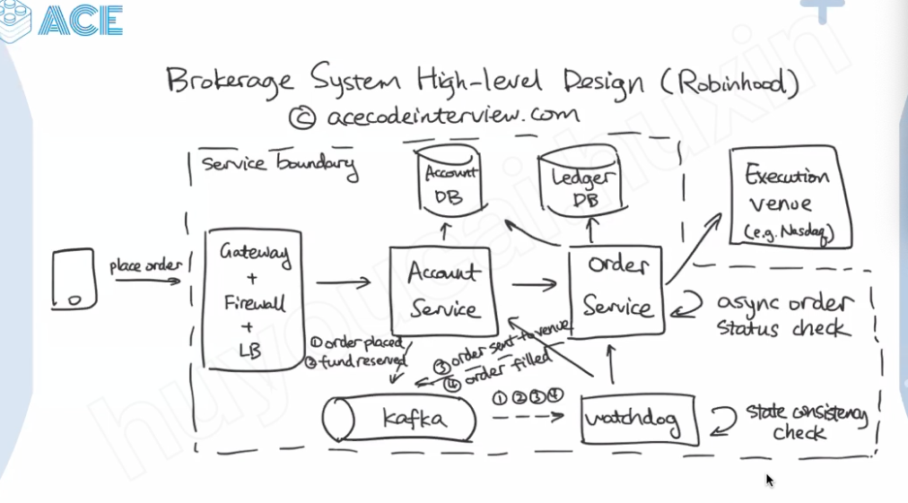

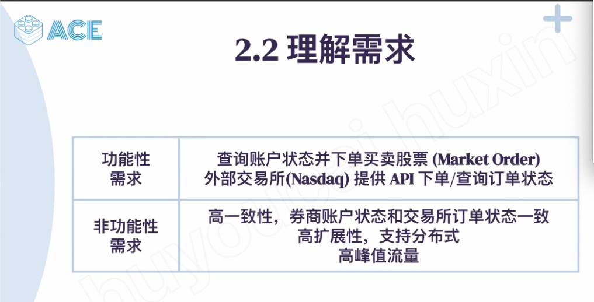

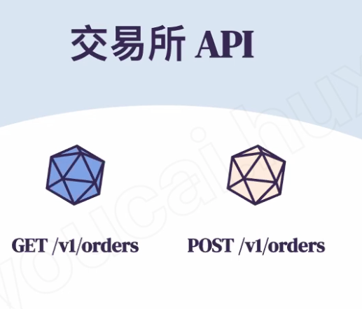

After call POST API, the result will not return immediately

We need to call GET API

In some frequency

APT to check the status of the Order

Or after we call the POST

id is object id

and client order id is client id generated by client side and we can query the status of order by using client id

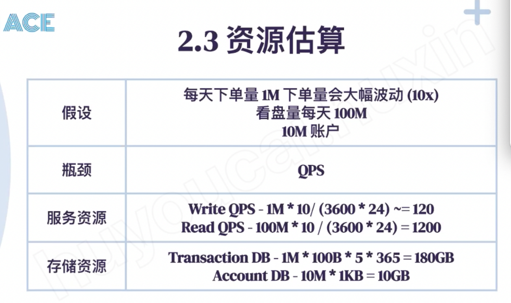

1m = 12/qps

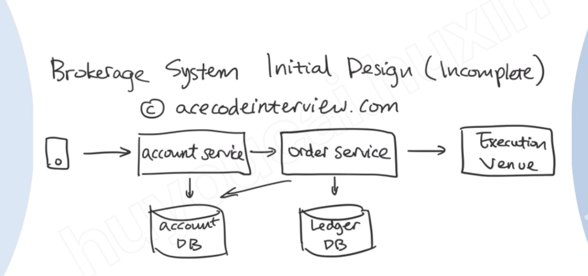

account service will check the status of the account

order service will place the order

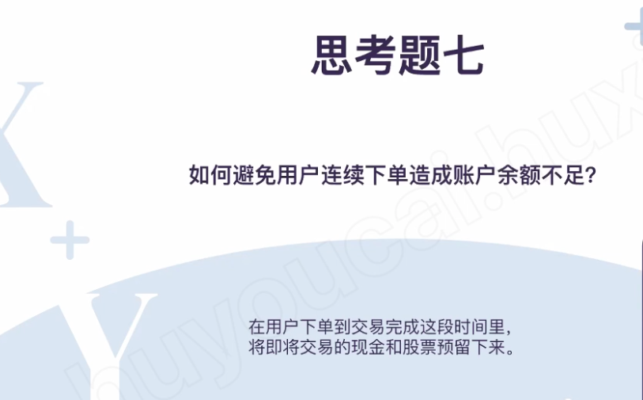

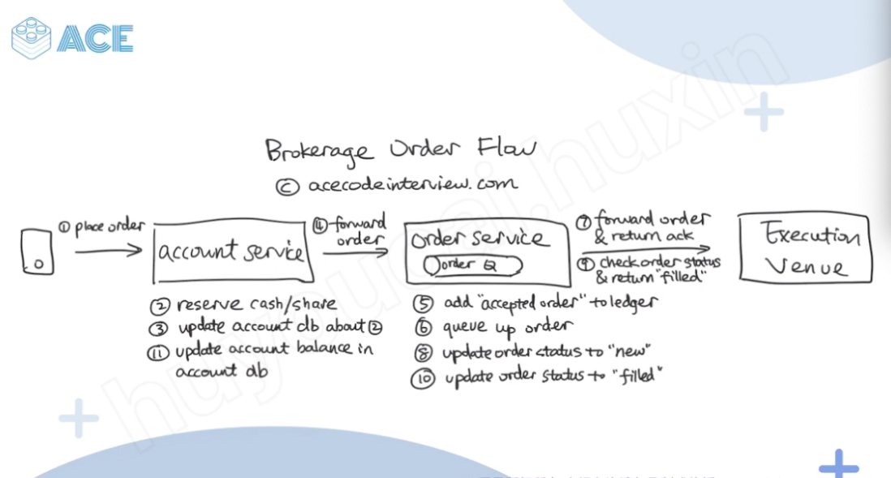

1.  place order
2.  [reserve cash/share]{.mark}
3.  [update account db about 2]{.mark}
4.  forward order
5.  [add accepted order to ledger]{.mark}
6.  queue up order
7.  Worker on another side will forward and submit order and return a ack
8.  [update order status to new]{.mark}
9.  check order status and return filled
10. [update order status to filled]{.mark}
11. update account balance in account db

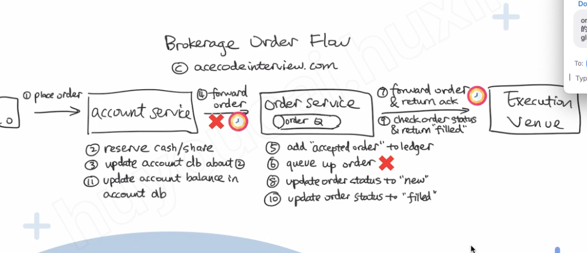

Step 4, 6 and 7 could be time out or error

We need to keep consistency between :

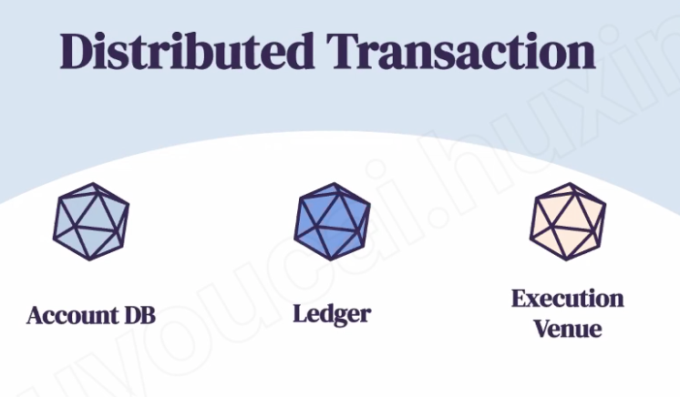

need make sure account DB

ledger db and execution venue

consistency

All the action will send event or log to Kafka (like write ahead log) and Kafka will forward to watchdog, or watchdog will read the event from Kafak. there is a cron job in watchdog and if there are any invalid from step 1- 4. it will undo the transaction

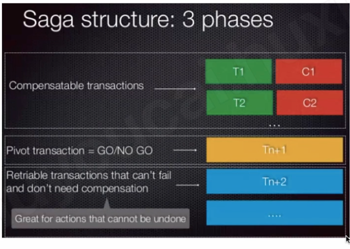

saga pattern will do each action in sequency

if some action failed it will undo or retried those actions

there are 4 types of transactions in the saga pattern: transaction, undo/compensable transaction and pivot transaction and retriable transaction

after all compensable transaction done, we can go to the pivot transaction

T1 can be rollback -- C1

Pivot transaction cannot rollback and cannot re-try

After pivot no transaction can be rollback

Retriable transaction cannot rollback but can re-try

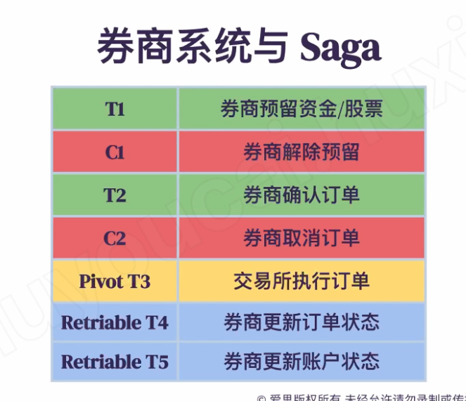

1.  place order
2.  [reserve cash/share]{.mark}
3.  [update account db about 2]{.mark}
4.  forward order
5.  [add accepted order to ledger]{.mark}
6.  queue up order
7.  Worker on another side will forward and submit order and return a ack
8.  [update order status to new]{.mark}
9.  check order status and return filled
10. [update order status to filled]{.mark}
11. update account balance in account db

T1 -- (2+3)

C2 undo those reservation

4

T2 -- 5

C2

6

T4 -- 8,10

9

T5 - 11

after T1 successful, in a certain timeframe, if the watchdog didnot hear anything for T2, it will undo the T1

after T2 successful, in certain timeframe, if the dogwatch didnot hear anything for Pivot T3, it will undo the T2

if T4 unsuccessful, watchdog will retry T4 ..

Pivot transaction, we cannot just retry, we need to collect some additional information

Like if the 交易所 是不是 有问题， 先询问交易所能不能再执行订单...

Database design

<https://docs.google.com/drawings/d/14PqzlioFNqoaaApA5t3UezEY55Aj6DimFe6gRynFNUs/edit>

![Account id I user id I balance I timestamp User LB Account DB Account service 1 .Place a order 2, Reverse credit + 3. update the table 11 .update the account 4. Submit the order to order service status Watch dog Forward 1, 2, 11 watch dog External Payment service Order service + queue 7. Forward the order and eturn ack 9. Check the order status periodically 5. Add new order to ledger 6. Queue up the new order 8. Update the order status to new 10. Up date the order to filled Order id I user id I account id I charity id I amo Create at I summit at I complete at I cancel at I nt I status 8 to ](../../media/Payment^JTrade-Stock-Robinhood-ACE-image16.png)

