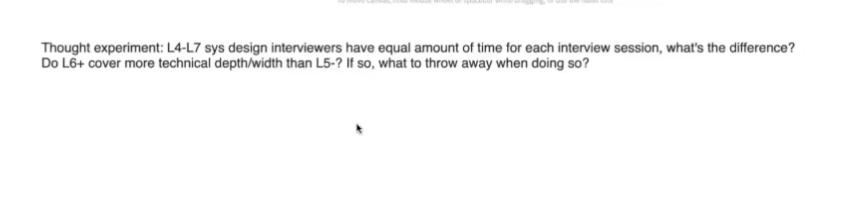

# Clarify

Created: 2024-08-17 10:18:06 -0600

Modified: 2024-08-20 12:36:53 -0600

---

{width="10.083333333333334in" height="2.4375in"}

1.  Clarify
2.  什么说 什么不说
3.  Mvp -> level 2
4.  20 -80 做20 的事情 80的gain
5.  

