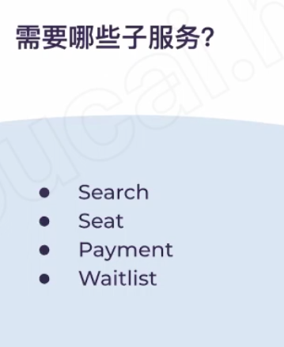
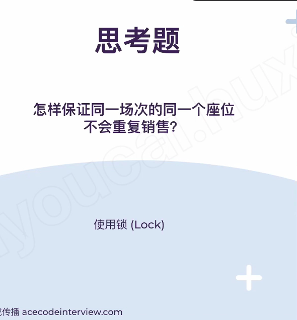
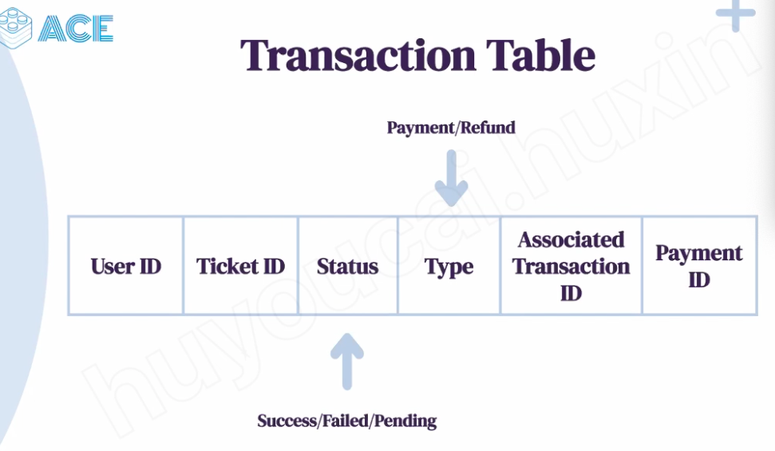
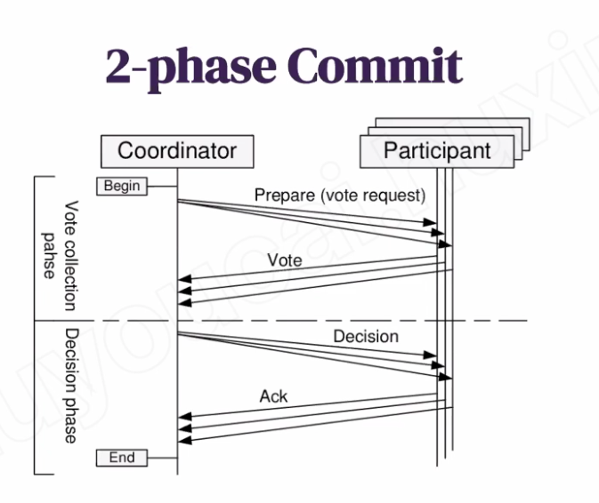
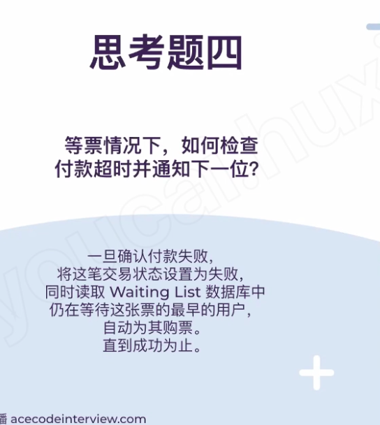
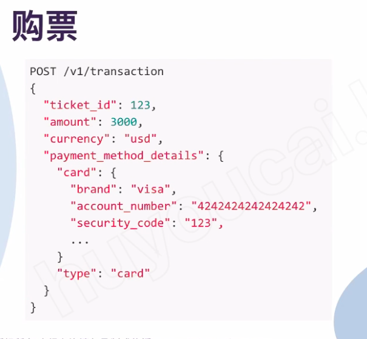
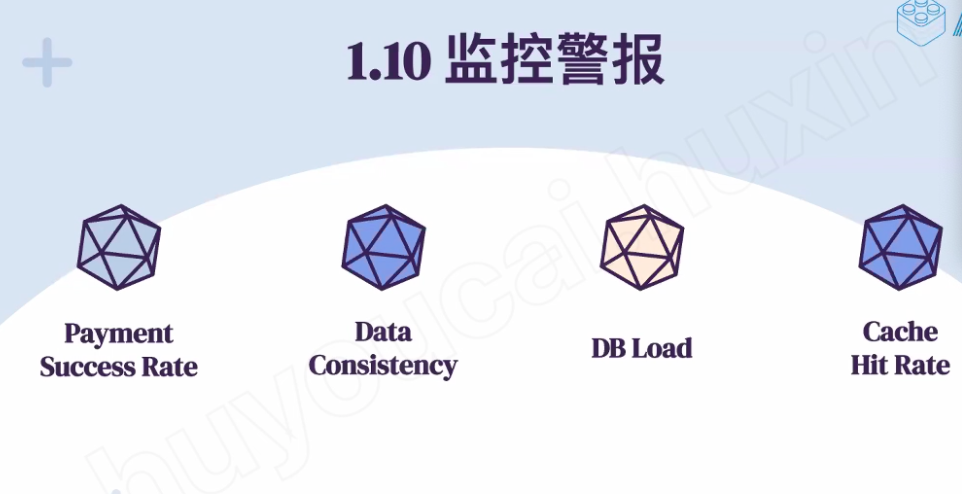

# Summary -ACE

Created: 2021-03-24 23:23:21 -0600

Modified: 2021-05-28 10:14:21 -0600

---

**[1.Requirement]{.mark}**

Should able to buy the tick online

[it is for one location or different location?]{.mark}

it for different city and different cinema

when user select the city, user should be see the movies release this city

user can select the movie, user should cinema running this movie

[each cinema has different hall ? cinema also different hall, user should able to select the cinema hall]{.mark}

1.  after user select the cinema hall, user should select one seat or multiple available seat
2.  user can hold the sheet around 5 min until he finish the payment

if no seat are available, do we think we need a waiting list?

1.  if no seat are available, user should able to await until the seat available, the police should be first come first service.

{width="5.0in" height="2.5729166666666665in"}

each ticket entity is 100B

each transaction entity is 100B

{width="5.0in" height="3.5208333333333335in"}

2.  **[Service]{.mark}**

We should have ticket search service, ticketing service, payment service and waitlist service

{width="3.7291666666666665in" height="4.5625in"}

3.  [Data follow]{.mark}: the most Scenario

A.  User searches for a movie base on the location. -- cinema table --geohash

Google s2 or quadtree they can sign a union id to each location

[the user alsp has a location id, it present a block or location, when they search the nearby cinema, the system will first compute his neighbor 8 cell id or more base on the radius, then return all the cinema base on the radius]{.mark}

B.  User selects a movie.

C.  User is shown the available shows or event of the movie.

User selects a show.

and user can see how many seat are availed from the ticket table

Once the user selects the seat, the system will try to reserve those selected seats and go to ticket service

user have 15 min to book the seat and finish the payment

After payment, booking is marked complete. If the user is not able to pay within 15 minutes, all their reserved seats are freed to become available to other users.

[if user found no seat are available but some seat just reserve but not completed the book, we can put them to a waiting list]{.mark}

{width="5.0in" height="5.385416666666667in"}

If we use master and slaver model, we can just add lock on the master service

Or the write only return to client if only the master and slaver all successfully writing

Or we can add lock for both wrtiting or reading

[Database Desgin]{.mark}

{width="5.0in" height="2.8541666666666665in"}

Venus = hall

Super_venus = cinema

Events = show

Ticket need a lock

Ticket : status - > pending, available, unavailable

Ticket id +.... Pending is select but not paid

{width="5.0in" height="3.0625in"}

Modified time -- lazy update, when other people visited this record, it will check if the status is pending and modified time is more than 15 minute, we can update it back to available

{width="5.0in" height="2.90625in"}

We will add record in transaction table when the payment is success or failed

If type is refund -- associated transaction id is payment id

{width="5.0in" height="4.71875in"}

{width="5.0in" height="4.197916666666667in"}

{width="5.0in" height="4.583333333333333in"}

two participant here is 1 .payment 2 ticket

2 phase commit

1.  To all participant, are you ready to write the change to database
2.  All the participant will prepare a [endo log and undo logo]{.mark}( in Kafka)

3. then send "YES" message to coordinator

4. if coordinator get YES from all participant, it will send the "commit" message to participant

5. participant commit the change and send "YES" to coordinate

We can use census protocol, there are multiple coordinator, they will do the next action only more than half coordinator agree

{width="5.0in" height="3.875in"}

[Waitlist DB]{.mark}

[Event id, user id, timestamp,]{.mark}

{width="5.0in" height="5.583333333333333in"}

for the reservation, we updated the ticket table and the status is pending, the timestamp is current time

If the reservation gets expired, system will scan the waitinglist table and find out if any waiting customer can be served.

Also, since we are serving in a first-come-first-serve manner

Clients can usewebsocketfor keeping themselves updated for their reservation status. Whenever seats become available, the server can use this request to notify the user.

[Rate limit]{.mark}

stop the request as much as possible. ~~Not let all request hit the database, distribute the request to different layer. If we have any 200 ticket, we don`t need 200 million request to read or write the database.~~

in the [client level]{.mark}, we need limitation the user in the client level, allow user send search request xxx per second

in the [web server level]{.mark}, we need a rate limiter to limit the number of request for each customer or each IP address

we also cache some web pages in web service, if some peoplejust ask for some static information or just query the same information in certain time, we can just return those page directly

API

{width="5.0in" height="4.614583333333333in"}

{width="5.0in" height="4.625in"}

{width="5.0in" height="2.5625in"}

