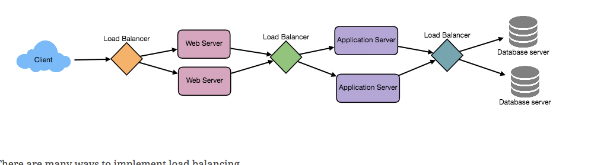

# summary 2 

Created: 2017-10-20 21:05:43 -0600

Modified: 2020-12-02 12:55:32 -0600

---

**Requirement**

Should able to buy the tick online

it is for one location or different location?

it for different city and different cinema

when user select the city, user should be see the movies release this city

user can select the movie, user should cinema running this movie

each cinema has different hall ? cinema also different hall, user should able to select the cinema hall

1.  after user select the cinema hall, user should select one sheet or multiple available sheet
2.  user can hold the sheet around 5 min until he finish the payment

if no seat are available, do we think we need a waiting list?

1.  if no seat are available, user should able to await until the seat available, the police should be first come first service.

**Service**

we have a table for the city, table for the cinema and city key should be the FK

cinema hall and cinema key should be FK

seat table, cinema hall will be the FK

on other side we have a movie table movie and cinema hall is many to many, we need a additional table call **show table**, show table will have start time and end time

we also have a **booking table** connect user and show, user and show is many to many relationship.

In the database, we'll store the reservation in the 'Booking' table, and the expiry time will be in the Timestamp column. The 'Status' field will have a value of 'Reserved (1)' and as soon as a booking is complete, the system will update the 'Status' to 'Booked (2)' and remove the reservation record from the Linked HashMap of the relevant show. When the reservation is expired, we can either remove it from the Booking table or mark it 'Expired (3)' in addition to removing it from memory.

we need a show_seat table connect booking, seat and show, in this table we will indicator the price and status

have a payment table and it is one to one relation ship between booking

![4. A user can have multiple bookings. PK FK PK Movie MovielO;Jnt Title: varchar(256) Description: varchar(512) Duration: datetime Language: varchar(16) ReleaseDate: datetime Country: varchar(64) Genre: varchar(20) Cinema CinemaID: int Name: varchar(64) TotalCinemaHaIIs: int CityID: int City CitylD: int Name: varchar(64) State: varchar(64) ZipCode: varchar(16) FK FK PK FK PK FK Show ShowlO;Jnt Date: datetime StartTlme: datetime End Time: datetime CinemaHaIIID: int MovieID: int CinerTWHaII CinemaHaIIID: int Name: varchar(64) TotalSeats: int CinemaID: int Cinema. Seat CinemaSeatID: int SeatNumber: int Type: int (enum) CinemaHaIIID: int FK FK PK FK FK FK Booking BookinglP;Jnt NumberOfSeats: int Timestamp: datetime Status: int (enum) UserID: int Shown: int Show_Seat ShowSeatID : int Status: int (enum) Price: number CinemaSeatID: int ShowID: int BookingID: int FK user userlOØnt Name: v archar(64) Password: varchar(20) Email: varchar(64) Phone: varchar(16) P ayment Amount: number Timestamp: datetime DiscountCouponID: int RemoteTransactionID: int PaymentMethod: int (enum) BookingID: int ](../../media/Payment^JTrade-Tick-System-summary-2-image1.png){width="2.3958333333333335in" height="1.5694444444444444in"}

the most Scenario

User searches for a movie.

User selects a movie.

User is shown the available shows of the movie.

User selects a show.

and user can see how many seat are availed from the show_sheet table

Once the user selects the seat, the system will try to reserve those selected seats and go to book application

user have 5 min to book the seat and finish the payment

After payment, booking is marked complete. If the user is not able to pay within five minutes, all their reserved seats are freed to become available to other users.

if user found no seat are available but some seat just reserve but not completed the book, we can put them to a waiting list

{width="2.7708333333333335in" height="0.75in"}

usually, a web service can accept 1k connection

we have two additional service or message queue, one is for reservation , one is for waiting list.

for the reservation, we can have a HashTable where the 'key' would be 'booking ID' and the 'value' would be the Linked HashMap containing 'show ID' and creation 'Timestamp'.

Whenever a booking is completed, or a reservation gets expired, waiting message queue will get a signal, so that any waiting customer can be served.

we can keep all the waiting users of a show in memory in a Linked HashMap. We need a Linked HashMap so that we can jump to any user to remove them from the HashMap when the user cancels their request.

Also, since we are serving in a first-come-first-serve manner, the head of the Linked HashMap would always be pointing to the longest waiting user, so that whenever seats become available, we can serve users in a fair manner.

We will have a HashTable to store all the waiting users for every Show. The 'key' would be 'ShowID, and the 'value' would be a Linked HashMap containing 'UserIDs' and their wait-start-time.

Clients can use[Long Polling](https://en.wikipedia.org/wiki/Push_technology#Long_polling)for keeping themselve updated for their reservation status. Whenever seats become available, the server can use this request to notify the user.

stop the request as much as possible. Not let all request hit the database, distribute the request to different layer. If we have any 200 ticket, we don`t need 200 million request to read or write the database.

in the client level, we need limitation the user in the client level, allow user send search request xxx per second

in the web server level, we need a rate limiter to limit the number of request for each customer or each IP address

we also cache some web pages in web service, if some peoplejust ask for some static information or just query the same information in certain time, we can just return those page directly

1.  If it is booking request, web service will call reservation API.
2.  We have a reservation queue
3.  if the queue is not full.This API will put the users to a reservation queue and redirect user to payment page ( queue, key will be booking id, value will be show id andtime stamp)

4.  If the queue is full and we can reject it request directly or found there are some seats are booked but not pay, put the customer to waiting list queue.

5.  If the queue item is expire, we check the booking table and find out the payment is successful or not. if not,will notice waiting list user and customer in the list can continue book.
6.  database will use the pull model connect the message queue, database will ask the certain request for message queue

7.  if that show still have available seats, Broadcast a message to all WaitingUserService to figure out the longest waiting user.
8.  otherwise, broadcast the watingUserService so that they can expire all those waiting users that need more seats than the available seats

each reverse service can have 1k tick in advance

{width="0.6597222222222222in" height="0.22916666666666666in"}{width="0.3055555555555556in" height="0.4652777777777778in"}{width="0.5972222222222222in" height="0.3055555555555556in"}{width="0.2916666666666667in" height="0.625in"}{width="0.24305555555555555in" height="0.4861111111111111in"}{width="0.3819444444444444in" height="0.4444444444444444in"}{width="0.20833333333333334in" height="0.20833333333333334in"}{width="0.3472222222222222in" height="0.3958333333333333in"}{width="0.3541666666666667in" height="0.3819444444444444in"}{width="0.4027777777777778in" height="0.24305555555555555in"}{width="0.2708333333333333in" height="0.4027777777777778in"}{width="0.3680555555555556in" height="0.2222222222222222in"}{width="0.2222222222222222in" height="0.3055555555555556in"}

