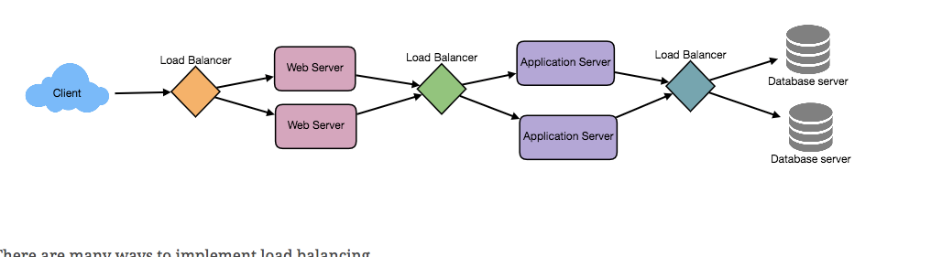

# summary 

---

requirement

should able to buy the tick online

1.  it for different city and different cinema
2.  when user select the city, user should be see the movies release this city
3.  user select the movie, user should cinema running this movie
4.  cinema also different hall, user should able to select the cinema hall
5.  after user select the cinema hall, user should select one sheet or multiple available sheet
6.  user can hold the sheet around 5 min until he finish the payment
7.  if no seat are available, user should able to await until the seat available, the police should be first come first service.

CAP

the consistency is very import for this system, we will assume multiple request will come at same time, client should get the same result, result is meaning the which seat available at anytime. if client book the seat and other clients should know

Scenario

we have a table for the city, table for the cinema and city key should be the FK

cinema hall and cinema key should be FK

seat table, cinema hall will be the FK

on other side we have a movie table movie and cinema hall is many to many, we need a additional table call **show table**, show table will have start time and end time

we also have a booking table connect user and show, user and show is many to many relationship

we need a show_seat table connect booking, seat and show, in this table we will indicator the price and status

have a payment table and it is one to one relation ship between booking

![4. A user can have multiple bookings. PK FK PK Movie MovielO;Jnt Title: varchar(256) Description: varchar(512) Duration: datetime Language: varchar(16) ReleaseDate: datetime Country: varchar(64) Genre: varchar(20) Cinema CinemaID: int Name: varchar(64) TotalCinemaHaIIs: int CityID: int City CitylD: int Name: varchar(64) State: varchar(64) ZipCode: varchar(16) FK FK PK FK PK FK Show ShowlO;Jnt Date: datetime StartTlme: datetime End Time: datetime CinemaHaIIID: int MovieID: int CinerTWHaII CinemaHaIIID: int Name: varchar(64) TotalSeats: int CinemaID: int Cinema. Seat CinemaSeatID: int SeatNumber: int Type: int (enum) CinemaHaIIID: int FK FK PK FK FK FK Booking BookinglP;Jnt NumberOfSeats: int Timestamp: datetime Status: int (enum) UserID: int Shown: int Show_Seat ShowSeatID : int Status: int (enum) Price: number CinemaSeatID: int ShowID: int BookingID: int FK user userlOØnt Name: v archar(64) Password: varchar(20) Email: varchar(64) Phone: varchar(16) P ayment Amount: number Timestamp: datetime DiscountCouponID: int RemoteTransactionID: int PaymentMethod: int (enum) BookingID: int ](../../media/Payment^JTrade-Tick-System-summary-image1.png)

the most Scenario

User searches for a movie.

User selects a movie.

User is shown the available shows of the movie.

User selects a show.

and user can see how many seat are availed from the show_sheet table

Once the user selects the seat, the system will try to reserve those selected seats and go to book application

user have 5 min to book the seat and finish the payment

After payment, booking is marked complete. If the user is not able to pay within five minutes, all their reserved seats are freed to become available to other users.

if user found no seat are available but some seat just reserve but not completed the book, we can put them to a waiting list

web service the base one the request of user , call different function in application service and application service will query the database and sent the resuelt to web serivce.

usually, a web service can accept 1k connection

we have another service all tracking service to track the status of the booking,

To store every reservation for every show, we can have a HashTable where the 'key' would be 'ShowID' and the 'value' would be the Linked HashMap containing 'BookingID' and creation 'Timestamp'.

In the database, we'll store the reservation in the 'Booking' table, and the expiry time will be in the Timestamp column. The 'Status' field will have a value of 'Reserved (1)' and as soon as a booking is complete, the system will update the 'Status' to 'Booked (2)' and remove the reservation record from the Linked HashMap of the relevant show. When the reservation is expired, we can either remove it from the Booking table or mark it 'Expired (3)' in addition to removing it from memory.

Whenever a booking is completed, or a reservation gets expired, WaitingUsersService will get a signal, so that any waiting customer can be served.

Just like ActiveReservationsService, we can keep all the waiting users of a show in memory in a Linked HashMap. We need a Linked HashMap so that we can jump to any user to remove them from the HashMap when the user cancels their request.

Also, since we are serving in a first-come-first-serve manner, the head of the Linked HashMap would always be pointing to the longest waiting user, so that whenever seats become available, we can serve users in a fair manner.

We will have a HashTable to store all the waiting users for every Show. The 'key' would be 'ShowID, and the 'value' would be a Linked HashMap containing 'UserIDs' and their wait-start-time.

Clients can use[Long Polling](https://en.wikipedia.org/wiki/Push_technology#Long_polling)for keeping themselve updated for their reservation status. Whenever seats become available, the server can use this request to notify the user.

We can use Consistent Hashing to allocate application servers for both ActiveReservationService and WaitingUserService based upon the 'ShowID'. This way, all reservations and waiting users of a particular show will be handled by a certain set of servers.

1.  Update database to remove the Booking (or mark it expired) and update the seats' Status in 'Show_Seats' table.
2.  Remove the reservation from the Linked HashMap.
3.  Notify the user that their reservation has expired.
4.  Broadcast a message to all WaitingUserService servers that are holding waiting users of that Show to figure out the longest waiting user. Consistent Hashing scheme will tell what servers are holding these users.
5.  Send a message to the WaitingUserService server holding the longest waiting user to process their request if required seats have become available.

1.  The server holding that reservation sends a message to all servers holding waiting users of that Show so that they can expire all those waiting users that need more seats than the available seats.
2.  Upon receiving above message, all servers holding the waiting users will query the database to find how many free seats are available now. Database cache would greatly help here to run this query only once.

3.  Expire all waiting users who want to reserve more seats than the available seats. For this, WaitingUserService has to iterate through the Linked HashMap of all the waiting users.

if we do`t need user select the seat, we can use multiple reverse service and waiting service. and shading base one the user id

we don`t need the show id

for the user wating service, the id will be user id

and the reverse service the key will be booking id and value will be time stamp

each reverse service can have 1k tick in advance

