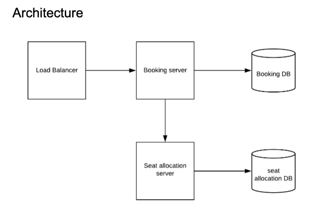

# 12306 ticket  

Created: 2020-12-02 12:55:34 -0600

Modified: 2021-04-22 23:25:28 -0600

---

Read modify write confit -- solved by read write locking ( two phase locking)

1.  The service should be basically divided into to 3 part

one is select, choose the seat, 100% read request, just query the database

find the available seat, we can cache it for the performance

2.  after the user click the booking button, we will insert to a [booking table]{.mark}

in the book service, it will start the booking process

booking table is shared by the show id or movie id

we can use two phase locking, read lock and write lock so the read will not block the write

we can also insert a recode into a memory database said this seat is

is current reserved for certain time

the select service also need query this reserved database to filter out the seat is already reserved

3.  we also need a background process to scan the booking database periodically , there should be a threshold for seats, 120% of available seats, if the number of people reach limitation, just delete that record and return failed

and put the rest of people into the waitlist

then redirect the winner user not in the waiting list to payment page or seat pager

When a user books tickets, request insert a row in the booking table, then return the increment id and a request id. Clients could async polling(not too frequent) the status of the booking status. Since read / write not blocking each other ([snapshot isolate]{.mark}) , the following read is not slowing booking(write).

4.  there is should be a configuration--- how many seat is available sorted in the KV store : zookeeper ...

A fully booked train or show could be marked unavailable in a configuration server.

client side will periodically check the booking table via the request id

{width="5.0in" height="3.9375in"}

Booking table indexed on passenger id, request id and route, primary key is auto increment id. Auto increment id will be used to decide the winner.

moved the old record to historical log database

{width="5.0in" height="3.34375in"}

Require write lock, system need the read lock first

Solution:

Quick estimation:

System should be able to handle 5 billion passengers per year. That is ~14 million per day.

14 million per day, assuming 85% occupation rate. Number of trains per day 16.5k

Peak time throughput doubled to 33k trains with 100% occupation rate. Passengers double times to the 28 million per day.

10m qps / 10k trains = 1k peak qps per train.

- The bottleneck is with database, in particular, when many people rush to the same trains, there is a possible case of [read-modify-write conflicts]{.mark}, ie. A and B checked the empty seat of train 1 and found there was an empty seat available, when they booked it, they had a conflict and only one was able to get the seat.
- Relational database is used to guarantee a strong transaction.
- Databases have to be sharded in order to handle the traffic. The normal shard key is train-travel-time (Beijing To Shanghai G1234 departs at 12:30pm)
- The separation of train seats are pre-determined and pre-allocated. Pre-allocation is required because there are still some offline agencies to sell the tickets in person, they will need to reserve some tickets. Additionally the traffic pattern is relatively predictable, few rounds of optimization of distributions of tickets should optimize the throughput to near max.

The central idea is separating the booking(concurrent resource competing) with seat allocation(compute intensive, need dynamic programming sometimes). [The booking DB is focusing on grabbing the seat and showing how many seats remain.]{.mark}

Take (Beijing To Shanghai G1234 departs at 12:30pm) as an example.

Booking part:

- Admin pre-determine and pre-allocate the train schedules, how many seats from Beijing to Shanghai directly, how many seats from Beijing to Shijiangzhuang etc. the data is then stored in the database[[In a Configuration database redis is ok].]{.mark}

- There are many ways to shard the booking database, here a simple shard based on Hash(Beijing To Shanghai G1234, departs at June 08, 2020 12:30pm) is fine.

- The database is using snapshot isolation concurrent control. So read not blocking write and vice versa. (may read slat data but read don't not block write.)

- Proposed booking table schema

Two major types of locks are utilized:

- **Write-lock** (**exclusive lock**)
- **Read-lock** (**shared lock**)

- An existing *write-lock* on a database object blocks an intended *write* upon the same object (already requested/issued) by another transaction by blocking a respective *write-lock* from being acquired by the other transaction. The second write-lock will be acquired and the requested write of the object will take place (materialize) after the existing write-lock is released.
- A *write-lock* blocks an intended (already requested/issued) *read* by another transaction by blocking the respective *read-lock* .
- A *read-lock* blocks an intended *write* by another transaction by blocking the respective *write-lock*.
- A *read-lock* [does not block]{.mark} an intended *read* by another transaction. The respective *read-lock* for the intended read is acquired (shared with the previous read) immediately after the intended read is requested, and then the intended read itself takes place.

- Proposed booking table schema, sharding by UUID(hash..)

<table>
<colgroup>
<col style="width: 6%" />
<col style="width: 14%" />
<col style="width: 7%" />
<col style="width: 7%" />
<col style="width: 11%" />
<col style="width: 9%" />
<col style="width: 9%" />
<col style="width: 19%" />
<col style="width: 5%" />
<col style="width: 6%" />
</colgroup>
<thead>
<tr>
<th>
Auto

incre id
</th>
<th>uuid</th>
<th>Train #</th>
<th>Start ts</th>
<th>UserId</th>
<th>#tickets</th>
<th>request</th>
<th>route</th>
<th>ts</th>
<th>state</th>
</tr>
</thead>
<tbody>
<tr>
<td>1</td>
<td>hash(G123, 2020-06-09 12pm)</td>
<td>G123</td>
<td>
06-09,

2020 12pm
</td>
<td>30112</td>
<td>1</td>
<td>uuid</td>
<td>A1(Beijing to Shanghai)</td>
<td>124</td>
<td></td>
</tr>
<tr>
<td>2</td>
<td>hash(G123, 2020-06-09 12pm)</td>
<td>G123</td>
<td>
06-09,

2020 12pm
</td>
<td>2313441</td>
<td>5</td>
<td>uuid</td>
<td>B2(Shijiazhuang to Shanghai)</td>
<td>125</td>
<td></td>
</tr>
</tbody>
</table>

- State could be [empty, booked, cancelled], empty either means it is not decided or it means that it is in a waiting list state.

- Booking table [indexed on passenger id, request id and route,]{.mark} primary key is auto increment id. Auto increment id will be used to decide the winner.

- Each book is therefore reduced to append one row in the booking table. Read write ratio could be 10:1,. Estimated read + write qps for one train is 100k most. One sql shards could easily handle.
- When a user books tickets, request insert a row in the booking table, then return the increment id and a request id. Clients could async polling(not too frequent) the status of the booking status. Since read / write not blocking each other, the following read is not slowing booking(write).

Rate limiting on the load balance

- The display of remaining tickets available is simply a read, therefore not blocking the write. Not a bottleneck.
- The tricky part is some users may cancel the booking, so users in the waiting list could be promoted.

  1.  If the user is certainly within threshold, return success and move to seat allocation.
  2.  If the user is beyond the waiting list capacity, return failed, mark the booking cancelled.
  3.  If the user is in the waiting list, wait for a certain period of time(1 - 5 mins), if some prior users cancel the booking, return success. Return failed when timeout.
  4.  If the waiting list is cleared and there are still some empty seats. Open up to fill again.

- A background process could read the rows in the table periodically(every 10 seconds), and decide who claimed the seats, who is in the waitlist and who is out.

- A fully booked train could be marked unavailable in a configuration server.

- From a technical perspective, dynamic allocation is possible, a greedy algorithm or simple dynamic programming could be used to dynamically allocate the seat. A longer time window may be needed.

- Book a trip across several trains will insert rows in all tables, if one insert failed, rest of trips could be automatically deleted. There should be an upper bound of how many trips requested (max = 2 or 3).
- [The data after train departure could be moved to a historical log db. To keep the db lean.]{.mark}

Write transfer to the append problem

[Seat allocation part:]{.mark}

- Seat allocation part is the computing intensive part and may require some heavy lifting.

- Seat allocation part could be done sequentially, since users already know they got a seat, they could wait a few more mins to get the exact seat allocation.

- Could use either DP or greedy algorithms to allocate seats.
- Once a seat is allocated, write to a seat allocation table.
- If the seat allocation server crashes, restart by reading the seat allocation table to find out who has been handled and the booking table to find out who needs to be allocated.

Since the number of seats per train is fixed, this design could be scaled infinitely.

