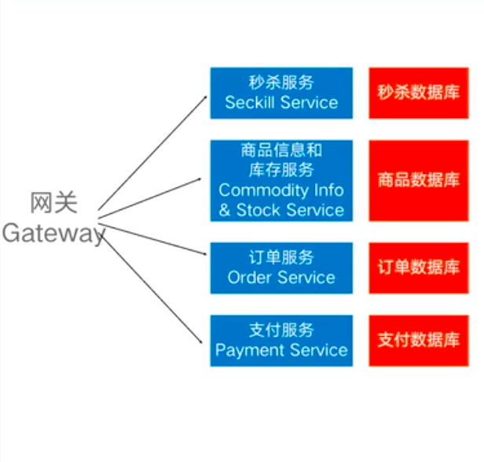
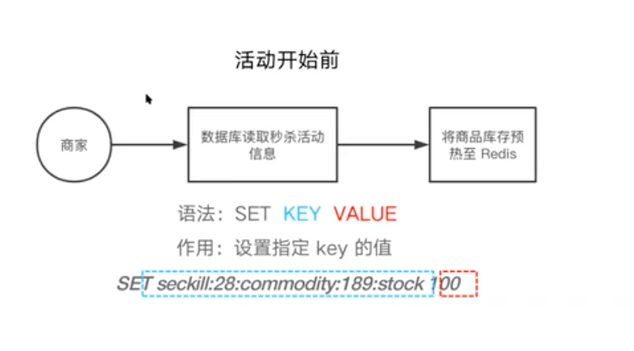
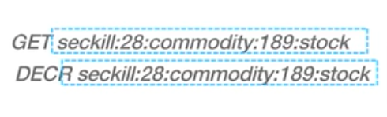
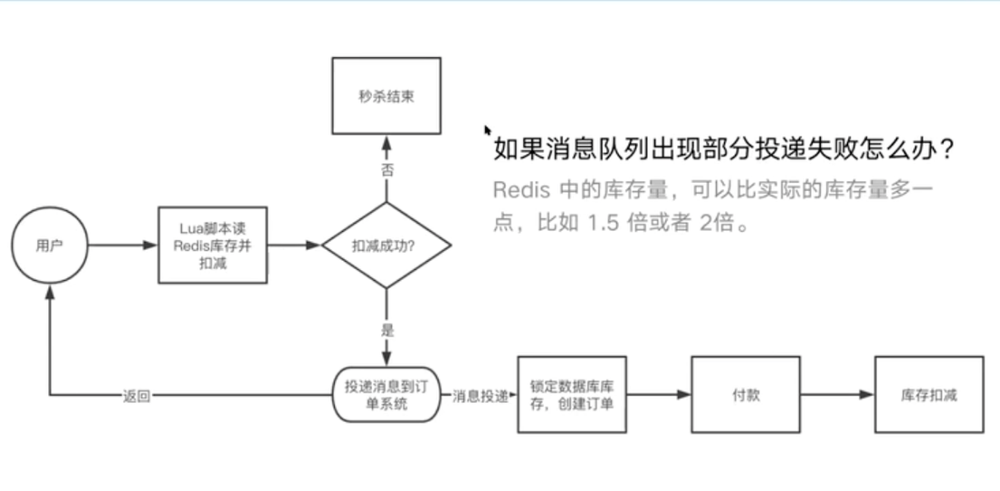

# 秒杀

Created: 2020-12-26 16:37:56 -0600

Modified: 2020-12-26 17:49:48 -0600

---

10 million people visiting

{width="10.083333333333334in" height="9.614583333333334in"}

{width="10.083333333333334in" height="5.010416666666667in"}

{width="10.083333333333334in" height="5.25in"}

{width="10.083333333333334in" height="5.635416666666667in"}

100 is value

{width="10.083333333333334in" height="3.1041666666666665in"}

{width="10.083333333333334in" height="5.96875in"}

{width="10.083333333333334in" height="4.989583333333333in"}

{width="10.083333333333334in" height="5.59375in"}

{width="10.083333333333334in" height="5.708333333333333in"}

Payment

Create order

Update the stock

{width="10.083333333333334in" height="5.479166666666667in"}

{width="10.083333333333334in" height="7.375in"}

{width="10.083333333333334in" height="5.479166666666667in"}

{width="10.083333333333334in" height="5.708333333333333in"}

