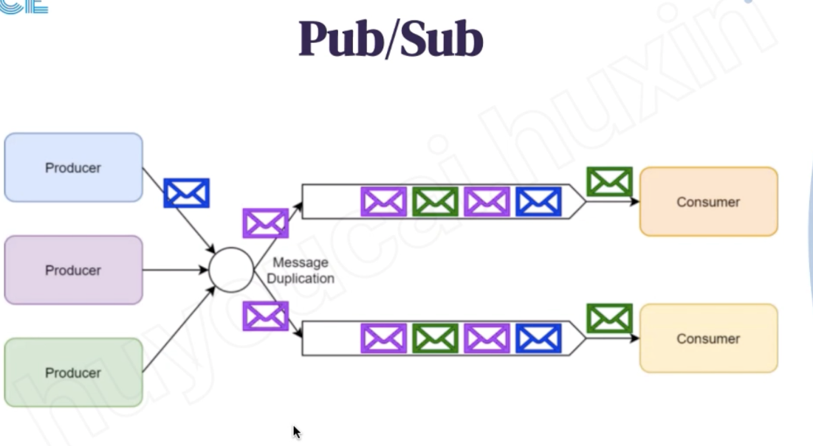

# Queue -ACE

---

Shared one queue

Rabbit MQ, queue will push the message to consumer side

Rabbit will delete the message

Kakfa more like a log will store the message in the disk or file system and do other analysis or process

Same kafka consumer will share the same topic point

Topic has too many message need to be shared to different partition

