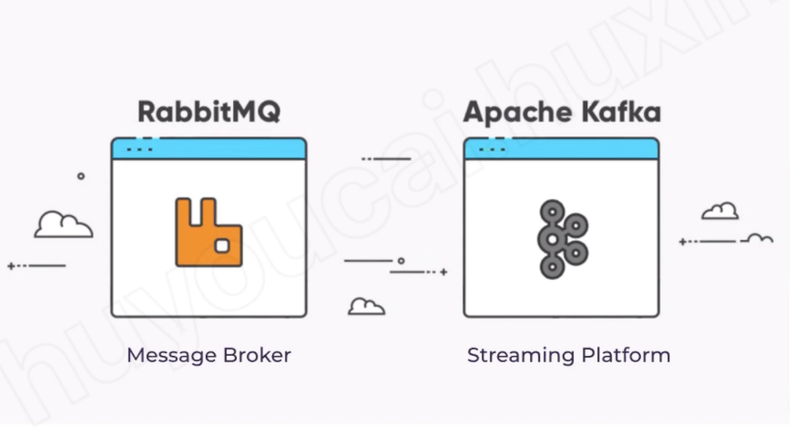
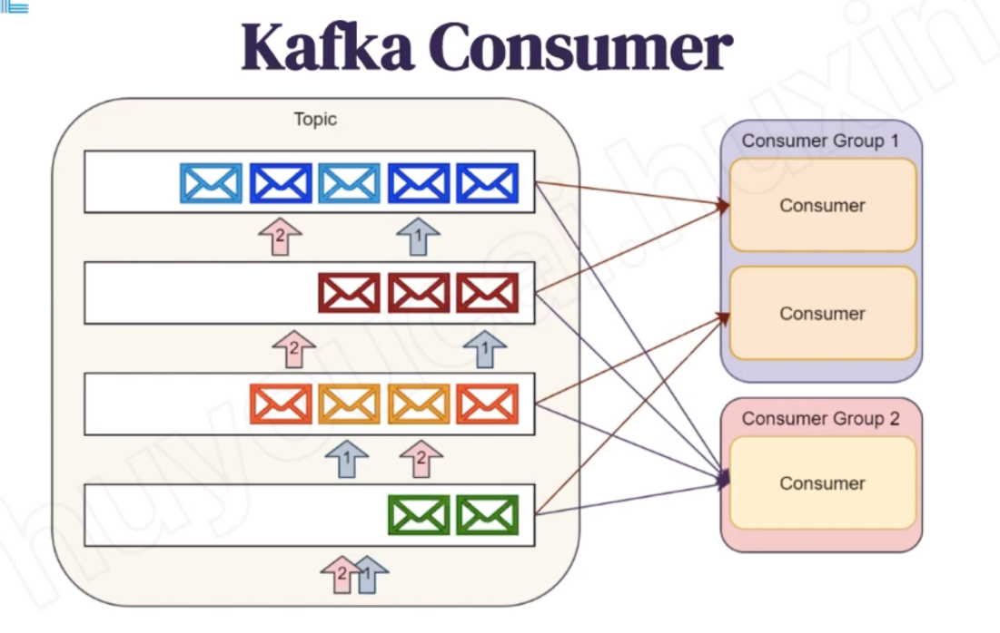
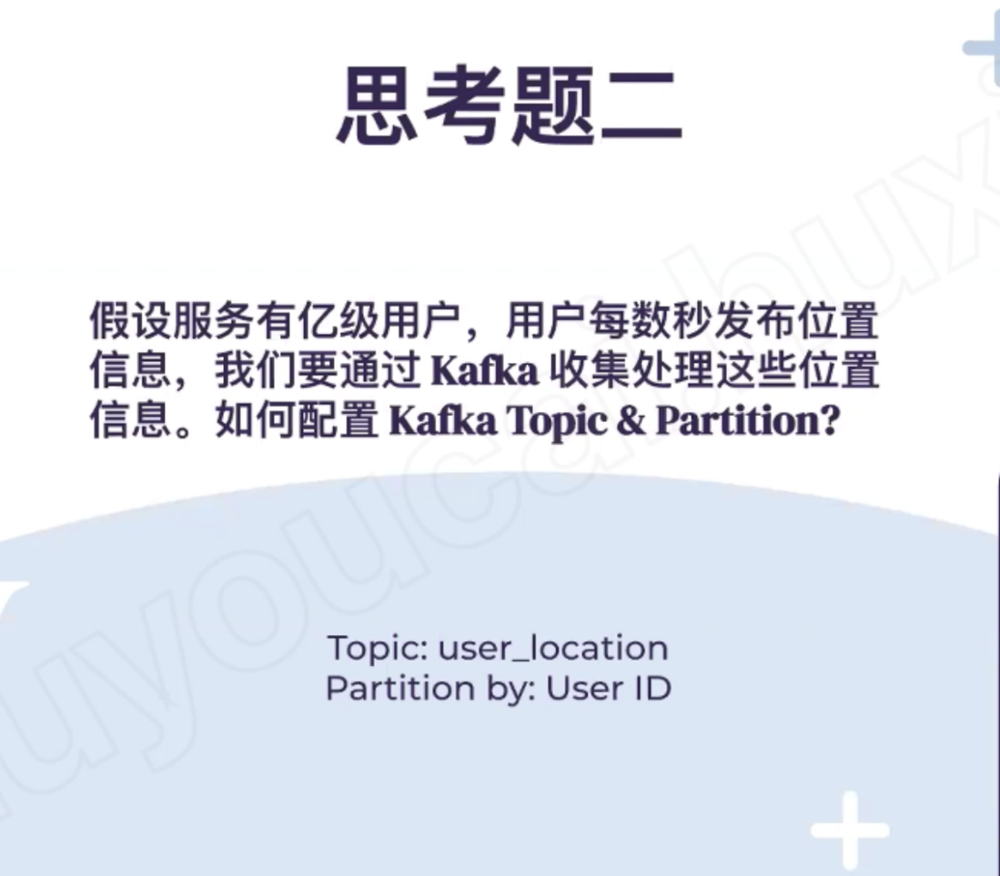

# Queue -ACE

Created: 2021-04-26 11:42:13 -0600

Modified: 2021-04-26 12:48:20 -0600

---

{width="10.083333333333334in" height="6.145833333333333in"}

Shared one queue

{width="10.083333333333334in" height="5.59375in"}

{width="10.083333333333334in" height="5.572916666666667in"}

Rabbit MQ, queue will push the message to consumer side

Rabbit will delete the message

Kakfa more like a log will store the message in the disk or file system and do other analysis or process

{width="10.083333333333334in" height="7.84375in"}{width="10.083333333333334in" height="6.416666666666667in"}

Same kafka consumer will share the same topic point

{width="10.083333333333334in" height="6.822916666666667in"}

Topic has too many message need to be shared to different partition

{width="10.083333333333334in" height="9.9375in"}{width="10.083333333333334in" height="8.854166666666666in"}

