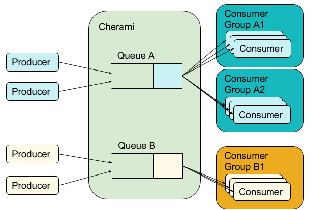
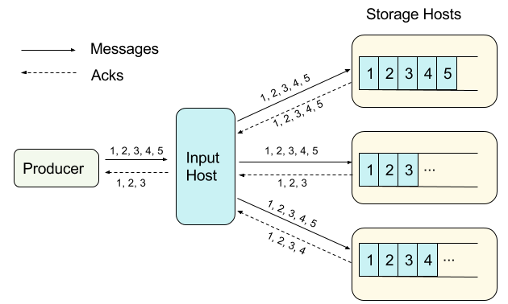
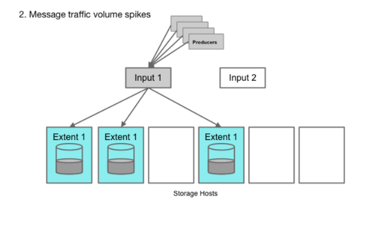
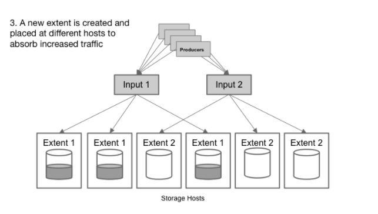
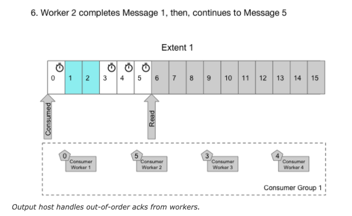
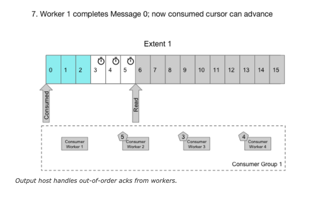
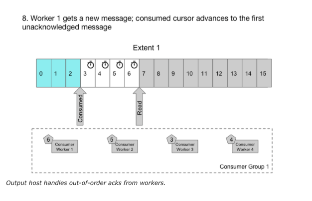
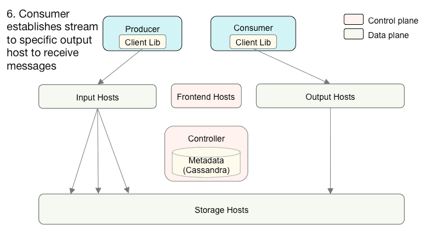

# https://eng.uber.com/cherami-message-queue-system/

---

<https://eng.uber.com/cherami-message-queue-system/>

Cherami's users are defined as either*producers*or*consumers*.*Producers*enqueue tasks.*Consumers*are worker processes that asynchronously pick up and process enqueued tasks. Cherami's delivery model is the typical[Competing Consumers](https://msdn.microsoft.com/en-us/library/dn568101.aspx)pattern, where consumers in the same consumer group receive disjoint sets of tasks (except in failure cases, which cause redelivery). Using this model, work fans out to many workers in parallel. ~~The number of workers is independent of any partitioning or sharding mechanisms internal to Cherami and can scale up and down simply by adding or removing workers.~~ If a worker fails to perform a task, another worker can redeliver and retry the task.

Cherami also supports multiple consumer groups, where each consumer group receives all tasks in the queue. Each consumer group is associated with a[dead letter queue](https://en.wikipedia.org/wiki/Dead_letter_queue). Tasks that exceed the maximum retry count (for example, "poison pills") land in dead letter queue ~~this queue~~ so that the consumer group can continue processing other messages. ~~These consumer handling features both distinguish Cherami from the simple message buses that are typically used in big data ingestion and analytics (e.g.[Apache Kafka](https://kafka.apache.org/)), and make Cherami advantageous in task queue use cases.~~

Producers enqueue tasks into queues A and B. Queue A feeds to two consumers groups that both receive all tasks, distributed across consumers within the respective group. Queue B feeds to only one consumer group.

~~Prior to Cherami, Uber used[Celery](http://www.celeryproject.org/)queues backed by[Redis](http://redis.io/)for all task-queue use-cases. The combo of Celery and Redis helped Uber scale quickly, up to a point. The drawbacks? Celery is Python-only, while we were increasingly relying on Go and Java to build higher performance backend services. Furthermore, Redis stores are memory-backed, which isn't as durable or scalable as we needed.~~

We needed a longer-term solution for Uber's future, so we built Cherami to satisfy these requirements:

1.  Durability, losslessness, and tolerance of hardware failures
2.  Flexibility between[availability and consistency (AP vs CP)](https://en.wikipedia.org/wiki/CAP_theorem)during network partition
3.  Ability to scale the throughput of each queue up and down easily
4.  Complete support for the competing-consumers consumption model
5.  Language agnostic

To satisfy those requirements, Cherami's design follows these design principles:

1.  We choose eventual consistency as a core principle. This allows high availability and durability, with the tradeoff that we don't provide ordering guarantees. However, that means that we can continue accepting requests during catastrophic failures or network partitions, and further improves availability by eliminating the need for a consistent metadata storage like[Zookeeper](http://zookeeper.apache.org/).
2.  We chose not to support the partitioned consumer pattern, and we don't expose partitions to the user. This simplifies consumer worker management, as workers don't need to coordinate which partition to consume from. It also simplifies provisioning, since both producers and consumers can scale independently.

In the following sections, we further elaborate on key design elements of Cherami and explain how we applied the design principles and tradeoffs.

Cherami's Key Design Elements

1. Failure recovery and replication

~~To be truly lossless and available, Cherami must tolerate hardware failures. In practice, this requires~~ Cherami to replicate each message across different hardware so that messages can reliably be read~~, but Cherami must also be able to accept new messages when hardware fails either transiently or permanently.~~

Cherami's fault tolerance comes from leveraging the append-only property of messaging systems and using pipelining in message transfers. Each message in a message queue is a self-contained element that, once created, is never modified. In other words, message queues are append-only. If the storage host containing the queue fails, we can pick a different storage host and continue writing to it. The enqueue operation continues to be available.

The append-only property allows a queue to remain available for publishing during hardware failure.

~~A Cherami queue consists of one or more*extents*, which are conceptual substreams within a queue that independently support appending messages. Extents are replicated to the storage layer by a role called*input host*. When an extent is created,~~ [its metadata contains an immutable host information tuple (input host and list of storage hosts).]{.mark} ~~In each storage host, the replicated copy of the extent is called a*replica*, and a storage host can host many replicas of different extents. If a single storage host fails, we don't lose messages because the extent is still readable from other replicas.~~

Cherami handles a storage host failure.

Producers connect to the specific input host to publish to an extent belonging to some queue. Upon receiving messages from a producer, the input host*simultaneously*pipelines the messages into all extent replicas through a[WebSocket](https://en.wikipedia.org/wiki/WebSocket)connection, and receives acknowledgements (*acks*) from the respective replicas in the same connection.

Pipelining means the input host does not wait for an ack before writing the next message, and that there is no message reordering or message skipping between the input host and all replicas. This also applies to the acks that return from each replica; acks come in the order of corresponding writes. The input host tracks all acks. Only when all storage hosts ack receipt of the same message are received does the input host ack to the producer. This final ack implies that the message has been durably stored in all replicas.

Within each extent, messages are ordered due to the pipelining property. This ensures messages across all replicas are consistent, except for the tails where a storage host has yet to persist the messages.

Input host only receives acks for the first three messages from all storage hosts. It acks the first three messages to the producer, as those messages are guaranteed to be fully replicated.

When any replica fails, the input host cannot receive acks from that replica for any further writes. Thus, this extent is no longer appendable. If the input host fails, we would lose the inflight acks from the storage hosts. In both cases, the tails of the replicas can be inconsistent: one or more messages are not replicated in all replicas. To recover from this inconsistency, instead of trying to scan and repair the tails, which is a complicated operation, we simply declare this extent "sealed" as-is; it's readable, but no more writes are allowed.

After sealing, Cherami creates a new extent for this queue, and a signaling channel notifies producers to reconnect and publish into the new extent. If a queue consists of only one open extent, sealing it would make the queue temporarily unavailable to publish for a short period of time before a new extent is created. To avoid publish latency spikes during failures, a queue normally sets a minimum number of extents so that publish can continue when one extent is being sealed and a new one created.

We choose to use sealing as a recovery mechanism because it is simple to implement. The tradeoff here is that duplicates can occur. The reason for the duplicates is that after a failure, the replica tails will contain messages not acked to the publisher, and it is not possible to determine which messages are unacked, if the input host has failed. Thus, in the read path, we will have to deliver everything, including these unacked messages. Publishers generally retry when failed to enqueue a message, so some of these messages may be republished in a new extent, which causes consumers to receive duplicates.

2. Scaling of Writes

Extents within Cherami are shared-nothing substreams. Cherami observes the throughput on each extent. As write load to a particular queue increases and some extents exceed their throughput limit, Cherami creates additional extents (input 2) for that queue automatically. The new extents receive part of the write load, alleviating the load on existing extents.

As write load decreases, Cherami seals some of the extents without replacing them with new ones. In this way Cherami reduces some overhead (memory, network connections, and other maintenance) required to maintain an open extent.

3. Consumption handling

Consumers in the same consumer group receive tasks from the same queue, but may receive from one or more extents. When a consumer receives a message and successfully processes it, the consumer replies to Cherami with an ack. If Cherami doesn't get an ack after some configured amount of time, it redelivers the message to retry. A consumer's ack can be delayed or missing when a consumer crashes, when a downstream dependency is unavailable, when a single task takes too long, or when processing gets stuck because of a deadlock. A consumer can also negatively acknowledge, or*nack*, a message, triggering immediate redelivery. Nacks allow consumer groups to process tasks that some members are incapable of processing (e.g. because of local failures, partial/rolling upgrade of a consumer group to a new task schema).

Because different consumers can take varied amount of time to process messages, acks arrive at Cherami in a different order than the ordering provided by the replicas. Some messaging systems store the read/unread state (also known as the visibility state) per message. However, to do that we would need to update these states on disk (with random writes) and handle the complexity of doing this for each of multiple consumer groups.

Cherami takes a different approach. In each consumer group, for each extent, we maintain an*ack offset*, which is a message sequence number below which all messages have been acked. We have a role called*output host*that consumers connect to in order to receive deliveries. The output host reads messages from storage hosts sequentially, keeping them cached in memory. It keeps tracks of in-flight messages (delivered to consumer, but not yet acked) and updates the ack offset when possible. Output host also keeps track of timing and nacks so that messages can be redelivered to another consumer as necessary. In Cherami, one extent can be consumed simultaneously by multiple consumer groups, so multiple output hosts might read from the same extent.

the ACK should store in the output extent

Output host handles out-of-order acks from workers.

Further, the system is configured to redeliver each message a limited number of times. If the redelivery limit is reached, the message is published to a[dead letter queue](https://en.wikipedia.org/wiki/Dead_letter_queue)and the message is marked as acked so that the ack offset can advance. This way, no "poison pill" messages block the processing of other messages in the queue. The consumer group owner can manually examine messages in the DLQ, and then handle them in one of two ways: purging them or merging them. Purging them deletes the messages, and is appropriate when they are invalid, or if the have no value (e.g. they were time-sensitive). The owner can otherwise merge them back to the consumer group, which is appropriate when the consumer software has been fixed to handle the messages that previously could not be handled, or when the transient failure condition has subsided.

4. Storage

Messages in Cherami are durably stored on disks. On the storage hosts, we chose[RocksDB](http://rocksdb.org/)as our storage engine for performance and indexing features, and we use a separate RocksDB instance per extent with a shared[LRU](https://en.wikipedia.org/wiki/Cache_Replacement_Policies)block cache. Messages are stored in the database with an increasing sequence number as the key, and the message itself as the value. Because the keys are always increasing, RocksDB optimizes its compaction so that we don't suffer from write amplification. When*output host*reads messages from an extent, it simply seeks to the*ack offset*for the consumer group it's serving, and iterates by the sequence number to read further messages.

With RocksDB, we can also easily implement timer queues, which are queues where each message is associated with a delay time. In such a case, the message is only delivered after the specified delay. For timer queues, we construct the key to contain the delivery time in high order bits, and sequence number in low order bits. Since RocksDB provides a sorted iterator, the keys are iterated in order of delivery time, while the sequence number of the lower bits ensures uniqueness of the keys:

System Architecture

Cherami consists of several different roles. In addition to the input, storage, and output roles we already introduced, there's*controller*, and*frontend*. A typical Cherami deployment consists of several instances of each role:

Interaction of Cherami's system components.

Different roles can exist on the same physical host or even be linked into a single binary. At Uber, each role runs in an individual Docker container. Input, storage, and output form the data plane of the system. Controller and frontend handle control plane functions and metadata operations.

Controller

Controller is the grand coordinator, the intelligence that coordinates all of the other components. It primarily determines when to create and where to place (to which input and which storage hosts) an extent. It also determines which output hosts handle the consumption for a consumer group.

All data plane roles report load information to Controller via RPC calls. With this information, controller makes the placement decision and balance load. There are several instances of this controller role, one of them weakly elected the leader using Uber's[Ringpop](https://eng.uber.com/intro-to-ringpop/)library for gossip and consistent hashing. Ringpop also performs distributed health check and membership functions.

Frontend

Frontend hosts expose[TChannel](https://github.com/uber/tchannel)--[Thrift](https://thrift.apache.org/)APIs that perform[CRUD](https://en.wikipedia.org/wiki/Create,_read,_update_and_delete)operations of queues and consumer groups. They also expose APIs for data plane routing purposes. When a producer wants to publish messages into a queue, it invokes the routing API to discover which input hosts contain the extents of the queue. Next, the producer connects to those input hosts using WebSocket connections and publishes messages in the established streams.

Similarly, when a consumer wants to consume messages from a queue, it first invokes the routing API to discover which output hosts manage the consumption of extents of the queue. Then, the producer connects to those output hosts using WebSocket connections and pulls messages. When new extents are created, Cherami sends back a notification to the producer and consumer so that they can connect to new extents. We developed client-side libraries to simplify these interactions.

Cassandra and Queueing

Finally, Cherami stores metadata on[Cassandra](http://cassandra.apache.org/), which is separately deployed. Metadata contains information about a queue, all its Extents, and all the Consumer Group [information such as ACK offsets per Extent per Consumer Group.]{.mark} We chose Cassandra not only because Cassandra is a highly available data storage system, but also because of its tunable consistency model. Such flexibility allows us to offer queues that can be either partition tolerant while not order preserving (AP queues), or order preserving (CP queues) but not available in the minor partition during such a partition event. The main difference in the handling of two types of queues is whether Extent creation requires conditional update operation.

AP Queues

For AP queues, extent creation does not need Quorum-level consistency in Cassandra. When a network partition occurs, Extents can be created on both sides of the partition. Let's call the partitions A and B. Producers in Partition A can publish into Extents in that partition, and Producers in Partition B can publish into Extents in Partition B. Therefore, writes are not blocked by network partition. For reads, Consumers in Partition A can only consume from Extents in that partition, and similar for Consumers in Partition B. However, when the network partition heals, Consumers are able to reach all Extents. The tradeoff here is that messages are eventually-consistent: it is not possible to establish a global ordering of messages because Extents can be created anytime, anywhere. In our implementation, we use Cassandra consistency level "ONE" when we write the Extent metadata.

CP Queues

For CP queues, Extent creation needs to be linearizable: in the case of a network partition, we must make sure that only one partition can create an Extent to succeed the previously sealed one. To ensure this, we use Cassandra's lightweight transaction so that if at the same time more than one Extent is created for any reason, only one can be used for a CP queue.

~~Cherami, Summarized~~

~~Cherami is a competing-consumer messaging queue that is durable, fault-tolerant, highly available and scalable. We achieve durability and fault-tolerance by replicating messages across storage hosts, and high availability by leveraging the append-only property of messaging queues and choosing eventual consistency as our basic model. Cherami is also scalable, as the design does not have single bottleneck.~~

~~Cherami was designed and built from the ground up in about six months in our[Seattle engineering office](https://www.uber.com/careers/list/?city=seattle&country=united-states-of-america&keywords=&subteam=all&team=engineering). Currently, Cherami transports many hundred millions of tasks durably per day among Uber Engineering's[many microservices](https://eng.uber.com/building-tincup/), helping use cases such as post-trip processing, fraud detection, user notification, incentive campaigns, and many other use cases.~~

~~Cherami is completely[written in Go](https://golang.org/), a language that makes building highly performant and concurrent system software a lot of fun. Additionally, Cherami uses several libraries that Uber has already open sourced:[TChannel](https://github.com/uber/tchannel-go/)for RPC and[Ringpop](https://github.com/uber/ringpop-go)for health checking and group membership. Cherami depends on several third-party open source technologies:[Cassandra](http://cassandra.apache.org/)for metadata storage, RocksDB for message storage, and many other third-party Go packages that are available on GitHub. We plan to[open source](http://uber.github.io/)Cherami in the near future.~~

~~**[Editor Update January 3 2017]{.underline}:**Cherami is now open sourced at the following links:[**github.com/uber/cherami-server**](https://github.com/uber/cherami-server)&[**github.com/uber/cherami-client-go**](https://github.com/uber/cherami-client-go).~~

*~~Xu Ning is an[engineering manager](https://www.uber.com/careers/list/?city=seattle&country=united-states-of-america&keywords=engineering+manager&subteam=all&team=engineering)and co-wrote this article with Maxim Fateev, a staff[software engineer](https://www.uber.com/careers/list/?city=seattle&country=united-states-of-america&keywords=software+engineer&subteam=all&team=engineering). Both are based in[Uber's Seattle engineering office](https://eng.uber.com/seattle-team-profile/).~~*

*~~Photo Credits for Header: "[Paloma](https://www.flickr.com/photos/amigomac/5069325296/)" by[Pablo Ibañez](https://www.flickr.com/photos/amigomac/), licensed under[CC-BY 2.0](https://creativecommons.org/licenses/by/2.0/). Image cropped for header dimensions and color corrected.~~*

*~~Photo Credits for intro pigeon image:[United States Signal Corps](https://commons.wikimedia.org/wiki/File:Cher_Ami_cropped.jpg)via[Smithsonian Institution](http://historywired.si.edu/enlarge.cfm?ID=522&ShowEnlargement=1), public domain~~.*

