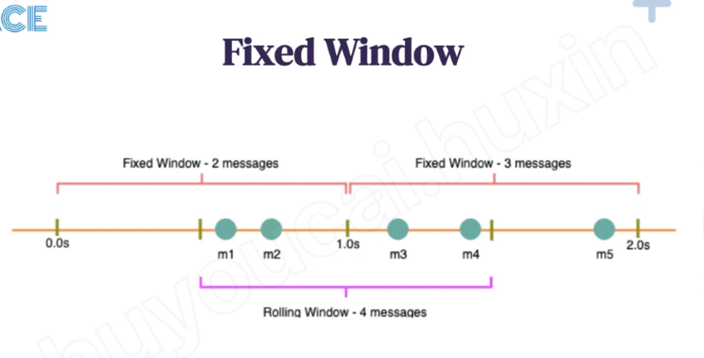
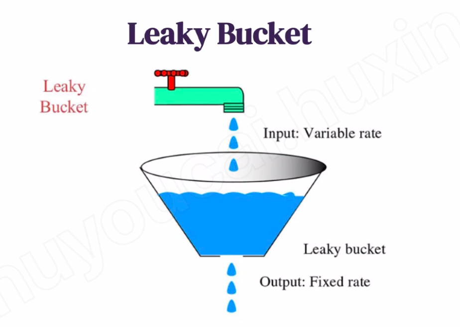
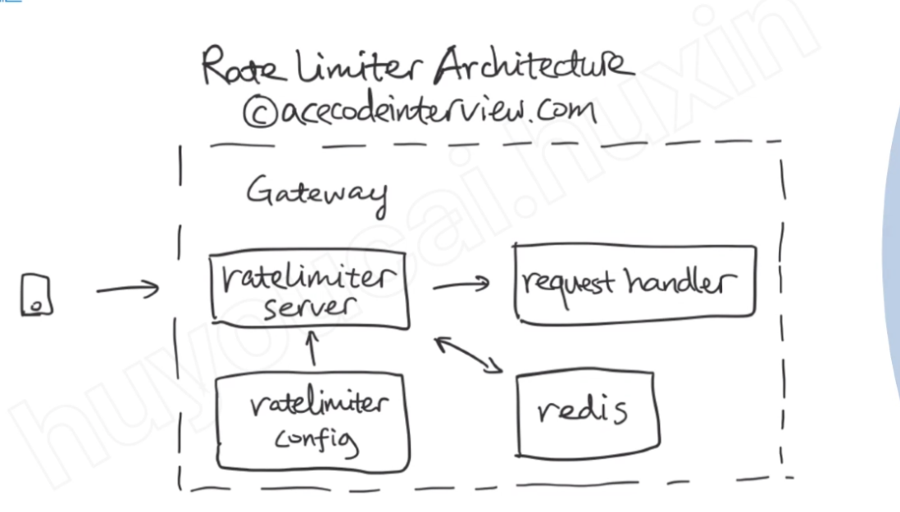
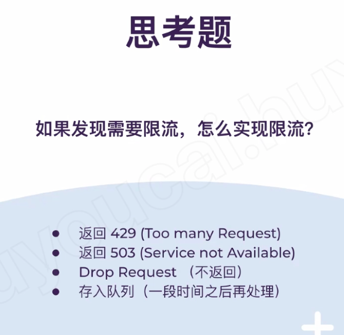
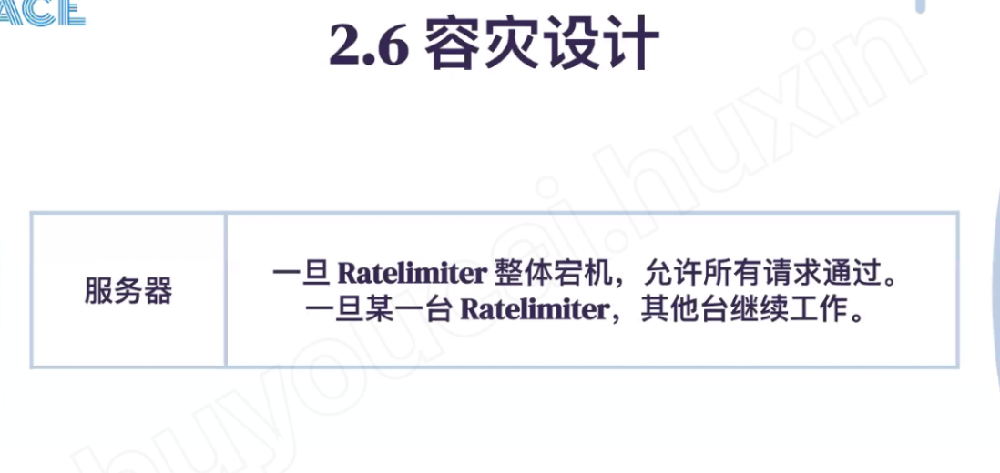

# Rate Limiter 3 -ACE

Created: 2021-04-18 11:18:32 -0600

Modified: 2021-05-23 16:28:11 -0600

---

**Rate Limiter**

**Function**

Limit the number of requests for each Customer or IP address within a time window, e.g., 15 requests per second for Customer A.

Limit how often each user call the API

**QPS**

or how many user use this system

or what`s limitation (Let's suppose we need a rate limiting of 500 requests per hour)

**High level design**

Once a new request arrives, Web Server first asks the Rate Limiter to decide if it will be served or rejected. If the request is not rejected, then it'll be passed to the API servers.

**Algorithm**

{width="5.0in" height="2.0208333333333335in"}

**[Fixed windows algorithm]{.mark}**

Fixed window counter algorithm divides the timeline into fixed-size windows and assign a counter to each window. Each request, based on its arriving time, is mapped to a window. If the counter in the window has reached the limit, requests falling in this window should be rejected.

![import import import public java . util. concurrent . ConcurrentHashMap; java . util. concurrent . ConcurrentMap; java . util. concurrent . atomic . Atomiclnteger; extends RateLimiter { FixedWindowCounter class key is sec, value is count threadsa e private final ConcurrentMap<Long, Atomiclnteger> windows = FixedWindowCounter(int maxRequestPerSec){ public super(maxRequestPerSec) ; Override boolean // remove the tast 3 digit convert to second new ConcurrentHashMap<>(); // epoch time start time as 1970 -1-1, how many mittsecond have passed since 1970-1-1 System . currentTimeMittis ( ) ; long windowsKey = // thread safe windows. put If Absent (windowsKey, new Atomiclnteger( 0)); initialValue: // atomic operation return windows. get (windowsKey) . // other windows. get (windowsKey) ; Atomiclnteger counter = windows. get (windowsKey) . incrementAndGet() <=maxRequestPerSec; boolean result = if( ! result) { counter. decrementAndGet(); return result; ](../../media/Rate-Limiter-Rate-Limiter-Rate-Limiter-3--ACE-image2.png){width="5.0in" height="4.635416666666667in"}

Problem:

This is a Fixed Window algorithm, as we're resetting the 'StartTime' at the end of every minute, which means it can potentially allow t[wice the number of requests per minute]{.mark}. Imagine if Kristie sends three requests at the last second of a minute, then she can immediately send three more requests at the very first second of the next minute, resulting in 6 requests in the span of two seconds.

{width="5.0in" height="2.5416666666666665in"}

<https://hechao.li/2018/06/25/Rate-Limiter-Part1/>

**Sliding windows (sliding log)** involves tracking a time stamped log for each consumer's request. These logs are usually stored in ~~a hash set or table~~ / queue that is sorted by time. Logs with timestamps beyond a threshold or boundary are discarded. When a new request comes in, we calculate the sum of logs to determine the request rate. If the request would exceed the threshold rate, then it is held.

{width="5.0in" height="3.8229166666666665in"}

**Sliding windows with count**

Sliding window counter is similar to fixed window counter

but it smooths out bursts of traffic by [adding a weighted count in previous window to the count in current window.]{.mark}

For example, suppose the limit is 10 per minute. There are 9 requests in window [00:00, 00:01) and 5 reqeuests in window [00:01, 00:02). For a requst arrives at 00:01:15, which is at 25% position of window [00:01, 00:02), we calculate the request count by the formula: 9 x (1 - 25%) + 5 = 11.75 > 10. Thus we reject this request. Even though both windows don't exceed the limit, the request is rejected because the weighted sum of previous and current window does exceed the limit.

{width="5.0in" height="2.4375in"}

![extends RateLimiter { public class SlidingWindow private final ConcurrentMap<Long, Atomiclnteger> windows = SlidingWindow(int maxRequestPerSec) { protected super(maxRequestPerSec) ; Override boolean allow() { System . currentTimeMittis() ; long cur Time = long windowLenInMs = 1000; new ConcurrentHashMap<>(); cur Time / windowLenInMs * windowLenInMs; long curWindowKey = windows. putlfAbsent(curWindowKey, new Atomiclnteger( initialValue: 0)); long preWindowKey = curWindowKey - windowLenInMs; Atomiclnteger preCount = windows. get(preWindowKey); if (preCount null) { return windows. get(curWindowKey) . incrementAndGet() <= maxRequestPerSec; //current time = : //current window kye = 00: 01:00 // pregeggtpt = 75% (cur Time - curWindowKey) / windowLenInMs; double preWeight (long) (preCount.get() * preWeight long count = + windows. get(curWindowKey) . incrementAndGet()) ; return count <= maxRequestPerSec; ](../../media/Rate-Limiter-Rate-Limiter-Rate-Limiter-3--ACE-image6.png){width="5.0in" height="4.447916666666667in"}

<https://preparingforcodinginterview.wordpress.com/2020/06/20/designing-an-api-rate-limiter/>

we track a counter for each fixed window. Next, we account for a weighted value of the previous window's request rate based on the current timestamp to smooth out bursts of traffic. For example, if the current window is 25% through, then we weight the previous window's count by 75%.

[Leaky bucket]{.mark}

*[Leaky bucket](https://en.wikipedia.org/wiki/Leaky_bucket) (closely related to [token bucket](https://en.wikipedia.org/wiki/Token_bucket)) is implement via a queue (or not) which you can think of as a bucket holding the requests. When a request is registered, it is appended to the end of the queue. The queue is a first in first out (**FIFO**) queue. If the queue is full, then additional requests are rejected*

*The request will be passed or leaked from the beginning of the queeu at certain rate*

The input rate can vary but the output rate remain constant

The advantage of this algorithm is saves bursty traffice into fixed rate traffice by averaging the data rate.

It's also easy to implement on a single server or load balancer, and is memory efficient for each user given the limited queue size.

However, a bursty of traffic can fill up the queue with old requests and starve (or reject) more recent requests from being processed. It also provides no guarantee that requests get processed in a fixed amount of time.

{width="5.0in" height="2.6875in"}

{width="5.0in" height="4.645833333333333in"}

{width="5.0in" height="3.5520833333333335in"}

the requests are processed at an approximately constant rate, which smooths out bursts of requests. Even though the incoming requests can be burst, the outgoing responses are always at a same rate.

{width="5.0in" height="5.229166666666667in"}

[Token bucket]{.mark}

{width="5.0in" height="4.03125in"}

![public class TokenBucket { private final long mxBucketSize; private final long refillRate; private double currentBucketSize; private long LastRefilITinest•p•, public TokenBucket(long maxBucketSize, long refillRate) { this. maxBucketSize nax8ucketSize; refillRate; currentBucketSize maxBucketSize; System. nanoTime(); public synchronized boolean allowqequest(int refit 10; if (currenteucketSize > tokens) { currentBucketSize tokens; return true; return false; private void refill() { long no. System. nanorine(); tokens) double tokensTOAdd • (now --- current8ucketSize Math.min(currentBucketSize • lostRefi11Tinestæp no'; • refiURate leg; tokensToAdd. Number Of tokens initially is equal to the maximum capacity Current time in nanoseconds Synchronized, as several threads may be calling the method concurrently First, refill bucket with tokens accumulated since the last call If bucket has enough tokens, call is allowed Request is throttled as bucket does not have enough tokens These many tokens accumulated since the last refill Number of tokens should never exceed maximum capacity ](../../media/Rate-Limiter-Rate-Limiter-Rate-Limiter-3--ACE-image12.png){width="5.0in" height="2.5416666666666665in"}

![public class extends RateLimiter TokenBucket3 private int token; // private final tong refittRate; // private doubte currentBucketSize; private long lastRefi11Timestamp; (int maxRequestPerSec){ public TokenBucket3 super(maxRequestPerSec) ; this . token = maxRequestPerSec; // this. refittRate = refittRate; // currentBucketSize = maxBucketSize; System . currentTimeMittis() ; lastRefi11Timestamp = Override public boolean synchronized (this) { refill() ; if (token 0) { return false; token--; return false; private void refill() System . currentTimeMittis() ; long now = (now-lastRefi11Timestamp) / 1000 ; double secSinceLastRefi11 = (int) secSinceLastRefi11*maxRequestPerSec; int count = if(count>@){ Math . min (token+count , maxRequestPerSec) ; token = lastRefi11Timestamp = now ](../../media/Rate-Limiter-Rate-Limiter-Rate-Limiter-3--ACE-image13.png){width="5.0in" height="5.145833333333333in"}

**The different between token bucket and Leakey bucket**

**If constant rate**

**Token bucket allows bursts to be sent faster rate after that constant rate**

**Leaky bucket sends the packet at the constant rate**

**(** <https://konghq.com/blog/how-to-design-a-scalable-rate-limiting-algorithm/>)

**Token bucket, the request processing rate is not capped, which means it only guarantees an average processing rate will not exceeds the maximum rate**

We recommend the **sliding window** approach because it gives the flexibility to scale rate limiting with good performance.

It also avoids the starvation problem of the leaky bucket and the bursting problems of fixed window implementations.

{width="5.0in" height="3.15625in"}

{width="5.0in" height="4.520833333333333in"}

<https://konghq.com/blog/how-to-design-a-scalable-rate-limiting-algorithm/>

[Each client has a bucket]{.mark}

1.  Sticky session

Services need to remember for each client, how many toke left in his bucket. We can store this information in the servers, each client only go to that specific servers.

We set up sticky sessions in your load balancer, so that each consumer gets sent to exactly one node or service. The disadvantages include a lack of fault tolerance and scaling problems when nodes get overloaded.

Or we can user centralized store like redis : client id -> number of token in his bucket

Client id ->token count (and last refill timestamp)

Problem: race condition in high concurrency request

This issue happens when you use a naïve "get-then-set" approach, wherein you retrieve the current rate limit counter, increment it, and then push it back to the datastore. This model's problem is that additional requests can come through in the time, it may be read the old data or invalid an invalid (lower) counter value. This allows a consumer to send a very high rate of requests to bypass rate limiting controls.

One way to avoid this problem is to put a "**lock**" around the key in question, preventing any other processes from accessing or writing to the counter. A lock would quickly become a significant performance bottleneck and does not scale well,

A better approach is to use a "**set-then-get**" mindset, relying on atomic operators-- set then get is a atomic operation

**Near real time check**

The increased[latency](https://konghq.com/blog/observability-kubernetes-kong/)is another disadvantage of using a centralized data store when checking the rate limit counters.

Unfortunately, even checking a fast data store like Redis would result in milliseconds of additional latency for every request.

Make checks locally**in memory**to make these rate limit determinations with minimal latency. To make local checks, relax the rate check conditions and use an [eventually consistent model.]{.mark}

For example, each node can create a data sync cycle that will synchronize with the centralized data store. Each node periodically pushes a counter increment for each consumer and window to the datastore. These pushes atomically update the values. The node can then retrieve the updated values to update its in-memory version. This cycle of converge → diverge → reconverge among nodes in the cluster is eventually consistent.

~~The periodic rate at which nodes converge should be configurable. Shorter sync intervals will result in less divergence of data points when spreading traffic across multiple nodes in the cluster (e.g., when sitting behind a round robin balancer). Whereas longer sync intervals put less read/write pressure on the datastore and less overhead on each node to fetch new synced values.~~

{width="5.0in" height="4.395833333333333in"}

{width="5.0in" height="2.84375in"}

1.  Request go to rate limiter server
2.  Rate limiter server check the configuration file or service to find out the limitation of the request per minute or per second

3.  The check the redis find out how many token this client left

4.  The decide pass or reject this request

{width="5.0in" height="4.864583333333333in"}

{width="5.0in" height="2.3645833333333335in"}

{width="3.0520833333333335in" height="0.5520833333333334in"}

Send the packet 200 to network

