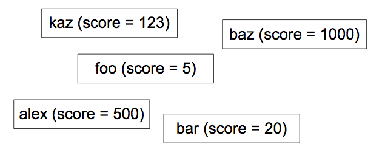
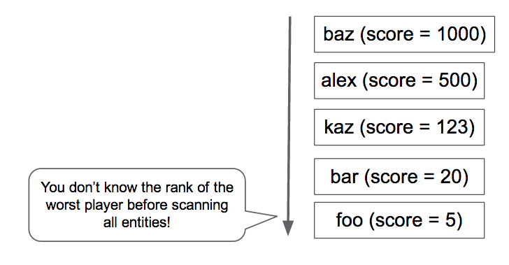
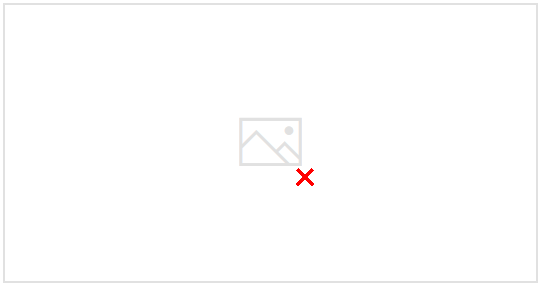
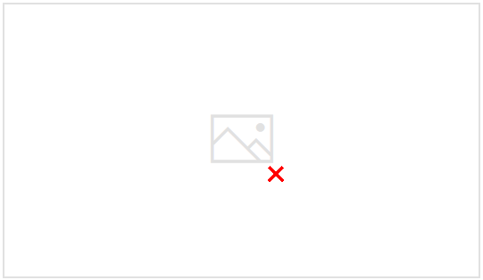

# Fast and Reliable Ranking in Google Datastore

---

Clipped from : <https://cloud.google.com/datastore/docs/articles/fast-and-reliable-ranking-in-datastore>

**Ranking: A simple and yet very hard problem**

Tomoaki Suzuki (Figure 1), an App Engine lead engineer at [Applibot](http://www.applibot.co.jp/en), has been trying to solve the very common, yet very difficult problem faced by every large gaming service: **Ranking**.

Figure 1: Tomoaki Suzuki, App Engine lead engineer at Applibot, Inc.

[Applibot](http://www.applibot.co.jp/en) is one of the major social application providers in Japan. The uniqueness of the company is their extensive knowledge and experience in building super-scalable social game services on [Google App Engine](https://cloud.google.com/appengine), the Platform as a Service (PaaS) offering from Google. Leveraging the power of the platform, Applibot has been quite successful in capturing business opportunities in the social game market, not only in Japan, but also in the United States. Applibot can certainly attest to its success. Legend of the Cryptids (Figure 2), one of their largest titles, hit #1 in the Apple AppStore North America gaming category in Oct 2012. The Legend series recorded 4.7 million downloads. Another title, Gang Road, hit #1 on the AppStore Japan total sales ranking in Dec 2012.

Figure 2: Legend of the Criptids, #1 ranked game in the Apple AppStore in Oct 2012.

These titles were able to scale smoothly and handle the massively growing traffic. Applibot did not have to struggle to build complex clusters of virtual servers or sharded databases. They harnessed the power of App Engine and efficiently achieved scalability and availability.

However, up-to-date player ranking is not an easy problem to solve, not for Tomoaki, and probably not for any developer, especially at this scale. The requirements are simple:

- Your game has hundreds of thousands (or more!) players.
- Whenever a player fights enemies (or performs other activities), their score changes.
- You want to show the latest ranking for the player on a web portal page.

**How do you calculate a rank?**

Figure 3: Each player has a score. How do you calculate their rank?

Getting a rank is easy, if it's not expected to also be scalable and fast. For example, you could execute the following query:

SELECT count(key) FROM Players WHERE Score > YourScore

This query counts all the players who have a higher score than yours (Figure 4). But do you want to execute this query for every request from the portal page? How long would it take when you have a million players?

Tomoaki initially implemented this approach, but it took a few seconds to get each response. This was too slow, too expensive, and performed progressively worse as scale increased.

Figure 4: The easiest way: Scan all players.

Next, [Tomoaki tried to maintain ranking data in Memcache. This was fast, but not reliable. Memcache entries could be evicted at any time, and sometimes the Memcache service itself was not be available]{.mark}. [With a ranking service that depended solely on in-memory-key-values, it was difficult to maintain consistency and availability.]{.mark}

As a temporary workaround, Tomoaki decided to degrade the service level. Rather than calculating the rank for every request, he set up a scheduled task that scanned and updated the rank of every player once an hour. In this way, requests from the portal page could get the player rank instantly, but it might be up to one hour old.

Ultimately, Tomoaki was looking for a persistent, transactional, fast, and scalable ranking implementation that could accept 300 score update requests per second and get a rank for each player in hundreds of milliseconds. To find a solution, Tomoaki turned to Kaz Sato, a Solutions Architect (SA) as well as a Technical Account Manager (TAM) in the Google Cloud Platform team and assigned to Applibot under a [premium-level support contract](https://cloud.google.com/support).

**An Express Way to Solve Problems**

Many large customers or partners of Google Cloud Platform, such as Applibot, subscribe to a premium-level support contract. With that support contract, in addition to 24x7 support from the Cloud Customer Support team and business support from the Cloud Sales team, Google assigns a Technical Account Manager (TAM) to each customer.

A TAM represents the customer to Google Engineering, which builds the actual cloud infrastructure. TAMs understand the customer's system and architecture in detail, and once they raise a critical case, they use their knowledge and network as a Google Engineering representative in the company to solve the issue. TAMs can escalate issues to Solutions Architects in the team or to Software Engineers in the Cloud Platform team. The premium-level support is the express lane to finding a solution with Google Cloud Platform.

Kaz, the TAM supporting Applibot, knew that ranking was a classic and yet hard-to-solve problem for any scalable distributed service. He started reviewing the known implementations for ranking on Google Cloud Datastore and other NoSQL datastores to find a solution that met Applibot's requirements.

**Looking for an O(log n) Algorithm**

The simple query solution requires scanning [all players with a higher score to count the rank of one player. The time complexity of this algorithm is O(n);]{.mark} that is, the time required for query execution increases proportionally to the number of players. In practice, this means that the algorithm is not scalable. Instead, we need an O(log n) or faster algorithm, where the time will only increase logarithmically as the number of players grows.

If you ever took a computer science course, you may remember that [tree algorithms](http://en.wikipedia.org/wiki/Tree_traversal), such as binary trees, red-black trees, or B-Trees, can perform at O(log n) time complexity for finding an element. Tree algorithms can also be used to calculate an aggregate value of a range of elements, such as count, max/min, and average by holding the aggregated values on each branch node. Using this technique, it is possible to implement a ranking algorithm with O(log n) performance.

Kaz found an open source implementation of a tree-based ranking algorithm for Datastore, written by a Google engineer: the [Google Code Jam Ranking Library](http://googleappengine.blogspot.jp/2009/01/google-code-jams-ranking-library.html).

This Python-based library exposes two methods:

- [SetScore to set the score of a player.]{.mark}
- [FindRank to get the rank of a given score.]{.mark}

[As player-score pairs are created and updated with the SetScore method, the Code Jam ranking library builds an N-ary tree^1^.]{.mark} For example, let's consider a tertiary tree that [can count the number of players with scores in the range from 0 to 80]{.mark} (Figure 5). The library stores the root node, which holds three numbers, as one entity. Each number corresponds to the number of players with scores in the sub-ranges 0 - 26, 27 - 53 and 54 - 80, respectively. [The root node has a child node for each range, holding in turn three values for players in the sub-ranges of the sub-range.]{.mark} The hierarchy needs four levels to store the number of players for 81 different score values.

![(0-26] (27-53) (54. 1] [27] [28] [291 • 17] [18-261 5] Rank(30) [27-35] [3 (36-38) (39-41] [0-26] [27-53] [54-811 [45-471 [48-501 [51-53) 1301 [33] [34] [351 - 22 ](../../media/Steam^JCollection-Leaderboard-Fast-and-Reliable-Ranking-in-Google-Datastore-image5.png)

Figure 5: Getting the rank of a score in a tertiary tree.

To determine the rank for a player who has a score of 30, the library only needs to read four entities ---the nodes circled by the dashed line in the diagram---to add up the number of players who have a score higher than 30. With 22 players to the "right" in four entities, the player rank is 23rd.

Likewise, a call to SetScore only needs to update four entities. Even if you have a large number of different scores, Datastore access will only increase at O(log n) and is not affected by the number of players. In practice, [the Code Jam ranking library uses 100 (instead of 3) as the default number of values per node,]{.mark} so only two (or three, if the score range is greater than 100,000) entities need to be accessed.

Kaz used the popular load testing tool [Apache JMeter](http://jmeter.apache.org/) to conduct a load test on the Code Jam ranking library and confirmed that the library responds fast. Both SetScore and FindRank can finish their jobs within hundreds of milliseconds using the N-ary tree algorithm that works at O(log n) time complexity.

**Concurrent Updates Limit Scalability**

However, during load testing, Kaz found a critical limitation with the Code Jam ranking library. [Its scalability in terms of update throughput was quite low.]{.mark} When he increased the load to three updates per second, the library started to return transaction retry errors. It was obvious that the library could not satisfy Applibot's requirement for [300 updates per second. It could handle only about 1% of that throughput.]{.mark}

Why is that? The reason is the cost of maintaining the consistency of the tree. In Datastore, you must use an [entity group](https://cloud.google.com/developers/articles/balancing-strong-and-eventual-consistency-with-google-cloud-datastore#h.3loc7ynqbw6i) to assure strong consistency when updating multiple entities in a transaction---see "[Balancing Strong and Eventual Consistency with Google Cloud Datastore](https://cloud.google.com/developers/articles/balancing-strong-and-eventual-consistency-with-google-cloud-datastore)". [The Code Jam ranking library uses a single entity group to hold the entire tree to ensure consistency of the counts in the tree elements]{.mark}.

However, an entity group in Datastore has a performance limitation. Datastore only supports about [one transaction per second](https://cloud.google.com/developers/articles/balancing-strong-and-eventual-consistency-with-google-cloud-datastore#h.ooaauy74mue8) on an entity group. Furthermore, if the same entity group is modified in concurrent transactions, they are likely to fail and must be retried. The Code Jam ranking library is strongly consistent, transactional, and fairly fast, but it does not support a high volume of concurrent updates.

**Datastore Team's Solution: Job Aggregation**

Kaz remembered that a software engineer in the Datastore team had mentioned a technique to obtain much higher throughput than one update per second on an entity group. [This could be achieved by aggregating a batch of updates into one transaction, rather than executing each update as a separate transaction]{.mark}. However, because the transaction includes a large number of updates, each transaction takes longer, increasing the possibility of conflict from concurrent transactions.

In response to Kaz's request, the Datastore team started discussing this issue and advised us to consider [using Job Aggregation,]{.mark} one of the design patterns used with Megastore.

[Megastore](http://research.google.com/pubs/pub36971.html) is the underlying storage layer of Datastore, and it manages the consistency and transactionality of entity groups. The one update per second limit originates from that layer. As Megastore is extensively used by various Google services, the engineers have been collecting and sharing best practices and design patterns within the company to build a scalable and consistent system with this NoSQL datastore.

[The basic idea of Job Aggregation is to use a single thread to process a batch of updates. Because there is only one thread and only one transaction open on the entity group, there are no transaction failures due to concurrent updates. You can find similar ideas in other storage products such as [VoltDb](https://docs.voltdb.com/UsingVoltDB/IntroHowVoltDBWorks.php) and [Redis](http://redis.io/topics/transactions).]{.mark}

However, there is a downside to the Job Aggregation pattern: [it uses just one thread to aggregate all the updates, and that imposes a limit to how fast it can send the updates to Datastore.]{.mark} Therefore, it was important to determine whether Job Aggregation could satisfy Applibot's throughput requirement of 300 updates per second.

**Job Aggregation by Pull Queue**

Based on the advice from the Datastore team, Kaz wrote Proof of Concept (PoC) code that combines the Job Aggregation pattern with the Code Jam ranking library. The PoC has the following components:

- [**Frontend**: Accepts SetScore requests from users and adds them as tasks to a pull queue.]{.mark}
- **Pull Queue**: Receives and holds the SetScore update requests from the frontend.
- **Backend**: Runs an infinite loop with a single thread that pulls the update requests from the queue and executes them with the Code Jam ranking library.

The PoC creates a [pull queue](https://cloud.google.com/appengine/docs/python/taskqueue/overview-pull), which is a kind of [Task Queue](https://cloud.google.com/appengine/docs/python/taskqueue) in App Engine that allows developers to implement one or multiple workers that consume the tasks added to the queue. [The backend instance has a single thread in an infinite loop that keeps pulling as many tasks as possible (up to 1000) from the queue.]{.mark} The thread passes each update request to the Code Jam ranking library, which executes them as a batch in a single transaction. The transaction may be open for a second or more, but because there is a single thread driving the library and Datastore, [there is no contention and no concurrent modification problem.]{.mark}

The backend instance is defined as a [module](https://cloud.google.com/appengine/docs/python/modules), a feature of App Engine that allows developers to define an Application Instance with various characteristics. In this PoC, the backend instance is defined as a manual scaling instance. Only one such instance is running at any given time.

Kaz load-tested the PoC by using JMeter. He confirmed that the PoC was able to process 200 SetScore requests per second, with batches of 500 to 600 updates per transaction. Job Aggregation works!

**Queue Sharding for Stable Performance**

But Kaz soon found another issue. As he continued running the test over several minutes, he saw the throughput of the pull queue fluctuate from time to time (Figure 6). Specifically when he kept adding requests to the queue with 200 tasks per second for several minutes, the queue suddenly stopped passing tasks to the backend, and the latency for each task increased dramatically.

Figure 6: Performance fluctuation of pull queue.

Kaz consulted with the Task Queue team to learn why this was happening. According to the Task Queue team, this is a known behavior for the current pull queue implementation which depends on [Bigtable](http://research.google.com/archive/bigtable.html) as its [persistence layer.]{.mark} When a Bigtable tablet grows too large, it is split into multiple tablets. While the tablet is being split, tasks are not delivered, and that creates the performance fluctuation when [the queue is receiving tasks at a high rate.]{.mark} The Task Queue team is working to improve these performance characteristics.

Michael Tang, a Solutions Architect, recommended a workaround [using Queue Sharding. Instead of using only one queue, he suggested to distribute the load over multiple queues.]{.mark} Each queue can be stored on a different Bigtable tablet server to minimize the effect of a tablet split and maintain a high task processing rate. While one queue is processing a split, other queues continue working, and sharding decreases the load on each queue, so splitting a tablet happens less often.

The enhanced backend instance loop executes the following algorithm:

1.  Lease SetScore tasks from 10 queues.
2.  Call the SetScores method with the tasks.
3.  Delete the leased tasks from the queues.

In step 1, [each queue supplies up to 1000 tasks, each task holding a player name and a score]{.mark}. [After aggregating all the player-score pairs into a dictionary, s]{.mark}tep 2 passes the [batch of updates to the SetScores method]{.mark} of the Code Jam ranking library, which opens a transaction to store them in Datastore. If there was no error executing the method, then step 3 deletes the leased tasks from the queues.

If there is an error or unexpected shutdown of the loop or the backend instance, the update tasks remain in the task queues, so that they can be processed when the instance restarts. In a production system, you might have another backend acting as a watchdog in standby mode, ready to take over if the first instance should fail.

**The Proposed Solution: Runs at 300 Updates per Second Sustained^2^**

Figure 7 shows the load testing result of the final PoC implementation with Queue Sharding. It effectively minimizes the performance fluctuations in the queues and can sustain 300 updates per second over several hours. Under usual load, each update is applied to Datastore within a few seconds of receiving the request.

Figure 7: Performance Graph of the solution.

This solution meets all of Applibot's original requirements:

- Scalable to handle tens of thousands of players.
- Persistent and consistent as all updates are executed in Datastore transactions.
- Fast enough to handle 300 updates per second.

With the load testing results and the PoC code, Kaz presented the solution to Tomoaki and other Applibot engineers. Tomoaki plans to incorporate the solution in their production system, expects to reduce the latency of updating the ranking info from **one hour to a few seconds**, and hopes to dramatically improve the user experience.

**Summary of Ranking Tree with Job Aggregation**

The proposed solution has several advantages and one disadvantage:

**Advantages:**

- Fast: FindRank call takes a few hundred milliseconds or less.
- Fast: SetScore just dispatches a task, which is processed by the backend in a few seconds.
- Strongly consistent and persisted in Datastore.
- Ranks are accurate.
- Scalable to any number of players.

**Disadvantage:**

- Throughput has a limitation (about 300 updates/sec with the current implementation).

As this solution uses the Job Aggregation pattern, [it relies on a single thread to aggregate all the updates. Additional]{.mark} work or complexity are necessary to achieve throughput higher than 300 updates/sec with the current CPU power of App Engine instances and Datastore performance.

**More Scalable Solution with Sharded Tree**

[If you require an even larger update rate, you may need to shard the ranking tree.]{.mark} You would create multiple implementations of the above system---[a set of queues each driving a backend module that updates its own ranking tree.]{.mark}

[In general, coordinating the trees is not required or expected. In the simplest case, each SetScore update is randomly dispatched to a queue.]{.mark} With three such trees, each with its own Datastore entity group and backend server, the expected update throughput would be three times greater. The tradeoff is that FindRank must query each ranking tree to obtain the rank of a score, and then sum the rank from each tree to find the actual rank, which will take a bit longer. The query time for FindRank can be substantially reduced by keeping entities in Memcache.

This is similar to the well-known approach of using [sharded counters](https://cloud.google.com/appengine/articles/sharding_counters): each counter is incremented independently, and the total sum is computed only when needed by the client.

For example, with three trees, FindRank(865) might find the three ranks 124, 183, and 156, indicating that each tree holds the respective number of scores higher than 865. The computed total number of scores higher than 865 is then 124 + 183 + 156 = 463.

This approach does not work for all types of distributed algorithms, but because ranking is fundamentally a commutative counting problem, it should work for large volume ranking problems.

**More Scalable Solutions with Approximate Approaches**

[If your application requires scalability more than accuracy of ranks,]{.mark} and can tolerate a certain level of inaccuracy or approximation, you could choose stochastic approaches such as:

These approximate approaches are all variants of one idea: How do you compress the storage for ranking information by allowing a certain degradation of the ranking accuracy?

**Buckets with Global Query** is an alternative solution proposed by the Datastore team and Alex Amies, a TAM. Alex implemented a PoC based on the Datastore team's idea and conducted extensive performance analysis. He proved that [Buckets with Global Query is a scalable ranking solution with minimal degradation on the ranking accuracy and could be suitable for applications that require higher throughput]{.mark} than the Code Jam ranking library. See the [Appendix](https://cloud.google.com/datastore/docs/articles/fast-and-reliable-ranking-in-datastore#appendix) for a detailed description and test results.

The **Lossy Counting Method** and **Frugal Streaming** are so-called [online algorithms](http://en.wikipedia.org/wiki/Online_algorithm) and [streaming algorithms](http://en.wikipedia.org/wiki/Streaming_algorithm) where you could use very small in-memory storage to calculate a stochastic estimation of top-rankers from a stream of player-score pairs. These algorithms would be suitable for applications that require very low latency and super-high bandwidth, [such as thousands of updates per second,]{.mark} with more limited accuracy and coverage of ranking results. [For example, if you want to have a real-time dashboard that shows the top 100 keywords typed into a social networking stream, these algorithms would help.]{.mark}

**Conclusion**

Ranking is a classic, yet hard-to-solve, problem if you require the algorithm to be scalable, consistent, and fast. In this article, we described how the Google TAMs worked closely with the customer and the Google Engineering teams to tackle the challenge and provide a solution that could reduce the ranking update latency from one hour to a few seconds. The design patterns discovered in the process---Job Aggregation and Queue Sharding---could also be applied to common problems in other Datastore-based system designs that require hundreds of updates per seconds with strong consistency.

**Notes**

1.  The Code Jam ranking library takes a parameter called "branching factor" that specifies how many scores each entity will hold. By default, the library [uses 100 as the parameter. In this case, scores ranging from 0 to 9999 will be stored on 100 entities as children of the root node. I]{.mark}f you need to handle a wider range of scores, you can change the branching factor to a higher value to optimize the number of entity accesses.
2.  Any performance figures described in this article are sampled values for reference and do not guarantee any absolute performance of App Engine, Datastore, or other services.

**Appendix: Buckets with Global Query Solution**

As mentioned in the [How to Get a Rank](https://cloud.google.com/datastore/docs/articles/fast-and-reliable-ranking-in-datastore#howtorank) section, it is expensive to query the database for every ranking request. This alternative approach periodically obtains the count of all the scores, computes the rank of selected scores, and provides those data points for use in computing ranks for particular players. [The total range of scores is partitioned into 'buckets'. Each bucket is characterized by a sub-range of scores and the number of players with scores in that range]{.mark}. [From that data, the rank of any score can be found to a close approximation. These buckets are similar to the top-level node in the ranking tree, but instead of descending to more detailed nodes]{.mark}, this algorithm just interpolates within a bucket.

The retrieval of rank by users from the frontend is decoupled from rank computation on buckets in the backend to minimize the time to find a rank. When a player's rank is requested, the appropriate bucket is found based on the player's score. [The bucket includes an upper rank boundary and a count of players within the bucket.]{.mark} Linear interpolation within buckets is used to estimate the rank of players within buckets. In our tests, we were able to get a player's rank in consistently less than 400 milliseconds for a full HTTP round trip. The cost of the FindRank method does not depend on the number of players in the population.

**Computing the rank for a given score**

Figure 8: Distribution of Scores in Buckets.

The count and upper-most rank (i.e. the highest rank possible in this bucket) are recorded for each bucket. For scores between the low and high score boundaries in a bucket, we use linear interpolation to estimate the rank. [For example, if the player has a score of **60**, then we look at the [50, 74] bucket, using the count (number of players/scores in the bucket) (42) and upper-most rank (5) to compute the player rank with this formula:]{.mark}

rank = 5 + (74 - **60**)*42/(74 - 50) = 30

**Computing the count and range for each bucket**

In the background, using a cron job or task queue, [the counts for each bucket are computed and saved by iterating over all buckets.]{.mark} We call this a *global query*, because it computes the parameters needed for estimating the ranks by examining the scores of all players. Sample Python code to do this by the scores in the [low_score, high_score] range for each bucket is shown below.

next_upper_rank = 1
for b in buckets:
count = GetCountInRange(b.low_score, b.high_score)
b.count = count
b.upper_rank = next_upper_rank
b.put()
next_upper_rank += count

The GetCountInRange() method counts each player with scores in the range covered by the bucket. Because Datastore maintains a sorted index on the player scores, this count can be computed efficiently.

When we need to find the rank of a particular player, we can use code as shown below.

b = GetBucketByScore(score)
rank = RankInBucket(b, score)
return rank + b.upper_rank - 1

The GetBucketByScore(score) method retrieves the bucket that contains the given score. The method RankInBucket() performs an estimate of rank within the bucket. The player's rank is the sum of the upper-most rank of the bucket, and the rank within the specific bucket that brackets the player's score. [We need to subtract 1 from the result because the upper-most rank of the top bucket will be 1]{.mark}, [and the rank of the top player within a specific bucket will also be 1.]{.mark}

[The buckets are stored to both Datastore and Memcache. To compute the rank, read buckets from Memcache (or Datastore, if Memcache is missing the data).]{.mark} In our own implementation of this algorithm, we used the Python NDB Client Library that uses Memcache to cache data stored in Datastore.

Because buckets (or other methods) are used to represent the data compactly, the ranks produced are not exact. Ranks within a bucket are approximated with linear interpolation. Other, more accurate, interpolation methods could be used for better approximation within the bucket, such as a regression formula.

**Cost**

[The cost of finding a rank and updating a player's score are both O(1);]{.mark} that is, independent of the number of players.

The cost of the global query job is O(Players) * frequency of cache update.

The cost of computing the bucket data in the backend job is also related to the number of buckets since a count query is performed for each bucket. The *count* query is optimized to use a keys-only query, but even so, the full key list must be retrieved.

**Pros**

This method is very fast for both updating a player's score as well as finding the rank of a score. Even though the results are based on a background job, if a player's score changes, then the rank will immediately show a change in the appropriate direction. This is because of the interpolation used within the bucket.

Since the computation of a bucket's upper-most rank is done in the background with a scheduled job, the player's scores can be updated without needing to keep bucket data synchronized. So, the throughput of updating players scores is not limited by this approach.

**Cons**

The time to count all the players' scores, compute the global ranks, and update the buckets, needs to be considered. In our tests, with a population of ten million players, the time was 8 minutes and 34 seconds for our test system on App Engine. This is faster than the hour(s) it would take to compute the rank of each player, but the trade-off is the approximation of scores within each bucket. In contrast, the tree algorithm computes the 'bucket ranges' (the top node of the tree) incrementally every few seconds, but has greater implementation complexity and limited throughput.

In all cases, the time for FindRank also depends on rapid retrieval of data (bucket or tree nodes) from Memcache. If the data is evicted from Memcache, then it must be re-fetched from Datastore and re-cached for subsequent FindRank requests.

**Accuracy**

The accuracy of the bucket method depends on how many buckets there are, the rank of the player, and the distribution of the scores. Figure 9 shows results from our study of the accuracy of the rank estimates with different numbers of buckets.

Figure 9: Variation of Accuracy with number of buckets.

Tests were done for a population of 10,000 players with uniformly distributed scores in the range [0-9999]. The relative error is about 1% even for just 5 buckets.

The accuracy drops off for highly ranked players, mostly because the law of large numbers does not apply when looking at only the top scores. In many cases, it may be advisable to use a more precise algorithm to maintain the ranks of the one or two thousand top-scoring players. The problem is considerably reduced, since there are fewer players to track, and the aggregate rate of updates is correspondingly lower.

In the test above, the use of uniformly distributed random numbers, where the cumulative distribution function is linear, favors the use of linear interpolation within the bucket, but the interpolation within buckets works well for any dense distribution of scores. Figure 10 shows the estimated and actual rank for an approximately normal distribution of scores.

Figure 10: Estimated rank with normal distribution

In this experiment, a population of 100 players was used to test accuracy with a small data set. Each score was generated by taking the average of 4 random numbers between 0 and 100, which roughly approximates a normal distribution of scores. The estimated rank was computed using the global query method with linear interpolation on 10 buckets. It can be seen that even for very small data sets and non-uniform distributions the results are very good.

