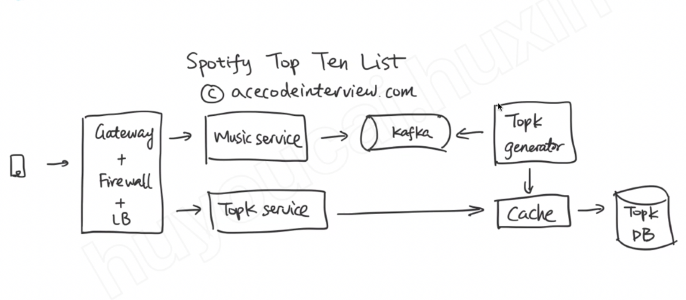
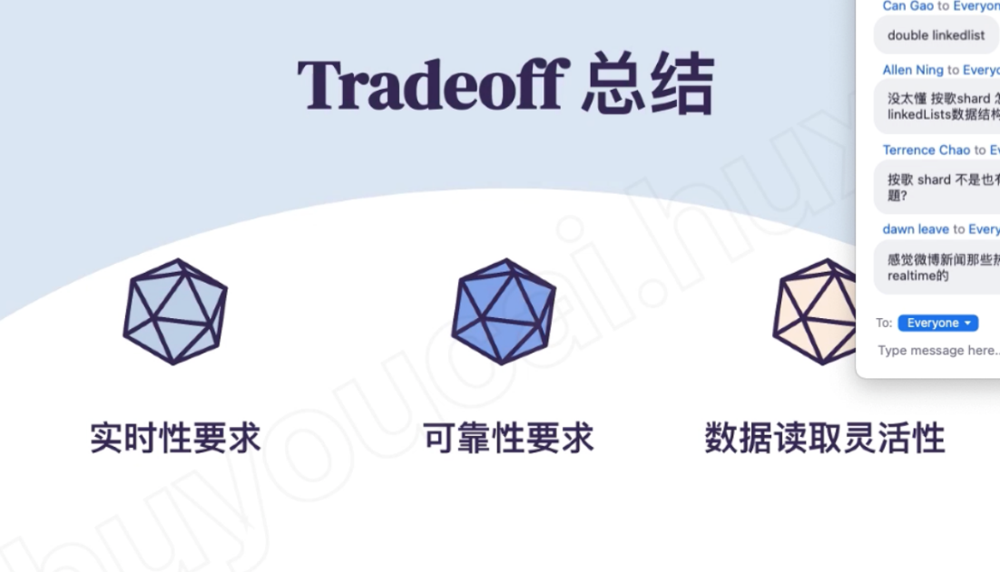

# Spotify top 10 

Created: 2021-04-15 10:35:54 -0600

Modified: 2021-05-25 16:42:06 -0600

---

Function requirement:

1.  Top 10 most popular song in last 7 days
2.  Real time update or maybe delay 1-2 minutes

Non function requirement

Support million of songs

High availability

does not require absolute accuracy

{width="5.0in" height="2.4722222222222223in"}

The system should have four part: ( all the data collection system)

1.  Data collection
2.  ~~Data transfer~~
3.  ~~Data store~~ top 10 calculation
4.  Data fetch or reading

{width="5.0in" height="2.2777777777777777in"}

1.  Data collection : when user play a music, at the same time, in the "music service ", system will [remeber]{.mark} this music has been played once at certain time,
2.  this play event should be sent to kafka queue

{width="5.0in" height="2.1875in"}

There two options 1. with Kafka, the benefit is we will store another event data [as a replica in Kafka]{.mark}, we can control the data transfer speed from music service to topk generator

But we will get like 100ms delay if we used Kafka

Or we can ask music service write all information (send request) to Top k generator service directly if we have the low latency requirement

[Top k generator will generate the top k information in cache]{.mark}

{width="5.0in" height="3.9722222222222223in"}

For top k cache we can use LFU cache -- least frequently used

LFU -- Hashmap +linkedlist, in the list each node is for the count ( all music played with 1000 times)

Hashmap is mapping with music id -> node

There two stream (in Kafka (two point in kafka) or additional database) to update the counter system

1.  New song just played.
2.  Old song player from 7 days ago

Sharding by song id or song name

O(k) find the top 10

Way 2: hashmap + heap : cannot update the song is the song is out of the 7 days windows

Way 2 count -min sketch instead of hashmap

{width="5.0in" height="5.201388888888889in"}

{width="5.0in" height="3.201388888888889in"}

Mapreduce is good for the application latency > 1 hour

{width="5.0in" height="2.5347222222222223in"}

Tradeoff

1.  If need real time -- stream process vs mapreduce
2.  If need accuracy -- hashamap vs count-min sketch
3.  How to read the data -- mapreduce vs stream process

{width="5.0in" height="2.8680555555555554in"}

