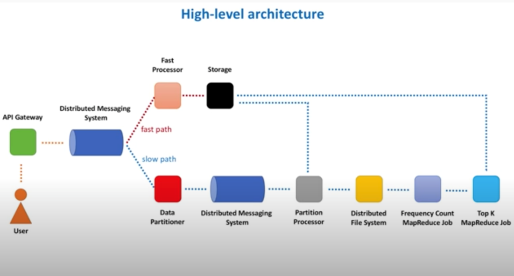
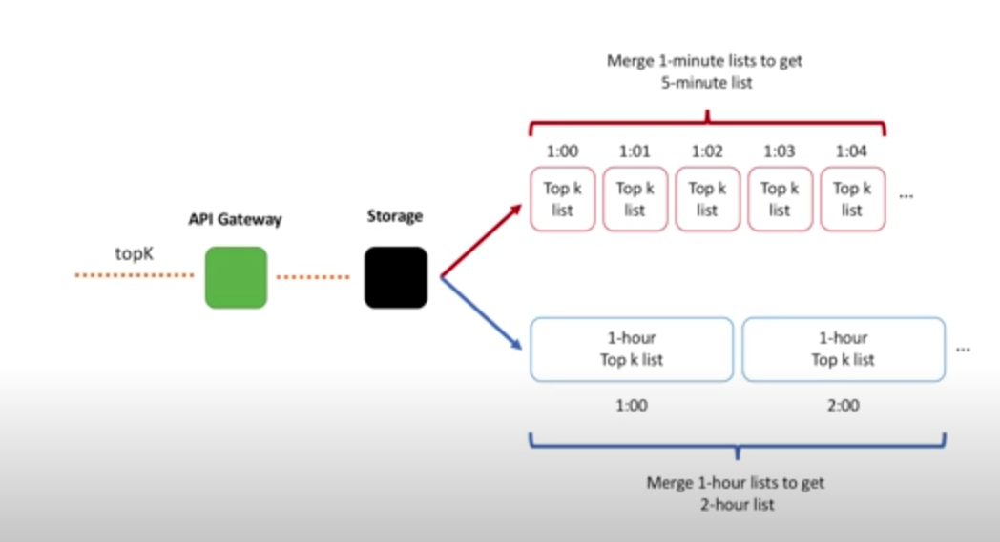

# Summary 

Created: 2021-01-15 01:08:35 -0600

Modified: 2021-02-04 17:55:18 -0600

---

{width="10.083333333333334in" height="5.520833333333333in"}

{width="10.083333333333334in" height="5.489583333333333in"}

{width="10.083333333333334in" height="5.510416666666667in"}

It is for Tyephead or Twitter search Data gathering

Or top K program

1.  First we use API gateway for log generation, each time user call API, it will be logged

We will use these logs for counting how many times each video was viewed.

We may allocate a buffer in memory on the API Gateway host, read every log entry and build a frequency count hash table. [This buffer should have a limited size, and when buffer is full, data is flushed and sent to downstream]{.mark}

Or completely skip all the aggregation on the API Gateway side and send information about every individual video view further down for processing.

I prefer the first way since [we cannot afford sending a single message to downstream due to the high scale ( write request qps), we want to decrease request rate at every next stage.]{.mark}

2.  Initially aggregated data is then sent to a distributed messaging system, like Apache Kafka.

[We will split our data processing pipeline into two parts: fast path and slow path.]{.mark}

3.  Fast path is for real time information, but the result is approximately

For example, by using data sampling we may not count every event, but only a [small fraction of all events]{.mark} or just count every 1000 event

Fast path service will do 3 things, count the event, flush to DB

and find the top k

We always keep two data structures: a count-min sketch and a heap in Fast Processor. We use count-min sketch to count, while heap stores the top-k list

[DB]{.mark}

Key: Video id#timestamp , value: count

Key : timestamp value: top 10

For Fast path we can use count -min sketch to calculate the top k

You can think of it as a two-dimensional array.

Width is usually in thousands, while height is small and represents a number of hash functions

count-min sketch that always have a predefined size and [never grow in size and]{.mark} because memory is no longer a problem, we do not need to partition the data.

Roughly, think of a count-min sketch as a replacement of the hash table, we can calculate how many products were purchase in this small window

we add the products count to the count-min sketch. -

Get key count from the count-min sketch. -

Check if the current key is in the heap.

If it presents in the heap, we update its count value there.

If it not present in the heap, we check if heap is already full. If not full, we add this key to the heap.

If heap is full, we check the minimal heap element and compare its value with the current key count value.

At this point we may remove the minimal element and add the current key (if current key count > minimal element value). [This way we only keep a predefined number of keys. This guarantees that we never exceed the memory, as both count-min sketch and the heap has a limited size.]{.mark}

then we send the data to the heap and find the top 10 then stored in the DB

Key : timestamp value: top 10

[Slow path]{.mark}

1.  For the slow path, first the data [partitioner servicer]{.mark} will receiver or subscriber the count event send information to a correspondent partition in another Kafka cluster. (partition by

??

2.  Other side of Kafka is the partition processor It will aggregate data in memory over the course of several minutes, [batch this information into files]{.mark} of the predefined size and send it to the distributed file system

Frequency Count MapReduce job reads all such 5-minute files and creates a final list per some time interval, let's say 1 hour.

Top K MapReduce job then uses this information to calculate a list of k heavy hitters for that hour.

Map reduce

Map job will generate the key value pair

Partitioner that all the values for each key are grouped together and make sure that all the values of a single key go to the same reducer. (shuffling phase),

[Then all the individual top k lists are sent to the single reducer that calculates the final top k list.]{.mark}

