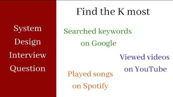
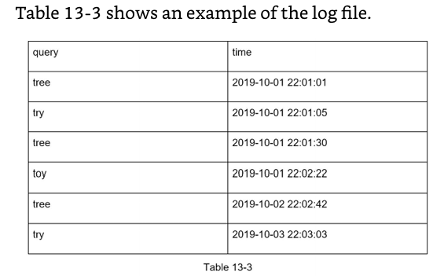
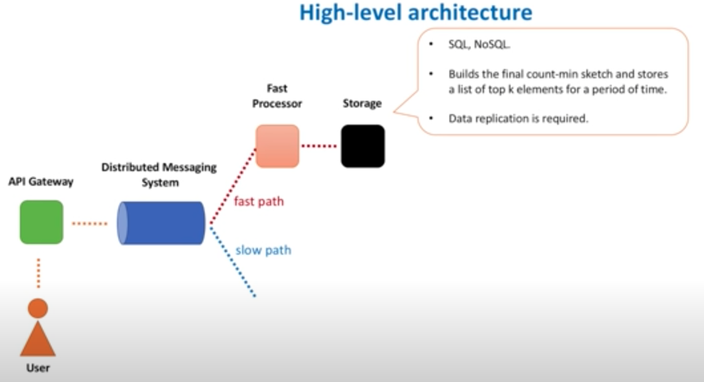
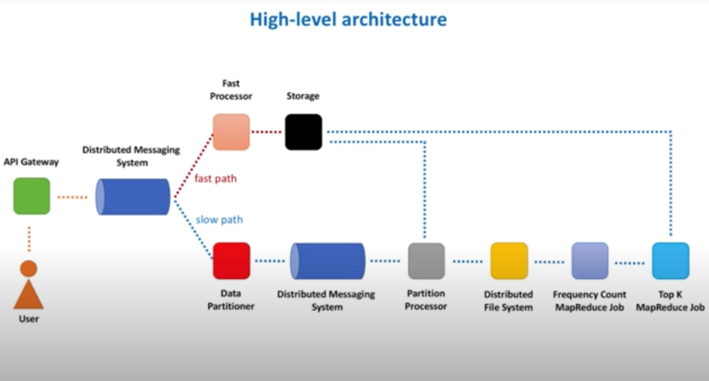
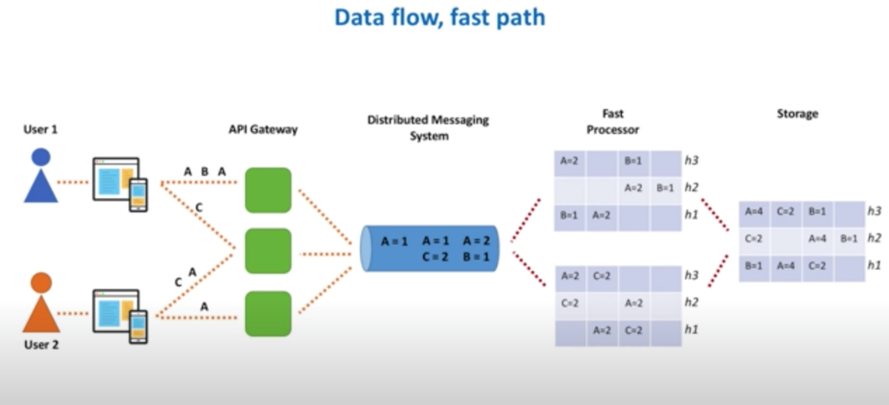
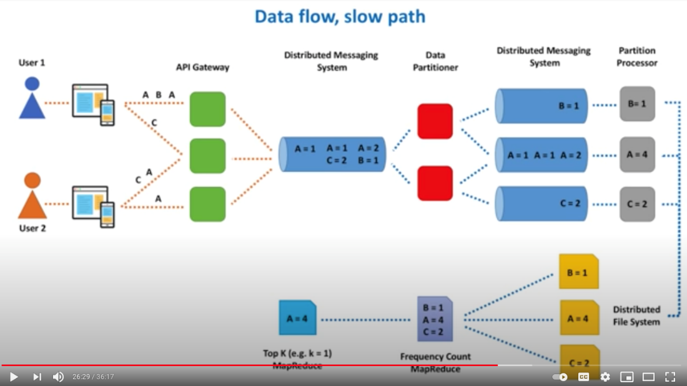
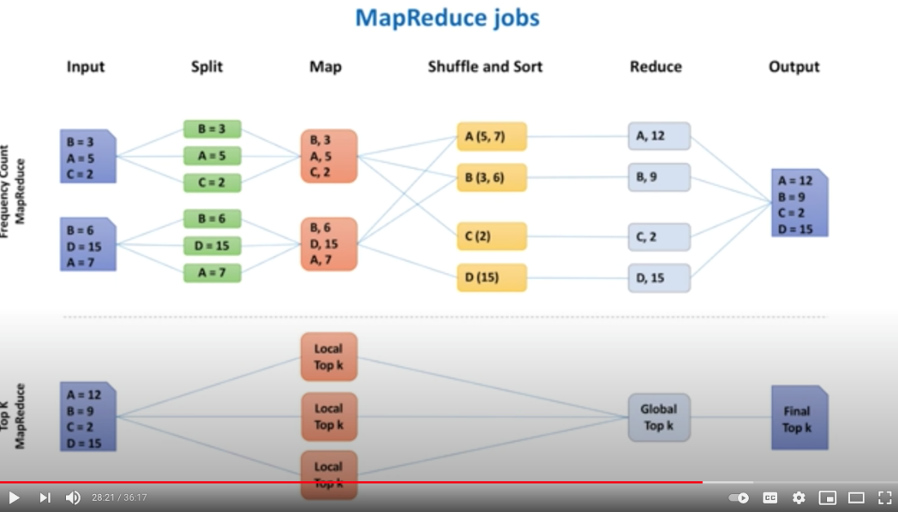
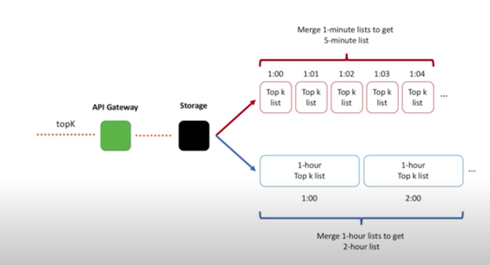

# Topk or how to collection the data

Created: 2020-12-17 16:38:54 -0600

Modified: 2021-02-04 18:42:00 -0600

---

<https://leetcode.com/discuss/interview-question/243604/Design-a-real-time-dashboard-showing-the-most-played-songs/240664>

<https://www.jiuzhang.com/qa/219/>

[System Design Interview - Top K Problem (Heavy Hitters)](https://www.youtube.com/watch?v=kx-XDoPjoHw)

{width="3.701388888888889in" height="2.076388888888889in"}

Hi.

Welcome to the system design interview channel.

Today we design a system for identifying the

top k heavy hitters (also known as the top k most frequent items).

Functional requirements are simple. We want our system to return a list of k most frequent items.

And because this list changes over time, we also need to provide a time interval, and more specifically, start and end time of that

interval.

Topk(k,startTime,endTime)

Remember, in our previous video we discussed

3 non-functional requirements we should think

about while designing distributed systems.

Scalable:

So, we want to design a solution that can scale together with the data increase

High available

Make data available in case of hardware failures

or network partitions

fast, so that we can retrieve a list of heavy hitters in a

matter of tens of milliseconds.

Performance requirement should give you a

hint that the final top k list should be pre-calculated

and we should avoid heavy calculations while

calling the topK API.

Let's also add one more requirement, which

is [accuracy]{.mark}. Accurate result

[For example, by using data sampling we may not count every event, but only a small fraction of all events or just count every 1000 event .]{.mark}

Another solution that can produce accurate results.

Let's store all the data on disk and use batch processing framework to calculate a top k list. this is where MapReduce comes into play.

~~Every time we introduce data partitioning, we need to deal with data replication, so that copies of each partition are stored on multiple nodes. We need to think about rebalancing, when a~~

~~new node is added to the cluster or removed from it.~~

But results may not be 100% accurate. This data structure is called count-min sketch.

[Count-min sketch]{.mark} is really simple. You can think of it as a two-dimensional array. We define width of this array and its height.

[Width is usually in thousands, while height is small and represents a number of hash functions,]{.mark}

for example 5.

When new element comes, we calculate each hash function value and add 1 to the correspondent cell.

For example, video A comes, we calculate five hash functions based on video A identifier and put 1 to each of 5 cells. When another A comes we increment each cell value.

And repeat the same for one more A. Then B arrives and we add 1 to each of B cells.

Hash function H1 produced a collision and we incremented A's value as well.

Then C arrives. And produces collisions with both A and B.

Here is how we add data to the count-min sketch.

But how do we retrieve data?

Logic is simple, among all the cells for A we take the minimum value.

Because of collisions, some cells will contain overestimated values.

And by taking minimum we decrease a chance of overestimation.

And, hopefully, it makes total sense right now why we need several hash functions, and not a single function.

If it was just a single hash function (for example H1), meaning that our array had only a single row, value of A would be 5, instead

of 3. By using more functions, we decrease the error.

And I bet you wonder how we choose width and height parameters.

Count-min sketch is a very well-studied data structure.

There are formulas that help to calculate both parameters based on the accuracy we want to achieve and probability with which we reach the accuracy.

Roughly, think of a count-min sketch as a replacement of the hash table

We still need a heap to store a list of heavy hitters.

But we replace a hash table, that could grow big, with a [count-min sketch that always have a predefined size and never grow in size]{.mark},

even when data set size increases.

[High level architecture]{.mark}

Every time user clicks on a video, request goes through API Gateway,

API Gateway routes client requests to backend services.

For our use case, we are interested in one specific function of API Gateways, [log generation]{.mark}, when every call to API is logged.

We will use these logs for counting how many times each video was viewed.

{width="5.0in" height="3.1319444444444446in"}

~~We may implement a background process that~~

~~reads data from logs, does some initial aggregation, and sends this data for further processing.~~

1.  We may allocate a buffer in memory on the API Gateway host, read every log entry and build a frequency count hash table. [This buffer should have a limited size, and when buffer is full, data is flushed]{.mark}. If buffer is not full for a specified period of time, we can flush based on time.

2.  There are also other options, like aggregating data on the fly, without even writing to logs. Or completely skip all the aggregation on the API Gateway side and send information about every individual video view further down for processing.

7. Regarding the slow path, I am confused by the data partitioner. Can we remove the first Distribute Messaging system and the data partitioner? The API gateway will send messages directly to the 2nd Distribute Messaging system based on its partitions. For example, the API gateway will send all B message to partition 1, and all A messages to partition 2 and all C messages to partition 3. Why we need the first Distribute Messaging system and data partitioner? If we use Kalfa as Distribute Messaging system, we can just create a topic for a set of message types.

In case of a large scale (e.g. YouTube scale), API Gateway cluster will be processing a lot of requests. I assume these are thousands or even tens of thousands of CPU heavy machines. With the main goal of serving video content and doing as little of "other" things as possible. [On such machines we usually want to avoid any heavy aggregations or log]{.mark}ic. And the simplest thing we can do is to batch together each video view request. I mean not to do any aggregation at all. Create a single message that contains something like: {A = 1, B = 1, C = 1} and send it for further processing. In the option you mentioned we still need to aggregate on the API Gateway side. We cannot afford sending a single message to the second DMS per each video view request, due to a high scale. I mean we cannot have three messages like: {A = 1}, {B = 1}, {C = 1}. As mentioned in the video, [we want to decrease request rate at every next stage.]{.mark}

There are pros and cons for every option.

Last but not least, we better serialize data into a compact binary format. This way we save on network IO utilization if request rate is very high. And let CPU pay the price.

[Initially aggregated data is then sent to a distributed messaging system, like Apache Kafka.]{.mark} Internally Kafka splits messages across several partitions, where each partition can be placed on a separate machine in a cluster.

We will split our data processing pipeline into two parts: fast path and slow path.

On the fast path, we will calculate a list of k heavy hitters . And results will be available within seconds.

On the slow path, we will calculate a list of k heavy hitters precisely.

And results will be available within minutes or hours, depending on the data volume.

[Let's first look at the fast path, it is much shorter.]{.mark}

We have a service, let's call it fast processor, that creates count-min sketch for some short time interval and aggregates data. [And because memory is no longer a problem, we do not need to partition the data.]{.mark}

Any message from Kafka can be processed by any Fast Processor host.

Every time we keep data in memory, even for a short period of time, we need to think about data replication. Otherwise, we cannot claim high availability for a service, as data may be lost due to hardware failures.

Because count-min sketch already produces approximate results, meaning we lose data already in some way, it may be ok if we lose data in some rare cases when host dies.

As long as slow path does not lose data, we will have accurate results several hours later.

Absence of replication greatly simplifies the system.

A good trade-off to discuss with your interviewer.

[Every several seconds Fast Processor flushes data to the Storage.]{.mark}

Remember that count-min sketch has a [predefined size]{.mark}, it does not grow over time. Nothing stops us from aggregating for longer

than several seconds, we may wait for minutes. But this will delay final results. Another trade-off to discuss.

The Storage component is a service in front of a database.

And it stores the final top k list for some time interval, for example every 1 minute or 5 minutes.

8. I have a question regarding the fast path through, it seems like you store the aggregated count min sketch in the storage system, but is that enough to calculate the top k? I felt like we would need to have a list of the websites and maintain a size k heap somewhere to figure out the top k.

You are correct. [We always keep two data structures: a count-min sketch and a heap in Fast Processor. We use count-min sketch to count, while heap stores the top-k list]{.mark}. In Storage service we also may keep both or heap only. But heap is always present.

9. So in summary, we still need to store the keys...count-min sketch helps achieve savings by not having to maintain counts for keys individually...when one has to find the top k elements, one has to iterate thru every single key and use count-min sketch to find the top k elements...is this understanding accurate?

We need to store the keys, but only K of them (or a bit more). Not all. When every key comes, we do the following: - Add it to the count-min sketch. - Get key count from the count-min sketch. - Check if the current key is in the heap. If it presents in the heap, we update its count value there. If it not present in the heap, we check if heap is already full. If not full, we add this key to the heap. If heap is full, we check the minimal heap element and compare its value with the current key count value. At this point we may remove the minimal element and add the current key (if current key count > minimal element value). This way we only keep a predefined number of keys. This guarantees that we never exceed the memory, as both count-min sketch and the heap has a limited size.

{width="5.0in" height="2.7152777777777777in"}

~~Have you noticed how our data processing pipeline gradually decreases request rate?~~

~~Let me elaborate on this.~~

~~There may be millions of users clicking on videos in the current minute. All those requests end up on API Gateway hosts. This cluster may be big, it may contain thousands of hosts.~~

~~Then we pre-aggregate data on each host, may be just for several seconds. But it helps to decrease number of messages that go into Kafka.~~

~~Next is Fast Aggregator cluster. And it will be much smaller in size than API Gateway cluster. It aggregates data further. For another several seconds.~~

~~And when we arrive to the Storage, we only deal with a small fraction of requests that landed initially on API Gateway hosts.~~

~~This is an important concept when you deal with stream processing and data aggregation.~~

[Now, let's define components of the slow path.]{.mark}

On the slow path we also need to aggregate data, but we want to count everything precisely.

There are several options how to do this.

One option is to let MapReduce do the trick.

We dump all the data to the distributed file system, for example HDFS or object storage, for example S3.

And run two MapReduce jobs, one job to calculate frequency counts and another job to calculate the actual top k list. Data is then stored in the Storage service.

~~Count-min sketch is great, it helped us to create a very simple and cost-effective architecture. But results produced by our fast path are~~

~~approximate.~~

~~MapReduce jobs we introduced on the slow path will help to produce accurate results. But this data processing path is indeed slow.~~

[I wish we could have something faster than MapReduce jobs.]{.mark}

[It may be slower than count-min sketch solution, but still accurate.]{.mark}

Let's [Data Partitioner read batches of events and parse them into individual events.]{.mark} Partitioner will take each video identifier and [send information to a correspondent partition in another Kafka cluster.]{.mark}

And as we mentioned before, every time we partition data, we need to think about possibility of hot partitions. And our partitioner service should take care of it.

Now, each partition in Kafka or shard in Kinesis, depending on what we use, stores a subset of data. Both Kafka and Kinesis will take care of data replication.

And we need a component that will read data from each partition and aggregate it further. Let's call it a [Partition Processor.]{.mark} It will aggregate data in memory over the [course of several minutes,]{.mark} batch this information into files of the predefined size and send it to the [distributed file system]{.mark}, where it will be further processed by MapReduce jobs.

Partition Processor may also send aggregated information to the Storage service.

{width="5.0in" height="2.6944444444444446in"}

~~Ideally, we should have a single data processing path. I just wanted to show you that depending on the requirements and more specifically how soon top k heavy hitters should be identified, we may choose a path that suits us the best.~~

[For example, if we can tolerate approximate results, forget about the slow path and its components. Fast path is simple and should be cheap to build.]{.mark}

If accuracy is important and results should be calculated in a matter of minutes, [we need to partition the data and aggregate in memory]{.mark}.

And if time is not an issue ,but we still need accurate results and data set is big, Hadoop MapReduce should be our choice.

[Example]{.mark}

We will start with the fast path. Users click on videos and each view video request is sent to one of the API Gateway hosts.

Let's say user 1 opened videos A, B and C. While User 2 opened videos A and C. Video A was opened multiple times by both users.

Each request landed on one of the API Gateway hosts and information about this was captured in log files.

Information about views is then aggregated on the host and sent to the Distributed Messaging System. And when I say aggregated I mean we just build a hash table on each host.

For each video we count how many times it was viewed in the [last several seconds.]{.mark} And remember that this hash table is relatively small. Whenever size of the hash table reaches some limit or specified time elapses, we send data out and free the memory for the next hash table.

So, the first API Gateway host will send out information about videos A and B. The second host, information about videos A and C. And

the third host, information about video A.

The first Fast Processor host will pick up and process the first message. And this is how count-min sketch will look like. The second Fast Processor host will pick up messages 2 and 3 and add information to its own count-min sketch.

And after aggregating information for several seconds, each Fast Processor host sends count-min sketch information to some Storage host, where we build a single count-min sketch.

Merging several count-min sketches together is as simple as summing up values in corresponding cells.

{width="5.0in" height="2.2777777777777777in"}

[Now, let's take a look at the slow path.]{.mark}

We have Data Partitioner, a component that reads each message and sends information about each video to its own partition.

~~For example, the first message is scattered around partitions 1 and 2. The second message goes to partitions 2 and 3.The third message goes to the second partition.~~

[We have Partition Processors aggregate data for each partition.]{.mark} Each processor accumulates data in memory for [let's say 5 minutes]{.mark} and writes this data to files, which are stored in the Distributed File System.

Frequency Count MapReduce job reads all such 5-minute files and creates a final list per some time interval, [let's say 1 hour]{.mark}.

Top K MapReduce job then uses this information to calculate a list of k heavy hitters for that hour.

{width="5.0in" height="2.826388888888889in"}

[And let's take a bit closer look at MapReduce jobs.]{.mark}

In MapReduce data processing is split into phases. The input to a MapReduce job is a set of files split into independent chunks ,in order to be processed by the map tasks in a parallel manner.

First, the record reader parses the data into records and passes the data to the mapper, in the form of a key/value pair.

In the mapper, each key/value pair from the record reader is transformed into zero or more new key/value pairs, called the intermediate pairs.

In the next phase, the partitioner takes the intermediate key/value pairs from the mapper and assigns the partition.

[Partitioning specifies that all the values for each key are grouped together and make sure that all the values of a single key go to the same reducer.]{.mark}

The partitioned data is written to the local disk for each mapper.

[( shuffling and sort take place]{.mark}

[Shuffle and sort is organize the those sort of records in a sort order and]{.mark}

[move those record from the mapper to reducer )]{.mark}

During the [shuffling phase]{.mark}, Hadoop MapReduce takes the output files produced by partition ears and downloads them to the reducer machine, via HTTP. And the purpose of the sort is to group keys together.

~~This way reducer task can easily iterate over values.~~

Reducer ~~then takes each key and iterates over all of the values associated with that key.~~In our case we just sum up all the values for the key.

And the output of the reduce task is written to the file system.

The Top K MapReduce job takes this data, splits it into chunks and sends each chunk to a mapper that calculates local top k list[. Then all the individual top k lists are sent to the single reducer that calculates the final top k list.]{.mark}

As you may see, the Top K MapReduce is based on exactly the same idea we discussed before: partition the data, find top k list for each

partition and merge individual lists into the one final list.

{width="5.0in" height="2.8541666666666665in"}

[Data retrieval]{.mark}

[If you remember, it was our functional requirement]{.mark}

[to retrieve a list of k heavy hitters for a specified time interval.]{.mark}

Here is what we should do.

First of all API Gateway should expose topK operation.

API Gateway will route data retrieval calls to the Storage service.

And the Storage service just retrieves the data from its underlying database.

Let's say our fast path creates approximate top k list for every 1-minute interval.

And our slow path creates precise top k list for every 1-hour interval, 24 lists total for a day.

When user asks for the top k list for the last 5 minutes, we just merge together 5, 1 minute lists. And get the final list, which is also approximate.

When user asks for the top k list for some 1-hour interval, for example from 1 pm till 2 pm, it is easy, we have precise lists calculated for each hour of the day.

But when user asks for the top k list for some 2-hour interval, for example from 1 pm till 3 pm, we cannot give back a precise list.

The best we can do is to merge together 2 1-hour lists.

And results may no longer be 100% correct.

{width="5.0in" height="2.7083333333333335in"}

[Let's see what else an interviewer may ask us about.]{.mark}

API Gateway does a lot of work. Authentication, SSL termination, rate limiting, request routing, response caching are among the few.

~~And API Gateway hosts indeed may not have enough capacity to run any data aggregation processes in the background.~~

But no matter how busy these hosts are, there will be a process that offloads log files from these hosts. Log files are usually sent to some storage or to a separate cluster where they can be further processed.

So, we can run our log parsing and aggregation process on that cluster. The rest of the data processing pipeline stays the same.

[There are several alternatives to count-min sketch algorithm.]{.mark}

There are counter-based algorithms, like Lossy Counting, Space Saving and Sticky Sampling. There are also modifications of the count-min sketch algorithm.

[As you may see, the value of k plays its role in several places.]{.mark}

On the fast path we merge top k lists together on data retrieval.

On the slow path, in Top K MapReduce job, all mappers send local top k lists to a single reducer. And what it tells us is that k cannot be arbitrary large. Several thousands are probably ok, but tens

of thousands may start causing performance degradation.

For example, during data retrieval when we merge such long lists on the fly. We should also remember about network bandwidth and storage space if we need to support larger values of k.

[What are the drawbacks of this architecture?]{.mark}

[The architecture we built with you is not a novel idea. It is also known as Lambda Architecture.]{.mark}

Lambda Architecture is an approach to building stream processing applications on top of MapReduce and stream processing engines.

We send events to a batch system and a stream processing system in parallel. And we stitch together the results from both systems at query time.

In 2011, Nathan Marz, the creator of Apache Storm wrote a famous article called "How to beat the CAP theorem" where he introduced

the idea of Lambda Architecture.

There are many benefits of Lambda Architecture, but there are drawbacks as well. In 2014, Jay Kreps, one of the authors of Apache Kafka wrote an article where he questioned Lambda Architecture.

And he mentioned complexity as one of the main drawbacks of this approach. And indeed, if you look at the fast path once again, you will see that it is very simple. But by introducing the slow path, we greatly increased overall complexity of the system.

Yes, we did this to have accurate results and to aggregate data over long time intervals. But these benefits come with a price. And this price is complexity.

As always, everything is a trade-off in the world of system design.

And I bet you are wondering right now, why on earth I want to make your life more complicated. [Couldn't we just use Kafka plus some stream processing framework, for example Apache Spark and solve this problem having a simpler architecture.]{.mark}

Yes and no.

Depending on the data volume we can solve the top k problem precisely and having a single data processing path.

And Kafka + Spark can do the trick. But I wanted to show you stuff under the hood.

At the end of the day Spark internally relies on the same ideas we discussed: data partitioning and in-memory aggregation. Spark internally partitions the data and calculates a top k list for each partition using a heap data structure.

And all these lists are merged together in the reduce operation.

We are almost done for today.

To those of you that have made it this far,

you deserve praise.

And let me share with you some important observation.

Today we solved a tough problem.

Problem that requires knowledge (remember

count-min sketch data structure, MapReduce

paradigm, principles of data aggregation).

But we did even more than this, we designed

a solution for a whole class of problems.

So, in your interview, when you are asked

explicitly about identifying heavy hitters,

you now know where to start, right?

But an interview question may be stated differently

and solution we built today still applies.

For example, you may be asked to design "what's

trending" service. Google trends, Twitter trends, Youtube trends,

etc.

In reality these services are more complicated

than just a list of heavy hitters, but a simpler version of such service may purely rely on our today's design.

We may compute a list of popular products

based on product page views or product purchases.

If asked about identifying the most actively traded stocks, this should also ring a bell in your head.

Basically, we have a stream of stock trades as an input.

And we need to find the top k stocks with the most number of trades.

You may be asked to design a system that protects

from DDoS attack.

And if you think about this problem you will see that this is also a problem of identifying

heavy hitters, where heavy hitter is some IP address that floods the victim service with superfluous requests.

We just need to find the top k IP addresses that generates the most number of requests.

And block those IPs.

.

