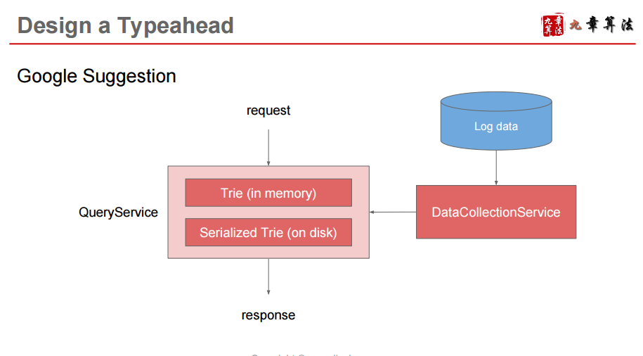
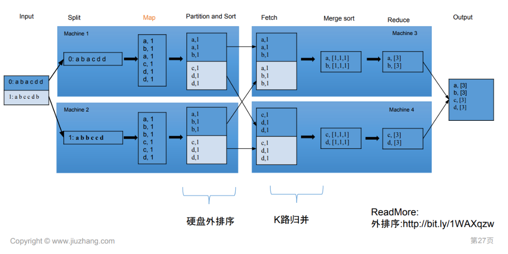

# Service 

Created: 2017-10-12 07:30:46 -0600

Modified: 2017-10-15 16:03:36 -0600

---

{width="5.0in" height="2.6527777777777777in"}

how the data collection service to update the trie

{width="5.0in" height="2.7569444444444446in"}

A trie is a tree-like data structure used to store word where each node stores a character of the word

For example, if we need to store 'cap, cat, caption, captain, capital' in the trie, it would look like:

{width="5.0in" height="5.375in"}

**How to find top 10 suggestion**

solution 1: could be to store the count of searches that terminated at each node. if users have searched about 'CAPTAIN' 100 times and 'CAPTION' 500 times, we can store this number with the last character of the phrase. So now if the user has typed 'CAP' we know the top most searched word under the prefix 'CAP' is 'CAPTION'. So given a prefix, we can traverse the sub-tree under it, to find the top suggestions.

problem: Since the tree is huge and traversing a sub-tree would take really long

solution 2:

we can store top suggestions with each node?

This can surely speed up our searches but will require a lot of extra storage.

We can optimize our storage by storing only references of the terminal nodes rather than storing the entire phrase.

To find the suggested term we've to traverse back using the parent reference from the terminal node. We will also need to store the frequency with each reference to keep track of top suggestions.

**How to update the trie?**

we have a datacollection service, we the new updates come in, we can log them and also track their frequencies.

Either we can log every query or do sampling and log every 1000th query. For example, if we don't want to show a term which is searched for less than 1000 times, it's safe to log every 1000th searched term.

We can have aMap reduce setup to process all the logging data periodically, say every hour. These MR jobs will calculate frequencies of all searched terms in the past hour.

{width="5.0in" height="2.5in"}

{width="5.0in" height="3.423611111111111in"}

We can then update our trie with this new data. We can take the current snapshot of the trie and update it with all the new terms and their frequencies. We should do this offline, as we don't want our read queries to be blocked by update trie requests. We can have two options:

1.  We can make a copy of the trie on each server to update it offline. Once done we can switch to start using it and discard the old one.
2.  Another option is we can have a master-slave configuration for each trie server. We can update slave while the master is serving traffic. Once the update is complete, we can make the slave our new master. We can later update our old master, which can then start serving traffic too.

**Updating the frequency**

Since we are storing frequencies of our typeahead suggestions with each node, we need to update them too.

We can update only difference in frequencies rather than recounting all search terms from scratch.

If we're keeping count of all the terms searched in last 10 days, we'll need to subtract the counts from the time period no longer included and add the counts for the new time period being included.

We can add and subtract frequencies based on[Exponential Moving Average (EMA)](https://en.wikipedia.org/wiki/Moving_average#Exponential_moving_average)of each term. In EMA, we give more weight to the latest data. It's also known as the exponentially weighted moving average.

for example, assume we count of all the term for last 10 days - t1 ,the weight of t1 will be 1/3 and the old data t2 in the node will be 2/3 so the total count will be t1 *1/3 + t2*2/3

After inserting a new term in the trie, we'll go to the terminal node of the phrase and increase its frequency. Since we're storing the top 10 queries in each node.

not just insert the new node, also need update the frequency of his parents node

if the current query's frequency is high enough to be a part of the top 10. If so, we insert this new term and remove the term with the lowest frequency.

**How can we remove a term from the trie?**Let's say we've to remove a term from the trie, because of some legal issue or hate or piracy etc. We can completely remove such terms from the trie when the regular update happens, meanwhile, we can add a filtering layer on each server, which will remove any such term before sending them to users.

**What could be different ranking criteria for suggestions?**In addition to a simple count, for terms ranking, we have to consider other factors too, e.g., freshness, user location, language, demographics, personal history etc.

