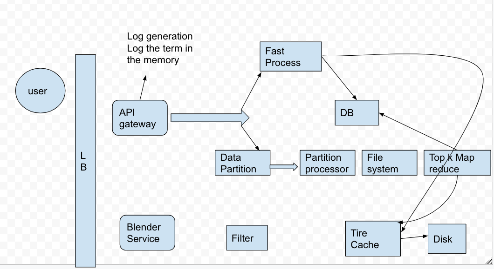

# Summary -2 

Created: 2021-01-16 00:47:01 -0600

Modified: 2021-04-24 11:28:25 -0600

---

{width="10.083333333333334in" height="5.541666666666667in"}

**[Function Requirement]{.mark}**

If user type something, system should suggest top 10 terms starting with base on user has typed.

[need ask the time frame for the top 10]{.mark}

top 10 is for 1 hours 1 day or one year

[Non-function requirement]{.mark}

Scalable

Highly available

Latency is impart for us, search typehead need compete with the typing spread

need to have low latency

How import the available

Very important. If search typeahead is not available, the site would still keep working. However, it will lead to a much degraded experience.

[Estimation]{.mark}

we assume there will be 500M active user and each user search 6 times and each search user need type 6 characters to get the result they want

**QPS: 500 * 6 * 6 /86400 =200k**

**Peak QPS 200k *2**

Assume 1 character = 1 bytes and assume 20% of the daily queries are new:

So the daily storage is 500M*6*6*20% = 1.2G

This means 0.4GB of new data is added to storage daily.

~~since we store the word in the tire data structure, the really storage should be less than this number~~

[High level Design]{.mark}

**The System can be divided into 2 part: Data collection, the system will** gathers user input queries and aggregates them in real-time or

•Query service: Given a search query or prefix, return 10 most frequently searched terms.

**Different with other solution, we can talk about the tire first**

A trie is a tree-like data structure used to store word . There is a root node - a is a empty string ;Each node has 26 children node -- if we assume the all the keyword is low case letter

and [each node stores a character of the word.]{.mark}

We also need store the frequency info in each node

[The problem is we need to traverse the entire tire to get the top k result]{.mark}

For example, if user type "tr" we first the prefix node "tr"

Then go through all its children node to get all valid children

Then sort the children to get top 10

[We also need store the top suggestion regarding each word in the node]{.mark}

We can store top k most popularity word in each node, for example the node b will all top k most popularity words start with b

The node "be" will store all top k most popularity words start with be..

Since 5 to 10 autocomplete suggestions are enough for users, k is a relatively small number.

The problem of this way is need a lot of space to store the words at every node.

**How to collect the data**

~~We have a data collection service, we the new updates come in, We can log them and also track their frequencies.~~

**~~to reduce the log file size~~**

~~if we don`t want to show a term which is search more the 1000.~~

~~We don`t need log every query. I can do sampling and log every 1000th query.~~

~~We can have a Map reduce setup to process all the logging data periodically, say every hour. These MR jobs will calculate frequencies of all searched terms in the past hour.~~

How to update the tire

**there are two solution** we don`t need store the frequency, we just need rebuilt the tire in another service offline as we don't want our read queries to be blocked by update trie requests.

we can have a master-slave configuration for each trie server. We can update slave while the master is serving traffic. Once the update is complete, we can make the slave our new master. We can later update our old master, which can then start serving traffic too.

the issue of this solution is wait the new service set up and we still need use the old data and may not 100 % represent the top 10 words in last week

**other solution is**: We will also need to store the frequency and update the frequency

We can update only difference in frequencies rather than recounting all search terms from scratch.

If we're keeping count of all the terms searched in last 10 days,

we'll need to [subtract the counts from the time period no longer included]{.mark} and add the counts for the new time period being included.

[for example, assume we count of all the term for last 10 days - t1 ,the weight of t1 will be 1/3 and the old data t2 in the node will be 2/3 ,so the total count will be t1 *1/3 + t2*2/3]{.mark}

After inserting a new term in the trie, we'll go to the terminal node of the phrase and increase its frequency. Since we're storing the top 10 words in each node.

the parents will store the top 10 hot words who prefix is like aaa....

[not just insert the new node, also need update the frequency of his parents]{.mark} node if the current query's frequency is high enough to be a part of the top 10. If so, we insert this new term and remove the term with the lowest frequency.

**How can we remove a term from the trie?** Let's say we've to remove a term from the trie, because of some legal issue or hate or piracy etc. We can completely remove such terms from the trie when the regular update happens, meanwhile, we can add a filtering layer on each server, which will remove any such term before sending them to users.

**How to store trie in a file so that we can rebuild our trie easily - this will be needed when a machine restarts?**

partition

**a. Range Based Partitioning:** What if we store our phrases in separate partitions based on their first letter. So we save all the terms starting with letter 'A' in one partition and those that start with letter 'B' into another partition and so on.

We can even combine certain less frequently occurring letters into one database partition.

[**Partition based on the hash of the term:** Each term will be passed to a hash function, which will generate a server number and we will store the term on that server.]{.mark}

This will make our term distribution random and minimizing hotspots.

To find typeahead suggestions for a term, we have to ask all servers and then aggregate the results. We have to use consistent hashing for fault tolerance and load distribution.

use this way, it is difficult store the top 10 word in each node, we need store a frequency (count of search)in the end of the node, for example, user search cat 100 times and caption 500 times, we can store this number with the last character of the phrase.

we have to ask all servers and then aggregate the results. We have to use consistent hashing for fault tolerance and load distribution.

