# Summary -ACE

---

**[Function Requirement]{.mark}**

If user type something, system should suggest top 10 terms starting with base on user has typed.

[need ask the time frame for the top 10]{.mark}

top 10 data should be updated every hour or every data or every year

[Non-function requirement]{.mark}

Scalable

Latency is impart for us, search typehead need compete with the typing spread

need to have low latency

Highly available

How import the available

Very important. If search typeahead is not available, the site would still keep working. However, it will lead to a much degraded experience.

The popularity should be update every hour

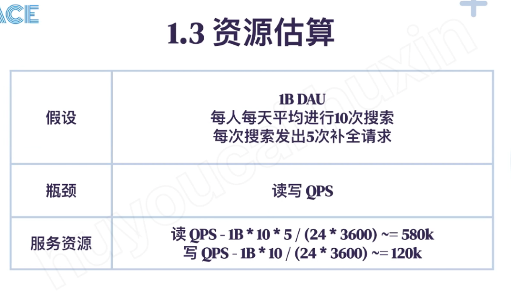

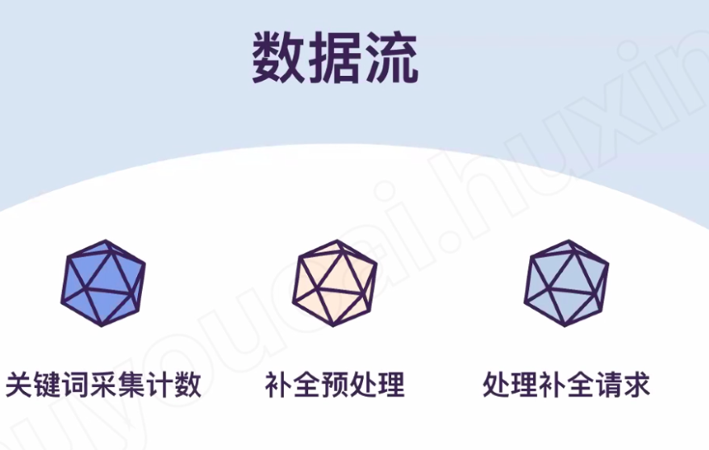

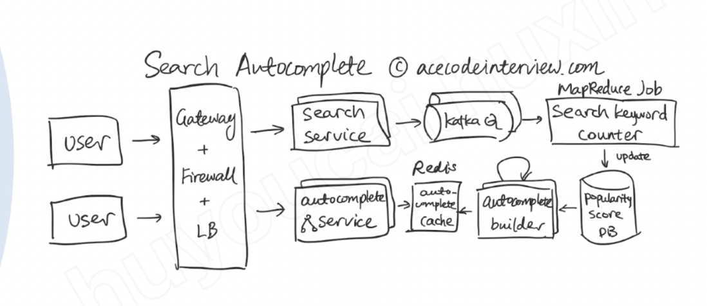

**The System can be divided into 2 part: Data collection, the system will** gathers user input queries and aggregates and calculate the top 10

Query service: Given a search query or prefix, return 10 most frequently searched terms.

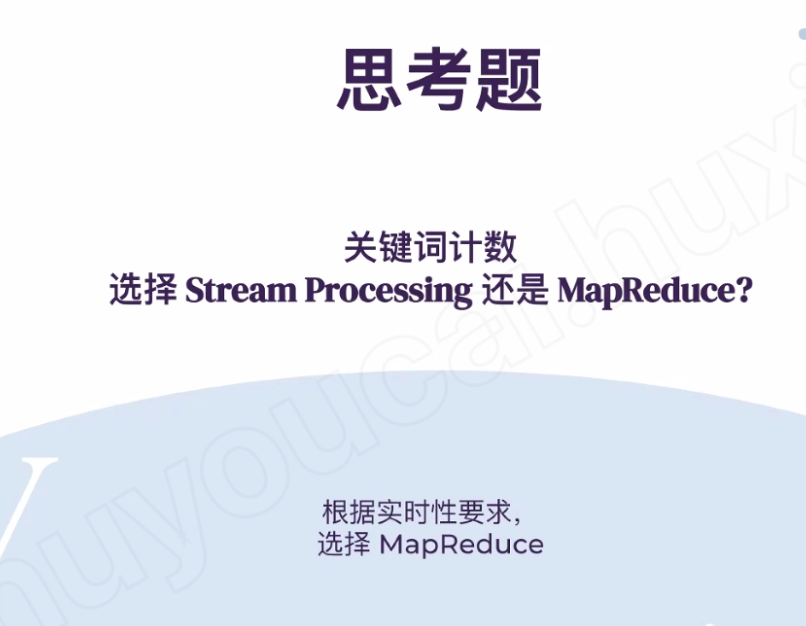

1.  [Data collection]{.mark}

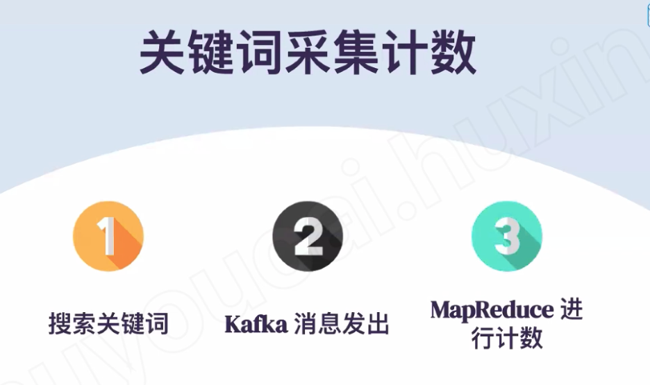

Kafka event : search key word and time stamp

System will store the [kafka event]{.mark} to the hive table -- data warehouse storage

May reduce job will run very hour to count those key word and update each word's popularity score in DB.

There are two ways to build each prefix top 10 words

1.  Use tire builder: we each leaf nodes's top 10 words and recursive from bottom to top
2.  Then we can dump the each node to generate a hash map key is each prefix keyword and value is to 10 words for this keywords---?

Finally MapReduce will store the calculation in the DB

Keyword/prefix word -> top10 ... A list of top 10 { word/prefix word , score }

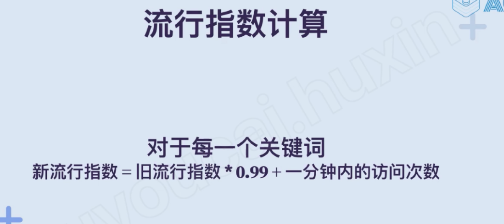

We just need to calculate within 1 minutes, how many this key word was searched then the new result = old result *0.99+ the number of search in 1 minutes

We can move all the history data to a history database

If we decided to change the 0.99 to 0.98 or 0.97 later, we can re-calculate the number base on the history data

3.  Auto complete

Trie solution -- we can build the trie from leaf to root, base on {word, score } table generated by MapReduce

![* some scores omitted for presentation purposes root c (car: 30, [cold, coin, cod, [car, cart J* car cart ca [cart] * : cart: 10, cat :901 cat cod cart. car) * co coi coin cat, col cold ](../../media/Steam^JCollection-Typehead-Summary--ACE-image8.png)

Each node has top 10 node for this prefix

[Hash table solution]{.mark}

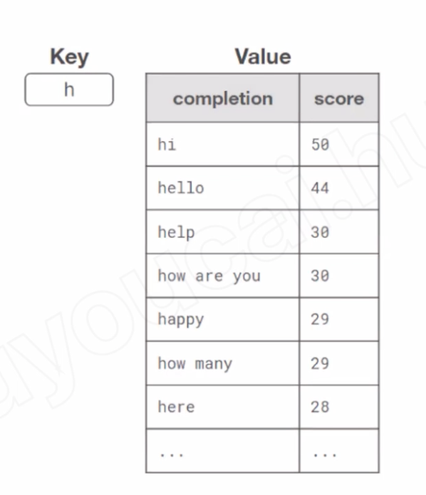

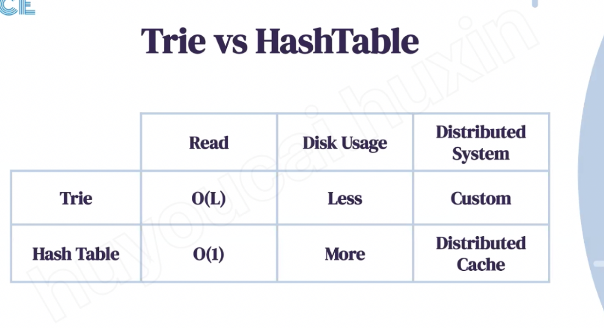

Trie solution Is not easy sharding, hash table has distributed cache solution

**How to store Trie in a file so that we can rebuild our trie easily - this will be needed when a machine restarts?**

**------------------------------------------------------------------**

**a. Range Based Partitioning:** What if we store our phrases in separate partitions based on their first letter. So we save all the terms starting with letter 'A' in one partition and those that start with letter 'B' into another partition and so on.

We can even combine certain less frequently occurring letters into one database partition.

[**Partition based on the hash of the term:** Each term will be passed to a hash function, which will generate a server number and we will store the term on that server.]{.mark}

[This will make our term distribution random and minimizing hotspots.]{.mark}

To find typeahead suggestions for a term, we have to ask all servers and then aggregate the results. We have to use consistent hashing for fault tolerance and load distribution.

For hot word--- we can user master slaver structure

[Prefetch]{.mark} --- Predict by service, assume user will key next time

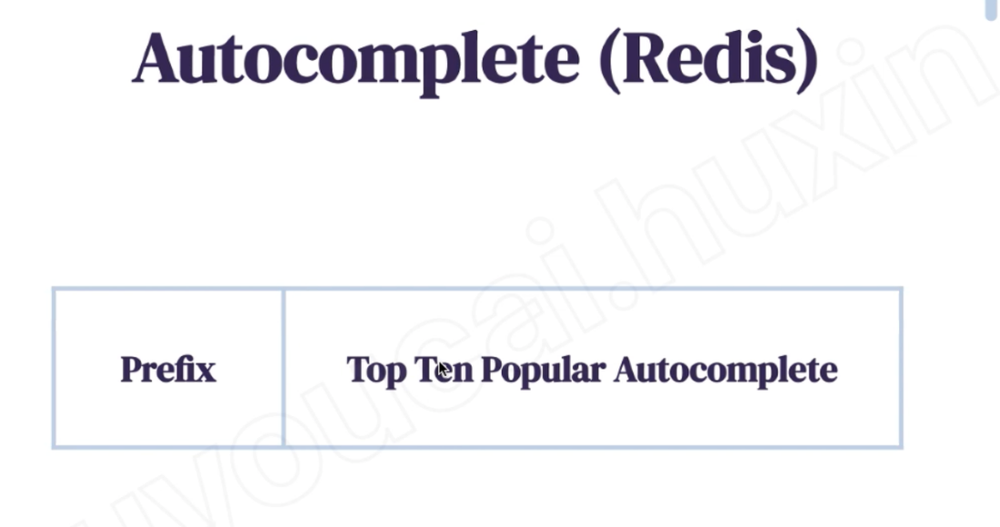

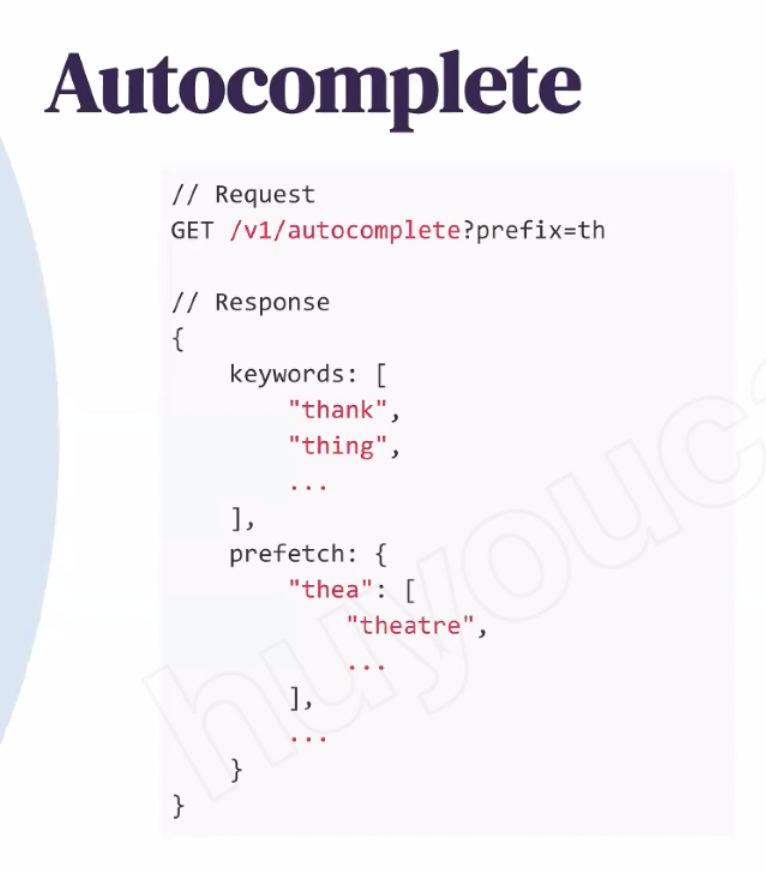

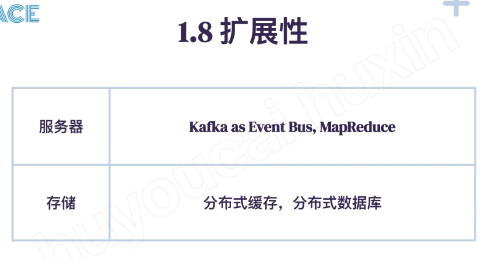

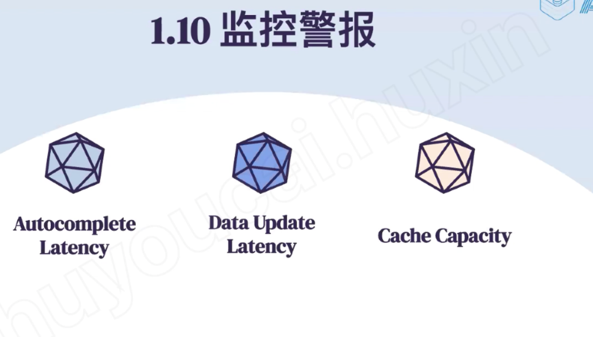

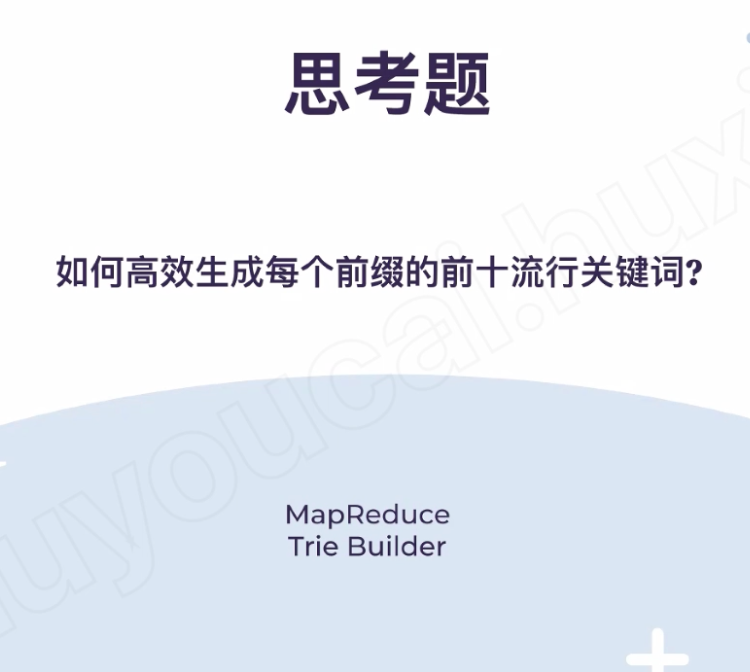

Data update latency

MapReduce job + trie builder

When last time data update

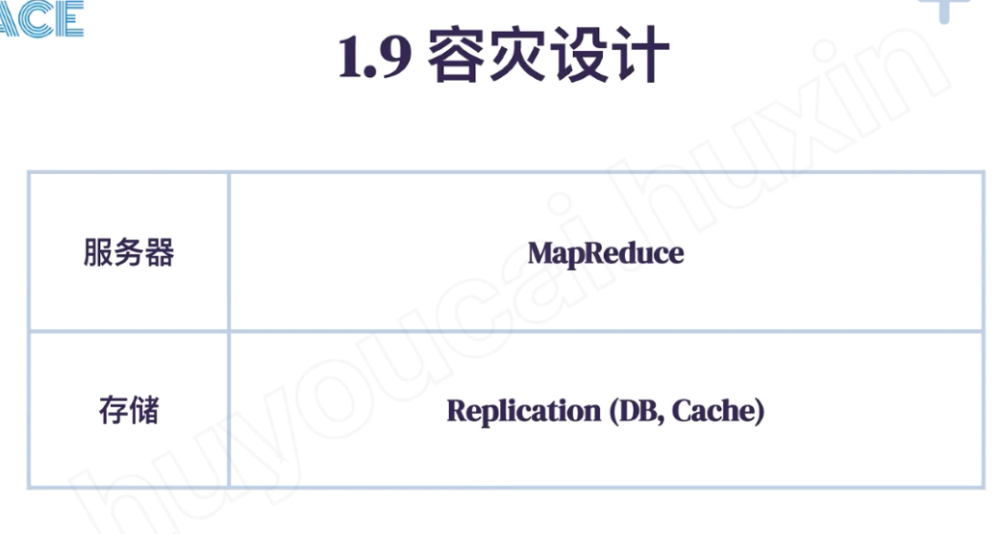

