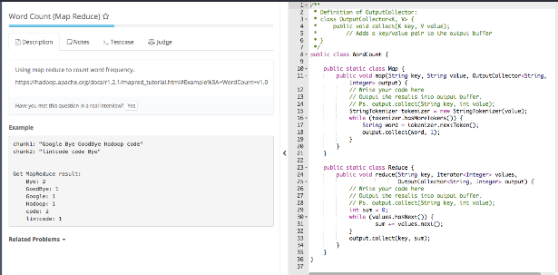
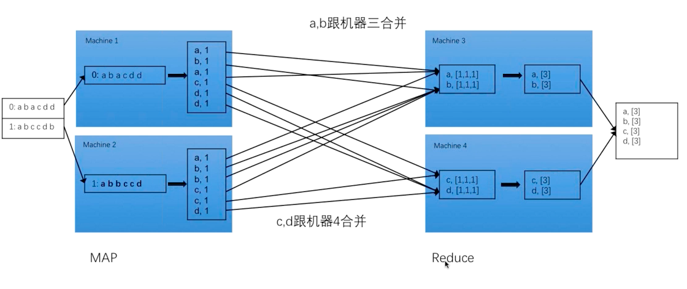

# Ladder

---

![Top K Frequent Words (Map Reduce) Description D Notes Testcase Judge Find top k frequent words with map reduce framework. The mapper's key is the document id, value is the content of the document, words in a document are split by spaces. For reducer, the output should be at most k key-value pairs, which are the top k words and their frequencies in this reducer. The judge will take care about how to merge different reducers' results to get the global top k frequent words, so you don't need to care about that part. The k is given in the constructor ofTopK class. i Notice For the words with same frequency, rank them with alphabet. Have you met this question in a real interview? Yes Example Given document A = tintcode is the best online judge I love tintcode and document B = tintcode is an online judge for coding interview ](../../media/Stream^JSearch-Mapreduce-Ladder-image2.png)

![class Pair { String key; int value; Pair(String key, int value) { this. key key; this. value = value; public class TopKFrequentWords public static class Map { public void map(String _, Document value, OutputC01 lector<String, Integers output) { // Write your code here // Output the results into output buffer. // Ps. output. collect(String key, int value); int id value.id; StringBuffer temp = new StringBufferC'i"); String content value. content; StringCJ words content. splitC" "); for (String word : words) if (word. length() > D { output. collect(word, 1); ](../../media/Stream^JSearch-Mapreduce-Ladder-image3.png)

![public static Class Reduce { private PriorityQueue<Pair> Q null; private int k; private pairComparator new { public int corpare(Pair left, Pair right) { if (left.value right.value) { return left. value - right value; return right. key. corpareTo(left.key); public void setup(int k) { // initialize your data structure here this. k Q = new pairComparator); public void reduce(String key, values) { // Write your code here int sum while (values . hasNextO) { sum values. next(); Pair pair new Pair(key, sum); if (Q. size() < k) { Q. add(pair); } else { Pair peak Q.peek(); if (pai rComparator. compare(pair, Q.poll(); Q. add(pair) ; peak) 0) { ](../../media/Stream^JSearch-Mapreduce-Ladder-image4.png)

![Anagram (Map Reduce) ("cd", "dc"] , Description D Notes Testcase Judge Use Map Reduce to find anagrams in a given list of words. Have you met this question in a real interview? Yes Example Given ["lint", "intl", 'lint t", "code"] , return [n lint", "inlt", "int l" ] , ["code"] . Given ["abn, "bal', "cd", "dc", , return ("ab", "bal'], Tags • Related Problems • ](../../media/Stream^JSearch-Mapreduce-Ladder-image6.png)

![public class Anagram { public static class Map { public void map(String key, String value, OutputC01 lector<String, String> output) { // Write your code here // Output the results into output buffer. // Ps. output. collect(String key, String value); StringTokenizer tokenizer new StringTokenizerCvalue); while (tokenizer .hasMoreTokensO) { String word tokenizer. nextTokenC); String original word; char C] chars original .toCharArray(); Arrays. sort(chars) ; String sorted new String(chars); output. collect(sorted, word); public static Class Reduce { public void reduce(String key, Iterator<String> values, OutputC011ector<String, List<String» output) { // Write your code here // Output the results into output buffer. // Ps. output. collect(String key, value); results new while (values . hasNextO) { results. add(values. next()) ; output. collect(key, results); ](../../media/Stream^JSearch-Mapreduce-Ladder-image7.png)

invert index

![• public class Invertedlndex { public static class Map { public void map(String _, Document value, OutputC01 lector<String, Integers output) { // Write your code here // Output the results into output buffer. // Ps. output. collect(String key, int value); int id value.id; StringTokenizer tokenizer new StringTokenizerCvalue. content); whi le (tokenizer. hasMoreTokensO) { String word tokenizer. nextTokenC); output. collect(word, id); public static class Reduce { public void reduce(String key, Iterator<lnteger> values, OutputC011ector<Stri ng, List<lnteger» output) { // Write your code here // Output the results into output buffer. // Ps. output. collect(String key, value); List<lnteger> results = new int previous - while (values . hasNext()) { int non values.next(); if(previous = non) { results. add(now) ; previous now; output. col ect(key , resul ts); ](../../media/Stream^JSearch-Mapreduce-Ladder-image8.png)

for map, key is the document id, value is content of document

for reduce, key is word, value is list

output collection will store in the lock disk,

sort

![Input 0: abacdd l:abccdb Split 0: abacdd Machine 2 l:abbccd Map a, a. c, a, C, c, Partition sort d.l Fetch a,l b,l d,l d,l d,l Merge sort a, [1,1.1] c. [1.1,11 d, [1.1,1] Reduce a, [31 Machine 4 d, [31 Output b, [31 ](../../media/Stream^JSearch-Mapreduce-Ladder-image10.png)

