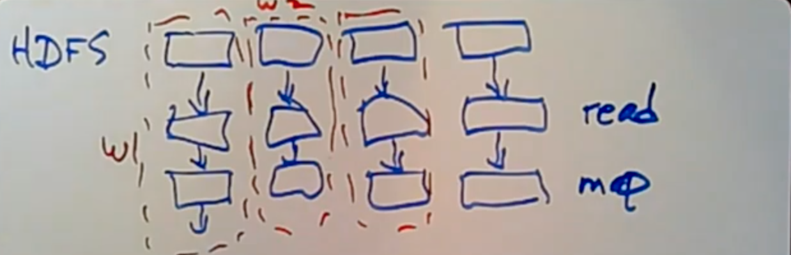
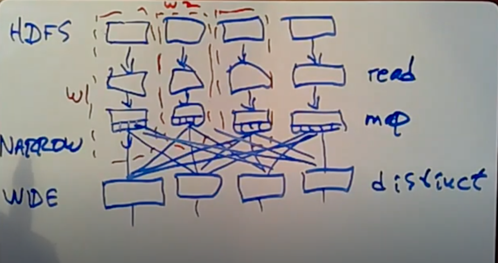

# MIT 15 Big Data Spark

Created: 2021-01-15 16:50:35 -0600

Modified: 2021-01-15 18:09:20 -0600

---

the data the input data starts out kind of pre partitioned by over in HDFS

we assume our one file it's our input files already split up into lots of you know 64 megabyte or whatever it may happen pieces in HDFS

spark knows that when you started you actually call collect the start of computation spark knows that the input data is already partitioned HDFS and it's gonna try to split up the work the workers in a corresponding way

so if it knows that there's I actually don't know what the details are a bit it might actually try to run the computation on the same machines that store the HDFS data or it may just set up a bunch of workers to read each of the HDFS partitions

And again there's likely to be more than one partition per per worker

so we have the input file and the very first thing is that each worker reads as part of the input file so this is the read their file read

if you remember the next step is a map where the each worker supposed to map a little function that splits up each line of input into a from two linked tupple um but this is a purely local operation and so it can go on in the same worker so we imagine that we read the data and then in the very same worker spark is gonna do that initial

map

from each worker to itself so there's no network communication involved indeed it's just you know we run the first read and the

output can be directly fed to that little map function and in fact this is that that initial map in fact spark certainly streams the data record by record through these transformations

So instead of reading the entire input partition and then running the map on the entire input partition, SPARK reads the first record or maybe the first just couple of records and then runs the map on just sort of all, I'm each record in fact runs each record

if it was many transformations as it can before going on and reading the next little bit from the file and that's so that it doesn't have to store these files could be very large

~~it isn't one half~~ so like store the entire input file it's much more efficient just to process it record by record

okay so there's a question so the first node in each chain is the worker holding the HDFS chunks, and the remaining nodes in the chain are the nodes in the lineage?

oh yeah I'm afraid I've been a little bit confusing here I think the way to think of this is that so far all this happen is happening on it on individual workers, so this is worker 1, maybe this is another worker and each worker is sort of proceeding independently and I'm imagining that they're all running on the same machines that stored the different partitions of the HTTPS fob, but there could be Network

communication here to get from HDFS to the to the responsible worker but after that it's very fast kind of local operations

{width="5.0in" height="1.6145833333333333in"}

all right and so this is what happens for the with the people called

the narrow dependencies that is transformations that just look consider each record of data independently, without ever having

to worry about the relationship to other records

so by the way this is already potentially more efficient than MapReduce and that's because if we have what amount to multiple map phases here, they just string together in memory whereas MapReduce if you're not super clever

if you run multiple MapReduce is even if they're sort of degenerate map only MapReduce applications, each stage would read input from GFS compute and write its output back to GFS then the next stage would be compute right so here we've eliminated the reading

writing in it you know it's not a very deep advantage, but it sure helps for efficiency

okay however not all the transformations are narrow, not all just sort of read their input record by record, kind of with every record independent from other records, and so what I'm worried about is the distinct call which needed to know all instances all records that had a particular key, similarly group by key needs to know about all instances that have a key join also it's gotta move things around so that takes two inputs, needs to join together all keys from both inputs so that this all records,

from both inputs that are the same key

so there's a bunch of these non-local transformations which the paper calls [wide transformations]{.mark} because they potentially have to look at all partitions of the input, that's a lot like reduce in MapReduce

serve example distinct() exposing we're talking about the distinct stage you know the distinct is going to be run on multiple workers

also and no distinct works on each key independently, and so we can partition the computation by key, but the data currently is not partitioned by key at all actually isn't really partitioned by anything ~~but just sort of however HDFS have my distorted,~~

so four distinct we're gonna run distinct() on all the worker, partition and all the workers partitioned by key, but you know any one worker needs to see all of the input records with a given key, which may be

spread out over all of the preceding workers for the preceding transformation, and all of all of the you know they're all for the workers are responsible for different keys but the keys may bespread out over workers for the preceeding transformation

now in fact the workers are the same typically it's gonna be the same workers running the map is running running the distinct but the data needs to be moved between the two transformations to bring all the keys together and

so what sparks actually gonna do it's gonna take the output of this map hash the each record by its key, and use that you know mod the number of workers to select which workers should see it and in fact the implementation is a lot like your implementation of MapReduce

the very last thing that happens in the last of the narrow stages is that the output is going to be [chopped up into buckets]{.mark} corresponding to the different workers, for the next transformation where it's going to be left waiting for them to fetch, I saw the scoop is that each of the workers run the sort of as many stages all the narrows stages they can through the completion and store the output split up into buckets ,when all of these are finished then we can start running the

workers for the distinct transformation whose first step is go and fetch from every other worker the relevant bucket of the output of the last narrow stage

and then we can run the distinct because all the given keys are on the same worker and they can all start producing output themselves

{width="5.0in" height="2.6354166666666665in"}

all right now of course these "wide transformations" are quite expensive the, now transformations are super efficient, because we're just sort of taking each record and running a bunch of functions on it totally locally, the "wide transformations" require pushing a lot of data impact essentially all of the data in for PageRank you know you get terabytes of input data that means that you know it's still the same data at this stage, because it's all the links and then in the web so now we're pushing terabytes and terabytes of data over the network to implement this shuffle from the output of the map functions to the input of the distinct functions

so these wide transformations are pretty heavyweight, a lot of communication and they're also kind of computation barrier because we have to wait all for all the narrow processing to finish before we can go on to the so there's wide transformation

all right that said the there are some optimizations that are possible because Spark has a view SPARC creates the entire lineage graph before it starts any of the data processing, so smart can inspect the lineage graph and look for opportunities for optimization and

certainly running all of if there's a sequence of narrow stages, running them all in the same machine by basically sequential function calls on each input record that's definitely an optimization

that you can only notice if you sort of see the entire lineage graph all at once

another optimization that spark does is noticing when the data has

all has has already been partitioned due to a wide shuffle, that the data is already partitioned in the way that it's going to be needed for the next wide transformation

so in the in our original program let's see I think we have two

wide transformations in a row distinct

requires a shuffle but group by key also

it's gonna bring together all the

records with a given key and replace

them with a list of for every key the

list of links you know starting at that

URL these are both wide operators they both are grouping by key and so maybe we have to do a shuffle for the distinct but spark can cleverly recognize a high you know that is already shuffled in a

way that's appropriate for a group by key we don't have to do in other shuffle so even though "group by key" is in principle it could be a wide transformation in fact I suspect spark implements it without communication because the data is already partitioned by key so maybe the group by key can be done in this particular case without shuffling data without expense

of course it you know can only do this because it produced the entire lineage graph first ,and only then ran the computation, so this part gets a chance to sort of examine and optimize and maybe transform the graph

so that looks topic actually any any

questions about lineage graphs or how

things are executed

I feel free to interact the next thing I want to talk about is fault tolerance, and here the you know these kind of computations they're not the fault tolerance are looking for is not the sort of absolute fault tolerance ,you would want with the database what you really just cannot ever afford to lose anything what you really want is a database that never loses data, here the fault tolerance we're looking for is more like well it's expensive if we have to repeat the computation we can totally repeat this computation if we have to but you know it would take us a couple of hours and that's irritating but not the end of the world

so we're looking to you know tolerate common errors but we

don't have to certainly don't have to having bulletproof ability to tolerate any possible error ,so for example spark doesn't replicate that driver machine if the driver which was sort of controlling the computation and knew about the lineage graph of the driver crashes I think you have to rerun the whole thing but you know any one machine only crashes maybe every few months so that's no big deal

another thing to notice is that HDFS is sort of a separate thing SPARK is just assuming that the input is replicated in a fault-tolerant way on HDFS and indeed just just like GFS, HDFS does indeed keep multiple copies of the data on multiple servers if one of them crashes can soldier on with the other copy so the input data is assumed to be to be relatively fault tolerant and

what that means that at the highest level is that spark strategy ,if one of the workers fail is just to recompute the whatever that worker was responsible for to just repeat those computations they were lost with the worker on some other worker and on some other machine

so that's basically what's going on and it you know it might take a while if you have a long lineage like you would actually get with PageRank, because you know PageRank with many iterations produces a very long lineage graph one way that spark makes it not so bad that it has to be may have to be computer everything from scratch if a worker fails is that each workers actually responsible for multiple partitions at the input ,so spark can move those parts move give each remaining worker just one of the partitions and they'll be able to basically paralyzed the re-computation that was lost with the failed worker by running each of its partitions on a on a different worker in parallel, so if all else fails, spark just goes back to the beginning from being input and just recomputes everything that was running on that machine

however and for now our dependencies that's pretty much the end

of the story, however there actually is a problem with the wide dependencies that makes that story not as attractive as you might

hope so this is a topic here is failure, one failed node, 1 failed worker

in a lineage graph that has wide dependencies, so the a reasonable or a sort of sample graph you might have is you know maybe you have a dependency graph, that's you know starts with some power dependencies, but then after a while you have a wide dependency so you got transformations that depend on all the preceding transformations and then some small narrow ones all right

and you know the game is that a single workers fail and we need to reconstruct the field before we've gone to the final action and produce the output, so we need to kind of reconstruct recompute

what was on this field worker

The damaging thing here is that ordinarily, as spark is executing along it you know it executes each of the transformations gives us output to the next transformation, but doesn't hold on to the original output unless you unless you happen to tell it to like the links data is persisted with that cache call, but in general that data is not held on

to because now if you have a like the PageRank lineage graph maybe dozens or hundreds of steps long, you don't want to

hold on to all that data it's way way

too much to fit in memory so as the

SPARC sort of moves through these

transformations it discards all the data

associated with earlier transformations

that means when we get here and if this

worker fails we need to we need to

restart its computation on a different

worker now so we can be the input and

maybe do the original narrow

transformations

they just depend on the input which we

have to reread but then if we get to

this y transformation we have this

problem that it requires input not just

from the same partition on the same

worker but also from every other

partition and these workers so they're

still alive have in this example have

proceeded past this transformation and

therefore discarded the output of this

transformation since it may have been a

while ago and therefore the input did

our recomputation needs from all the

other partitions doesn't exist anymore

and so if we're not careful that means

that in order to rebuild this the

computation on this field worker we may

in fact have to re execute this part of

every other worker as well as well as

the entire lineage graph on the failed

worker and so this could be very

damaging right if we're talking about oh

I mean I've been running this giant

spark job for a day and then one of a

thousand machines fails that may mean we

have to we know anything more clever

than this that we have to go back to the

very beginning on every one of the

workers and recompute the whole thing

from scratch no it's gonna be the same

amount of work is going to take the same

day to recompute a day's computation so

this would be unacceptable we'd really

like it so that if if one worker out of

a thousand crashes that we have to do

relatively little work to recover from

that and

because of that spark allows you to check point to make [periodic]{.mark}

[check points]{.mark} of specific transformation, so um so in this graph what we would do is in the scallop program we would call

I think it's the persist call actually we call the persist call with a special argument that says, look after you compute the output of this

transformation please save the output to HDFS, and so everything and then if something fails the spark will know that aha the output of the proceeding transformation was safe HDFS, and so we just have

to read it from each DFS instead of recomputing it on all for all partitions back to the beginning of time um and because HDFS is a separate storage system which is itself replicated in fault-tolerant the fact that one worker fails you know the HDFS is still going to be available even if a worker fails

so I think so for our example PageRank I

think what would be traditional would be

to tell

spark to check point the output to check

put ranks and you wouldn't even know you

can tell it to only check point

periodically so you know if you're gonna

run this thing for 100 iterations it

actually takes a fair amount of time to

save the entire ranks to HDFS because

again we're talking about terabytes of

data in total so maybe we would we can

tell SPARC look only check point ranks

to HDFS every every 10th iteration or

something to limit the expanse although

you know it's a trade-off between the

expensive repeatedly saving stuff to

disk and how much of a cost if a worker

failed you had to go back and redo it

Bertha's a question when we call

that does act as a checkpoint you know

okay so this is a very good question

which I don't know the answer to the

observation is that we could call cash

here and we do call cashier and we could

call cashier and the usual use of cash

is just to save data in memory with the

intent to reuse it that's certainly why

it's being called here because we're

using links for but in my example it

would also have the effect of making the

output of this stage available in memory

although not on not an HDFS but in the

memory of these workers and the paper

never talks about this possibility and

I'm not really sure what's going on

maybe that would work or maybe the fact

that the cash requests are merely

advisory and maybe evicted if the

workers run out of space means that

calling cash doesn't give you it isn't

like a reliable directed to make sure

the data really is available it's just

well it'll probably be available on most

nodes but not all nodes because remember

even a single node loses its data and

we're gonna have to do a bunch of

recomputation so III I'm guessing that

persists with replication is a firm

directive to guarantee that the data

will be available even if there's a

failure

I don't really know it's a good question

alright okay so that's the programming

model and the execution model and the

failure strategy and by the way just a

beat on the failure strategy a little

bit more the way these systems do

failure recovery is it's not a minor

thing as as people build bigger and

bigger clusters with thousands and

thousands of machines you know the

probability that job will be interrupted

by at least one worker failure it really

does start to approach one and so the

the designs recent designs intended to

run on big clusters have really been to

a great extent dominated by the failure

recovery strategy and that's for example

a lot of the explanation for why SPARC

insists that the transformations be

deterministic and why the are these its

rdd's are immutable because you know

that's what allows it to recover from

failure by simply recomputing one

partition instead of having to start the

entire computation from scratch and

there have been in the past plenty of

proposed sort of cluster big data

execution models in which there really

was mutable data and in which

computations could be non-deterministic

make if you look up distributed shared

memory systems those all support mutable

data and they support non-deterministic

execution but because of that they tend

not to have a good failure strategy so

you know thirty years ago when a big

cluster was for computers none of this

mattered because the failure probability

was little very low and so many

different kinds of computation models

seemed reasonable then but as the

clusters have grown to be hundreds and

thousands of workers really the only

models that have survived are ones for

which you can devise a very efficient to

failure recovery strategy that does not

require backing all the way up to the

beginning

and restarting the paper talks about

this a little bit when it's criticizing

I'm distributed shared memory and it's a

very valid criticism I bet it's a big

design constraint okay so the sparks not

perfect for all kinds of processing it's

really geared up for batch processing of

giant amounts of data bulk bulk data

processing so if you have terabytes of

data and you want to you know chew away

on it for for a couple hours smart great

if you're running a bank and you need to

process bank transfers or people's

balance queries then SPARC is just not

relevant to that kind of processing

known or to sort of typical websites

where I log into you know I access

Amazon and I want to order some paper

towels and put them into my shopping

cart SPARC is not going to help you

maintain this part the shopping cart

SPARC may be useful for analyzing your

customers buying habits sort of offline

but not for sort of online processing

the other sort of kind of a little more

close to home situation that spark in

the papers not so great at is stream

processing i SPARC definitely assumes

that all the input is already available

but in many situations the input that

people have is really a stream of input

like they're logging all user clicks on

their web sites and they want to analyze

them to understand user behavior you

know it's not a kind of fixed amount of

data is really a stream of input data

and you know SPARC as in describing the

paper doesn't really have anything to

say about processing streams of data but

it turned out to be quite close to home

for people who like to use spark and and

now there's a variant of SPARC called

spark streaming that that is a little

more geared up to kind of processing

data as it arrives and you know sort of

breaks it up into smaller batches and

runs in a batch at a time to spark

so it's good for a lot of bad stuff but

that's certainly on to be thing right to

wrap up the UH you should view spark as

a kind of evolution after MapReduce and

I may fix some expressivity and

performance sort of problems or that

MapReduce has what a lot of what SPARC

is doing is making the data flow graph

explicit sort of he wants you to think

of computations in the style of figure

three of entire lineage graphs stages of

computation and the data moving between

these stages and it does optimizations

on this graph and failure recovery is

very much thinking about the lineage

graph as well so it's really part of a

larger move and big data processing

towards explicit thinking about the data

flow graphs as a way to describe

computations a lot of the specific win

and SPARC have to do with performance

part of the prepend these are

straightforward but nevertheless

important some of the performance comes

from leaving the data in memory between

transformations rather than you know

writing them to GFS and then reading

them back at the beginning of the next

transformation which you essentially

have to do with MapReduce and the other

is the ability to define these data sets

these are Dedes and tell SPARC to leave

this RDD in memory because I'm going to

reuse it again and subsequent stages and

it's cheaper to reuse it than it is to

recompute it and that sort of a thing

that's easy and SPARC and hard to get at

in MapReduce and the result is a system

that's extremely successful and

extremely widely used and if you deserve

real success okay that that's all I have

to say and I'm happy to take questions

if anyone has them

you

