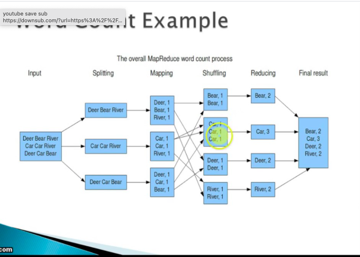
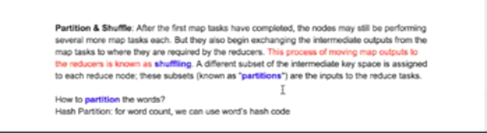
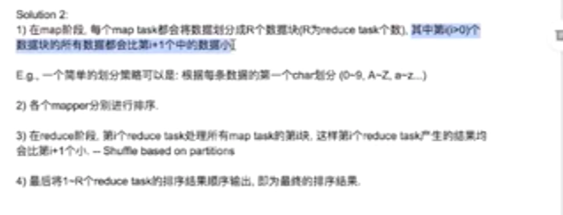

# Laioffer class 3 

---

Original file -> chunk, mapper -> map output file -> partition,sort and shuffer -> reducer ->final file

Word count, partition by hash(words)

All the apple, count go to the same partition

Sort , partition by the

map partition the input data

partition

If sorted by value

1.  Word count
2.  Different reducer... 1-100 ->reducer 1 , 100-200 reducer 2, then sort in the different reducer and merge
3.  Into the output file

