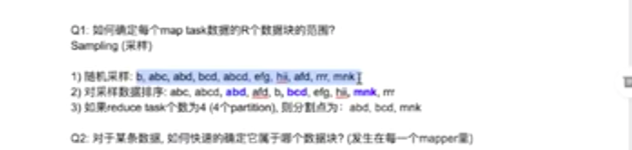

# Laioffer class 3 

Created: 2021-02-06 14:07:21 -0600

Modified: 2021-02-06 17:48:10 -0600

---

{width="5.0in" height="3.0625in"}

{width="5.0in" height="3.5729166666666665in"}

Original file -> chunk, mapper -> map output file -> partition,sort and shuffer -> reducer ->final file

Word count, partition by hash(words)

All the apple, count go to the same partition

{width="5.0in" height="1.3645833333333333in"}

Sort , partition by the

{width="5.0in" height="1.90625in"}

{width="5.0in" height="2.6145833333333335in"}

map partition the input data

partition

{width="5.0in" height="1.1875in"}

{width="5.0in" height="2.5625in"}

If sorted by value

1.  Word count
2.  Different reducer... 1-100 ->reducer 1 , 100-200 reducer 2, then sort in the different reducer and merge
3.  Into the output file

