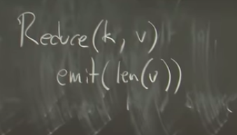
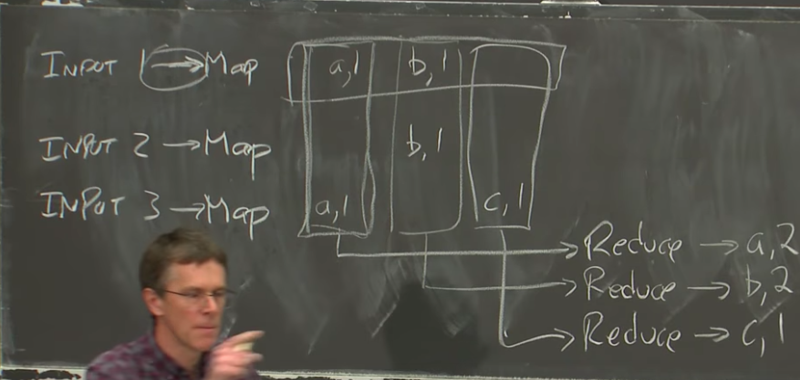

# MIT 

Created: 2021-01-02 17:51:48 -0600

Modified: 2021-03-14 11:35:39 -0600

---

48''

so that's what MapReduce is all about and the idea is that the programmer just

write the application designer consumer of this distributed computation

I'm just be able to write a simple map function and a simple reduce function

that don't know anything about distribution and the MapReduce framework

would take care of everything else

so an abstract view of how what MapReduce is up to is it starts by assuming that there's some input and the input is split up into some a whole bunch of different files or chunks in some way

So we're imagining that no yeah you know input file one, and put file two, etc you

know these inputs are maybe you know web pages crawled from the web, or more

likely sort of big files that contain many web each of which contains many web

files crawl from the web all right

And the way Map Reduce starts is that you're to find a map function and the MapReduce framework is gonna run your map function on each of the input files, and of course you can see here there's some obvious parallelism available can run the maps in parallel so the each of these map functions only looks as this input and produces output the output

that a map function is required to produce is a list you know it takes a file as input ~~and the file is some fraction of the input data~~ and it produces a list of key value pairs as output, the map function

and so for example let's suppose we're writing the simplest possible MapReduce example a word count MapReduce job goal is to count the number of occurrences of each word ,so your map function [might emit key value pairs,]{.mark} where the key is the word and the value is just one, so for every word at C so then this map function will split the input up into words or everywhere , it emits that word as the key and 1 as the value and

then later on will count up all those ones in order to get the final output

the paper calls intermediate output, which is for every map a set of key value pairs as output

then the second stage of the computation is to run the reduces and the idea is that the MapReduce framework [collects together all instances from all maps of each key word ,so the MapReduce framework is going to collect together every key value pair,]{.mark} whose key was a ,it's gonna take collect them, all and hand them to one call of the programmer to find reduce function and then it's gonna take

all the B's and collect them together of

course you know requires a real

collection because they were different

instances of key B were produced by

different indications of map on

different computers so we're not talking

about data movement I'm

so we're gonna collect all the B keys and hand them to a different call to reduce that has all of the B keys ,as its arguments and same

the MapReduce framework will arrange for one call to reduce for every key that occurred in any of the map output and

all these reduces have to do or any one of them has to do is just count the number of items passed to it,

~~doesn't even have to look at the items because it knows that each of them is~~

~~the word is responsible for plus one is the value ,you don't have to look at~~

those ones we've just count

[so this reduce is going to produce a and then the count of its inputs ,this reduce]{.mark}

[it's going to produce the key associated with it and then count of its values]{.mark}

which is also two so this is what a

typical MapReduce job looks like the

high level just for completeness the

well some a little bit of terminology

the whole computation is called the job

anyone invocation of MapReduce is called

a task so we have the entire job and

it's made up of a bunch of math tasks

and then a bunch of produced tasks so

it's an example for this word count

You know the what the map and reduce functions would look like the map function takes a key in the value as arguments and now we're talking about functions like written in an ordinary programming language like C++ or Java or

who knows what so this is just code people ordinary people can write what a map function for word count would do is split the the "key" is the file name which typically is ignored we really care what the file name was and the V is the content of this maps input file so V is you know just contains all this text Map(key, value)

we're gonna split V into words and then for each word we're just gonna emit and emit takes two arguments, make emit is provided by the MapReduce framework we get to produce we hand emit a key which is the word and a value which is the string one

so that's it for the map function and a word count map

function and MapReduce literally it

could be this simple

so there's sort of promise to make the

and you know this map function doesn't

know anything about distribution or

multiple computers or the fact we need

we need to move data across the network

or who knows what

this is extremely straightforward and

the reduce function for a word count, the reduce is called with you know remember

each reduce is called with sort of all the instances of a given key on the MapReduce framework calls reduce with the key that it's responsible for, and a vector of all the values that the maps

produced associated with that key,

The key is the word the values are all ones, we don't like here about them we only care about how many they were, and so reduce has its own omit function that just takes a value to be emitted as the final output as the value for the this key, so we're gonna admit a length of this array

{width="7.145833333333333in" height="4.104166666666667in"}

so this is also about as

simplest reduce functions have are and

in Map Reduce namely extremely simple

and requiring no knowledge about fault

tolerance or anything else alright any

questions about the basic framework yes

[Music]

you mean can you feed the output of the

reducers sort of oh yes oh yes in in in

in real life all right

in real life it is routine among

MapReduce users to you know define a

MapReduce job that took some inputs and

produce some outputs and then have a

second MapReduce job you know you're

doing some very complicated multistage

analysis or iterative algorithm like

PageRank for example which is the

algorithm Google uses to sort of

estimate how important or influential

different webpages are that's an

iterative algorithm is sort of gradually

converges on an answer and if you

implement in MapReduce which I think

they originally did you have to run the

MapReduce job multiple times and the

output of each one is sort of you know

list of webpages with an updated sort of

value or weight or importance for each

webpage so it was routine to take this

output and then use it as the input to

another MapReduce job oh yeah well yeah

you need to sort of set things up the

output you need to rate the reduced

function sort of in the knowledge that

oh I need to produce data that's in the

format or as the information required

for the next MapReduce job I mean this

actually brings up a little bit of a

shortcoming in the MapReduce framework

which is it's great if you are if the

algorithm you need to run is easily

expressible as a math followed by this

sort of shuffling of the data by key

followed by a reduce and that's it

my MapReduce is fantastic for algorithms

that can be cast in that form and we're

furthermore each of the maps has to be

completely independent and

are required to be functional pure

functional functions that just look at

their arguments and nothing else

you know that's like it's a restriction

and it turns out that many people want

to run much longer pipelines that

involve lots and lots of different kinds

of processing and with MapReduce you

have to sort of cobble that together

from multiple MapReduce distinct

MapReduce jobs and more advanced systems

which we will talk about later in the

course are much better at allowing you

to specify the complete pipeline of

computations and they'll do optimization

you know the framework realizes all the

stuff you have to do and organize much

more complicated efficiently optimize

much more complicated computations

from the programmers point of view it's

just about map and reduce from our point

of view it's going to be about the

worker processes and the worker servers

that that are they're part of MapReduce

framework that among many other things

call the map and reduce functions so

yeah from our point of view we care a

lot about how this is organized by the

surrounding framework this is sort of

the programmers view with all the

distributive stuff stripped out yes

sorry I gotta say it again oh you mean

where does the immediate data go okay so

there's two questions one is when you

call a MIT what happens to the data and

the other is where the functions run so

the actual answer is that first where

the stuff rotten there's a number of say

a thousand servers um actually the right

thing to look at here is figure one in

the paper sitting underneath this in the

real world there's some big collection

of servers and we'll call them maybe

worker servers or workers and there's

Also

[a single master server that's organizing the whole computation]{.mark} and what's going on here is the master server for knows that there's some number of input files, you know five thousand input files and it farms out in vacations of map to the different workers ,so it'll send a message to worker 7 saying please run you know this map function on such-and-such an input file and then the worker function which is you know part of MapReduce and knows all about Map Reduce well then read the file ,read the input and call this map function with the file name value as its arguments

then that worker process will implement the "emit" and every time the map calls emit ,the worker process will write this data to files on the local disk

so what happens to map emits and is: they produce files on the map workers local discs that are [accumulating all the keys and values produced by the maps run on that worker]{.mark}

~~so at the end of the Map phase ,what we're left with is all those worker machines ,each of which has the output of some of whatever maps were run on that worker machine, then the~~ MapReduce workers arrange to move the data to where it's going to be needed for the

Reduces

so and since and a you know in a typical big computation you know this this reduce indication is going to need all map output that mentioned the key A, but it's gonna turn out you know this is a simple example

but probably in general every single map indication will have produce lots of keys including some instances of key A

so typically in order before we can even run this reduce function, the MapReduce framework that is the MapReduce worker running on one of our thousand servers is going to have to go talk to every single other of the thousand servers and say look you know I'm gonna run the reduce for key A ,please look at the intermediate map output stored in your disk and fish out all of the instances of key A and send them over the network to me

so the reduce worker is going to do that it's going to fetch from every worker all of the instances of the key that it's responsible for that the master has told it to be responsible for

and once it's collected all of that data then it can call reduce and the reduce function itself calls "reduce emit" which is different from the map in it and what "reduces emit" does is writes the output to a file in a cluster file service, that Google uses so here's something I

haven't mentioned I haven't mentioned

where the input lives and where the

output lives they're both files because

any piece of input we want the

flexibility to be able to read any piece

of input on any worker server that means

we need some kind of network file system

to store the input data and so indeed

the paper talks about this thing called

GFS or Google file system and GFS is a

cluster file system and BFS actually

runs on exactly the same set of workers

that work our servers that run MapReduce

and the input GFS just automatically

when you you know it's a file system you

can read in my files it just

automatically splits up any big file you

store on it across lots of servers and

64 megabyte chunks so if you write

if you view of ten terabytes of crawled

web page contents and you just write

them to GFS even as a single big file

GFS will automatically split that vast

amount of data up into 64 kilobyte

chunks distributed evenly over all of

the GFS servers which is to say all the

servers that Google has available and

that's fantastic that's just what we

need if we then want to run a MapReduce

job that takes the entire crawled web as

input the data is already stored in a

way that split up evenly across all the

servers and so that means that the map

workers you know we're gonna launch you

know if we have a thousand servers we're

gonna launch a thousand map workers each

reading one 1000s at the input data and

they're going to be able to read the

data in parallel from a thousand GFS

file servers thus getting now tremendous

total read throughput you know the read

through put up a thousand servers

so so are you thinking maybe that Google

has one set of physical machines among

GFS and a separate set of physical

machines that run MapReduce jobs okay

right so the question is what does this

arrow here actually involve and the

answer that actually it sort of changed

over the years as Google's

involve this system but you know what

this in those general case if we have

big files stored in some big Network

file system like you know it's like GFS

is a bit like AFS you might have used on

Athena where you go talk to some

collection and your data split over big

collection o servers you have to go talk

to those servers over the network to

retrieve your data in that case what

this arrow might represent is the meta

MapReduce worker process has to go off

and talk across the network to the

correct GFS server or maybe servers that

store it's part of the input and fetch

it over the network to the MapReduce

worker machine in order to pass the map

and that's certainly the most general

case and that was eventually how

MapReduce actually worked in the world

of this paper though and and if you did

that that's a lot of network

communication are you talking about ten

terabytes of data and we have moved 10

terabytes across their data center

network which you know data center

networks wanting gigabits per second but

it's still a lot of time to move tens of

terabytes of data in order to try to and

indeed in the world of this paper in

2004 the most constraining bottleneck in

their MapReduce system was Network

throughput because they were running on

a network if you sort of read as far as

the evaluation section their network

their network as was they had thousands

of machines

whatever and they would collect machines

they would plug machines and you know

each rack of machines and you know an

Ethernet switch for that rack or

something but then you know they all

need to talk to each other but there was

a route Ethernet switch that all of the

Rockies are net switches talked to and

this one and you know so if you just

pick some Map Reduce worker and some GFS

server you know chances are at least

half the time the communication between

them has to pass through this one

wouldn't switch their routes which had

only some amount of total throughput

which I forget you know some number of

gigabits per second and I forget the

number well but when I did the division

that is divided up to the total

throughput available in the routes which

by the roughly 2000 servers that they

used in the papers experiments what I

got was that each machine share of the

route switch or of the total network

capacity was only 50 megabits per second

per second in their setup 50 megabits

per second per machine and then might

seem like a lot 50 megabits gosh

millions and millions but it's actually

quite small compared to how fast a disks

Ron or CPUs run and so this with their

network this 50 megabits per second was

like a tremendous limit and so they

really stood on their heads in the

design described in the paper to avoid

using the network and they played a

bunch of tricks to avoid sending stuff

over the network when they possibly

could avoid it one of them was they

would they ran the gfs servers and the

MapReduce workers on the same set of

machines so they have a thousand

machines

they'd run GFS they implement their GFS service on that thousand machines and run MapReduce on the same thousand machines and then when the master was splitting up the map work and sort of farming it out to different workers

it would cleverly when it was about to run the map that was going to read from input file one it would figure out from GFS which server actually holds input file one on its local disk, and it

would send the map for that input file to the MapReduce software on the same machine ,so that by default this arrow was actually local read from the local disk and did not involve the network and you know depending on failures or load or whatever that couldn't always do that but almost all the maps would be run on the very same machine

and stored the data thus saving

them vast amount of time that they would

otherwise had to wait to move the input

data across the network the next trick

they played is that map as I mentioned

before stores this output on the local

disk of the machine that you run the map

on so again storing the output of the

map does not require network

communication he's not immediately

because the output stored in the disk

however we know for sure that one way or another in order to group together all of you know by the way the MapReduce is defined in order to group together all of the values associated with the given key and pass them to a single invocation to produce on some machine this is going to require network communication we're gonna you know we want to need to fetch

all dates and give them a single machine that have to be moved across the

network and

so this [shuffle]{.mark} this movement of the keys from is kind of originally stored by row and on the same machine that ran the map we need them essentially to be stored on by column on

the machine that's going to be responsible for reduce this transformation of row storage

essentially column storage, paper calls a shuffle and it really that required moving every piece of data across the network from the map that produced it to the reduce that would

need it and now it's like the expensive part of the MapReduce yeah

{width="10.083333333333334in" height="4.833333333333333in"}

you're right you can imagine a different

definition in which you have a more kind

of streaming reduce I don't know I

haven't thought this through I don't

know why whether that would be feasible

or not certainly as far as programmer

interface like if the goal their

number-one goal really was to be able to

make it easy to program by people who

just had no idea of what was going on in

the system so it may be that you know

this speck this is really the way reduce

functions look and you know in C++ or

something like a streaming version of

this is now starting to look I don't

know how it look probably not this

symbol but you know maybe it could be

done that way and indeed many modern

systems people got a lot more

sophisticated with modern things that

are the successors the MapReduce and

they do indeed involve processing

streams of data often rather than this

very batch approach there is a batch

approach in the sense that we wait until

we get all the data and then we process

it so first of all that you then have to

have a notion of finite inputs right

modern systems often do indeed you

streams and and are able to take

advantage of some efficiencies do that

MapReduce okay so this is the point at

which this shuffle is where all the

network traffic happens this can

actually be a vast amount of data so if

you think about sort if you're sorting

the the output of the sort has the same

size as the input to the sort so that

means that if you're you know if your

input is 10 terabytes of data and you're

running a sort you're moving 10

terabytes of data across a network at

this point and your output will also be

10 terabytes and so this is quite a lot

of data and then indeed it is from any

MapReduce jobs although not all there's

some that significantly reduce the

amount of data at these stages somebody

mentioned Oh what if you want to feed

the output of reduce into another

MapReduce job and indeed that was often

what people wanted to do and

in case the output of the reduce might

be enormous like four sort or web and

mixing the output of the produces on ten

terabytes of input the output of the

reduces again gonna be ten terabytes so

the output of the reduce is also stored

on GFS and the system would you know

reduce would just produce these key

value pairs but the MapReduce framework

would gather them up and write them into

giant files on GFS and so there was

another round of network communication

required to get the output of each

reduce to the GFS server that needed to

store that reduce and because you might

think that they could have played the

same trick with the output of storing

the output on the GFS server that

happened to run the MapReduce worker

that ran the reduce and maybe they did

do that but because GFS as well as

splitting data for performance also

keeps two or three copies for fault

tolerance that means no matter what you

need to write one copy of the data

across a network to a different server

so there's a lot of network

communication here and a bunch here also

and I was this network communication

that really limited the throughput in

MapReduce

in 2004 in 2020 because this network

arrangement was such a limiting factor

for so many things people wanted to do

in datacenters modern data center

networks are a lot faster at the root

than this was and so you know one

typical data center network you might

see today actually has many root instead

of a single root switch that everything

has to go through you might have you

know many root switches and each rack

switch has a connection to each of these

sort of replicated root switches and the

traffic is split up among the root

switches so modern data center networks

have far more network throughput and

because of that actually modern I think

Google sort of stopped using MapReduce a

few years ago but before they stopped

using it the modern MapReduce actually

no longer tried to run the maps on the

same machine as the data stored on they

were happy to vote the data from

anywhere because they just assumed that

was extremely fast okay we're out of

time for MapReduce

we have a lab due at the end of next

week

in which you'll write your own somewhat

simplified MapReduce so have fun with

that

and see you on Thursday

