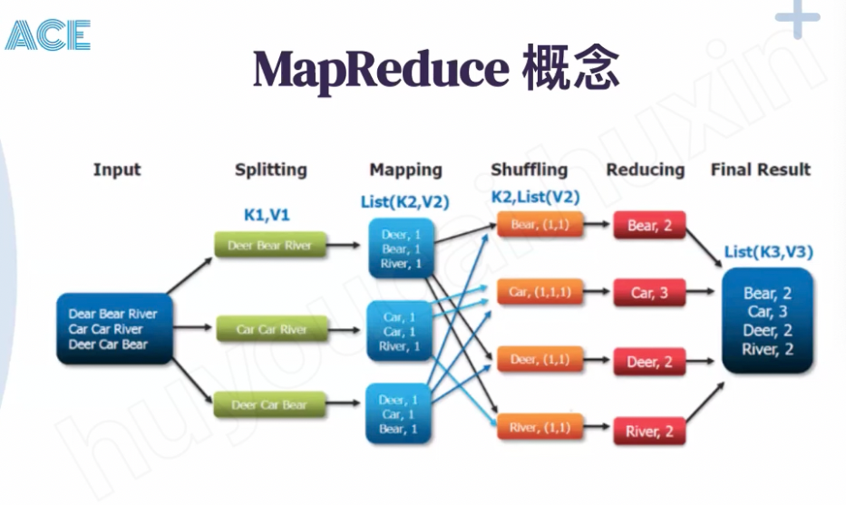

# MapReduce - ACE

---

map reduce have map task and reduce task. All the task a independent

There are group of map jobs will read the input document and split those doc to groups of words then generate to key value pair -- (it call intermediate files)

Shuffling -- combine the same key together and Mapreduce framework will deploy those key value pair to different reduce job and generate the output file

