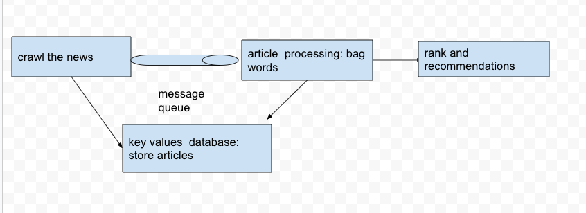

# Recommendation news

Created: 2020-12-15 13:00:35 -0600

Modified: 2021-03-14 11:04:35 -0600

---

[Mock Interview: design recommendation system](https://www.youtube.com/watch?v=JyPE7STy4W4&t=1688s)

Problem

Create a recommendation system similar to tou-tiao, recommend personal news to individual users:

- Support news publishing from selected users
- Ingesting news from other news websites
- Classify the news
- Analysis user behavior
- Recommend the related news to the right user based on user behavior

Part 1: System to publish news to serving

Part 2: Get content of an article :

Part 3: Get News recommendation

[Part 1:]{.mark} Get news ready for serving.

1.  News websites

Crawling, - - system will get news after they publish

2.  ~~MVP users upload~~

[Key value DB Dynamo Cassandra for raw data]{.mark}

[[DB for news raw content]<Immutable> -> classify the articles->[DB ready for serving]]{.mark}

[Immutable articles [logs ] :]{.mark}

Yellow Flags:

- Not put article into DBs
- Put an article into Message queue.

[Part two]{.mark} How to classify the article

Good morning

Bag of words {good: [0], morning: [1]}

Remove the stop words : like the, a ...

[Label(News topics)]{.mark}: predefined

Classifiers: examine bag of words, see how likely should this articled belong to a label.

- Model (news) -> label
- ~~News website timeliness~~
- Label human define
- ~~Train weekly -> get weekly old news classified with the newly labels~~

Human operator label popular news

[One service to crawler the news]{.mark}

[One service to process the news, map the label to the news]{.mark}

[Part 3 : general news list]{.mark}

[How to get recommendation news list for users?]{.mark}

[For each Sigle label, we only recommend the most popular news to user]{.mark}

1.  Push to user base on the popular, publishers credibility.

{label: [[news ids sorted list sorted by relevance, publishers credibility... Popular( only for old news)]{.mark} ]}

{politics: [1 3 5 6] relevance}

{Sports': [ 3 6, 10 ]}

[User history comes from logging. We keep user browser history, article browser history inside the logging system]{.mark}

User 1: {preferred labels: politics 0.9like very much sports: 0.1 }

[System will pick up the relative category for the user]{.mark}

~~1 million: active users in 1 hours -> hundreds or thousands.~~

[Content filtering]{.mark} -- content map to different label, user map to label, send news to user base on same label

[Collaborative filtering]{.mark} -- user A read article a1 and b1 and user b also read article a1, system will push the article b1 to user B,

If the system thinks the user A and user B is similar, the system will recommend some article to B which A like

[other]{.mark}

[Timeliness]{.mark}

[Online -offline]{.mark}

[Duplicates ---]{.mark}

[words processing]{.mark}

<https://docs.google.com/drawings/d/1eeTxxqw9NcYR5erkwG4EQEpQQVaRiqUT4uMH5l2HK24/edit?usp=sharing>

{width="10.083333333333334in" height="3.7291666666666665in"}

[Crawl the news ->store the news to a immutable database->parse the news to the bag words->use machine leaning model to classify the news -> assign the topic or label to each news , add the weight to the news ->]{.mark}

