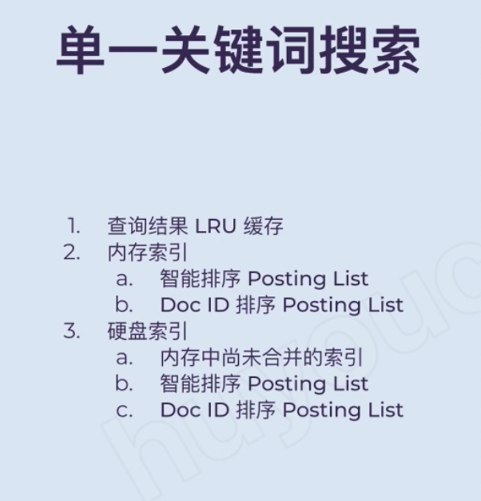
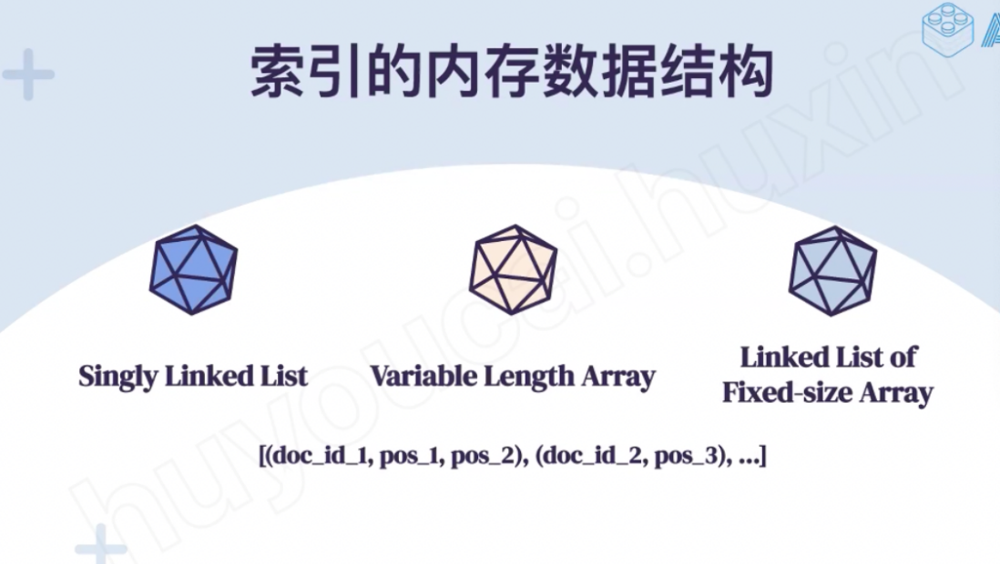
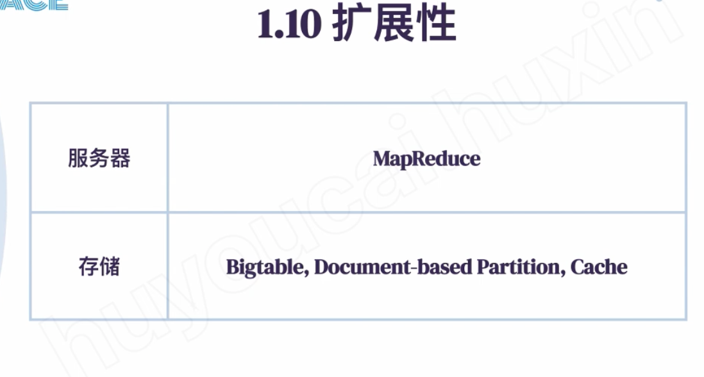
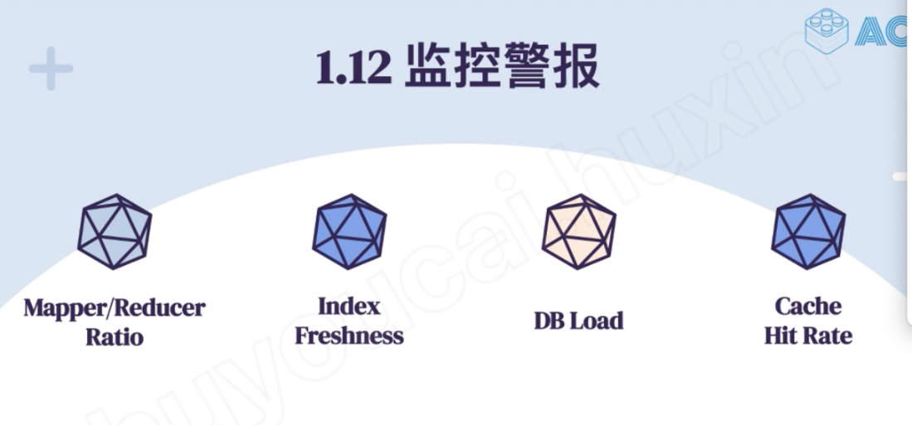

# Summary - ACE

---

The system has 2 part: index builder -- build the index and search or query the keyword.

When we crawler the new webpage, system will store the new webpage to database and send a kind of event to indexer service to create a inverted index for the new webpage and stored it in index store

When user search used like key word search, the search query will go to query processor service and the query process will look up the inverted index in index store and return to user

[For indexer service]{.mark}, we run the mapreduce job to build the inverted index

The mapper job will extract the keywords from webpage

do the tokenization, normalization(vehicle= car), stemming and lemmatization

The map job will read the document, split those documents into group of words, generate the key value pair and write it into the GFS

{key is keyword, value is url+position }

~~Then~~ the MapReduce framework is going to collect together every key value pair and give it to different reduce function

Reducer job will combine those key value pair together, create the [posting list]{.mark} ,store in index store

[MapReduce - ACE](onenote:Mapreduce.one#MapReduce%20-%20ACE&section-id={A28EF3D2-AD11-B849-A1F2-27F121D9A4E3}&page-id={39607F96-AA1E-8041-832A-C8E735E5BC75}&end&base-path=https://d.docs.live.net/77339d157d673f41/Documents/System%20Design/Stream,Search)

Key is keyword and value is a list of {url+position } pair

Keyword ->url+position

From crawl the new page to build index and able to be searched by user, it will take [1-2 days]{.mark}

[How to store (or shard) the posting list, inverted index :]{.mark}

Termed based or document based: Document id ( stored the web page as document)

![Document- Partitioned Index Term- Partitioned Index Advantages Posting Lists are Smaller Easy to manage and scale Intersections are local to a machine Index updates can be done dynamically and one partition at a time Only a subset of machines are used for each query Disadvantages All machines are contacted for each query Merging results from all machines can be expensive Network traffic to all machines can be expensive Remote intersections can be expensive as entire posting lists need to be copied over network Index updates need to be done for entire index ](../../media/Stream^JSearch-Search-Summary---ACE-image5.png)

[Stored the document partition inverted in the memory]{.mark}

[Also stored the long posting list on the disk by using the term partitioned]{.mark}

[老师你好， 在 google search 的 index 设计里，你提到index partition 的策略是hybrid]{.mark}

[我的理解是 index 是用 document parittion ，存放在内存里，如果内存里存不下，在把剩余的存在硬盘里，用的是term-partition。不知道这样的理解对不对？]{.mark}

基本正确，就提一点。

内存部分会使用分布式缓存，所以使用 document partition 之后没有绝对的存不下的问题。我们说不在内存中存储所有的 Inverted Index 数据是因为不常用的长尾 index 放在内存里意义不大，太贵。这些数据就只放在硬盘里就好

一方面，在多数情况下，对于常用的索引，也就是每个关键词中排序最靠前的内容的 Posting List（可以是词频最高 (term frequency)，也可以是所在网站权重更高），我们保留一定数量的在内存中。另一方面，对于很少被查询的内容，我们可以将这些 Posting List 放在硬盘中，在少数情况下使用。

In each posting list, we sort the doc base on the doc id; or we also can consider to sort the doc base on the term frequency ( if the key word occurs more often in one doc, we put that doc on the first)

[Stored based on the doc id]{.mark} --- for keyword intersection

[Index maintainer service for new index]{.mark}

[Intermitted merge -- build the new posting list n other place then merge together ( better one)]{.mark}

[Incremental update -- when user just search a key words, update this key words at the same time]{.mark}

[We can temporarily store the result of each search in memory]{.mark}

[For each query, system will look at the cache first, then query the in meory index storage]{.mark}

[For each term, there are more than one posting list]{.mark}

[One is sorted base on the impact and frequency]{.mark}

[One is sorted base on the doc id]{.mark}

[First 2- 3 page will return the result from impacted or frequency sorting posting list]{.mark}

[Then return from doc id sorting posting list]{.mark}

[Then return from the posting list from disk partition by term base]{.mark}

<https://forum.acecodeinterview.com/t/topic/190/2>

LRU= frequent query cache

[Document partition index:]{.mark}

Pros:

1.  Posting list are smaller and could be short and easy to update (update in one partition)
2.  Intersection locally

Cons:

For each key work, need to scan all the machine, network traffic to all the machine could be expensive

[Term partition index:]{.mark}

Pros:

Don't need scan all the machine

Cons

Term based will have hot words

Need a additional machine for intersection

Expensive for index update

Cannot store in memory

indexer Index maintainer + on disk index storage = big table

Write operation first write a log then write to memory first

Mem table is ~~line indexer~~ Index maintainer for new index

Then merger into disk

SStable is for disk index

Index builder will first update the in-memory storage,

Then update the index maintainer --

Index maintainer will have all new posting list

Then it will fresh into the disk periodically

Linked list we need store the point information

Variable length array -- the array can be extend but cannot insert new data quickly

Linked list fixed size array -- multiple fixed size array linked with array

Doc gap: store the first doc id then rest just store the difference between previous one and current one (docid2 - docid1)

Variable byte encoding, store the number and indicate how many bytes for the number, small number just need less bytes

We can use doc gap and variable bytes encoding at same time

If the position value is continue ... New (postion 1) york (position 2)

Or build index for "New York" , "new York "is the keyword

API:

Start = 30 : start 3th page (each page has 10 item) ( index update is not very frequency)

Mapreduce will store the result in GFS

Index freshness:

For those sites that are updated frequently

We need to check if we update the index for those website

