# Search twitter

Created: 2021-01-01 15:58:50 -0600

Modified: 2021-01-22 23:04:43 -0600

---

[Keynote: Twit](https://www.youtube.com/watch?v=AguWva8P_DI) [ter's search architecture](https://www.youtube.com/watch?v=AguWva8P_DI)

now Twitter has about has more than 230 million monthly active users

and 500 million tweets are sent every single day basically

we have already seen more than 300 billion tweets in the company

they had world record which was 33 thousand tweets per second

this number going above like 800 or 1000

we can easily handle um Peaks like this one also they have more than [2 billion search queries every day]{.mark} that includes API queries and user enter queries which of course it's a huge number

it's just like I have [thirty forty thousand queries per second]{.mark}

[Feature:]{.mark}

now search for images and videos um if you if you search on Twitter you get not only twitter on your search timeline but you get like vine videos and popular images

we also implemented relevant search, you could not only search for all tweets

[ranked by time]{.mark}, now the cost tweets

because there are so many tweets now we also offer a [relevant search]{.mark} so when you just enter a query we even show you the best tweet till all that by time but we kind of filter out the not so important tweets, but you can still have the option actually to search for all tweets if you want to

So here's a high-level picture of our search architecture

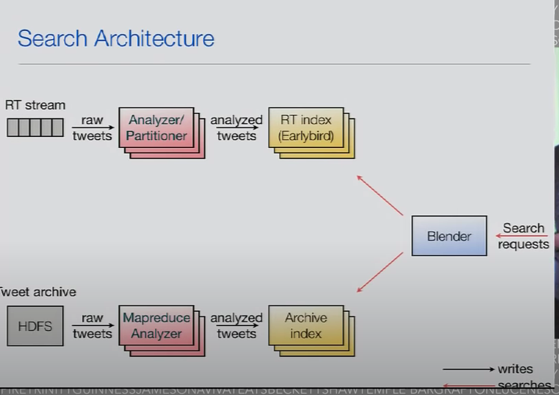{width="5.0in" height="3.5277777777777777in"}

and let's concentrate on the upper part for now so

we get of course a real-time stream of tweets as I said earlier like 500 m tweets per day

we get a stream of raw tweets and [they get fed into our analyzer/ partitioner]{.mark}

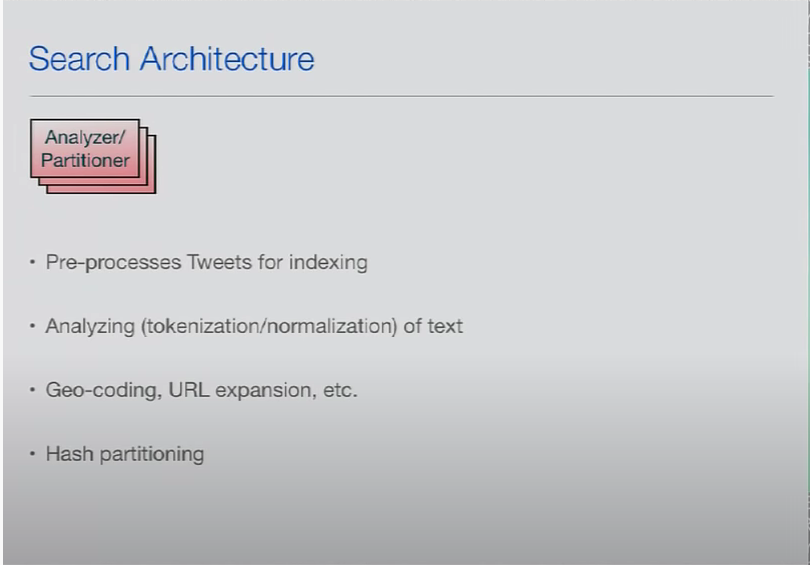{width="5.0in" height="3.4791666666666665in"}

which is a component that takes those tweets and and does stuff

like [normalization tokenization]{.mark} which is called and leucine analyzing the document

it does geocoding if you have [shortened URL to expand to you out and]{.mark} that's a lot of stuff like this and prepares kind of it prepares the Tweet for indexing it stores all that pre tokenized content and thrift objects I don't know if you guys are familiar if that's a data serialization format

and we also dusted off hash partitioning, so of course we

~~don't have all tweets into single index, so we I'm going to show the class~~

~~a layout in a second, but~~ this component actually takes to tweet ID mod set by the number of hash partitions that we have and then arranges the data in different partitions

okay so that's what the analyzers doing here and petitioner so you can see raw tweet come in and analyze tweet come out and get sent to the earlier bird

From [Mock Interview: design recommendation system](https://www.youtube.com/watch?v=JyPE7STy4W4&t=1127s)

We will update the raw tweet token into the bags of words, for example : "good morning"

The bag of words should be like good (0), morning(1)

Remove the stop words like "a", "the "

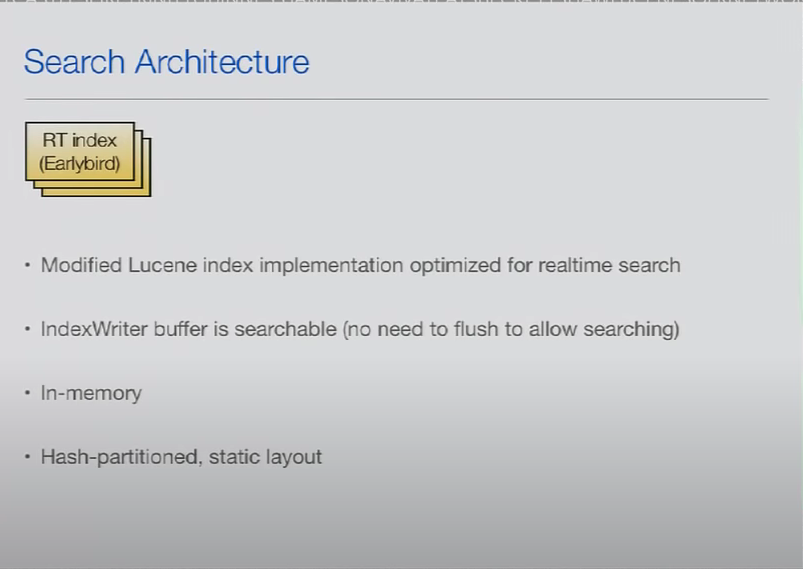{width="5.0in" height="3.5416666666666665in"}

Early bird I said that's a modified Lucine version optimized for real-time search

we don't have to actually flush any in-memory data structures to disk in order to search them, and we've seen every time you

~~actually want to see one to be able to search the most recent documents you~~

~~gather to an index writer you have to call reopen on the next hour update and it will actually internally flush its buffers to this got to run directory and then you can search it that's kind of inefficient for us~~

because and Twitter, we want to be able to always search the [most recent tweets]{.mark} so we would have to reopen the index, writer all the time

~~which would lead to a decrease in indexing throughput, if you had to flush~~

~~all the time~~

so one of the big changeswe made the sec that you actually can search the buffer in the index writer by you out appending to it ,it's all in memory these indexes are all in memory and the hash partition using static layout

so every earlybird index contains a certain number of documents in the real time case and real time index case, it's I think 8 million to 16 million ~~a~~

~~tweet~~ and every earlybird index is replicated a certain number of times for redance and also for just to scale our k per second

then as I mentioned we have a fixed number of hash partition and we it's very simple technique we we just mod the tweet ID to n , figure out and the church petitioner to each should go into

the indexes are sorted in in time order, so what's on the upper end of the slide are the most recent tweets the most recent lucine segments

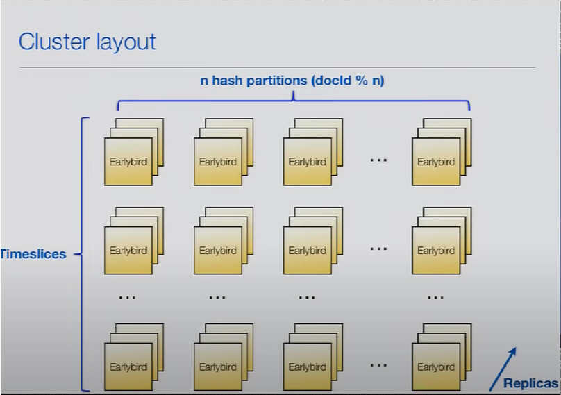{width="5.0in" height="3.5208333333333335in"}

all the segments so this means that the segments on the top here are the ones

that are not complete that we are writing currently to, so these ones we can always can append to, and the older segments when they are full when they

reach 60 million documents then they are fixed and they can't be updated anymore

[you can think of the real-time inindex and Twitter as a cache]{.mark}, so it means

that it's kind of rolling a sliding window of the most recent tweets ,because

basically if some if we have finished a new time sides here or times it's the same word for segment basically if they have finished a new time slice then we

discard the one on the bottom so we always have the same number of tweets

and our in memory index

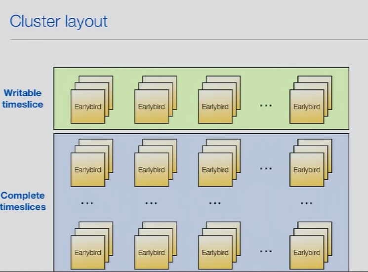{width="5.0in" height="3.701388888888889in"}

so since that is kind of a cache and I said earlier we were only able to

search the most recent tweets, we recently launched the the tweet archive which is a whole different ingestion pipeline here in this picture which is

on the lower half of the slide

[So basically all tweets and Twitter are stored in HDFS]{.mark} and to build these archive indexes, we actually use [MapReduce jobs,]{.mark} so we use we read the retreat from HDFS and daily jobs actually create from these broad feeds again the analyzed content ,so [they analyze the text similarly to the real-time analyzer]{.mark} that I talked about already ,aggregates metadata like, how

it aggregates all that tokenize this text, normalizes text, and

then stores that again in our thrift format, and then we build archive indexes

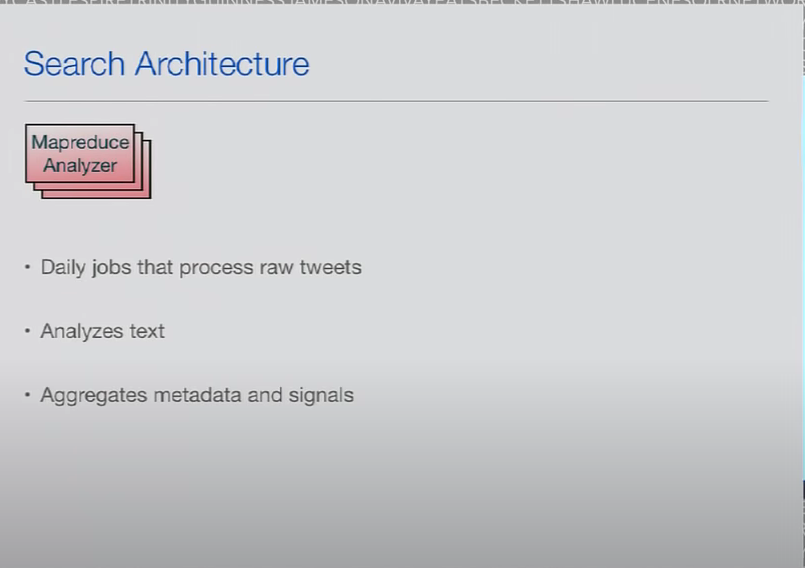{width="5.0in" height="3.5208333333333335in"}

from that and these archive index is currently on the Lucene standard

they are reversed and sorted, and that's actually an advantage them off building them in MapReduce or building them offline

that we can change the sort order of the indexes so since since we still actually even if we do relevant search on Twitter, we still shows [the search results in chronological order ,like from new to old,]{.mark} and so that's why it still makes sens e even though we do relevance filtering it still makes sense to actually sort them new to old for early termination reasons

{width="5.0in" height="2.5833333333333335in"}

the interesting part about the archive indexes that we actually currently have two tiers one tier is a smaller one the upper one here which is and all a memory index Lucene index, whenever goes in the next that contains a small number of the best tweets of all time ~~and best of course is something I cannot tell you how we how we measure that but of course it includes stuff like I of moss a tweet favorited in this kind of stuffs of course we use engagement signals and like a lot of other signals to figure that out~~

and we have a second tier index that's on SSD again a vanilla Lucene index which is much much bigger of course it supports less QPS which is fine because first but first always do is we hit our in memory archive index and only if it didn't find enough search results, then we actually go to the SSD index which still has actually really good latency

SSDs are fast nowadays but the throughput is not as good of course as in memory ,

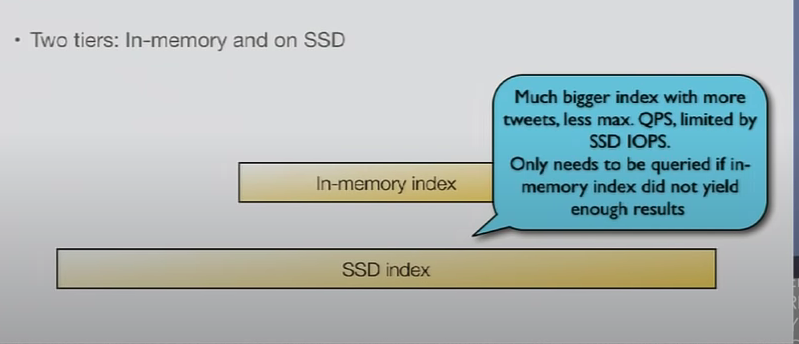{width="5.0in" height="2.1458333333333335in"}

let me have component called Blender ,the blender is a thrift aggregation service,which basically takes the search

requests that you enter a query on your iPhone or website, the blender receives a request as a thrift object and the blender has a workflow management system it knows a lot of different services within Twitter that knows our different search indexes like the the real-time earlybird index

into archive index it also knows like other things like how to map user names to user IDs and like a lot of different internal services and

[it can call all these services and it knows exactly for each query which services do I need to call,]{.mark} to satisfy the query so for some queries we need to call more services and other ones

for example if you search for something like you know best photo for near San Francisco, right so now we have to figure out what that's near San Francisco mean, we have to talk to geo service, the blender also figures out what services

Can call in parallel ,but what which ones can it only call serial so for example

in parallel it could probably call those two indexes and get results from both

but it could not in my example say I just mentioned cause the geo service at

the same times racene because it needs to know the location before I can call it

the blender takes that request fans it out to multiple components for example our two indexes here receives result, merges them together does maybe some post-processing, [some ranking some de duplicated filtering]{.mark} and sends it back to the caller and then we can render it on your device

it's pretty much it one thing I haven't mentioned yet is I said most of these segments after they're full they are they are complete and not not mutable anymore, it's not completely true we have another stream of updates which can be deletes everybody, can [delete tweets]{.mark} or if there's new engagement on a tweet like if you favorite it, we send these signals to these different indexes and update and memory data structures

One difference that early bird has compared to see notes is that we can update

column stripe fields or I think they're called dock values in the lucence,

something they've seen is catching up with lucence, now it's much easier for us because fast it's our memory we can overwrite a lot of these signals just in place and

~~you'll see it's a little different you have to talk there about merging ,and but~~

~~yellow scenes getting this feature soon too but we use these updated become~~

~~stripe fields to update all these signals and they come in through a~~

~~different pipeline~~

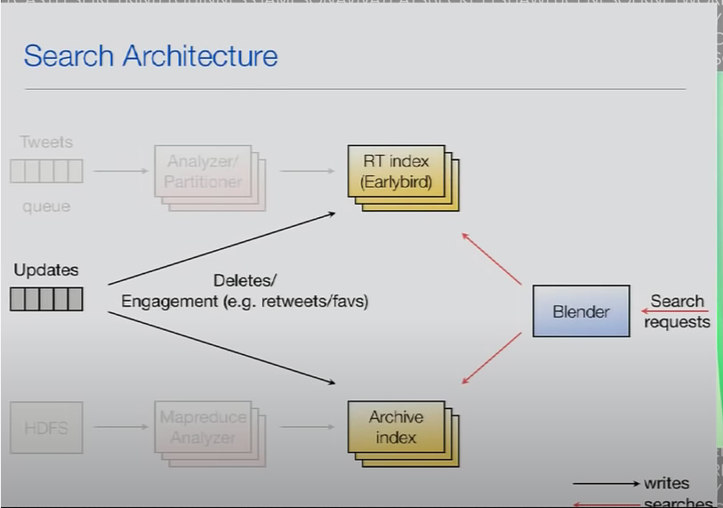{width="5.0in" height="3.5069444444444446in"}

the search architecture so is the

question was the hash based on tweet

identifier so how do we assign identify

us to tweets um that happens already

like way before the treats even get to

the search engine we have a project I

think it's naive in the open source code

[snowflake]{.mark} and it's a distributed ID

generator that can Jen

read unique IDs for the different feeds

and I think there's blog posts out there

how exactly it works but yeah every

tweet gets a unique idea sign and then

it's the tweet carry set ID already when

we get it and search and then we just

use that at the end and mod modded by

the number of hash petitions okay

[all these search engines use an inverted index to do fast retrieval]{.mark}, and if you

look at these six documents and you want to find the word in these ,it would be not very smart to just keep searching until you find the word ,that would be very slow that's why we built an inverted index

what it basically does is it takes all documents finds all unique terms and all these documents and builds a dictionary right side, so these are all you know alphabetically sorted terms that occur in these six documents are unique terms, and then on the right side we have something called the [posting list]{.mark}, so for example if you want to search for the word "keeper" which occurs in documents, 1,4, and 5

you could quickly find it here in the dictionary ,it's like basically in the book if you read a book and in the end, you have also like a dictionary lookup table right there's pages it's very similar here you find the word keeper in the dictionary

it could be a hash table in early birds case finally quickly look at the posting list and it tells you the document occurs in sorry the term occurs in documents 1,4 and 5

{width="5.0in" height="3.5625in"}

so now when we talk about data in data encoding in an index, the majority of all the data is really in the posting supposing is occupy a large percentage of your entire index

so they have to be stored very efficiently and ideally we can it would be nice to compress them really well

So if you look at the dock IDs up here, if you for example had the posting list

with numbers 5, 15, 9000,9002 .. then those numbers are pretty big

while you seen that and early bird

we do [Delta encoding so we don't store there the number itself,but the difference between the current posting and the previous posting,]{.mark}

so why does it help us it help us helps us if we can actually store smaller numbers in a more compressed way

that works is you don't always use 4 bytes for each integer by the user variable not number of bytes and you actually use only 7 bits to encode the value itself

[and use the first bit to indicate, if the next byte following the bite]{.mark} you'recurrently decoding is part of the same number, so for example if you want to

store a number 5 we mark the first bit ,first bit is marked 0 so now

the decoder knows okay I only need to read this one by it and then I know what my what the value is I don't have to read the next bites

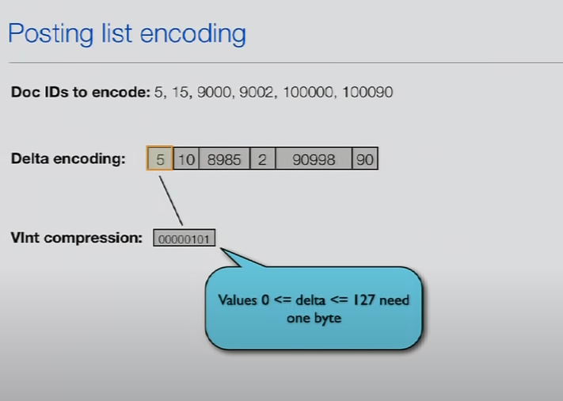{width="5.0in" height="3.548611111111111in"}

you store a bigger number like [8000 that doesn't fit into 7 bits obviously]{.mark}

[7 bits can only store a number up 127, so in this case we need 2 bytes and the first bit after the first byte would be a 1,]{.mark} so now the deoder actually knows oh I have to also decode the next byte to figure out what my overall values

and the next byte, then it reads the next byte that starts with a 0 and now the

decoder knows ok I have I have read all bytes for this particular value, ~~so now~~

~~we only need variable number of bytes for you for numbers and now it makes~~

~~sense to actually mix in them as smaller to save space~~

{width="5.0in" height="3.5069444444444446in"}

that's why we do use Delta encoding

so some problems here and that's why we had to change this encoding an early-bird is that you can only read these posting inNold to new direction and the direction you have written them in because Delta encoding every posting depends on the previous one

am i doing this every posting depends on the previous one, because we have this Delta Delta encoding

so I'm it's only possible to read these posting is in old to new direction, and now if you think about Twitter, we always want to return the most recent tweets first because those are the most interesting ones in real-time search

so we would actually ideally like

to read the postings in the opposite

direction because then we could early

terminate after we found enough result

and don't have to read the entire

posting this so that's why we wanted to

change this to be able to read and in

the opposite direction the other problem

with using viens is that in java are

probably in any programming language you

cannot write a variable number of bytes

atomically so you can write a 32-bit

number like an integer you can write

that atomically

atomically means that one thread can

write it and a different thread will

never see a value other than the old or

the new value it will not get any dirty

reads it's a really atomic operation on

the low level on the cpu level if you if

you want to store a number of as

multiple bytes like with three bytes

this it's impossible to store that in

java atomically and for our concurrency

model an early-bird it's very important

for us that that we can actually write

these numbers atomically so that's why

it also doesn't work for us and really

birth to use very number of bytes per

posting

which brings me to the implementation of

early bird sportiness the encoding

actually this is what we used to use

very recently we change the slightly and

[To compress Tweet IDs, we first mapped the full 64-bit ID into a 0-indexed local ID:]{.mark}

I'm going to cover what it what it looks like now, but it used to be extremely

simple actually every posting used to be one integer and you split up that into integer into two parts, the up the [24 bits are the doc ID,]{.mark} itself that means it can have at maximum value of 16.7 million that's also where is the maximum segment size that I mentioned earlier comes from where I said every segment can only have 16.7 million documents that's because of this limitation

that we only use 24 bits for the doc ID, that leaves us 8 bits and in this these 8 bits we store the position of a term within a document, and we need

to store the position because if you do so for example phrase queries if you've

searched for "San Francisco" in quotes we need to know that San Francisco are next to each other, for that reason we have to store not only the doc ID we

also have to store and we've seen the position of a term

so now treats are very short 140 characters so even if you have a Japanese tweet that doesn't use white spaces, and you would tokenize like it in

240 tokens, you would still not get more tokens than you know 225

which is why we say we if we said okay 8 bits are not for the position and

we kind of a reserved fixed number of bits for that reason

{width="5.0in" height="2.736111111111111in"}

so now the cool thing is actually, you can now it because it's so simple because we don't do Delta compression or anything else you can use

you can read this in both directions

right now no posting depends on the on

the previous one so it's very easy to

just decode them in reverse order so we

write them in on here in left to right

direction and we read them and write

your left direction and for example if

you want to return three search results

you can start searching and after you've

found three results you can actually

stop you can early terminate you don't

have to look at the rest of the postings

anymore if you can only read and left to

right direction it's much it's much

harder problem much

you cannot do it as efficiently to find

the last three results if you especially

if you don't know where the posting is

ends because index writer is appending

to it so this is a very simple but very

efficient implementation now how does it

work to store to store all these

postings I'm done I'm going to cover

this also pretty quickly now and after

that I will more focus on how we are

changing this encoding to support

documents at eff more than hundred forty

characters so

if you remember earlier when I said when I showed you how an inverted index works that we have a dictionary component, and then we have also posting this so I'm not going to cover now how we encode the dictionary

an in-memory hash table very very simple you seen has some fancy FST's

And this is that we want to store a lot of link basically posting, it's a linked list right so we want to store a lot of this posting list in a

very efficient way, and the challenge is

if you see in tweet with the term you haven't seen before, maybe new hash tag

for example ,at that point you have no idea I going to see this term again? ~~you~~

~~know because maybe it's like this new theme or a meme or a new like I'm~~

~~breaking news so maybe~~ now you're going to see this five million times that hash tag, and you need to allocate a lot of memory for that corresponding list

Also the unique term like someone like made up some funny word and you're never going to see it again, in this case of course you don't want to allocate a lot of memory ,so first time you see it you have no idea what to do um

also since it's all memory, we have to be very careful about garbage collection, it should ideally use a constant number of objects ,this whole storage and not until the independent on the number of objects

that we use should be independent on the number of postings and yeah it should be possible to read them in the opposite order as I said earlier and we need to be able to so the lock-free part is something ~~I~~

~~talked about two years ago and thus~~

~~alone I can't talk about it right now~~

~~but the talk is online so I encourage~~

~~you to check that out it's actually my~~

~~favorite topic about early word but~~

~~there's not enough time today to also~~

~~talk about this one but what I said~~

~~earlier it's important for~~ this

threading model that we can write to postings atomically and if you check out

the other target you you will understand why

![Posting lists storage - Objectives • Store many single-linked lists of different lengths space-efficiently • The number of java objects should be independent of the number of lists or number of items in the lists • Every item should be a possible entry point into the lists for iterators, i.e. items should not be dependent on other items (e.g. no delta encoding) • Append and read possible by multiple threads in a lock-free fashion (single append thread. multiple reader threads) • Traversal in backwards order ](../../media/Stream^JSearch-Twitter-Search-Search-twitter-image14.png){width="5.0in" height="3.5277777777777777in"}

okay so how does this work for now imagine we have in memory 4 levels of

integer arrays and this to integer array on each level can grow into from left to right( this direction )by allocating new integer array blocks in Java ,but you can kind of for simplicity just think of we have four arrays that can individually grow, and we can kind of forget that they're block, by multiple blocks so you can just think of four different array on four levels

on each level we can allocate what we call slices, which can be assigned to particular terms so on the lowest level we can allocate a slice of the size of 2(Integer) and the next level we can allocate a size, the size of 16(Integer) and so forth, each level we can allocate a multiple of these slices, but they will always have the same size it's shown here ,so now when we see new term, we don't know yet as I said we don't know how often you're going to see it so the first thing we do is we go to the lowest pool and allocate a new slice to integers for it so now we have room for two postings, we have seen the term of course already the first time so we store that in that slice, and we will have room for another occurrence of this term

so let's say we see the term you know three times, we have stored the first two occurrences in the slice yeah now we see the third time ,now we say okay it's probably likely if you see the third time, you're gonna see it more than like a bunch more times now so now we go up a level, and say okay now we allocate 16 integers additionally and we can store the next 16 occurrences of that

term in in that slice

so then if you have seen it 18 times, we go up a level, if you have seen

828 plus 18 whatever that is then we allocate the slice on the highest level

then we have room for 2048 more occurrences and if you see it even more often than 2200 also then we stay on the upper level and just allocate slices on the upper level

{width="5.0in" height="2.4375in"}

the question is how do we search this, we as I said we want to search in the opposite of the insertion order right, so we kind of write from left to right but we want to search in from right to left

how does it know if it searches the slice to get to the previous slice right

so we need to be able to link the slices together, to make it really a linked list

every verse linked list basically again

this was a this was a posting encoding just as a reminder it fits into one Integer, the cool thing is it actually took any pointer to any of these postings also fits into one integer ,because they encoded like this we have

{width="5.0in" height="3.2083333333333335in"}

we take a 32-bit integer and divide into three sections this time the first section uses two bits to indicate which pool we are using, which level basically

remember we had four levels so these two bits are enough to determine on which level we are talking about the

||||||| slice

next section is the index within the level which slice we are talking about

so for example you know this would be level 0 this is the first slice, second slice, third slice, so that slice index indicates which slice we are talking

about

then depending on which level, we are we need to certain number of bits for an offset with within the slice ,on the lowest level, you only need 1 bit because the slice size is 2 ,we only need to say it's the first to the second integer, if you go up we may need 2 up to 11 bits to indicate which particular posting you are talking about

so that's how we can encode the pointer also into a integer and the cool thing is now that it can store the pointers itself and integers we can store them in

the same arrays, and basically we can say: ok the first integer in the slice it's not a posting it's actually pointer backwards to the previous slice

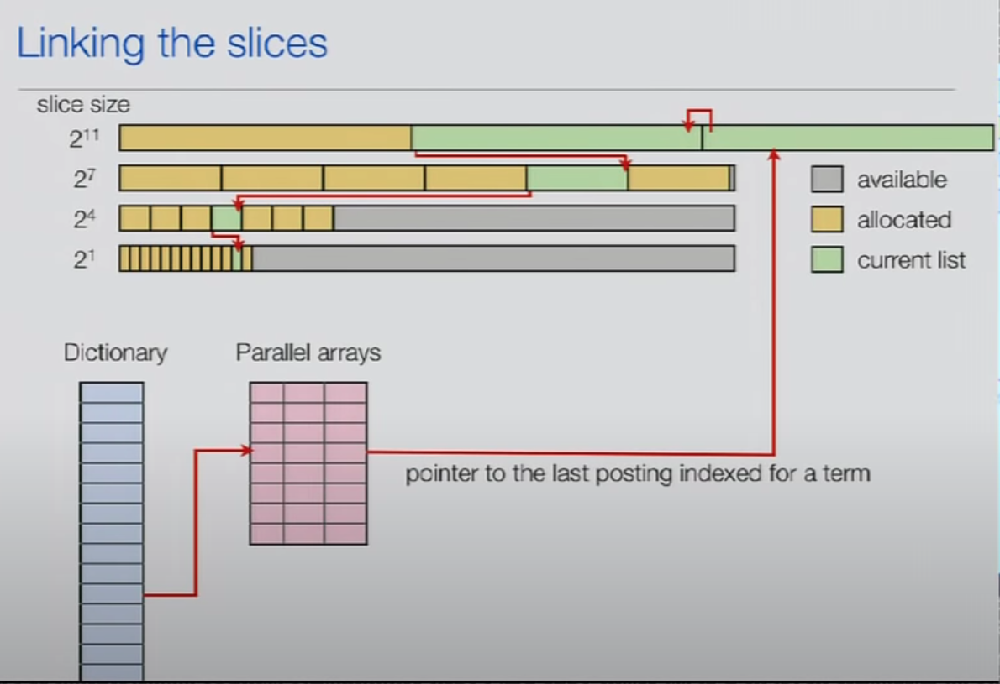{width="5.0in" height="3.4166666666666665in"}

and now

the whole thing looks like this when you when you enter hashtag in the search engine, we first look it up in the dictionary, [we find a pointer to the most recent posting and then we search backwards]{.mark}, and the current in the slice maybe the [early terminate]{.mark} because we found enough results, but maybe we can't determinate ,so then we reach the beginning of the slice, say hi it's a pointer to the previous one, we follow it, and then we can decode the next slide and so forth ,until we either early terminate, all these search until the very end of beginning

I guess that

make sense

I'm sorry so the question is why do we

use these two bits because we should

know which level we are referring to we

don't right because here we don't know

if we are going to stay on the same

level or if you're going down the level

okay there's two yeah there's two

possibilities true we could safe a bit

however this pointer that points from

the dictionary to the most recent

posting uses the same encoding and of

course if you have seen the term only

one time it could certainly point to

this level so it couldn't really point

to anywhere so that's kind of the answer

I mean also we don't really need to bet

for anything else which is something I

usually don't say that yeah

so as a summary for those postings encoding Ints can be written atomically in java, again important for threading model

we can read these posting lists in backwards order

every posting is possible entry point, basically that means you can follow pointer to anywhere in this list and start searching, you don't there's no context you need to know

we can do with efficient skipping because it's fixed sizes posing, so you can say I want to skip ten over ten postings without needing additional data structures

one thing I might I have not mentioned yet is that a disadvantage of this encoding is especially when we talk about bigger documents that let's say you have a document that contains the same term multiple times, and tweets that's not very likely, because tweets are so short , but we do that's different to lucina's we just store the entire posting multiple times, so we repeat the doc ID we've write the same doc ID twice, in that case

um that's fine for tweets because again that doesn't happen very often,

but if you talk about large documents, if you index like you know multiple page

documents of course that will have stop writing document id many times and you don't want to encode the doc ID like knew a thousand times if the it's a thousand times contained in your document, we've seen does it differently it actually stores the doc ID and followed by a value called to term frequency that was actually uh earlier on the slide, but inverted index which is the length of

the posting this ,so you see in store so doc ID ,then the term frequency and

then it stores the positions

so clearly this advantage if we would use if we want to use this encoding for larger documents

{width="5.0in" height="3.4166666666666665in"}

so that brings us to the new posting is encoding that we recently switched to so

the objectives are we want to support 32-bit positions, not only eight bits to be compatible to luence

since posting this API we want to support payloads which you guys know

what payloads are probably most of you do with every with every posting you can store metadata in a byte array that can have any number of bytes you one we want

to store term frequency which are just

mentioned instead of repeating doc IDs

because it just doesn't make sense for

large documents to repeat to doc IDs we

want to keep our concurrency model very

important otherwise the whole approach

doesn't really work anymore for us we

want to stay space efficient foot for

the street use case but we want to add

the flexibility for large documents so

but we want to keep the space

optimizations and we want to keep the

performance that we're seeing right now

{width="5.0in" height="4.298611111111111in"}

okay so now when we look at the leucine posting a basic consists now there's a

consists of a doc ID ,then of the term frequency, that I mentioned and then of one or more of these position payload pairs for this particular document

the new posting is encoding what we want to do is we want to keep the fact that these postings that contain the Doc ID these are fixed size are integers

because again they can be written atomically and for enum of other reasons

and then you can also continue using that memory storage model that I showed you, but you want to support variable lengths for these positions and payloads

{width="5.0in" height="3.5069444444444446in"}

so what you seen us and what we are going to do in Earlybird 2 ,we want to store them in separate data structures and separate streams and the upper one is basically what we talked , these yellow boxes is basically one integer and it contains the dock IDs before, but now it may actually contain the term frequency instead of the position for the 8 bits ,and all the positions and payloads can be stored on a separate data structure where for each posting we can have vary length bytes here

the problem now is how do we correlate the dock ID posting with the corresponding position payload pair posting

it's not an easy problem because you do not want to store a pointer for every single posting because then the pointer itself would be as big as posting itself right we would also use probably a 32-bit integer since these are 32-bit integers we would actually double the amount of space we need ,but because of our concurrency model it's also there's a lot of limitations, we

have because we write everything in the lock free way we have to make sure we don't get dirty reads and that kind of stuff so it's it's kind of a difficult

problem how to encode these pointers Right

so now the idea is to actually use an embedded skip list, and skip list

something leucine uses for speed, we introduced some you know for two reasons for speed but also for these pointers

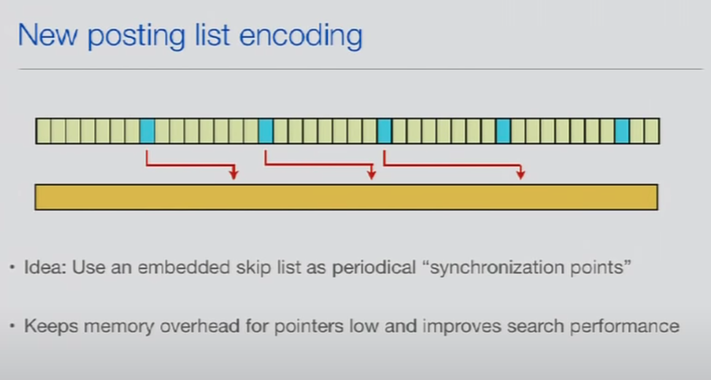{width="5.0in" height="2.6666666666666665in"}

the ideas that at regular intervals in this dock ID stream, we inject these Skip points, and the Skip point contains a pointer to where in the stream the position payload stream the corresponding section starts,

and now the cool thing is that we actually don't need to that we don't need too much space to encode all the pointers, but we have them regularly enough so that it works for that it perform it enough

if you look at how these are stored if you take a slice for example on the lowest level,remember that was a slice on the highest 2048 integer slice, we change the encoding now so that basically it has the header and the header contains all the Skip entries that I showed, logically the Skip entries

are kind of evenly spaced over the entire posting, or the slice in this

case but now we store them together [in the header of the slice for]{.mark} cash efficiency reasons, and simplicity reasons

so [the first integer again as before a space pointer and the next section in this header has now the Skip list for our postings in the slice that contains the point us to the to the position payload stream]{.mark} ,and it also contains the dock IDs at the positions where these points are

that's helpful if you for example want to skip to a certain Doc ID you don't really have to scan the sole stream you can actually just scan the skip list, like lucine, you can just skip scans a much smaller skip list, find the right entry point that's close to where you want to go, skip there and then search for the extra posting between those two skip points

when you actually find that skip point, you also read the corresponding pointer into the position payload list and know where the corresponding bytes start and that other storage

what they use it for but I can just tell you that it's also ,it actually special we made for compatibility with leucine ,leucine has point-in-time semantics

which means when you open an index reader, the luence sees a static snapshot of your index, as our encoding it's very very hard, it used to be very hard to

actually return a length of the posting list in the point-in-time semantics that, because we appending to the posting is all the time

so the length is always changing but an existing index reader wants to see what was the length of the posting is at the time when I when I was opened, so using sliced IDs we can actually from the index reader knows it's pointing at a

particular slice, it can easily from the slice ID calculate what is the length of positing is up to that point

actually know O(1) like we've return the length of the posting,

list which is very going to be very important when we want to contribute the

spectra leucine

{width="5.0in" height="3.9930555555555554in"}

so this was the old encoding of a posting itself, so now as I mentioned we can be done when you use these 8 bits only for the position anymore ,but now we want to actually store also the term frequency in there

so one observation is that tweets can have 140 characters or they could have 140 tokens if you have a non whitespace language, but most of the times I don't I mean normally I don't know tweets maybe we have ten words on average in harmony ,but roughly like that I would guess so the number ten you can store in four bits, so you you almost never need the full 8bits to store the positions

so we said okay we're going to steal one bit and the bit is going to be an indicator of whether the other 7 bits actually contain the term frequency or if they actually have the position in line

~~so now when can we inline the position instead of storing a termfrequency well we can do it if the "term freq" can see is 1 because then we know we have exactly one posting for this document and this term so~~ now wecan say okay if the term frequency is 1,we're going to set a bit to 0, and we know that the other seven bits as before are actually the position of that single occurrence of the term in that tweet

~~and there are some other conditions when that have to be fulfilled in order for us to inline they're kind of like implementation details~~

the text position has to be smaller than127 because seven bits can only start the very hundred twenty seven so if we had a

tweet you know that had hundred forty

characters and has like hundred forty

tokens and the token occurs at position

hundred forty then we couldn't we would

not be able to invent that position

because in the Mahon for you cannot be

stored in seven bits but of course that

doesn't happen very often and also if we

would use payloads we cannot do it

because with payloads we know we have to

store the payloads and the other stream

so that's why we would also not be able

to inline the position here and that's

an implementation detail we cannot

actually inline it if a posting is right

behind the sky point for kind of

complicated reasons

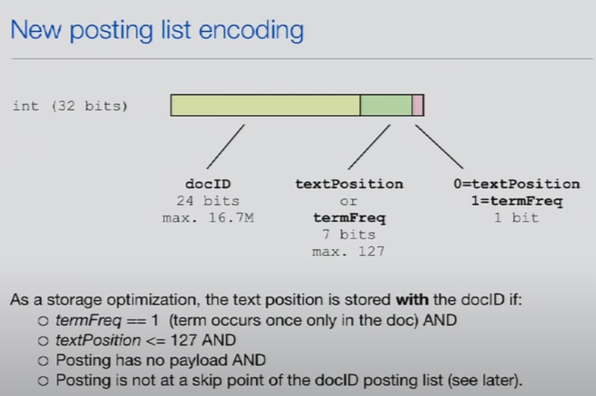{width="5.0in" height="3.326388888888889in"}

yeah okay so the summer here is that we

can not support with this format 32-bit

positions and we can support payloads

and we still keep the optimizations for

Tweets we still keep the fact that dock

IDs are stored in 32-bit integers we

keep our entire threading model we keep

optimizations for treats where you can

inline positions in 99% of the cases and

actually you know it's just in lined and

we don't currently in the tthe next

have to use the additional data

structure skip lists I actually now

introduced they improve performance of

especially boolean queries and we use a

messy synchronization points to find

quickly where and the other day of

structure the corresponding data is and

for short oh yeah it's worse at array

and the performance and space

consumption actually knows this formulas

is almost identical to the previous

format so we added all these new

features but the performance you can

almost in our graphs you cannot see when

we deployed this because the performance

is so similar and also the size of the

indexes is almost the same it's slightly

bigger of course because now we have

skippers and sometimes maybe we cannot

inline a position button it's it's

almost not noticeable and that is pretty

much it

{width="5.0in" height="3.326388888888889in"}

and none of the questions I have

one question regarding you re item shot

search I don't really understand why the

basic listing index cannot provide such

functionality to you why to him /

implement your own invert index yeah

good question um the answer is I what I

was trying to hint at earlier the value

seen the near real-time using is called

the near real-time search feature right

so the index Rider

are you familiar with loosing the API in

X writer and that yeah so if you append

a document to the index writer it puts

them it puts the terms and the postings

into similar data structures at the ones

that I talked about that but these data

structures are not searchable

they are kind of internal buffers so now

they are penned it but

they're not searchable if you call open

x-reader on the writer and get the fresh

next video that can search these these

latest documents but the next way that

actually does it need to flush these in

memory buffers to disk or to a different

in memory ram directory so it flushes em

it converts the the hole buffer into a

different format so if you call in our

case we actually open it next three

doubles every single query like we get

as I said two billion queries per day

every single query is called a column

index reader because for us it's a it's

a cheap operation I couldn't talk about

them the threading model unfortunately

for time reasons but that threading

model allows us to open an index reader

super efficiently and we that actually

doesn't trigger a flush of this a memory

buffer to a different two to a disk or

to a different remnar rectory right if

you would do the same thing in the scene

every single key with every single time

open a new index reader is what every

single time probably after every tweet

or every like 10th Street or so flush

that stuff to this go to to the RAM

directory and then you would actually

later pay for that because it has to

merge all these segments together Lucy

would start segment merging so what you

actually the but the problem then is in

your scene is that the more often you

call open next reader the more your

indexing performance goes down because

the next writer will be busy a segment

merging the in our implementation the

completely decoupled indexing and

searching so you can as I said you can

call 2 billion times open next video per

day and we never flush anything to disk

and we never have to do segment emerging

so this the indexing throughput like if

you have if you look at a graph of

earlybird and it's not accepting any

traffic it's just indexing and then you

start hitting it with queries you don't

see a slowdown at all in the indexing

performance so that's pretty much the

reason why we are you doing this and

that's why all these data structures

have to be a little bit more calm I

don't want to say complicated but I have

to meet other requirements for threading

reasons for our the way our concurrency

model works

yeah yeah I have two questions one's

just a detail I'm curious if you have

more like doc frequency is bigger than

127 you just repeat the oh yeah posting

that was one I assume just repeat it

like you did in the old system no no I

took that slide out because I thought it

would be too many details okay it's

actually pretty easy we just store the

value 127 in that spot in those seven

bits and we store the actual number then

in the secondary data structure okay

yeah so and then the other question is

just about have you compared the size of

the indexes with the variable length

encodings that leucine has and what are

the trade-offs likely to be yeah we have

about I want to say 30% more space

compared to a leucine segment what we do

is actually we the segments are complete

remember I had to like uncomplete ones

on the top and in the blue box I had the

complete ones we actually when they're

completely start compressing them and

the very similar form onto leucine and

then we kind of reclaim the space so we

actually only pay that 30 percent

overhead for the most recent segments

but that's actually even a fair

comparison at all the fair comparison

would be to compare this encoding to

that in memory buffer in the scene that

is currently not searchable because like

I haven't compared those to likely

leucine this smaller because they can

actually use viens they don't have to

fulfill those training requirements but

that would be more fair comparison to

compare those two Thanks yeah when you

talk about contributing this to leucine

yeah does it mean that the single index

will be limited to sixteen point seven

million documents or segments above that

number won't be merge anymore it would

mean that we would have to flush the

buffer after sixteen million documents

you can still have bigger segments but

um but I talked about earlier like right

now leucine when you call up my next

video it flushes the stea structure into

segments

I think in this case it would just mean

we could delay that flush until we reach

sixteen point seven million okay so it's

only the in memory representation yes

yeah as soon as you flush this as soon

as it kind of compressed this you would

actually convert it into like a standard

leucine from it it just in fact

something we are working on that even

for those complete segments when we

optimize them that we don't use a custom

format anymore but we actually use going

to use a window losing form the only

thing why that's a little tricky to do

right now is that we have a custom

implementation of dock values because we

need to be able to update them in memory

that's why currently it's a little

tricky for us to just convert what we

have to another Lucene but we are

working on it

and the back just occurs to me this

seems very similar to the kind of

problems we have to solve for log

analysis have you thought about

splitting Twitter and opening up a log

searching business as well

I have no person you thought about this

no yeah but I mean this I think this

would be a good use case a good

implementation for a lot of use cases

that require real-time access to your

documents and where you have it's really

good approach for use cases where all

your numbers are high your numbers your

documents per second the number of

queries you have and especially the

latency that you have to meet between

indexing and searching so whenever you

have a use case where all these numbers

have to be very high all the latency

very low then this is a good approach

anything else

all right hi what about faceting you on

Twitter you can search but it's

impossible to to have some facets but

about the result is it because you have

this early termination about the on the

search that's it's a good question

actually it's the we have some sort of

faceted so also we have technologies

that are very similar to faceted search

but kind of hidden from the user if you

think of a use case where you want to

return where it's actually it's basic

basically faceted search right if you

want to return in an index where the

documents are tweets you want to return

results that are not read so that for

example photos for this could be

considered a facet right um you could

you could build a course in the index on

on your meta photos but if you talk

about the real time use case like

Twitter that's very hard because maybe

you see the photo you know now and ten

minutes in the next ten minutes people

are going to comment on it or tweet

about it so when are you going to index

that photo right because all the Texas

have metadata of the of the document by

going to see it later so for that use

case the facet approach is actually

pretty cool because now we can index for

every tweet that has this particular

photo we can assign we can identify okay

that link is a photo and we can assign

an ID to it and now we can actually

facet on these IDs so you could for

example search for when I say best

photos in San Francisco your query you

know would be San Francisco and we match

we find every tweet that Metro San

Francisco look up this ID of look up

what facets this tweet contains in the

facets are for example this photo and

then have an accumulator that counts

which IDs occur most often and the

results but yes you're right um our

determination can be a problem but

basically what the answer is that we

just keep searching longer I mean we

would probably still not search a few

want to find the best picture system in

school we aren't going to search all

three and billion tweets right so we

research more but we also determined at

some point but yeah we don't have this

classic the exposed facet feature via

it's more like where people can click

photos together it's more like used

under the covers for these kind of use

cases could you tell a bit of how you

deal with Kasia flashes or do you even

care about them with what cache have

flashes you know so what I'm asking a

bit from the solar perspective so every

time you can meet your Kasia flashes

okay she cashes um we don't we don't

commit it's all a memory right so is it

so that you always search backwards in

the most recent segment and it's fast

enough for you it's all a memory there's

no caching here all segments are memory

the ones on the real time index a all

the memory and it's still fast enough

well I don't know in the question I mean

caching is also memory right

yeah but case you can have different

data structure oh you're talking for

fast search you know okay I thought you

maybe meant the file system cache so

you're meanings specific yeah like ashes

or yeah

query search caching basis okay okay

okay okay sorry we do have some caching

we have different caching approaches um

I think I may have talked about one last

time here which is we can cache partial

results so for example let's say you

have certain operators you always append

to every query for example when you

enter San Francisco a really search for

maybe if sigh excedrin Cisco and not

from spam users and do not contain

offensive images I could be something

right that's not really the query but

it's an example so let's say we append

obviously two operators no spam no

offensive content to the query it

wouldn't make sense to always really

join these operators in

so then in that case we have kind of

what we call the curry cache where we

can actually cache partial query results

for example no spam and no offensive

content the merge of of these operate

and these two operators the result of

that we can actually cache a memory and

next time someone enters a new curry we

don't have to evaluate these two

operators again we can actually just

join those results that the interesting

part is how we do those real real-time

search again if you leave it was in the

last presentation if you look at this

talk that you can't see right now

because the screen doesn't show the

bottom of the slide but there's a link

down here which links to the previous

slide from Barcelona and actually that I

think covers how this cache works and

then we have other caches in the system

like the blender that I talked about a

few issues the exact same Korean like

one millisecond later it's going to hit

that cache and a lot of cases not in all

cases so there's kind of different

caches in this but you have to flush it

some some times right because you get

new data so you have to flush the old

cache or rebuild it somehow yeah so my

question the sketch that I was talking

about the baby updated in the real-time

case it's a little bit it's hard to

explain that without slides I again in

this talk I explained how it works we

have kind of an we have kind of a

background thread that why you're

appending posting is you can also update

the cache but sometimes you got to

rebuild the whole thing yeah so we have

some approaches to do this efficiently

yeah okay thanks

you

