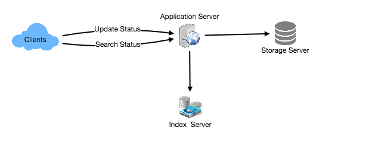
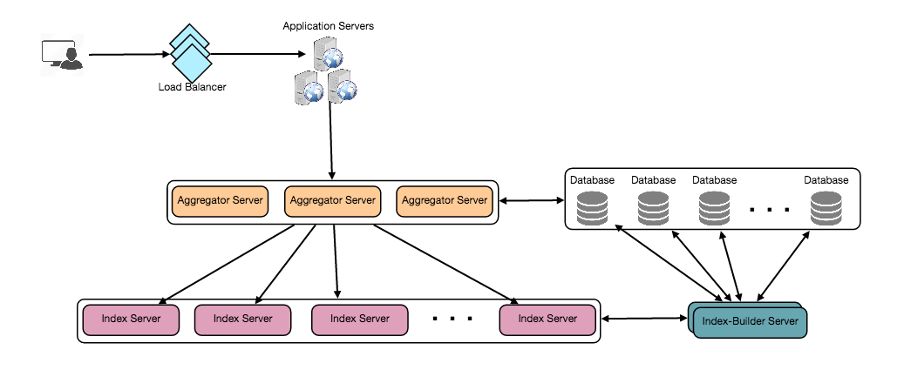

# Service for status search

---

we need to store all the statues in a database, and also build an index that can keep track of which word appears in which status. This index will help us quickly find statuses that users are trying to search.

Search: (index database)

Index: What should our index look like? Since our status queries will consist of words, therefore, let's build our index that can tell us which word comes in which status.

So our index would be like a big distributed hash table, where 'key' would be the word, and 'value' will be a list of StatusIDs of all those status objects which contain that word.

**How big our index will be.**

If we want to build an index for all the English words and some famous nouns like people names, city names,etc.and if we assume that we have around 300K English words and 200K nouns, then we will have 500k total words in our index. Let's assume that the average length of a word is five characters. If we are keeping our index in memory, we would need 2.5MB of memory to store all the words:

500K * 5 => 2.5 MB

Let's assume that we want to keep the index in memory for all the status objects for only past two years. Since we will be getting 730Billion status objects in 5 years, this will

give us 292Billion status messages in two years. Given that, each StatusID will be 5 bytes, how much memory will we need to store all the StatusIDs?

292Billion * 5 => 1460 GB

Assuming on the average we have 40 words in each status and since we will not be indexing prepositions and other small words like 'the', 'an', 'and' etc., let's assume we will have around 15 words in each status that need to be indexed. This means each StatusID will be stored 15 times in our index. So total memory will need to

store our index:

(1460 * 15) + 2.5MB ~= 21 TB

Assuming a high-end server has 144MB of memory, we would need 152 such servers to hold our index.

**How to shard index service?**

Sharding based on Words: While building our index, we will iterate through all the words of a status and calculate the hash of each word to find the server where it would be indexed. To find all statuses containing a specific word we have to query only that server which contains this word.

We have a couple of issues with this approach:

1. What if a word becomes hot? There would be a lot of queries on the server holding that word. This high load will affect the performance of our service.

2. Over time some words can end up storing a lot of StatusIDs compared to others, therefore, maintaining a uniform distribution of words while statuses are growing is quite difficult.

Some words ( key value), the value will be very huge, cannot guarantee evenly distributed

Sharding based on the status object: While storing, we will pass the StatusID to our hash function to find the server and index all the words of the status on that server.

While querying for a particular word, we have to query all the servers (broadcast) , and each server will return a set of StatusIDs. A centralized server will aggregate these results to return them to the user.

Fault Tolerance

What will happen when an index server dies? We can have a secondary replica of each server, and if the primary server dies it can take control after the failover. Both primary and secondary servers will have the same copy of the index.

What if both primary and secondary servers die at the same time? We have to allocate a new server and rebuild the same index on it.

If we were using 'Sharding based on the status object', the brute-force solution would be to iterate through the whole database and filter StatusIDs using our hash function to figure out all the required Statuses that will be stored on this server. This would be inefficient and also during the time when the server is being rebuilt we will not be able to serve any query from it, thus missing some Statuses that should have been seen by the user.

How can we efficiently retrieve a mapping between Statuses and index server? We have to build a reverse index that will map all the StatusID to their index server. Our Index-Builder server can hold this information. We will need to build a Hashtable, where the 'key' would be the index server number and the 'value' would be a HashSet containing all the StatusIDs being kept at that index server. Notice that we are keeping all the StatusIDs in a HashSet, this will enable us to add/remove Statuses from our index quickly. So now whenever an index server has to rebuild itself, it can simply ask the Index-Builder server for all the Statuses it needs to store, and then fetch those statuses to build the index. This approach will surely be quite fast. We should also have a replica of Index-Builder server for fault tolerance.

Cache

To deal with hot status objects, we can introduce a cache in front of our database. We can use Memcache , which can store all such hot status objects in memory.

Application servers before hitting backend database can quickly check if the cache has that status object. Based on clients' usage pattern we can adjust how many cache servers we need. For cache eviction policy, Least Recently Used (LRU) seems suitable for our system.

