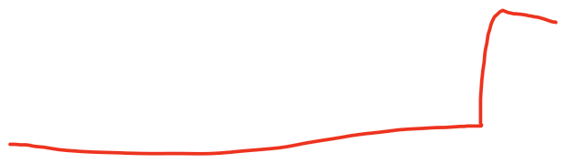
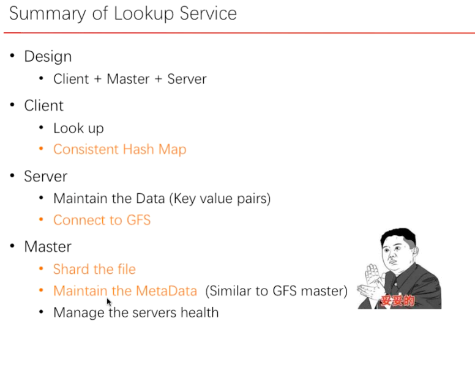

# Lookup Service , steam website

Created: 2017-05-06 15:35:57 -0600

Modified: 2017-05-07 16:34:44 -0600

---

{width="5.0in" height="2.6041666666666665in"}

![Consistent Hash Memory MetaData DiskO, address0 Diskl, addressl Consistent Hash Map DiskO: [0-300] Diskl: [301-600] Disk2: [601-999] Has 100 20 50 DiskO A hump D mother E hump F nice Diskl B nice C good G good N mother ](../media/System-Design-Lookup-Service-,-steam-website-image2.png){width="5.0in" height="4.083333333333333in"}

{width="5.0in" height="2.8020833333333335in"}

{width="6.458333333333333in" height="1.8645833333333333in"}

这个表只有读过一遍以后才会生成

chunk id

chunk offset

{width="5.0in" height="3.9583333333333335in"}

