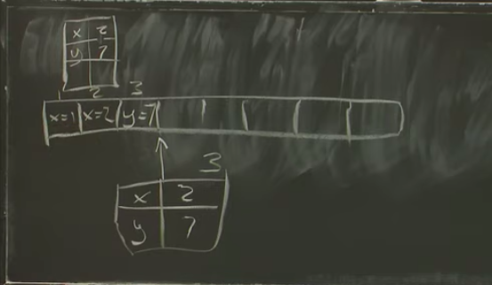

# Raft - leader election 

Created: 2020-11-23 12:40:29 -0600

Modified: 2020-11-23 13:17:24 -0600

---

first step is to have an odd number of servers instead of an even number of servers

the leader should be get vote for majority of service

and the those majority service must contain at least one server that was in the previous majority that is any two majorities overlap in at least one server

so the new leader is guaranteed to know about the term number used by the previous leader, so there will be no split brain issue

[contents of logs]{.mark}

I'm gonna write out log entries for each of the servers, ~~sort of aligned to indicate slots~~ (corresponding) each slots in the log and the values I'm going to write here are the term numbers rather than client operations

Raft 2

[election restriction]{.mark}

sophisticated election restriction that the request vote handling RPC handling code is supposed to check before it says yes, before votes yes for a different peer and the rule is we only vote you, vote yes for some candidate who send us over request votes only if candidate has a higher term in the last log entry or same last term

how to back up faster a little bit better and the general idea is to be able to have the follower send enough information to the leader can jump back an entire

terms, worth of entries that have to be deleted per append entries ,so it leader may only have to send one in append entries per term in which the leader and follower disagree instead of one per entry

35

Figure two this three items only three items are persistent so that's the [log entries, current term ,and voted for.]{.mark}

why log has to be persisted is that we have to persist the application state so only the logins and so when the server restarts the only information available to reconstruct the application state is the sequence of commands in the log

what about current term why does current term have to be persistent.

they're both about ensuring that there's only one that each term has at most one leader, so yeah so voted for the

if a server receives a vote request and votes for server 1 and then it crashes and if it didn't persist. this the identity of who had voted for and in my crash we start get another vote request for the same term from server 2 and say gosh I haven't voted for anybody because my voted for is blank. now I'm gonna vote for server 2 and now. our servers voted for server 1 and for server 2 in the same term and that might allow two servers since both server and server to voted for themselves, they both may think they have a majority out of three and they're both going to become leader

the reason that's important is that writing stuff to disk is can be very expensive.

if you want it to build a system they could serve more than a hundred quests per second then there's a bunch of options, one is you can use a solid-state drive or some kind of flash

if you're even more sophisticated maybe you can build yourself "battery backed DRAM" and do the persistence into battery back DRAM and then if the server reboots hope that reboot was took shorter than the amount of time the battery lasts and that this stuff you persisted is still in the RAM

the other trick people play a lot is to try to batch . That is if you can if client requests are if you have a lot of client requests coming in, maybe you should accept a lot of them and not reply to any of them for a little bit. We call a lot of them accumulate

and then persist you know a hundred log entries at a time from your hundred

clients and you know only then send out the append entries .because you do actually have to persist this stuff to disk ,if you receive a client request you have to persist the new entry to disk before you send the append entries RPCs the followers, the leader it's essentially promising to commit that that request and can't forget about it

the followers have to persist the new log entry to their disk before they reply to the append entries because they were apply to the append entries it's also a promise to preserve and eventually commit that log entry so they can't be allowed to forget about it if they crash

it's worth

scratching your head a little bit about

why commit index lasts apply next index

and match index why it's fair game for

them to be simply thrown away if the

server crashes and restarts like why

wasn't you know commit index or last

apply it like geez last applied is the

record of how much we've executed right

if we throw that away aren't we gonna

execute log entries twice and is that

correct how about that why is why is it

safe to throw away last applied

yes I am we're all about simplicity and

safety here with raft so that's exactly

correct the the reason why all that

other stuff can be non-volatile as you

mentioned I mean sorry volatile the

reason why those other fields can be

volatile and thrown away is that we can

the leader can reconstruct sort of

what's been committed by inspecting its

own log and by the results of append

entries that it sends out to the

followers I mean initially the leader if

it if everybody restarts because they

experienced a power failure

initially the leader does not know

what's committed what's executed but

when it sends out log and append entries

it'll sort of gather back information

and essentially from the followers about

What's in how much of their logs match

the leaders and therefore how much must

have been committed before the crash

another thing in the 4-2 world which is

not the real world

another thing about figure two is that

figure two assumes that the application

state is destroyed and thrown away if

there's a crash in a restart so the

figure two world assumes that while log

is persistent that the application state

is absolutely not persistent required

not to be consistent in figure 2 because

the in figure 2 the log is preserved

persisted from the very beginning of the

system and so what's going to happen if

you sort of play out what the various

rules in figure 2 after a leader restart

is that the leader will eventually re

execute every single log entry that is

handed to the application you know

starting with log entry one after a

reboot it's the raft is gonna hand the

application every log entry starting

from one and so that will after a

restart the application will completely

reconstruct its state from scratch by a

replay from the beginning of the time of

the entire log after each restart and

again that's like a sort of

straightforward elegant plan but

obviously potentially very slow

[snapshot and log compaction]{.mark}

if we just follow the figure 2 rules the log just keeps on growing may end up you know millions and millions of entries long and so requires a lot of memory to store

the log looks like

{width="5.0in" height="2.048611111111111in"}

when raft feels that it's log has gotten to be too large you know more than a

megabyte or ten megabytes or whatever some arbitrary limit raft will ask the

application to take make a snapshot of it the application state as of a certain

point in the log

then we can safely throw away the log before that point , the snap is basically

the table it's just about a database server,

we also need to annotate the snapshot with the entry number that are corresponds to you so it's basically you know if the entries are 1 2 3 this snapshot corresponds to,just after log

index 3 ,with the snapshot in hand, if we persist it to disk rats persistent to disk raft never again will need this part of the logs and it can simply throw it away as long as it persists a

snapshot as of a certain log index plus the log after that index as long as that's persisted to disk,we never going to need to log before that and so this is what raft does the raft ask the application for snapshot gets the snapshot saves it to disk with the log after that it just throws away this log here

{width="5.0in" height="2.8958333333333335in"}

what happens on a restart, so the raft will find the latest (snapshot -log pair) on its disk and hand the snapshot to the application because we no longer are able to replay you know all the log entries so there must be some other way to initialize the application basically,

not only is the application have to be able to produce a snapshot of application state but it has to be able to absorb a previously made snapshot and sort of reconstruct it

stable in memory from a snapshot

for the follower, leader will send its current snapshot plus current log well send its current snapshot to the follower and then presumably immediately follow it with an append entries that has the leaders current log

of X - 2 and then after it the read of X

it yields - and this this read of X of 1

if we assume that the X didn't already

have the value 1 there there must be in

this relationship and that is the read

must come after the right and this read

also must become for this right and

maybe there's some other restrictions -

anyway we can take these we can take

this set of arrows and flatten it out

into an order and that actually works so

the order that's the total order that

demonstrates that this history is

linearizable is first the right of x - 1

then the read of x yielding 1 then the

right of x - 2 and the read of x that

yields 2

alright so the fact that there is this

order that does obey the ordering

constraints shows that this history is

linearize ability and doesn't you know

if we're worried about the system that

produced this history whether it's a but

that system is linearizable then this

particular example we saw it doesn't

contradict the presumption that the

system is linearizable any questions

about what I just did each read sees you

know read of X the value it sees must be

them value written by the most the most

recent proceeding right in the order so

you know in this case in this case we're

totally ok with this order because this

read the value it saw is indeed the

value written by the most recent write

in this order and this read the value it

sighs I mean in informally it's that

reads can't real should not be yielding

stale data if I write something in Rita

back gosh I should see the value I wrote

and that's like a formalization of the

notion that

oh yes oh yeah yeah all right let me let

me he's right up example that's not

indeed linearizable so example two let's

suppose our history is we had a right of

X value one right back with value two

and so this one we also want to write

out the arrows and so we know what the

constraints are on any total order we

might find the right of X to one because

of time because it finished in real time

before the right x to started and must

come before in any satisfying order we

produce the right of Ecsta two has to

come before the right before the read of

X that yields two so we have this arrow

the read of X had to finished before the

read of X to one started so we have this

arrow and the read of X to one because

it saw value one has to come after the

right of X - 1 and more crucially before

the right of X 2 - right so we can't

have this read of X yielding one if it's

immediately preceded by I'll write out X

- 2 so we also have this arrow like this

and because there's a cycle in these

constraints there's no order that can

obey all these constraints and therefore

this history is not linearizable and so

the system that produced it is

is not a linearizable system you know

would be linearizable the history was

missing any one of these three and I

would break the cycle yes maybe I'm not

sure because suppose or I don't know how

to incorporate very strange things like

supposing somebody red 27 you know it

doesn't really if there's no right of 27

a read of 27 doesn't at least the way

I've written out the rules doesn't sort

of well there may be some sort of anti

dependency that you would construct okay

um I will continue this discussion next

week

