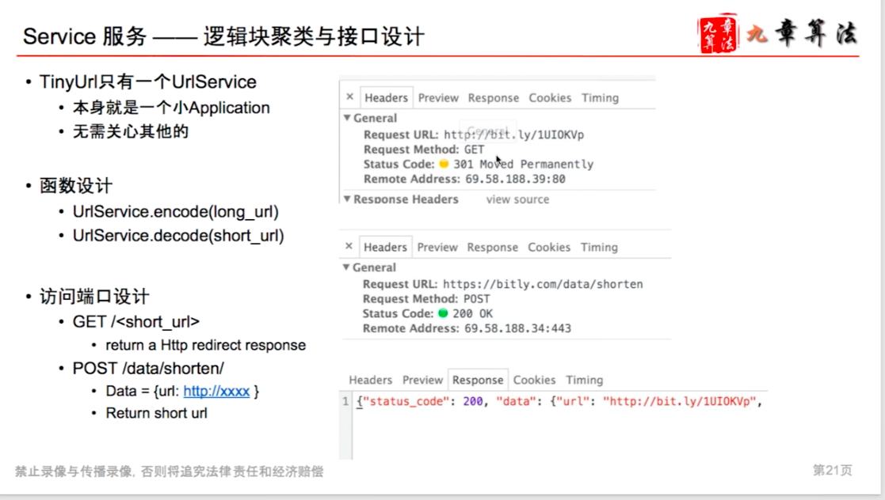

# Service 

---

creatURL(original_url, custom_alias=None user_name=None, expire_date=None)

**Parameters:**

original_url (string): Original URL to be shortened.

custom_alias (string): Optional custom key for the URL.

user_name (string): Optional user name to be used in encoding.

expire_date (string): Optional expiration date for the shortened URL.

**Returns:**(string)

A successful insertion returns the shortened URL, otherwise, returns an error code.

decode(short_url)

