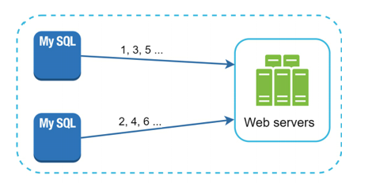
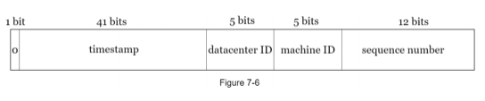

# Key  Generation 

Created: 2017-10-15 17:33:17 -0600

Modified: 2021-01-22 18:24:54 -0600

---

[Solution 1]{.mark}

How can we generatePhotoIDs?

assume we have 48 bit for id

ID should a epoch second and the second part will be an auto incrementing id

let we assume our epoch time start today and the id we want to use next 50 years and we need 31 bit to store this number

and we have 17 bit for the incrementing id that mean every second we expect generate around 2 ^17 new tweet

[Solution 2]{.mark}

One solution could be that we use a separate database to generate auto-incrementing IDs. If ourPhotoIDcan fit into 64 bits(8 bytes), we can define a table containing only a 64 bit ID field. So whenever we would like to add a photo in our system, we can insert a new row in this table and take that ID to be ourPhotoIDof the new photo.

Wouldn't this key generating DB be a single point of failure? Yes, it will be. A workaround for that could be, we can define two such databases, with onegeneratineven numbered IDs and the other odd numbered. For MySQL following script can define such sequences:

KeyGeneratingServer1:

auto-increment-increment = 2

auto-increment-offset = 1 (start point)

KeyGeneratingServer2:

auto-increment-increment = 2

auto-increment-offset = 2(start Point)

We can put a load balancer in front of both of these databases to round robin between them and to deal with down time. Both these servers could be out of sync with one

generating more keys than the other, but this will not cause any issue in our system.

Drawback:

Hard to scale with multiple data centers

IDs do not go up with time across multiple servers.

It does not scale well when a server is added or removed.

{width="9.875in" height="4.916666666666667in"}

**Add the time stamp**

b. Generating keys offline

We can have a standalone Key Generation Service (KGS) that generates random six letter strings beforehand and stores them in a database (let's call it key-DB). Whenever we want to shorten a URL, we will just take one of the already generated keys and use it. This approach will make things quite simple and fast since we will not be encoding the URL or worrying about duplications or collisions. KGS will make sure all the keys inserted in key-DB are unique.

Can concurrency cause problems? As soon as a key is used, it should be marked in the database so that it doesn't get used again. If there are multiple servers reading keys concurrently, we might get a scenario where two or more servers try to read the same key from the database. How can we solve this concurrency problem?

Servers can use KGS to read/mark keys in the database. KGS can use two tables to store keys, one for keys that are not used yet and one for all the used keys. As soon as KGS gives keys to one of the servers, it can move them to the used keys table. KGS can always keep some keys in memory so that whenever a server needs them, it can quickly provide them. For simplicity, as soon as KGS loads some keys in memory, it can move them to used keys table. This way we can make sure each server gets unique keys. If KGS dies before assigning all the loaded keys to some server, we will be wasting those keys, which we can ignore given a huge number of keys we have. KGS also has to make sure not to give the same key to multiple servers. For that, i[t must synchronize (or get a lock to) the data structure holding the keys before removing keys from it and giving them to a server.]{.mark}

What would be the key-DB size? With **base64 encoding,** we can generate 68.7B unique six letters keys. If we need one byte to store one alpha-numeric character, we can store all these keys in:

6 (characters per key) * 68.7B (unique keys) => 412 GB.

Isn't KGS the single point of failure? Yes, it is. To solve this, we can have a standby replica of KGS, and whenever the primary server dies, it can take over to generate and provide keys.

from Instagram blog:

<https://engineering.instagram.com/sharding-ids-at-instagram-1cf5a71e5a5c>

[Solution 3]{.mark}

**Sharding& IDs atInstagram**

Generated IDs should be sortable by time (so a list of photo IDs, for example, could be sorted without fetching more information about the photos)

IDs should ideally be 64 bits (for smaller indexes, and better storage in systems likeRedis)

Existing solutions

Many existing solutions to the ID generation problem exist; here are a few we considered:

**Generate IDs in web application**

This approach leaves ID generation entirely up to your application, and not up to the database at all. For example, MongoDB'sObjectId, which is 12 bytes long and encodes the timestamp as the first component. Another popular approach is to use UUIDs.

Pros:

Each application thread generates IDs independently, minimizing points of failure and contention for ID generation

If you use a timestamp as the first component of the ID, the IDs remain time-sortable

Cons:

Generally requires more storage space (96 bits or higher) to make reasonable uniqueness guarantees

Some UUID types are completely random and have no natural sort

**Generate IDs through dedicated service**

Ex: Twitter's Snowflake, a Thrift service that uses ApacheZooKeeperto coordinate nodes and then generates 64-bit unique IDs

Pros:

Snowflake IDs are 64-bits, half the size of a UUID

Can use time as first component and remain sortable

Distributed system that can survive nodes dying

Cons:

Would introduce additional complexity and more 'moving parts' (ZooKeeper, Snowflake servers) into our architecture

DB Ticket Servers

Uses the database's auto-incrementing abilities to enforce uniqueness. Flickr uses this approach, but with two ticket DBs (one on odd numbers, the other on even) to avoid a single point of failure.

Pros:

DBs are well understood and have pretty predictable scaling factors

Cons:

Can eventually become a write bottleneck (though Flickr reports that, even at huge scale, it's not an issue).

An additional couple of machines (or EC2 instances) to admin

If using a single DB, becomes single point of failure. If using multiple DBs, can no longer guarantee that they are sortable over time.

Of all the approaches above, Twitter's Snowflake came the closest, but the additional complexity required to run an ID service was a point against it. Instead, we took a conceptually similar approach, but brought it inside PostgreSQL.

[Our solution]{.mark}

Each of our IDs consists of:

**41** bits for time in milliseconds (gives us 41 years of IDs with a custom epoch)

13 bits that represent the logical shard ID

10 bits that represent an auto-incrementing sequence, modulus 1024. This means we can generate 1024 IDs, pershard, per millisecond

Let's walk through an example: let's say it's September 9th, 2011, at 5:00pm and our 'epoch' begins on January 1st, 2011. There have been 1387263000 milliseconds since the beginning of our epoch, so to start our ID, we fill the left-most 41 bits with this value with a left-shift:

id = 1387263000 <<(64-41)

Next, we take the shard ID for this particular piece of data we're trying to insert. Let's say we'reshardingby user ID, and [there are 2000]{.mark} logical shards; if our user ID is 31341, then the shard ID is 31341 % 2000 -> 1341. We fill the next 13 bits with this value:

id |= 1341 <<(64-41-13)

Finally, we take whatever the next value of our auto-increment sequence (this sequence is unique to each table in each schema) and fill out the remaining bits. Let's say we'd generated 5,000 IDs for this table already; our next value is 5,001, which we take and mod by 1024 (so it fits in 10 bits) and include it too:

id |= (5001 % 1024)

For the Twitter snowflaker

{width="10.083333333333334in" height="2.1770833333333335in"}

The maximum timestamp that can be represented in 41 bits is 2 ^ 41 - 1 = 2199023255551 milliseconds (ms), which gives us: ~ 69 years = 2199023255551 ms / 1000 seconds / 365 days / 24 hours/ 3600 seconds. This means the ID generator will work for 69 years and having a custom epoch time close to today's date delays the overflow time. After 69 years, we will need a new epoch time or adopt other techniques to migrate IDs.

•Clock synchronization.

synchronization. In our design, we assume ID generation servers have the same clock. This assumption might not be true when a server is running on multiple cores.

