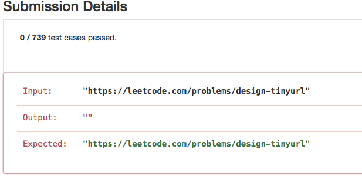
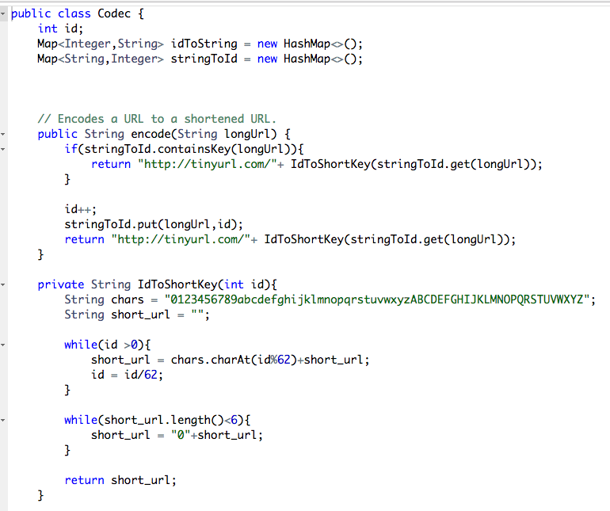
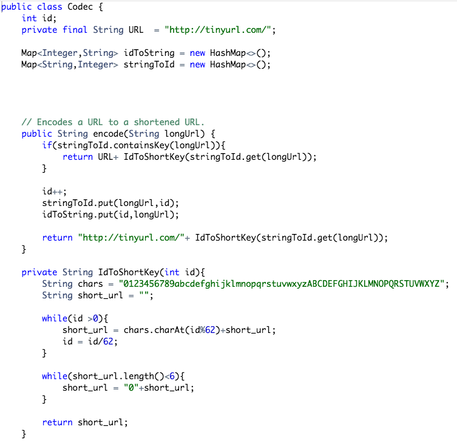

# BASE 62 Encode and Decode TinyURL 

Created: 2017-04-30 15:58:43 -0600

Modified: 2017-10-21 09:04:17 -0600

---

{width="5.0in" height="2.423611111111111in"}

{width="5.0in" height="4.1875in"}

{width="5.0in" height="4.5625in"}

Accepted Solution

{width="5.0in" height="4.868055555555555in"}

{width="5.0in" height="5.159722222222222in"}

{width="1.2777777777777777in" height="0.8125in"}

{width="1.3680555555555556in" height="0.625in"}

{width="2.9305555555555554in" height="1.0138888888888888in"}

先计算的 放在 最后

{width="3.7708333333333335in" height="0.8541666666666666in"}{width="3.423611111111111in" height="0.9236111111111112in"}

不用 for loop

