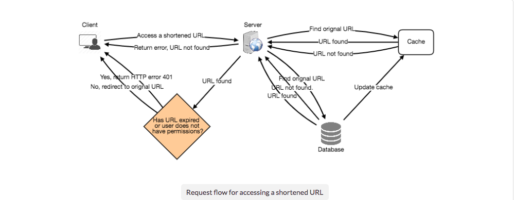
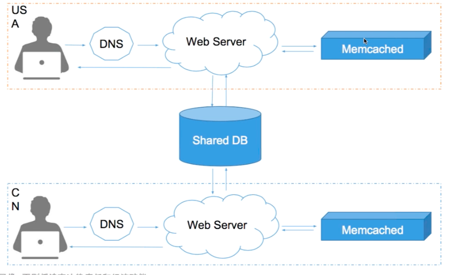
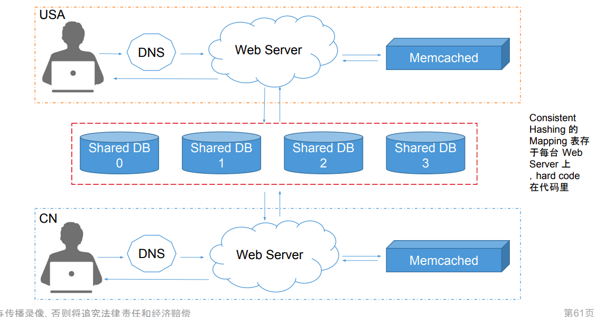
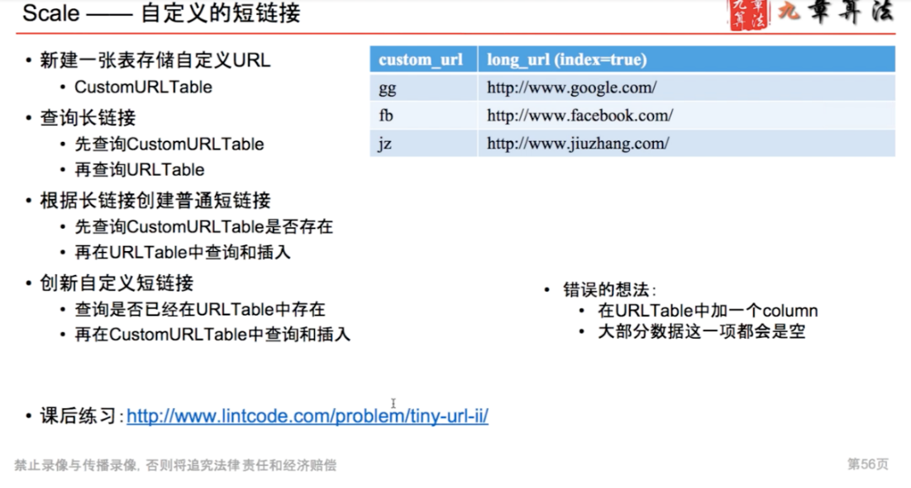

# Scale

---

We can cache URLs that are frequently accessed. We can use Memcache, that store full URLs with their respective hashes. The application servers, before hitting backend storage, can quickly check if the cache has desired URL.

**How much cache should we have?**We can start with 20% of daily traffic and based on clients' usage pattern we can adjust how many cache servers we need.

As estimated above we need 4G memory( [Scenario](onenote:#Scenario&section-id={5C9BC554-D710-BB4A-B564-D4493A1F1645}&page-id={E2B39DFD-80FC-B247-81D1-CA95E38CBC76}&end&base-path=https://d.docs.live.net/77339d157d673f41/Documents/9%20chapter/System%20Design%20and%20OO%20Design/TinyURL.one) ) to cache 20% of daily traffic

since a modern day server can have 256GB memory, we can easily fit all the cache into one machine, or we can choose to use a couple of smaller servers to store all these hot URLs.

**Which cache eviction policy would best fit our needs?**When the cache is .full, and we want to replace a link with a newer/hotter URL, how would we choose? Least Recently Used (LRU) can be a reasonable policy for our system. Under this policy, we discard the least recently used URL first. We can use a[Linked Hash Map](https://docs.oracle.com/javase/7/docs/api/java/util/LinkedHashMap.html)or a similar data structure to store our URLs and Hashes, which will also keep track of which URLs are accessed recently.

To further increase the efficiency, we can replicate our caching servers to distribute load between them.

**How can each cache replica be updated?**Whenever there is a cache miss, our servers would be hitting backend database. Whenever this happens, we can update the cache and pass the new entry to all the cache replicas. Each replica can update their cache by adding the new entry. If a replica already has that entry, it can simply ignore it.

0-61 then map to 62`s characters

