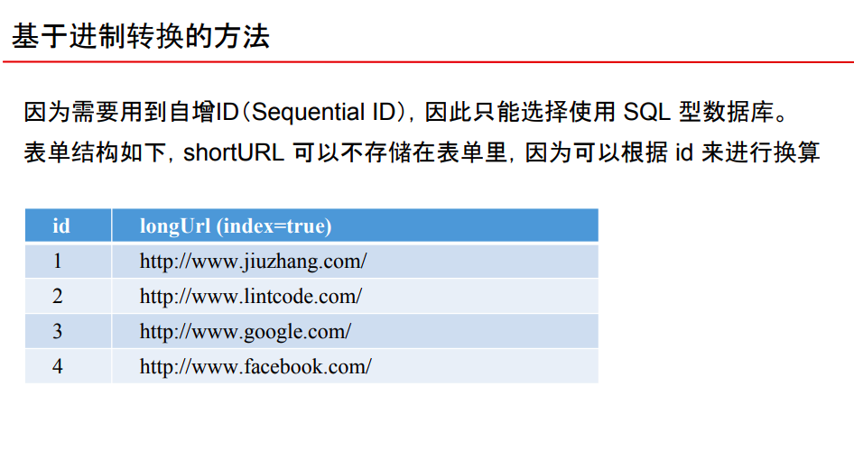
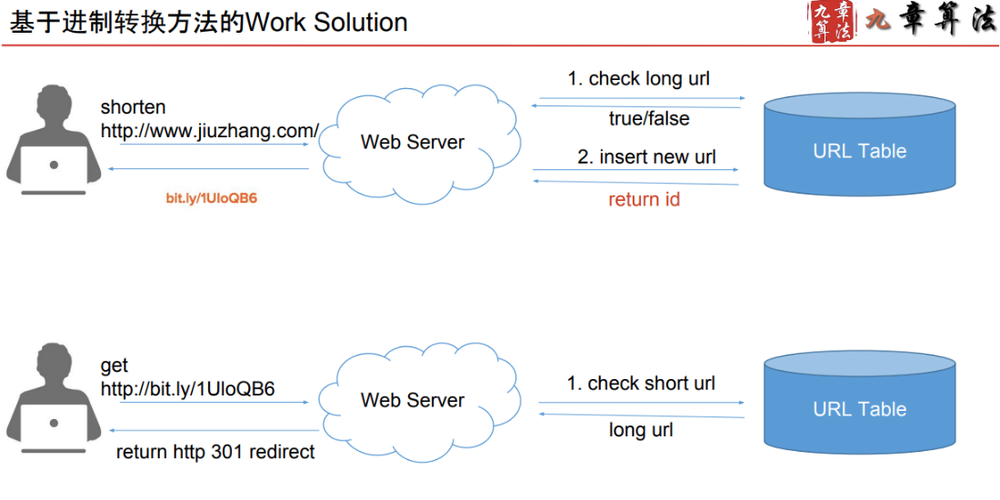

# Storage - Base 62

Created: 2017-10-09 17:01:23 -0600

Modified: 2017-10-21 08:56:40 -0600

---

{width="5.0in" height="2.736111111111111in"}

{width="5.0in" height="2.5in"}

{width="5.0in" height="1.9861111111111112in"}

