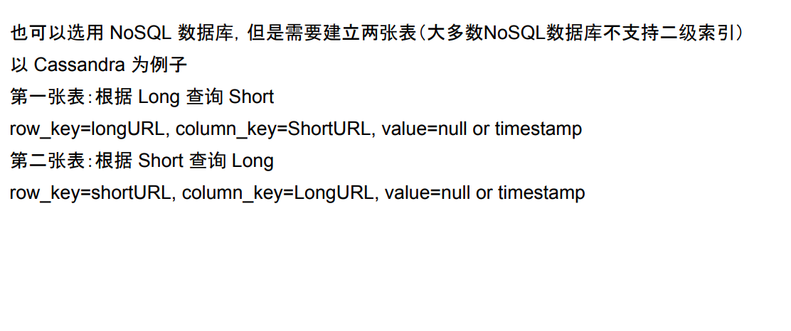

# Storage

---

SQL or NO SQL

1.  don`t need support transaction
2.  don`t need support join option
3.  QPS is not too high ( 2k and is read heavy than write heavy)
4.  need Sequential id

two solution

1.  No SQL

we just random generate a 6 digitals for given long URL, if this short URL is not used. We just insert it into database.

it should be very quick at the begin and will very slow when the url grow

