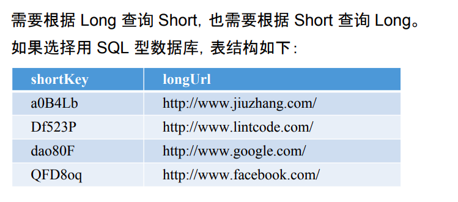

# Storage

Created: 2017-10-09 16:08:16 -0600

Modified: 2017-10-09 17:05:37 -0600

---

SQL or NO SQL

1.  don`t need support transaction
2.  don`t need support join option
3.  QPS is not too high ( 2k and is read heavy than write heavy)
4.  need Sequential id

{width="3.9791666666666665in" height="1.75in"}

two solution

1.  No SQL

we just random generate a 6 digitals for given long URL, if this short URL is not used. We just insert it into database.

{width="10.083333333333334in" height="3.3229166666666665in"}

it should be very quick at the begin and will very slow when the url grow

{width="10.083333333333334in" height="4.489583333333333in"}

{width="10.083333333333334in" height="4.270833333333333in"}

{width="10.083333333333334in" height="5.125in"}

