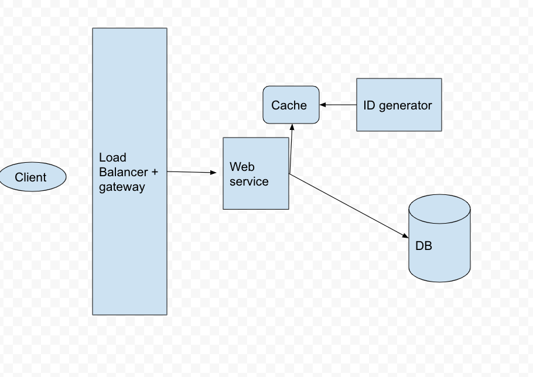
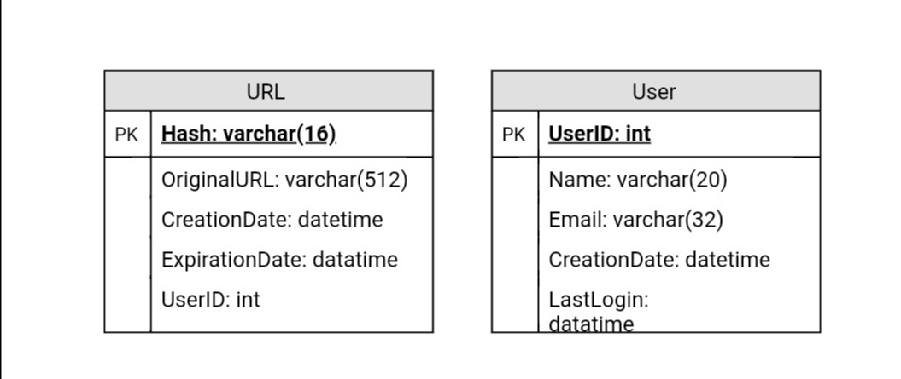

# summary 

Created: 2017-10-21 08:14:45 -0600

Modified: 2021-04-26 16:59:36 -0600

---

{width="5.0in" height="3.53125in"}

**Feature Requirement:**

long URL to short URL

short URL to long URL and redirect to long URL

custom short URL

Non Feature

High availability

Scalability

**DAU:**

100 M

[How many link the user will click and how many user will create new short url?]{.mark}

we assume every user click the 1 link per day and only 10% user create short

read QPS will be 1k = 100M /86400

peak read qps will be 2k

write QPS will be 100M * 0.1 /86400 = 100

peak QPS will be 200

**Storage for next 5 years**

the average length of URL is 100 bytes

10M * 100* 5 * 365 = 1.8T

**Service or High level design**

we just need one service for the long url to short url and short url to long url

we have a API for log to short

creatURL(api_dev_key, original_url, custom_alias=None, expire_date=None)

Parameters:

api_dev_key (string): The API developer key of a registered account. This will be used to, among other things, throttle users based on their allocated quota.

original_url (string): Original URL to be shortened.

custom_alias (string): Optional custom key for the URL.

expire_date (string): Optional expiration date for the shortened URL.

Returns: (string)

A successful insertion returns the shortened URL, otherwise, returns an error code.

**One thing is import: sequential id is begin from 0 or from 1**

Inside the service we have IDToShortURL(int id), ShortURLToID(Stromh

[toBase62(char c)]{.mark}

**Database**:

{width="5.0in" height="2.1041666666666665in"}

Database : id (generate by id generator) | Original URL | time | user id ...

We choose sql datable

We have 2k read request per second. it is not too high and we can use sequential id in the sql database to covert the long to short url

The algorithm from long to short is base 62

from 0-9, a to z, A to z

Base on our calculation, we have around the 1.8 T long url will be created, we assume all are different the length of URL is 7 is enough.

[since 62 ^ 5 = 900M, 62 ^ 6 = 57 Bill , 62 ^ 7 = 3.5 T]{.mark}

[so we can use most 7 digital base 62 string to present the long url]{.mark}

[Since 3.5T ~ 2^ 42, so we can use 42 bits id]{.mark}

[After we got 42 bit id --> covert to 10 base number then convert to 62base short url]{.mark}

|    |
|-----|

**Improvement:**

We can cache URLs that are frequently accessed.

can quickly check if the cache has desired URL.

~~**(How much cache should we have?** We can start with 20% of daily traffic and based on clients' usage pattern we can adjust how many cache servers we need.~~

~~As estimated above we need 4G memory( [Scenario](onenote:#Scenario&section-id={5C9BC554-D710-BB4A-B564-D4493A1F1645}&page-id={E2B39DFD-80FC-B247-81D1-CA95E38CBC76}&end&base-path=https://d.docs.live.net/77339d157d673f41/Documents/9%20chapter/System%20Design%20and%20OO%20Design/TinyURL.one) ) to cache 20% of daily traffic~~

~~since a modern day server can have 256GB memory, we can easily fit all the cache into one machine, or we can choose to use a couple of smaller servers to store all these hot URLs. )~~

**Which cache eviction policy would best fit our needs?** LRU

~~**How can each cache replica be updated?** Whenever there is a cache miss, our servers would be hitting backend database. Whenever this happens, we can update the cache and pass the new entry to all the cache replicas. Each replica can update their cache by adding the new entry. If a replica already has that entry, it can simply ignore it.~~

**If there are huge writing request**

**Sharding**

we add an addition character at the begin call sharding key and it the hash the whole long url use (MD5 or SHA256) then % 62

we have some machine we said N and we divide N by 62

and create a map and send the url to the machine base on the table

0->machine0

....

A -> mach1

B-> mach1

C->

**Clear the linked which already expired**

Whenever a user tries to access an expired link, we can delete the link and return an error to the user.

A separate Cleanup service can run periodically to remove expired links

We can have a default expiration time for each link, e.g., two years.

**Permission**

Can users create private URLs or allow a particular set of users to access a URL?

We can also create a separate table to store UserIDs that have permission to see a specific URL. If a user does not have permission and try to access a URL, we can send an error (HTTP 401) back. Given that, we are storing our data in a NoSQL wide-column database like Cassandra, the key for the table storing permissions would be the 'Hash' (or the KGS generated 'key'), and the columns will store the UserIDs of those users that have permissions to see the URL.

