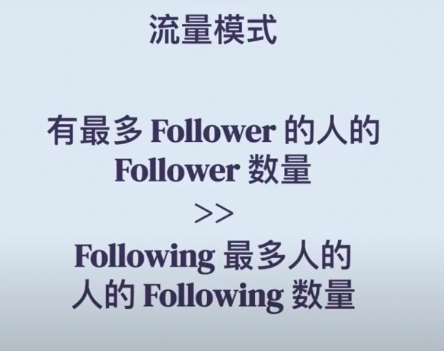
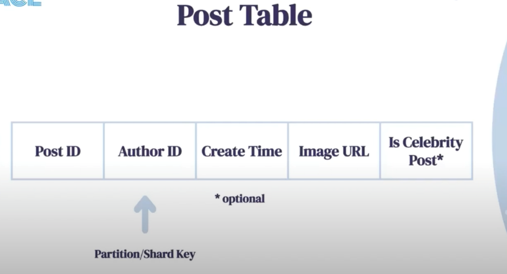
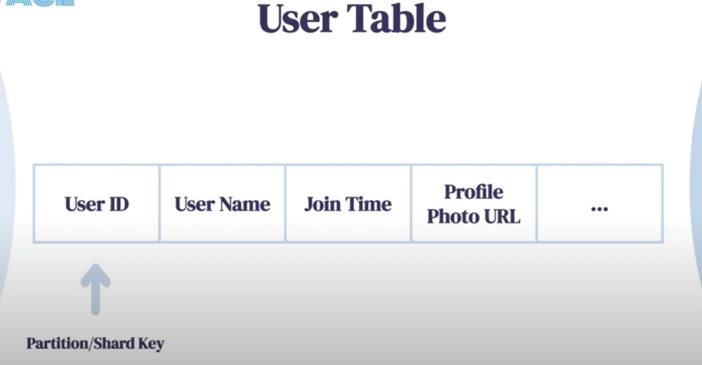
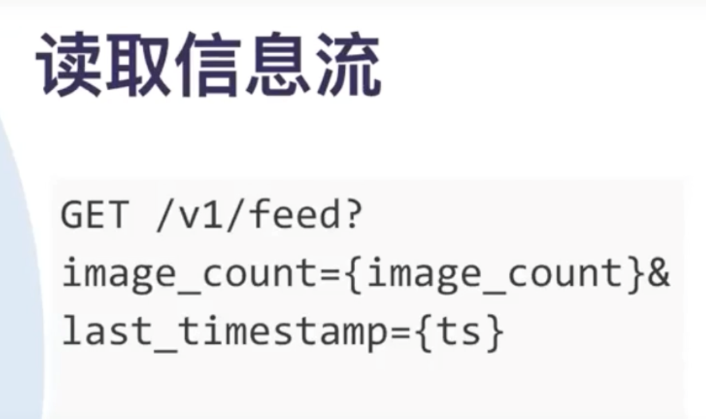
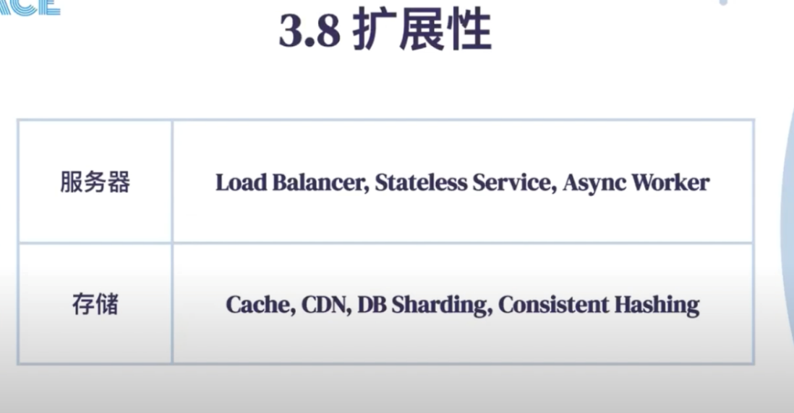
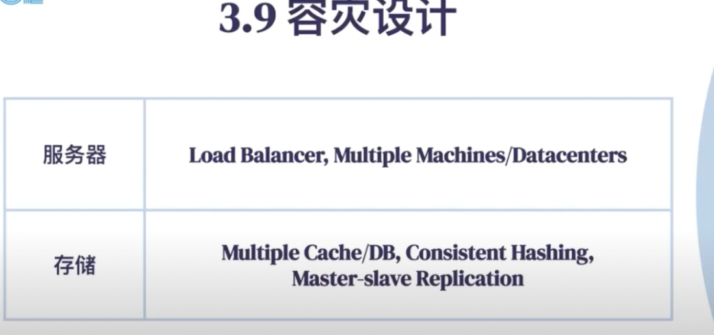
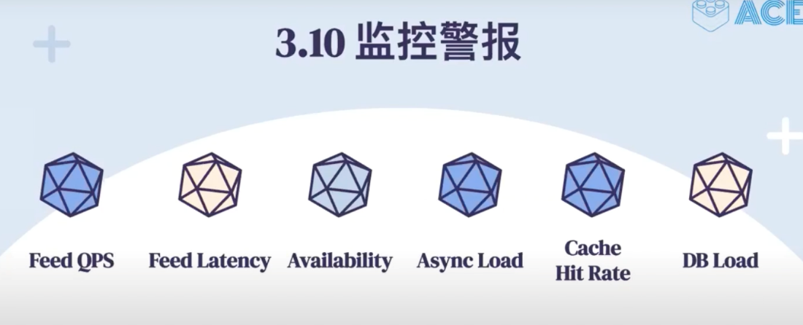

# ACE

Created: 2021-04-26 14:46:21 -0600

Modified: 2021-06-02 17:46:51 -0600

---

{width="5.0in" height="3.5in"}

{width="5.0in" height="2.4027777777777777in"}

**Functional Requirements**

Users should be able to upload/download/view photos.

Users can perform searches **based on** photo/video titles.

Users can follow other users.

The system should be able to generate and display a user's timeline consisting of top photos from all the people the user follows.

{width="5.0in" height="2.9375in"}

[Is a read heavy system]{.mark}

[Peak QPS * 5 or * 10]{.mark}

Two different type of user normal user -- few followings

And follow a lot of other users

Celebrity --- a lot of followings

{width="5.0in" height="3.951388888888889in"}

{width="5.0in" height="2.2916666666666665in"}

Follower table is who user follower

Following table is who follow me/user

[We need to store data about users, their uploaded photos, and people they follow]{.mark}

{width="5.0in" height="2.7083333333333335in"}

{width="5.0in" height="2.6666666666666665in"}

Sort by create time and post id

{width="5.0in" height="2.6944444444444446in"}

{width="5.0in" height="2.6041666666666665in"}

{width="5.0in" height="6.395833333333333in"}

For pagination

[CDN -- application will check the CDN first if not then get the photo from S3 base on the URL]{.mark}

{width="5.0in" height="4.256944444444445in"}

Post image will get a url

{width="5.0in" height="2.9722222222222223in"}

Pagination ---

Ask service return all the photo relatively new than last_timestamp

Select *

From time> last_timestamp

Assume the photo sort by time and olderest one will on the top

Non functional requirement

Allow latency for posting the photo

{width="5.0in" height="3.0069444444444446in"}{width="5.0in" height="2.4166666666666665in"}

Reliability -- if we can save the data correctly or return the correct result to user, all user have the same source of truth

Reliability --Auto complete system -- must return top 10 or can return any 10 result from top 20 or top 50

Consistency - all the user can read the same result (may be not correct result -- reliability)

{width="3.8541666666666665in" height="3.2847222222222223in"}

Demonized,

We don't need to join the post table to get the post information again

URL is S3 URL

The real photo will stored in the bob storage like[HDFS](https://en.wikipedia.org/wiki/Apache_Hadoop)or[S3](https://en.wikipedia.org/wiki/Amazon_S3).

But if user rename, the data will be inconsistence

A is celebrity , B is list of user follow A

If C send a picture , all the user follow C will get push (like D)

D follow C, D is follower

{width="5.0in" height="1.2152777777777777in"}

There are two types of cache:

Query cache : if user query the database, we can store the result in cache, web application may only load the first 10 page, if user want to more information ( next 10 page), web application can fetch the data from the cache

General purpose cache : for popular data

scalability

{width="5.0in" height="2.5972222222222223in"}

{width="5.0in" height="2.3402777777777777in"}

High availability

We can use consistent hashing to back up data on the previous node

{width="5.0in" height="2.0277777777777777in"}

Feed latency-- how long the system can push the new post to feed table

Availability -- all service availability

Async load -- how long the async job backlog

DB load ( database have enough storage)

